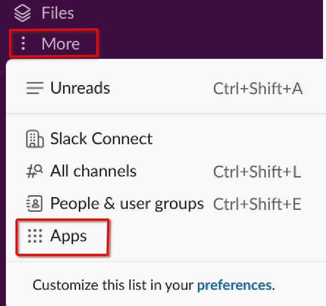
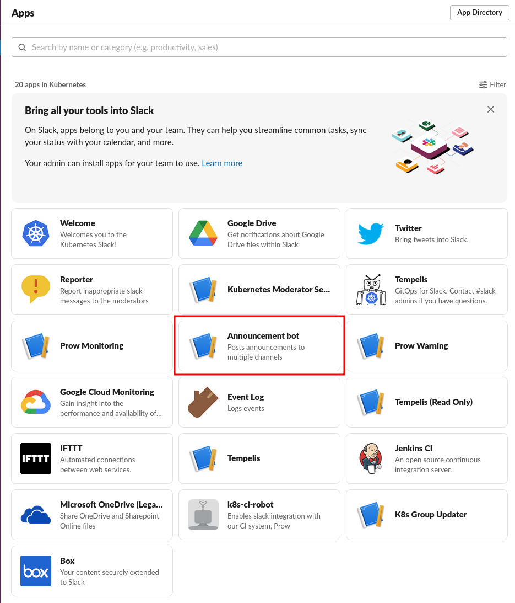
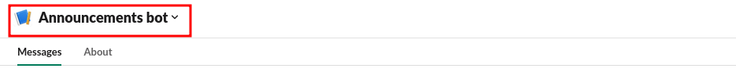
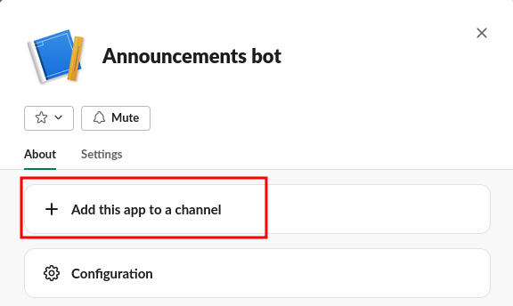
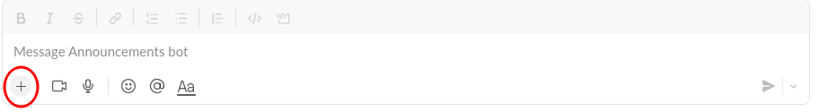
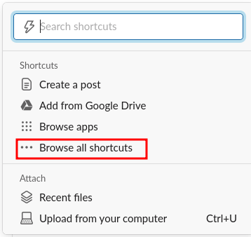
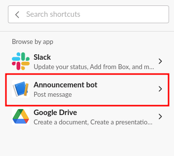
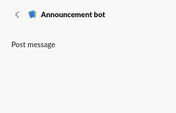
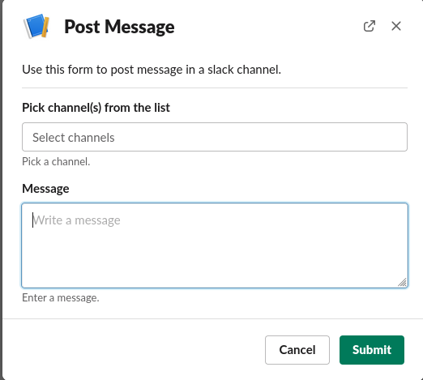

# K8s Announcement Bot User guide

The source code for this bot is present in https://github.com/kubernetes-sigs/slack-infra/tree/main/slack-post-message and it is deployed using https://github.com/kubernetes/k8s.io/tree/main/apps/slack-infra

## Prerequisites

### Permissions
To use the bot, the user must be a member of the Slack 'sig-contributor-comms' group. Contact @contributor-comms to obtain the necessary permissions or to post something on your behalf.

#### Steps to add a new user to the bot
- *Add the User*: The new user will need to copy their "member id" from their account in Slack, and decide on a preferred username to add via PR to kubernetes/community/communication/slack-config/users.yaml
- *Add the User to the Group*: Create a PR to add the newly created username from the users.yaml file to kubernetes/community/communication/slack-config/usergroups.yaml

### Adding bot to a channel

To allow the bot to send messages to a channel, it must first be added to the channel. Before adding it, you need to make sure that the bot has already joined the channel. Although the bot is added to most of the channels, it might still be necessary to add it to a new channel. Follow the steps below to do so.

1. Go to the 'More' option in the top left side and then go to 'Apps'

2. That will take you to the apps page & choose 'Announcement bot' in this page

3. Now, slack will take you to a DM page with the bot. Click on the title of the bot at the top of this page

4. In the pop-up click on 'Add this app to a channel' & enter the channel name. This will have add the bot to the specified channel

## Pushing announcements through the bot

1. From any page on slack, find the '+' button called as "Attachments & shortcuts" in the text box

2. In the options displayed, click on 'Browse all shortcuts'

3. In the following page choose 'Announcement bot'

4. In the options displayed for 'Announcement bot' click on 'Post message' which open the message form

5. In the form, choose the channel(s), write the message that needs to be sent and click on 'submit' bottom.

The keyboard here might not support slack emoji search (with `:`) The workaround for this is to copy emojis

