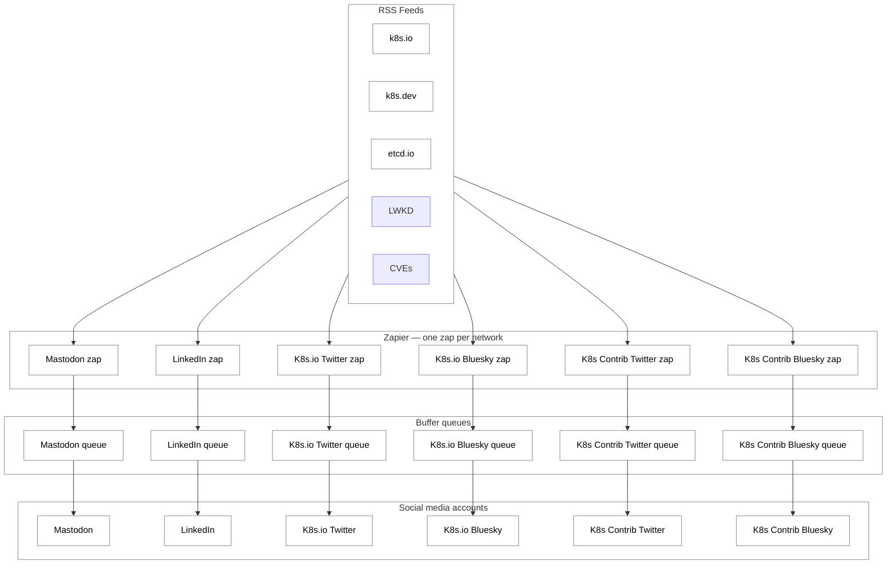

# Social Media Automation

Contributor Comms manages the social media accounts for the Kubernetes community.
We use automation to alleviate the workload of posting blog posts, LWKD, and CVEs
to social media. This document describes the automation process in place to
push the various posts out to the social media accounts for the project.

## Overview

New posts published to any of the project's RSS feeds are automatically queued
and published to six social media accounts. The pipeline is fully automated via
Zapier and Buffer — no manual posting is required.

## Pipeline

## Stages

### 1. RSS feeds

The pipeline is triggered by three RSS feeds:

- `k8s.io`
- `k8s.dev`
- `etcd.io`
- `LWKD`
- `CVEs`

A new item on any of these feeds is what kicks off the automation.

### 2. Zapier

There is one Zapier zap per social media network. There are 18 total zaps.
Blog RSS feeds are one group of zaps (6), LWKD makes another group of zaps
(6), and CVEs make the last group of zaps (6). Each zap watches all three
RSS feeds, and when a new item appears it builds a post from the item's
**Title** and **Link**, then adds that post to the network's Buffer queue.

### 3. Buffer

Each connected account has its own Buffer queue. Buffer holds the queued posts
and handles the actual scheduling and publishing to the account.

### 4. Social accounts

Posts are published to the following six accounts:

- Mastodon
- LinkedIn
- K8s.io Twitter
- K8s.io Bluesky
- K8s Contrib Twitter
- K8s Contrib Bluesky