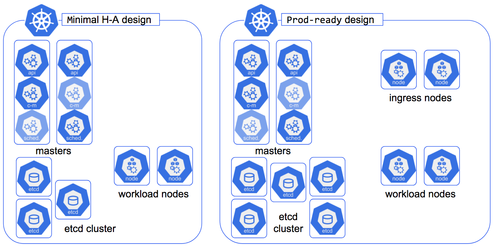
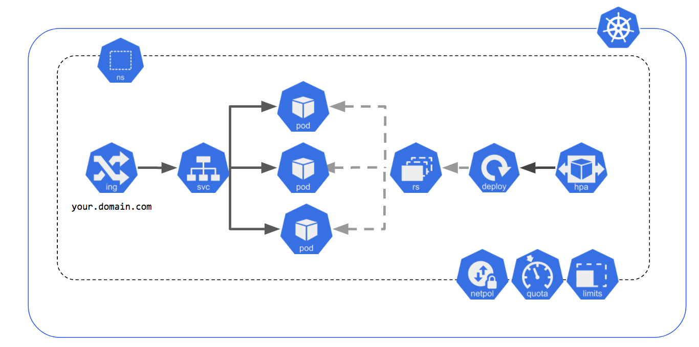

# Kubernetes Icons Set

These icons are a way to standardize Kubernetes architecture diagrams for presentation. Having uniform architecture diagrams improve understandibility.

# Generate png icons from svg

```shell
./tools/rasterize.sh
```

This script will convert all svg into png. It's based on a docker container defined [here](hack/svgconvertor/Dockefile)

## How to use these icons

Each icons can be found in differents formats
* [png](png)
* [svg](svg)

There is 2 types of icons

| Kind  | Type       | Icon                             |
|-------|------------|----------------------------------|
|  Pod  | Labeled    |        |
|  Pod  | Unlabeled  |      |


This repository contains slidedeck with all icons and some diagrams

| Link  | Extension  |
|-------|------------|
|  [Kubernetes_Icons_Keynote](./slidedeck/Kubernetes_Icons_Keynote.key)  | Apple keynote 09    |
|  [Kubernetes_Icons_PPTX](./slidedeck/Kubernetes_Icons_PPTX.pptx)  | Microsoft PowerPoint 16    |
|  [Kubernetes_Icons_GSlide](https://docs.google.com/presentation/d/1lJ0RHWzEKzd6PFePTpukNqPoTIPrvg25_-VS6bmEHIw/edit?usp=sharing)  | Google Slide    |
|  [Kubernetes_Icons_PDF](./slidedeck/Kubernetes_Icons_PDF.pdf)  |  PDF  |

## Usage Example

There is icons for each layers of a complete Kubernetes Architecture
* [Infrastructure components](./png/infrastructure_components)
* [Control Plane components](./png/control_plane_components)
* [Kubernetes Resources](./png/k8s_resources)

#### Kubernetes infrastructure diagrams example


#### Exposed Pod with 3 replicas

