# HOWTO Backup Private Channels and DMs from Slack

To back up private channels, and direct message chains, from Slack we currently recommend [slackdump](https://github.com/rusq/slackdump).

It is a relatively easy to use commandline tool to backup your channels and DMs and store the data locally. No fees or 3rd-party online storage is involved, making it suitable for even confidential private channels.

## Preparing to Export

Decide which member of your private channel will archive it. This should be someone who is prepared to follow up before the June 20th deadline, and can easily install and use Slackdump. You should also give some thought as to [what you will do with the archive files](#what-should-i-do-with-the-backup-files) afterwards, although the critical thing is to make sure that someone makes a copy before the deadline.

## Installing Slackdump

Slackdump is supporting various platforms. You can find the latest release [here](https://github.com/rusq/slackdump/releases/tag/v3.1.4). The installation instructions below are taken from [the official instructions of the project](https://github.com/rusq/slackdump/?tab=readme-ov-file#installation-and-quickstart) with a few additions based on our experience.

### MacOS

The easiest way to install on a Mac is using Brew:

```
brew install slackdump
```

Some Linux distros also support Brew, which can be an easy way to install there as well.

### Other OSes

On other Operating Systems, please follow these steps:

1. Download the latest release for your operating system from the [releases] page.
1. Unpack the archive to any directory.
1. Run the `./slackdump` or `slackdump.exe` executable (see note below).

[releases]: https://github.com/rusq/slackdump/releases/

> [!NOTE]
> On Windows and macOS you may be presented with "Unknown developer" window.
> The reason for this is that the executable hasn't been signed by
> the developer certificate.

  To work around this:

  - **on Windows**: click "more information", and press "Run
    Anyway" button.
  - **on macOS** 14 Sonoma and prior:  open the folder in Finder, hold Option
    and double click the executable, choose Run.
  - **on macOS** 15 Sequoia and later:  start the slackdump, OS will show the
    "Unknown developer" window, then go to System Preferences -> Security and
    Privacy -> General, and press "Open Anyway" button.

## Basic Slackdump Navigation

Most of the Slackdump CLI uses this basic navigation:

* Use TAB to navigate between fields
* Use up and down arrows to navigate between items on a list
* Use ENTER to select an option
* Use ESC to go back to a higher-level menu

## Step by Step Walkthrough

Use the wizard to get started:

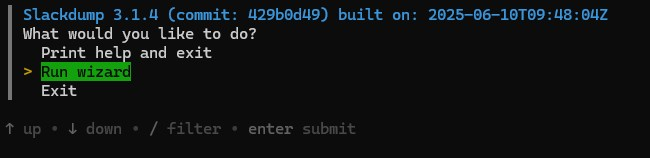

Choose "Workspace", and then "New" to authenticate for the Kubernetes Slack. You will be prompted to choose a method for logging in.

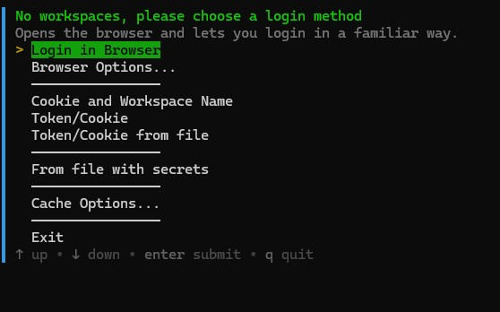

You can select any of the login options that work for you. For some users, the default browser login does not work. If it fails for you, we recommend the Cookie and Workspace Name Option.

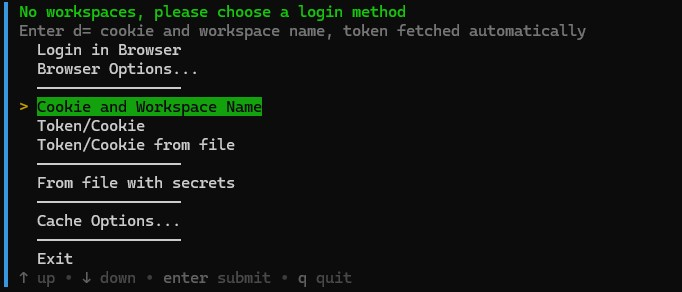

To retrieve the Cookie, Login into [https://kubernetes.slack.com](https://kubernetes.slack.com) with your credentials through your regular browser. You can retrieve the cookie using your browser's web developer tools (this works on both Firefox and Chrome). It will start with the string `xoxd`.

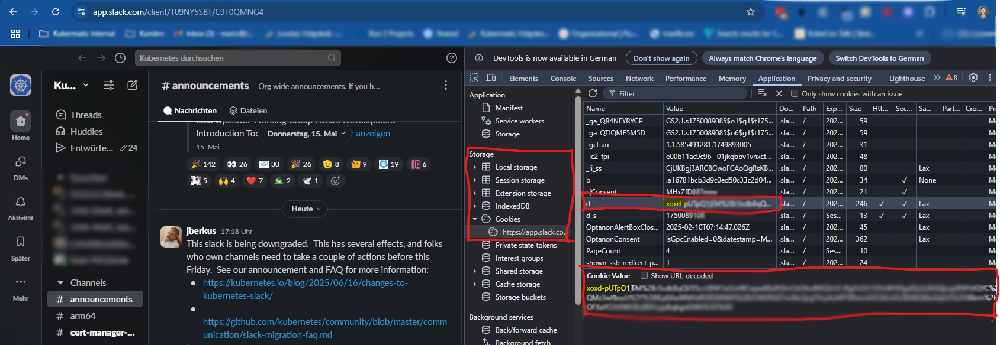

Enter "kubernetes" for the workspace name, your session cookie, and select "Yes" for "Confirm creation of workspace" to create credentials.

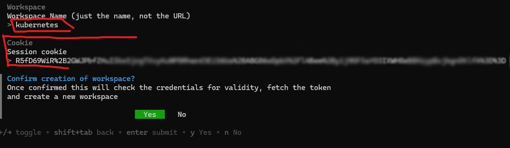

Navigate the menus and select "Export" (not "Dump"). You will be asked for a login.

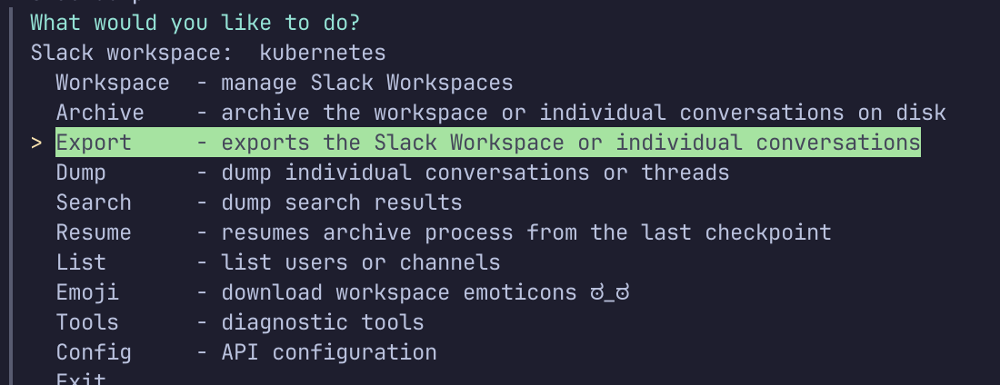

Now you can export your private Channels and DMs. The easiest way is to use ChannelIDs.

To retrieve a ChannelID of a private channel, select the channel and click on the 3 dots to choose "Open channel details". The popup will display the Channel ID at the bottom.

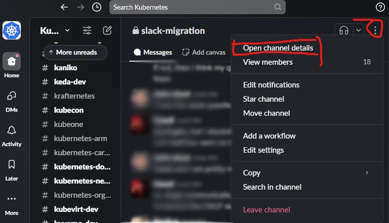

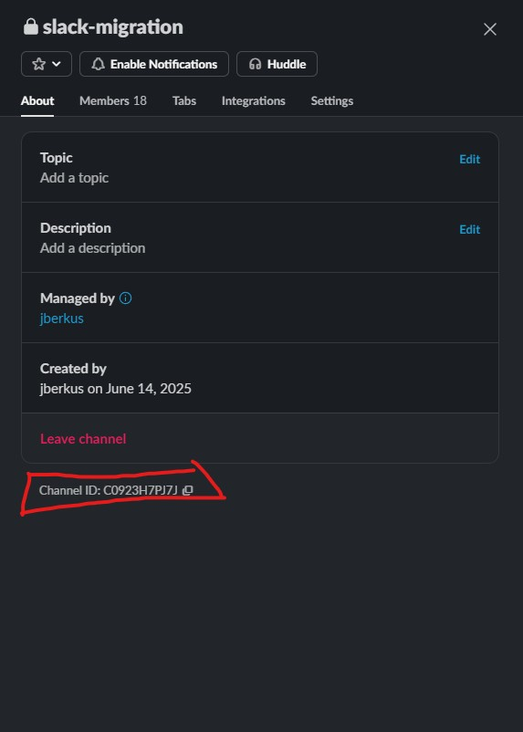

For DMs, you follow a similar method. Click the three dots and select "Open conversation details". Afterwards you can copy a ChannelID.


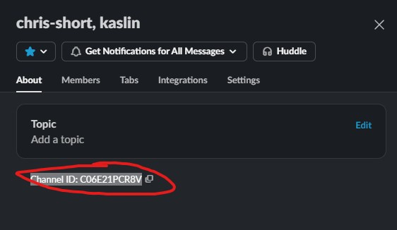

Now you can export the channel contents, selecting each channel via its ID. We recommend the "standard" storage type.

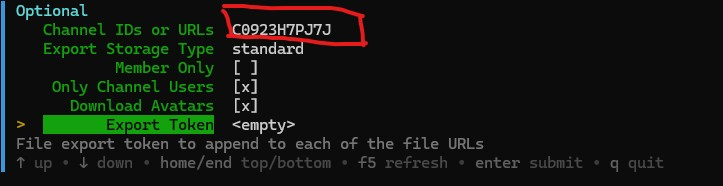

Once you have selected all the options, hit ESC to go back, and choose "Run Export". Slackdump will do a lot of pulling data, and eventually create a zip file in the root of your home directory.

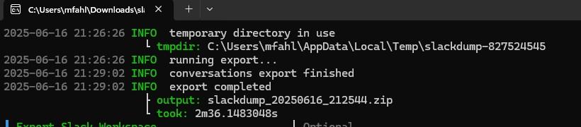

## View the export:

Once the workspace data is dumped, you can run built-in viewer:

```shell
slackdump view <zip or directory>
```

The built-in viewer supports all types of dumps:

1. Slackdump Archive format
1. Standard and Mattermost Slack Export
1. Dump mode files

Alternatively, you can use one of the following tools to view the
export results:

- [SlackLogViewer] - a fast and powerful Slack Export viewer written in C++, works on Export files (images won't be displayed, unless you used an export token flag).
- [Slackdump2Html] - a great Python application that converts Slack Dump to a
  static browsable HTML. It works on Dump mode files.
- [slack export viewer][slack-export-viewer] - Slack Export Viewer is a well known viewer for
  slack export files. Supports displaying files if saved in the "Standard" file mode.

[SlackLogViewer]: https://github.com/thayakawa-gh/SlackLogViewer/releases
[Slackdump2Html]: https://github.com/kununu/slackdump2html
[slack-export-viewer]: https://github.com/hfaran/slack-export-viewer

## What Should I Do with the Backup Files?

**Kubernetes Private Channels**: Contact #sig-contribex about getting a folder for your group in the Kubernetes-owned Google Drive. Let them know who should have access to the folder.

**Non-Kubernetes Private Channels**: For other projects on our Slack with private channels (there's a few), it will be up to you to figure out an appropriate community-owned location for the export.

**Direct Message Threads**: In most cases, DMs you back up should stay in your own storage. If there is some reason why a DM thread should belong to the Kubernetes community, then contact ContribEx.
