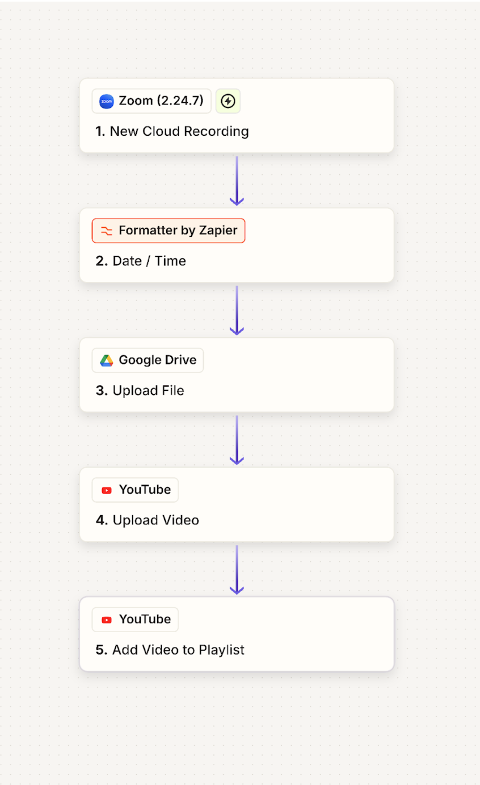

# Zapier Integration Playbook: Standard Operating Procedure

## 1. Overview

**Workflow Name:**  
Zaps: Zoom Recording to Google Drive & YouTube

**Template:**  
https://zapier.com/shared/1cf48789b958c3e2bf8cae14ed25c6943f193a7f

**Purpose:**  
Automates the flow of Zoom cloud recordings into Google Drive for backup, and then uploads them to YouTube, assigning them to the correct playlist.

**Owner:**  
[@youtube-admins](https://github.com/kubernetes/community/blob/master/communication/moderators.md#owners)

**Last Updated:**  
Feb 06, 2026, 22:32 CET

## 2. Prerequisites

**Important:** Before setting up this Zapier workflow, the Zapier app must be added to your Zoom Marketplace. This is required for Zapier to access Zoom cloud recordings and trigger the automation workflow.

To add the Zapier app to the Zoom Marketplace, reach out to [@zoom-admins](https://github.com/kubernetes/community/blob/master/communication/moderators.md#zoom) on Slack. They have access the the admin account to complete this setup.

## 3. Workflow Diagram

**High-level visual sequence:**

1. Zoom: Detects new cloud recording
2. Formatter: Normalizes the recording date
3. Google Drive: Uploads the file to a shared drive folder
4. YouTube: Uploads the video with title, description, and privacy settings
5. YouTube: Adds uploaded video into the correct playlist

## 4. Step-by-Step Breakdown & Rebuild

**Template:**  
https://zapier.com/shared/1cf48789b958c3e2bf8cae14ed25c6943f193a7f

**Zap Name:**  
[SIG-NAME]-Integration: Zoom Recording → Google Drive → YouTube

### 4.1 Trigger – Zoom

- **App:** Zoom (v2.24.7)
- **Event:** New Cloud Recording

**Setup inside Zapier:**
- Connect the correct Zoom account
- Choose trigger: New Cloud Recording
- Configure filters if needed (e.g., only for your user or specific meeting topics)
- Test trigger: Zapier should return a sample recording object

**Fields to note:**
- Recording Start Time → used in Formatter step
- Download URL → used later for file upload

### 4.2 Action – Formatter by Zapier (Date/Time)

- **App:** Formatter by Zapier
- **Event:** Date/Time → Format

**Setup inside Zapier:**
- Input: Recording Start Time (from Zoom)
- From Format: Auto-detect
- To Format: YYYY-MM-DD

**Example Output:**  
2025-09-04  
(This clean date string will be inserted into file names and YouTube titles.)

### 4.3 Action – Google Drive (Upload File)

- **App:** Google Drive
- **Event:** Upload File

**Setup inside Zapier:**
- Connect Google Drive account
- Folder: Select destination folder (e.g., `/Team/Meetings/Recordings/`)
- File: Map Zoom’s Download URL
- File Name: `WG Node Lifecycle Meeting – {{Formatter Output}}.mp4`
- Test: Zapier should upload a sample file into your Drive folder

### 4.4 Action – YouTube (Upload Video)

- **App:** YouTube
- **Event:** Upload Video

**Setup inside Zapier:**
- Connect your YouTube channel
- Video File: Map to the Google Drive file from Step 3
- Title: `WG Node Lifecycle Meeting – {{Formatter Output}}`
- Description: (Include structured details, e.g.)
    - Weekly WG Node Lifecycle meeting
    - Date: {{Formatter Output}}
    - Agenda:
        - Updates
        - Open issues
        - Next steps
- Privacy: Choose Public / Unlisted / Private
- Tags: (Optional, e.g., Kubernetes, Working Group, Node Lifecycle)

### 4.5 Action – YouTube (Add Video to Playlist)

- **App:** YouTube
- **Event:** Add Video to Playlist

**Setup inside Zapier:**
- Playlist: Select the target playlist (e.g., WG Node Lifecycle Meetings)
- Video: Map video ID from Step 4 (YouTube Upload)

## 5. Testing the Zap

- Run the Zap manually with a sample Zoom recording
- Confirm:
    - File appears in Google Drive with correct filename
    - Video uploads to YouTube with correct title, description, privacy
    - Video appears in the right playlist

## 6. Error Handling

- **Large files:** If file upload fails, check Zoom → Drive connection limits
- **Retries:** Zapier retries failed steps automatically; confirm retry settings
- **Notifications:** Ensure error emails are enabled in Zapier account
- **YouTube Upload:** If YouTube rejects upload (e.g., quota exceeded), Zapier shows an error in Zap History
- **Email Notifications:** Set up email notifications for failed runs

## 7. Accounts & Connections

This section details the accounts and connections used within our Zapier integrations.  
Maintaining accurate and secure connections is vital for uninterrupted workflows.

| Application        | Account Name  | Connected By | Last Reviewed |
|--------------------|--------------|--------------|--------------|
| Zoom Account       | Person       | Person       | Date         |
| Google Drive Account| Person       | Person       | Date         |
| YouTube Account    | Person       | Person       | Date         |

## 8. Change Management Note

Any edits to this Zap must be documented in this SOP and reviewed by [@youtube-admins](https://github.com/kubernetes/community/blob/master/communication/moderators.md#owners).  
Export a new PNG of the flow when changes are made.

## 9. Team Implementation Notes

- All team members should have access to the Google Drive destination folder and YouTube playlist
- Test workflow with a small sample recording before enabling full automation
- Keep a version history: save screenshots or JSON export of Zap for version tracking

## 10. Testing Checklist

- Trigger fires when a new Zoom recording is created
- File uploads to correct Google Drive folder
- Filename uses YYYY-MM-DD format
- Video uploads to YouTube with title & description
- Video is assigned to correct playlist
