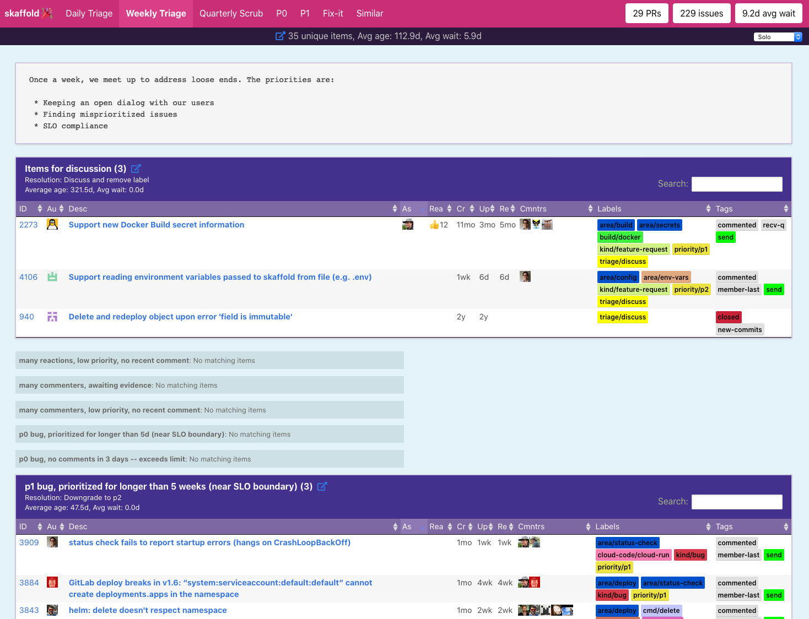
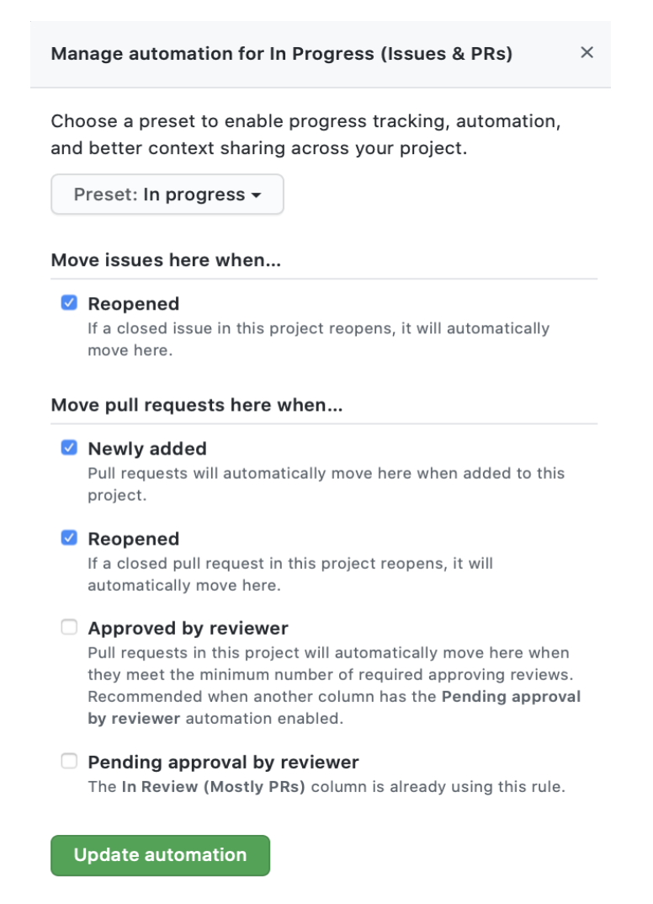
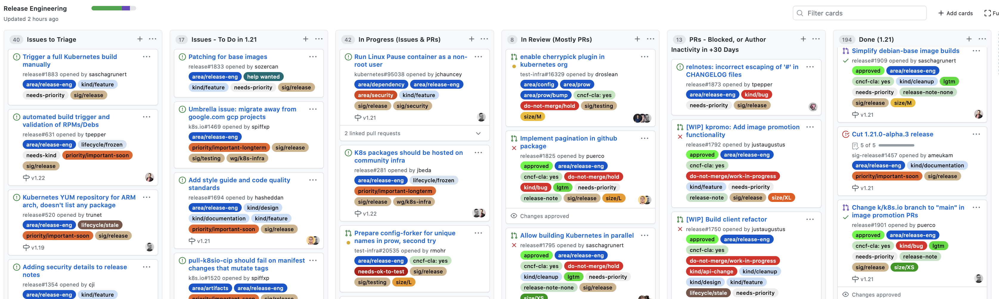
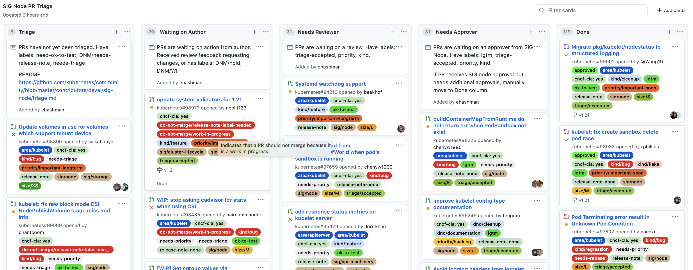
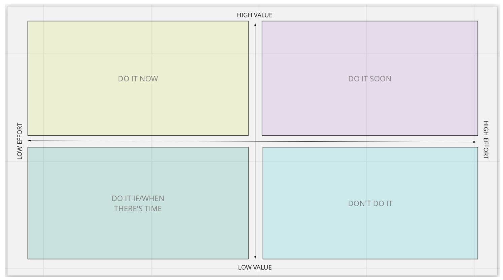
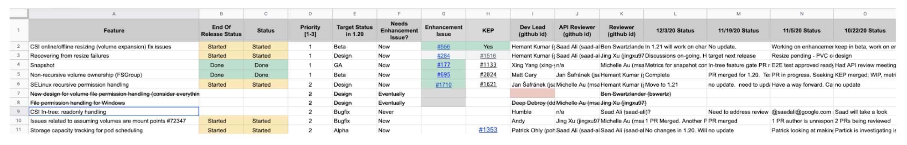
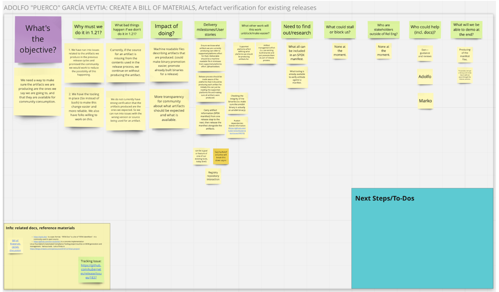

# Process and Workflow Guide

Author: **[@LappleApple](https://github.com/lappleapple)** || Contributors: **[@annajung](https://github.com/annajung)**, **[@kikisdeliveryservice](https://github.com/kikisdeliveryservice)**, **[@neolit123](https://github.com/neolit123)** 

## Who This Is For

- Leads who want guidance on how to structure workflow and processes using models explored successfully by other groups 
- Contributors who want to support Special Interest Groups (SIGs), Working Groups (WGs), subprojects, and other groups with process and workflow improvements
- Contributors who want to become leads or drive Kubernetes Enhancements Proposals (KEPs) and projects/subprojects

## Why This Exists

The primary reason is to reduce risk. Without processes in place to engage and graduate contributors, keep work flowing forward to completion, delegate, and ensure that the highest-value work gets done, Kubernetes will lose contributors, momentum, and growth opportunities. And you, as leads, might burn out from trying to do it all. Process assists in delegation, which is how overworked and overstretched SIG, WG, and subproject leads can load-balance. 

The idea here is progress, not perfection. Please try to put past process experiments and things-that-didn’t-work behind you. What failed yesterday might work today. You might need to recalibrate your idea of “failure”—a small bit of progress is still progress. Also, from failures we learn.

You might also take a cue from SIG Release and create a Program Manager role for your group. Reach out to Lauri Apple via the [#chairs-and-techleads](https://kubernetes.slack.com/messages/chairs-and-techleads) Slack channel if you’d like to explore this option.

## What This Covers

This guide presents guidance for key areas of workflow and process along with examples or insights from the named SIGs:

- [Ways of Working Agreement](#ways-of-working-agreement) (SIG Release/Release Engineering)
  - [Example: SIG Release/Release Engineering](#example-sig-releaserelease-engineering)
- [Making the Most out of Meetings](#making-the-most-out-of-meetings) (SIGs Instrumentation, Release, Storage, Auth)
- [Triage and Triaging Tools](#triage-and-triaging-tools)
- [Triage Meetings](#triage-meetings) (SIGs API Machinery, Instrumentation)
  - [Staffing Triage Activities](#staffing-triage-activities) (SIG Docs)
- [Triage Party](#triage-party) (SIGs Cluster Lifecycle, CLI, Release)
  - [Example: Triage Party for Skaffold](#example-triage-party-for-skaffold) (SIG Cluster Lifecycle)
- [GitHub Project Boards](#github-project-boards) (SIGs Node, Windows, Release) 
  - [Board Set-up Basics](#board-set-up-basics)
  - [Example: Pull Request Triage Board](#example-pull-request-triage-board-sig-node) (SIG Node)
  - [Example: Board Highlighting Risks](#example-board-highlighting-risks-sig-windows) (SIG Windows) 
  - [Example: KEP-Specific Issue Triage](#example-kep-specific-issue-triage-sig-release) (SIG Release)
- [KEP Planning for an Upcoming Release Cycle](#kep-planning-for-an-upcoming-release-cycle) (Network, Storage)
  - [Example: Prioritization Framework](#example-prioritization-framework-sig-release) (SIG Release)
  - [Example: KEP Tracking Table/Google Doc](#example-kep-tracking-tablegoogle-doc-sigs-node-windows) (SIGs Node, Windows)
  - [Example: KEP Tracking Spreadsheet](#example-kep-tracking-spreadsheet-sig-storage) (SIG Storage)
  - [Tips for Handling KEPs That Require Cross-SIG Coordination](#tips-for-handling-keps-that-require-cross-sig-coordination)
  - [Managing KEP Scope](#managing-kep-scope)
  - [When You Need More Help with KEPs/KEP Process](#when-you-need-more-help-with-kepskep-process)
- [Creating Roadmaps](#creating-roadmaps)
  - [Example: Roadmapping Templates for a Release Cycle](#example-roadmapping-templates-for-a-release-cycle-sigs-docs-release) (SIGs Docs, Release)
  - [Example: Brainstorming Template for Creating a Roadmap](#example-brainstorming-template-for-creating-a-roadmap-sig-releaserelease-engineering) (SIG Release/Release Engineering)
  - [Example: Umbrella Issues for Roadmapping an Initiative/Epic](#example-umbrella-issues-for-roadmapping-an-initiativeepic-sigs-testing-release) (SIGs Testing, Release)
- [Managing Communications: Delegating and Driving Transparency](#managing-communications-delegating-and-driving-transparency)
  - [Slack](#slack)
  - [Mailing List and GitHub Notification Best Practices](#mailing-list-and-github-notification-best-practices) (SIG Contributor Experience)

For brevity’s sake, not every aspect of running a SIG, WG, or subproject is covered. If you have questions, please reach out in [#chairs-and-techleads](https://kubernetes.slack.com/messages/chairs-and-techleads).

## Ways of Working Agreement

This one comes first as it’s a helpful way to summarize how your SIG, WG, or subproject operates in terms of communication, processes, and roles and responsibilities. This can serve as a useful onboarding tool or help you prevent process drift or abandonment. 

### Example: SIG Release/Release Engineering

The [Release Engineering](https://github.com/kubernetes/sig-release/tree/master/release-engineering) subproject of SIG Release has published a Ways of Working agreement that covers communication channels and how they’re used; roles and responsibilities; how they discuss work; and other major aspects of workflow and process. 

### Making the Most out of Meetings

Most, if not all, SIGs, WGs, and subprojects already have templates for organizing bimonthly meetings. [Here is a collection of templates](https://miro.com/templates/team-meetings/) for remote meetings that you might also find useful.

You’ll find some SIG-specific meeting tips in Release Engineering’s WoW agreement. A few more:

- Ask for topics ahead of time to drive focus, async planning, and meeting management. SIGs Architecture, Testing, and API Machinery do this.
  - Either cancel the meeting if there is no agenda, or use the meeting time to triage.   
- Split your meeting time into half discussion, half triaging and planning. If you’re struggling to stay on top of your KEPs and workflow, group meetings offer an opportunity to discuss your backlog and delegate work—including KEP follow-up activities—to contributors. SIG Storage tracks KEPs in their regular bimonthly meetings to ensure KEPs don’t linger in Alpha or Beta forever.  
- Refine and reorganize the meeting agenda during the first few minutes of the meeting. Put small items at the top, longer discussion items at the bottom. This allows people with quick asks and announcements to drop off the call if they’re not invested in the longer discussion items. SIGs Instrumentation and Auth do this regularly.
- Pay attention to how many people speak during your SIG meetings. If it’s just 2-3 people having a conversation, then consider keeping the discussion short and taking the topic offline. If you think the entire group should participate, structure the conversation to make that possible.

Meetings provide an opportunity to delegate work to contributors and to make group decisions about KEP backlogs, future plans, roadmaps, etc. For this reason, consider keeping discussions about specific topics brief and high-level. The async sidebar option (discussion on a GitHub issue, or a Slack thread) or small-group call is often better for working out details on a specific topic in order to make the most out of group meeting time.

## Triage and Triaging Tools

Triaging is an effective method for improving responsiveness to contributor requests—and, consequently, keeping contributors engaged and motivated. It’s also useful for:
- keeping on top of incoming work and delegating it to contributors
- maintaining company agnosticism. “Devs from other SIGs don’t have to ask for any favors in getting PRs to move forward—it’s just part of the process,” API Machinery Chair Fede Bongiovanni says. “Features don't get biased development.”

You can find [comprehensive triaging guidelines](/contributors/guide/issue-triage.md) here, along with information about triage tools used across the project:
- **[Triage Party](https://github.com/google/triage-party)**: a stateless web app to optimize issue and PR triage for large open-source projects using the GitHub API. More details are below. (Cluster Lifecycle, SIG Release) 
- **[GitHub project boards](https://docs.github.com/en/github/managing-your-work-on-github/managing-project-boards)**: these kanban boards allow you to track GitHub issues and PRs in an automated way. More details are below.

### Triage Meetings

Triaging is highly recommended for improving workflow and responsiveness to contributors. 

Some groups, like SIGs API Machinery and [Instrumentation](https://docs.google.com/document/d/1FE4AQ8B49fYbKhfg4Tx0cui1V0eI4o3PxoqQPUwNEiU/edit), host triage-specific meetings to manage their backlogs. If your group's backlog is small, however, then you can triage and refine during your bimonthly meetings by setting aside time. In November 2020 we rolled out a needs-triage label to support triage activities. You can add your [user feedback about the label here](https://github.com/kubernetes/community/issues/5299).

#### Staffing Triage Activities

If you’re a lead who runs triage yourself, you might strongly consider delegating this role to new contributors, including non-code contributors. You might also have contributors who take a strong interest in process and workflow topics—ask and you might be surprised.

SIG Docs rotates the triage facilitator role with its “[wrangler of the week](https://github.com/kubernetes/website/wiki/PR-Wranglers)” schedule. The wrangler balances their time between reviewing PRs and triaging new issues. 

### Triage Party 

#### Example: Triage Party for Skaffold

[Triage Party](https://github.com/google/triage-party) is an open-source tool that focuses on “reducing response latency for incoming GitHub issues and PR's, and ensure[s] that conversations are not lost in the ether.” Project creator Thomas Strömberg reports that using Triage Party for Minikube and Skaffold workflows has led to dramatic improvements in responsiveness to contributor requests. By “dramatic,” he means *40 times faster*.

**Other Uses of Triage Party**:
- SIG CLI uses it to manage [kubectl](https://cli.triage.k8s.io/s/kubectl) workflow, including quarterly bug scrubs and daily/weekly triage.

### GitHub Project Boards

A growing number of Kubernetes groups use GitHub project boards to quickly monitor and triage workflow. SIGs with boards include Contributor Experience, Release, Windows, Node, and Architecture. Some of these boards are highlighted below.

#### Board Set-up Basics

Project boards enable you to automate your workflow and review the status of work. You can automate board settings to eliminate the manual toil of moving items across the board:

To set up a project board, create several columns and put the earliest stages of work status at left. An example is Release Engineering’s board:

**The column flow here is**: 
Issues to Triage ⇒  
Issues - To Do in [current release] ⇒  
In Progress (Issues and PRs) ⇒  
In Review (Mostly PRs) ⇒   
PRs - Blocked, or Author Inactivity in +30 Days ⇒  
Done (during current release cycle)

When using a project board during a meeting, it’s recommended to review items from right to left. This is because the idea of kanban is to keep work flowing toward Done, and work in Review and In Progress is closer to being done than items that are still waiting for triage. 

#### Example: Pull Request Triage Board (SIG Node)

SIG Node uses [this GitHub project board layout](https://github.com/orgs/kubernetes/projects/49) to manage PR workflow. This not only helps Node, but also other SIGs organize their work. “Node’s PR triage board has been helpful for us,” says SIG Windows Chair Mark Rosetti. “I've been trying to make sure PRs that have been reviewed/approved by SIG Windows but still need an approval from the node / kubelet owner end up there.”

Note the cards at the top, which give direction and context to help new contributors get started with this board. With such guidance in place, even a new contributor can run a triage session for the team—enabling you to delegate.

#### Example: Board Highlighting Risks (SIG Windows) 

SIG Windows has created columns in [their project board](https://github.com/orgs/kubernetes/projects/8) for highlighting flaky tests and approval needs from other SIGs.

#### Example: KEP-Specific Issue Triage (SIG Release)

GitHub project boards are easy to spin up and tear down, which means you can easily set up one for managing the workflow of a large KEP—or a KEP that requires coordination across several different SIGs.

### KEP Planning for an Upcoming Release Cycle

SIGs are advised to start planning their list of KEPs for the upcoming release cycle as early as possible. This allows plenty of time to discuss the KEPs during your regular bimonthly meetings and organize your release cycle plans. SIG Storage runs release-cycle planning sessions to organize themselves, and also to refine their backlog to prune abandoned KEPs from their backlog.

#### Example: Prioritization Framework (SIG Release)

[This article](https://productcoalition.com/how-to-prioritize-features-and-projects-heres-the-ultimate-list-of-prioritization-frameworks-6f5b626ae779) provides many examples of prioritization frameworks to help you identify the highest-value work in your backlog and make trade-offs. Here’s a simple framework that enables you to make choices based on the required effort as well as urgency:

The above framework image was created with [Miro](http://miro.com), a digital whiteboard tool that your SIG can use for free. A recommendation is to run a planning meeting in which your SIG members use Miro PostIts to place KEPs along this matrix. From the resulting discussion you can come up with your KEPs for the upcoming release cycle and also spark a useful discussion about which KEPs are more urgent than others. Running such an exercise also gives you leverage in saying “no” or “not yet” to KEPs that must span across several cycles or are judged by the group to be lower-priority.

SIG Release's Release Engineering subproject has been using Miro planning boards since 1.20 to prioritize KEPs and other work. SIG Cluster Lifecycle co-chair Lubomir I. Ivanov also recommends [Diagrams.net]( https://www.diagrams.net/), which needs shareable folders (e.g. Google Drive) to work.

#### Example: KEP Tracking Table/Google Doc (SIGs Node, Windows)

SIG Windows Chair Mark Rossetti says this table has helped “especially as a TL;DR for those less active” in a SIG. Add the deadline for the next Enhancements Freeze at the top of the table to make that information transparent:

| Feature        | Goals           | 1.XX Target Stage  | Owners (Authors/Reviewers/Approvers) | TODO before Freeze |
| ------------- |:-------------:| :-----:|:-------------:| -----:|
|    Feature name      |       outcome sought     |       alpha/beta     |      so-and-so     |     steps     |

#### Example: KEP Tracking Spreadsheet (SIG Storage)

If you prefer tracking work in spreadsheets, here’s an example from Storage: 

#### Tips for Handling KEPs That Require Cross-SIG Coordination

Many SIGs struggle to plan for KEPs that require participation from other SIGs. Finding approvers to review code and code changes can be difficult. This results in KEPs not being approved on time, requiring SIGs to fill out exceptions, and then missing code freeze. If you're owning a KEP that requires participation from other SIGs, plan accordingly:
- Alert the other SIGs well ahead of time of your needs. You might need to plan a cycle in advance for an especially complex KEP.
- Develop a coordination plan that is self-service and lightweight—a simple spreadsheet or GitHub tracking issue, highlighting what is needed from each SIG and by when, can help you stay on top of progress and upcoming needs.
- If you’ve not had time to discuss the KEP with participating SIGs, try reducing the scope of the KEP for the upcoming release so that it doesn't affect other SIGs. This way, fewer people from other SIGs need to give tech reviews for KEP or code.

#### Managing KEP Scope

Breaking down large KEPs into smaller increments of value helps you to ship faster and more frequently, and creates shorter feedback loops. 

Network and Storage are two SIGs that regularly break down large KEPs to ship more predictably. An example from Storage is volume health: The alpha version was a very small feature that could be expanded in later cycles. When it’s not possible or simple to break down KEPs, consider holding them until the next release cycle to avoid missing the Code Freeze deadline.

#### When You Need More Help with KEPs/KEP Process

Please ping the Enhancements subproject at [#enhancements](https://kubernetes.slack.com/messages/enhancements) with your questions, needs, and concerns. In addition to having extensive knowledge about the KEP process and how to manage it, the subproject also includes several product manager-contributors who will embed with your SIG and help you with prioritization, user story creation for KEPs, roadmapping, and other efforts that can save you time and reduce complexity.

## Creating Roadmaps

Kubernetes currently lacks a project-wide roadmap, which presents some friction for users and customers. This is something that the Enhancements subproject aims to drive during 2021.

### Example: Roadmapping Templates for a Release Cycle (SIGs Docs, Release)

The KEP planning tools shared above are one way to roadmap a release cycle. But if your SIG doesn’t generate a lot of KEPs, and/or is mostly consumed with ongoing activities or emergent work, you might decide to create a standard roadmapping doc. A good roadmap will cover these bases:
- **Who** is the customer (user personas, specific parties served)
- **What** is the deliverable (including milestones, or increments of value that roll up to the deliverable)
- **Why** is it needed/urgent—what is its purpose? (including metrics and objectives) 
- **When** is it needed (what opportunities will we lose, by when, if we don’t do this now?)
- **Where** will the work be done: SIGs, components, areas of architecture 
- **Acceptance Criteria**: how do we know when we’re “done”?
- **Risks**: of not doing it, and the risks we might face during development 
- **What’s out of scope**

### Example: Brainstorming Template for Creating a Roadmap (SIG Release/Release Engineering)

Release Manager Adolfo “Puerco” García Veytia and SIG Release Tech Lead Dan Mangum used Miro to brainstorm a roadmap for creating a bill of materials:

SIG Release/Release Engineering is using [this template](https://docs.google.com/document/d/1U-SxIQKwEDmlj3QMxmKUl2laFRKaelDwBBBqWtnxPvw/edit) to draft a 2021 North Star vision that tells a coherent story to the project and contributors about what work is important this year, and why.

### Example: Umbrella Issues for Roadmapping an Initiative/Epic (SIGs Testing, Release)

GitHub doesn’t provide different issue types for different sizes of work. A commonly used workaround is the umbrella issue, which enables you to document a complex piece of work using headers and checkboxes. 

Using the results of the Miro session referred to above, Adolfo “Puerco” García Veytia created [this umbrella issue](https://github.com/kubernetes/release/issues/1837) for Release Engineering’s Bill of Materials. It’s a great example because:

- The title uses [Umbrella] to flag to others that several tasks are included within
- It describes the reasons for doing the work, to provide context to readers
- It highlights milestones with supporting tasks underneath, to organize the work and onboard contributors quickly
- It is succinct, easy-to-read, and outcomes-based

Here’s [another good example](https://github.com/kubernetes/test-infra/issues/18549) of an umbrella issue, from SIG Testing:

- Describes at the top why the work is important
- Includes a section for decisions to be made during development
- Includes a checklist to track supporting tasks 

## Managing Communications: Delegating and Driving Transparency

Across a project the size of Kubernetes, communications can easily be lost or missed. Many contributors receive literally hundreds of GitHub notifications a day. Many notes get pushed to Slack, and group leads face many direct messages on top of channel pings. Time to read important but long documents can be scarce. 

### Slack

- Use direct messages only for sensitive topics (personal, HR-related).  
- When someone pings via DM about work or a question that could be discussed/answered by others, direct them to your public channel.
- Use 2-3 channels as your main go-to for discussion.
- Create team handles and use them to draw attention to time-sensitive or workflow-related Slack messages (posted GitHub issues, PRs). This can drive delegation and discussion.

### Mailing List and GitHub Notification Best Practices

See the [communication best practices for mailing list and GitHub notifications](/communication/best-practices.md).
