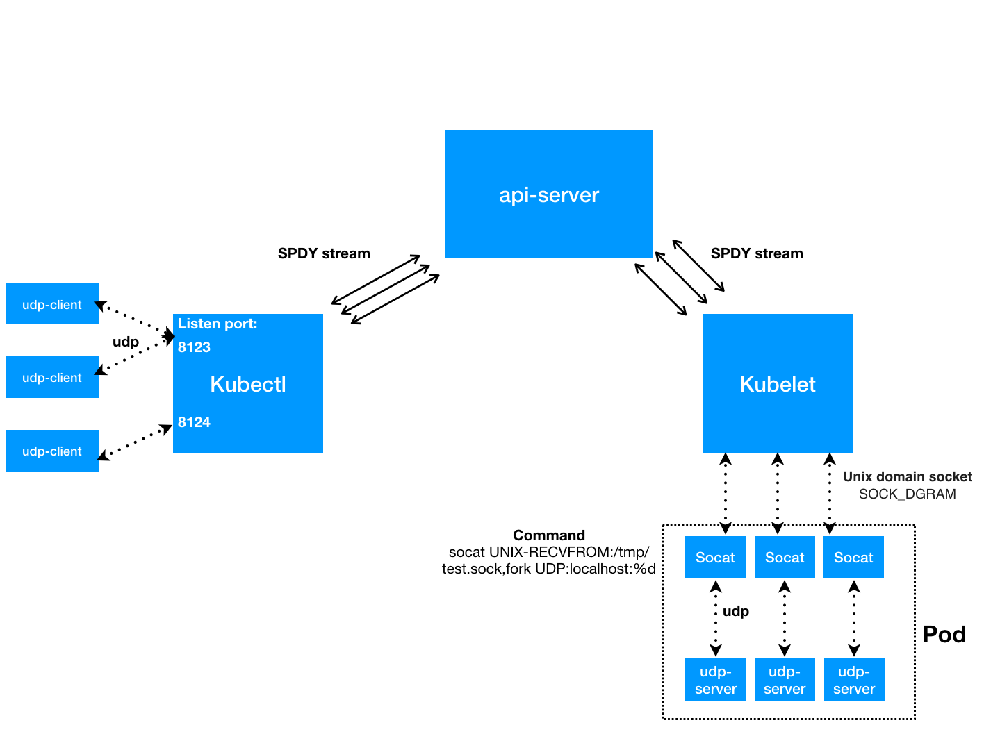

# UDP Port Forwarding in Kubernetes

Author: @shiywang

## Abstract

This describes an approach for providing support for:

- port forwarding to containers with UDP protocol

## Background && Motivation

Fixes user request of https://github.com/kubernetes/kubernetes/issues/47862


## Constraints and Assumptions

- We already have a port forwarding implementation for TCP using SPDY. TCP is connection-based and supports streaming, so it's easy to identify individual connections and we can use io.Copy to transfer the streams of data between all the components involved (local client, kubectl, apiserver, kubelet/CRI, pod). Unlike TCP, UDP is connectionless and it uses messages instead of a stream of data. To add support for UDP, we will continue to use SPDY, but we will not be able to use io.Copy for UDP datagram transmission. Instead, we will design a simple protocol to allow UDP message encapsulation over SPDY. Additionally, we will use a Unix domain socket as the means for transferring UPD messages between the kubelet/CRI and the pod.




## Use Cases

- As a user of a Kubernetes cluster, I want to be able to connect to local ports on my computer and have them forwarded to ports in the container with UDP.

- Basically like this: `kubectl port-forward pod-name --protocol=udp   8888:10001`

## Process Flow

### Port Forwarding Flow
1. The Kubectl connects to the apiserver to initiate a port forwarding
request.
2. The apiserver proxies the request to the Kubelet where the container lives.
3. The Kubectl listens on each specified local port, awaiting reading package.
4. The udp client send package to one of the local listening ports in Kubectl, Kubectl parse the package.
4. The Kubectl notifies the Kubelet of the new connection when the rmAddr is different. (similar to tcp per connections per data stream, since udp is connectionless we use rmAddr to distinguish)
5. The Kubelet executes nsenter + socat and use unix domain socket listening and forwarding back and forth between the client and the port in the container.


## Design Considerations

### Backward Compatibility

#### old kubectl - new api-server/kubelet
 
Fully compatible with out compatibility design.

#### new kubectl - old api-server/kubelet

Add a new port forwarding protocol, `v2.portforward.k8s.io`, that will indicate that UDP port forwarding is supported. If a newer kubectl requests `v2.portforward.k8s.io` and the apiserver does not support it, the apiserver returns an error.

### Customized Protocol

The customized protocol is pretty simple here, it contains two parts: the content length and actual data (oringal udp package). 

```
    0                   1                   2                   3
    0 1 2 3 4 5 6 7 8 9 0 1 2 3 4 5 6 7 8 9 0 1 2 3 4 5 6 7 8 9 0 1
   +-+-+-+-+-+-+-+-+-+-+-+-+-+-+-+-+-+-+-+-+-+-+-+-+-+-+-+-+-+-+-+-+
   |                       Content Length                          |
   +-+-+-+-+-+-+-+-+-+-+-+-+-+-+-+-+-+-+-+-+-+-+-+-+-+-+-+-+-+-+-+-+
   |                            Data                               |
   +-+-+-+-+-+-+-+-+-+-+-+-+-+-+-+-+-+-+-+-+-+-+-+-+-+-+-+-+-+-+-+-+
```


### Streaming Protocol

The current multiplexed streaming protocol used is SPDY.