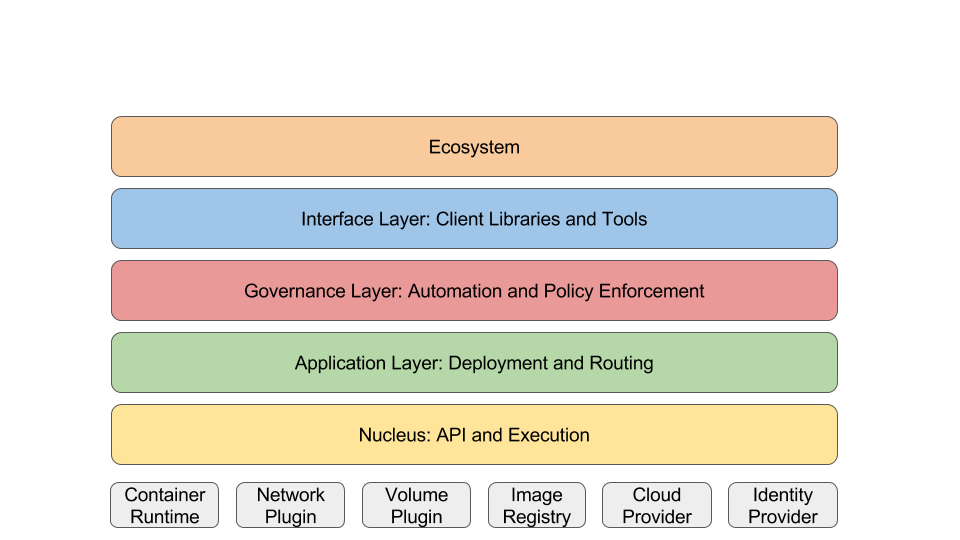

# Kubernetes Architectural Roadmap

**Shared with the community**

Status: First draft

Last update: 4/20/2017

Authors: Brian Grant, Tim Hockin, and Clayton Coleman

Intended audience: Kubernetes contributors

* * *

<!-- markdown-toc start - Don't edit this section. Run M-x markdown-toc-refresh-toc -->
**Table of Contents**

- [Kubernetes Architectural Roadmap](#kubernetes-architectural-roadmap)
    - [Summary/TL;DR](#summarytldr)
    - [Background](#background)
    - [System Layers](#system-layers)
        - [The Nucleus: API and Execution](#the-nucleus-api-and-execution)
            - [The API and cluster control plane](#the-api-and-cluster-control-plane)
            - [Execution](#execution)
        - [The Application Layer: Deployment and Routing](#the-application-layer-deployment-and-routing)
        - [The Governance Layer: Automation and Policy Enforcement](#the-governance-layer-automation-and-policy-enforcement)
        - [The Interface Layer: Libraries and Tools](#the-interface-layer-libraries-and-tools)
        - [The Ecosystem](#the-ecosystem)
    - [Managing the matrix](#managing-the-matrix)
    - [Layering of the system as it relates to security](#layering-of-the-system-as-it-relates-to-security)
    - [Next Steps](#next-steps)

<!-- markdown-toc end -->

## Summary/TL;DR

This document describes the ongoing architectural development of the Kubernetes system, and the
motivations behind it. System developers wanting to extend or customize
Kubernetes should use this document as a guide to inform where and how best to implement these
enhancements. Application developers wanting to develop large, portable and/or future-proof
Kubernetes applications may refer to this document for guidance on which parts of Kubernetes they
can rely on being present now and in the future.

The layers of the architecture are named and described (see the diagram below). Distinctions are
drawn between what exists today and what we plan to provide in future, and why.

Succinctly, the layers comprise:

1. **_The Nucleus_** which provides standardized API and execution machinery, including basic REST
   mechanics, security, individual Pod, container, network interface and storage volume management,
   all of which are extensible via well-defined interfaces.  The Nucleus is non-optional and
   expected to be the most stable part of the system.

2. **_The Application Management Layer_** which provides basic deployment and routing, including
   self-healing, scaling, service discovery, load balancing and traffic routing.  This is
   often referred to as orchestration and the service fabric. Default implementations of all
   functions are provided, but conformant replacements are permitted.

3. **_The Governance Layer_** which provides higher level automation and policy enforcement,
   including single- and multi-tenancy, metrics, intelligent autoscaling and provisioning, and
   schemes for authorization, quota, network, and storage policy expression and enforcement. These
   are optional, and achievable via other solutions.
   
4. **_The Interface Layer_** which provides commonly used libraries, tools, UI's and systems used to
   interact with the Kubernetes API.
   
5. **_The Ecosystem_** which includes everything else associated with Kubernetes, and is not really
   "part of" Kubernetes at all.  This is where most of the development happens, and includes CI/CD,
   middleware, logging, monitoring, data processing, PaaS, serverless/FaaS systems, workflow,
   container runtimes, image registries, node and cloud provider management, and many others.

## Background

Kubernetes is a platform for deploying and managing containers. For more information about the
mission, scope, and design of Kubernetes, see [What Is
Kubernetes](http://kubernetes.io/docs/whatisk8s/) and the [architectural
overview](/contributors/design-proposals/architecture/architecture.md). The
latter also describes the current breakdown of the system into components/processes.

Contributors to Kubernetes need to know what functionality they can
rely upon when adding new features to different parts of the system.

Additionally, one of the problems that faces platforms like Kubernetes
is to define what is "in" and what is “out”. While Kubernetes must
offer some base functionality on which users can rely when running
their containerized applications or building their extensions,
Kubernetes cannot and should not try to solve every problem that users
have. Adding to the difficulty is that, unlike some other types of
infrastructure services such as databases, load balancers, or
messaging systems, there are few obvious, natural boundaries for the
“built-in” functionality. Consequently, reasonable minds can disagree
on exactly where the boundaries lie or what principles guide the
decisions.

This document, which was inspired by [similar efforts from the
community](https://docs.google.com/document/d/1J6yCsPtggsSx_yfqNenb3xxBK22k43c5XZkVQmS38Mk/edit),
aims to clarify the intentions of the Kubernetes’s architecture
SIG. It is currently somewhat aspirational, and is intended to be a
blueprint for ongoing and future development. NIY marks items not yet
implemented as of the lated updated date at the head of this document.

[Presentation version](https://docs.google.com/presentation/d/1oPZ4rznkBe86O4rPwD2CWgqgMuaSXguIBHIE7Y0TKVc/edit#slide=id.p)

## System Layers

Just as Linux has a kernel, core system libraries, and optional
userland tools, Kubernetes also has "layers" of functionality and
tools. An understanding of these layers is important for developers of
Kubernetes functionality to determine which cross-concept dependencies
should be allowed and which should not.

Kubernetes APIs, concepts, and functionality can be sorted into the
following layers.

### The Nucleus: API and Execution

Essential API and execution machinery.

These APIs and functions, implemented by the upstream Kubernetes
codebase, comprise the bare minimum set of features and concepts
needed to build up the higher-order layers of the system.  These
pieces are thoroughly specified and documented, and every
containerized application will use them. Developers can safely assume
they are present.

They should eventually become stable and "boring". However, Linux has
continuously evolved over its 25-year lifetime and major changes,
including NPTL (which required rebuilding all applications) and
features that enable containers (which are changing how all
applications are run), have been added over the past 10 years. It will
take some time for Kubernetes to stabilize, as well.

#### The API and cluster control plane

Kubernetes clusters provide a collection of similar REST APIs, exposed
by the Kubernetes [API
server](https://kubernetes.io/docs/admin/kube-apiserver/), supporting
primarily CRUD operations on (mostly) persistent resources. These APIs
serve as the hub of its control plane.

REST APIs that follow Kubernetes API conventions (path conventions,
standard metadata, …) are automatically able to benefit from shared
API services (authorization, authentication, audit logging) and
generic client code can interact with them (CLI and UI
discoverability, generic status reporting in UIs and CLIs, generic
waiting conventions for orchestration tools, watching, label
selection).

The lowest layer of the system also needs to support extension
mechanisms necessary to add the functionality provided by the higher
layers. Additionally, this layer must be suitable for use both in
single-purpose clusters and highly tenanted clusters. The nucleus
should provide sufficient flexibility that higher-level APIs could
introduce new scopes (sets of resources) without compromising the
security model of the cluster.

Kubernetes cannot function without this basic API machinery and semantics, including: 

* [Authentication](https://kubernetes.io/docs/admin/authentication/):
  The authentication scheme is a critical function that must be agreed
  upon by both the server and clients. The API server supports basic
  auth (username/password) (NOTE: We will likely deprecate basic auth
  eventually.), X.509 client certificates, OpenID Connect tokens, and
  bearer tokens, any of which (but not all) may be disabled. Clients
  should support all forms supported by
  [kubeconfig](https://kubernetes.io/docs/user-guide/kubeconfig-file/). Third-party
  authentication systems may implement the TokenReview API and
  configure the authentication webhook to call it, though choice of a
  non-standard authentication mechanism may limit the number of usable
  clients.

    * The TokenReview API (same schema as the hook) enables external
      authentication checks, such as by Kubelet

    * Pod identity is provided by "[service accounts](https://kubernetes.io/docs/user-guide/service-accounts/)"

        * The ServiceAccount API, including default ServiceAccount
          secret creation via a controller and injection via an
          admission controller.

* [Authorization](https://kubernetes.io/docs/admin/authorization/):
  Third-party authorization systems may implement the
  SubjectAccessReview API and configure the authorization webhook to
  call it.

    * The SubjectAccessReview (same schema as the hook),
      LocalSubjectAccessReview, and SelfSubjectAccessReview APIs
      enable external permission checks, such as by Kubelet and other
      controllers

* REST semantics, watch, durability and consistency guarantees, API
  versioning, defaulting, and validation

    * NIY: API deficiencies that need to be addressed:

        * [Confusing defaulting
          behavior](https://github.com/kubernetes/kubernetes/issues/34292)
        * [Lack of
          guarantees](https://github.com/kubernetes/kubernetes/issues/30698)
        * [Orchestration
          support](https://github.com/kubernetes/kubernetes/issues/34363)
        * [Support for event-driven
          automation](https://github.com/kubernetes/kubernetes/issues/3692)
        * [Clean
          teardown](https://github.com/kubernetes/kubernetes/issues/4630)

* NIY: Built-in admission-control semantics, [synchronous
  admission-control hooks, and asynchronous resource
  initialization](https://github.com/kubernetes/community/pull/132) --
  it needs to be possible for distribution vendors, system
  integrators, and cluster administrators to impose additional
  policies and automation

* NIY: API registration and discovery, including API aggregation, to
  register additional APIs, to find out which APIs are supported, and
  to get the details of supported operations, payloads, and result
  schemas

* NIY: ThirdPartyResource and ThirdPartyResourceData APIs (or their
  successors), to support third-party storage and extension APIs

* NIY: An extensible and HA-compatible replacement for the
  /componentstatuses API to determine whether the cluster is fully
  turned up and operating correctly: ExternalServiceProvider
  (component registration)

* The Endpoints API (and future evolutions thereof), which is needed
  for component registration, self-publication of API server
  endpoints, and HA rendezvous, as well as application-layer target
  discovery

* The Namespace API, which is the means of scoping user resources, and
  namespace lifecycle (e.g., bulk deletion)

* The Event API, which is the means of reporting significant
  occurrences, such as status changes and errors, and Event garbage
  collection

* NIY: Cascading-deletion garbage collector, finalization, and
  orphaning

* NIY: We need a built-in [add-on
  manager](https://github.com/kubernetes/kubernetes/issues/23233) (not
  unlike [static pod
  manifests](https://kubernetes.io/docs/admin/static-pods/), but at
  the cluster level) so that we can automatically add self-hosted
  components and dynamic configuration to the cluster, and so we can
  factor out functionality from existing components in running
  clusters. At its core would be a pull-based declarative reconciler,
  as provided by the [current add-on
  manager](https://git.k8s.io/kubernetes/cluster/addons/addon-manager)
  and as described in the [whitebox app management
  doc](https://docs.google.com/document/d/1S3l2F40LCwFKg6WG0srR6056IiZJBwDmDvzHWRffTWk/edit#heading=h.gh6cf96u8mlr). This
  would be easier once we have [apply support in the
  API](https://github.com/kubernetes/kubernetes/issues/17333).

    * Add-ons should be cluster services that are managed as part of
      the cluster and that provide the same degree of
      [multi-tenancy](https://docs.google.com/document/d/148Lbe1w1xmUjMx7cIMWTVQmSjJ8qA77HIGCrdB-ugoc/edit)
      as that provided by the cluster.

    * They may, but are not required to, run in the kube-system
      namespace, but the chosen namespace needs to be chosen such that
      it won't conflict with users' namespaces.

* The API server acts as the gateway to the cluster. By definition,
  the API server must be accessible by clients from outside the
  cluster, whereas the nodes, and certainly pods, may not be. Clients
  authenticate the API server and also use it as a bastion and
  proxy/tunnel to nodes and pods (and services), using /proxy and
  /portforward APIs.

* TBD: The
  [CertificateSigningRequest](/contributors/design-proposals/cluster-lifecycle/kubelet-tls-bootstrap.md)
  API, to enable credential generation, in particular to mint Kubelet
  credentials

Ideally, this nuclear API server would only support the minimum
required APIs, and additional functionality would be added via
[aggregation](/contributors/design-proposals/api-machinery/aggregated-api-servers.md),
hooks, initializers, and other extension mechanisms.

Note that the centralized asynchronous controllers, such as garbage
collection, are currently run by a separate process, called the
[Controller
Manager](https://kubernetes.io/docs/admin/kube-controller-manager/).

/healthz and /metrics endpoints may be used for cluster management
mechanisms, but are not considered part of the supported API surface,
and should not be used by clients generally in order to detect cluster
presence. The /version endpoint should be used instead.

The API server depends on the following external components:

* Persistent state store (etcd, or equivalent; perhaps multiple
  instances)

The API server may depend on:

* Certificate authority

* Identity provider

* TokenReview API implementer

* SubjectAccessReview API implementer

#### Execution

The most important and most prominent controller in Kubernetes is the
[Kubelet](https://kubernetes.io/docs/admin/kubelet/), which is the
primary implementer of the Pod and Node APIs that drive the container
execution layer. Without these APIs, Kubernetes would just be a
CRUD-oriented REST application framework backed by a key-value store
(and perhaps the API machinery will eventually be spun out as an
independent project).

Kubernetes executes isolated application containers as its default,
native mode of execution. Kubernetes provides
[Pods](https://kubernetes.io/docs/user-guide/pods/) that can host
multiple containers and storage volumes as its fundamental execution
primitive.

The Kubelet API surface and semantics include:

* The Pod API, the Kubernetes execution primitive, including:

    * Pod feasibility-based admission control based on policies in the
      Pod API (resource requests, node selector, node/pod affinity and
      anti-affinity, taints and tolerations). API admission control
      may reject pods or add additional scheduling constraints to
      them, but Kubelet is the final arbiter of what pods can and
      cannot run on a given node, not the schedulers or DaemonSets.

    * Container and volume semantics and lifecycle

    * Pod IP address allocation (a routable IP address per pod is
      required)

    * A mechanism (i.e., ServiceAccount) to tie a Pod to a specific
      security scope

    * Volume sources:

        * emptyDir

        * hostPath

        * secret

        * configMap

        * downwardAPI

        * NIY: [Container and image volumes](http://issues.k8s.io/831)
          (and deprecate gitRepo)

        * NIY: Claims against local storage, so that complex
          templating or separate configs are not needed for dev
          vs. prod application manifests

        * flexVolume (which should replace built-in
          cloud-provider-specific volumes)

    * Subresources: binding, status, exec, logs, attach, portforward,
      proxy

* NIY: [Checkpointing of API
  resources](https://github.com/kubernetes/kubernetes/issues/489) for
  availability and bootstrapping

* Container image and log lifecycles

* The Secret API, and mechanisms to enable third-party secret
  management

* The ConfigMap API, for [component
  configuration](https://groups.google.com/forum/#!searchin/kubernetes-dev/component$20config%7Csort:relevance/kubernetes-dev/wtXaoHOiSfg/QFW5Ca9YBgAJ)
  as well as Pod references

* The Node API, hosts for Pods

    * May only be visible to cluster administrators in some
      configurations

* Node and pod networks and their controllers (route controller)

* Node inventory, health, and reachability (node controller)

    * Cloud-provider-specific node inventory functions should be split
      into a provider-specific controller.

* Terminated-pod garbage collection

* Volume controller

    * Cloud-provider-specific attach/detach logic should be split into
      a provider-specific controller. Need a way to extract
      provider-specific volume sources from the API.

* The PersistentVolume API

    * NIY: At least backed by local storage, as mentioned above

* The PersistentVolumeClaim API

Again, centralized asynchronous functions, such as terminated-pod
garbage collection, are performed by the Controller Manager.

The Controller Manager and Kubelet currently call out to a "cloud
provider" interface to query information from the infrastructure layer
and/or to manage infrastructure resources. However, [we’re working to
extract those
touchpoints](/contributors/design-proposals/cloud-provider/cloud-provider-refactoring.md)
([issue](https://github.com/kubernetes/kubernetes/issues/2770)) into
external components. The intended model is that unsatisfiable
application/container/OS-level requests (e.g., Pods,
PersistentVolumeClaims) serve as a signal to external “dynamic
provisioning” systems, which would make infrastructure available to
satisfy those requests and represent them in Kubernetes using
infrastructure resources (e.g., Nodes, PersistentVolumes), so that
Kubernetes could bind the requests and infrastructure resources
together.

The Kubelet depends on the following external components:

* Image registry

* Container Runtime Interface implementation

* Container Network Interface implementation

* FlexVolume implementations ("CVI" in the diagram)

And may depend on:

* NIY: Cloud-provider node plug-in, to provide node identity,
  topology, etc.

* NIY: Third-party secret management system (e.g., Vault)

* NIY: Credential generation and rotation controller

Accepted layering violations:

* [Explicit service links](https://github.com/kubernetes/community/pull/176)

* The kubernetes service for the API server

### The Application Layer: Deployment and Routing

The application management and composition layer, providing
self-healing, scaling, application lifecycle management, service
discovery, load balancing, and routing -- also known as orchestration
and the service fabric.

These APIs and functions are REQUIRED for any distribution of
Kubernetes. Kubernetes should provide default implementations for
these APIs, but replacements of the implementations of any or all of
these functions are permitted, provided the conformance tests
pass. Without these, most containerized applications will not run, and
few, if any, published examples will work. The vast majority of
containerized applications will use one or more of these.

Kubernetes’s API provides IaaS-like container-centric primitives and
also lifecycle controllers to support orchestration (self-healing,
scaling, updates, termination) of all major categories of
workloads. These application management, composition, discovery, and
routing APIs and functions include:

* A default scheduler, which implements the scheduling policies in the
  Pod API: resource requests, nodeSelector, node and pod
  affinity/anti-affinity, taints and tolerations. The scheduler runs
  as a separate process, on or outside the cluster.

* NIY: A
  [rescheduler](/contributors/design-proposals/scheduling/rescheduling.md),
  to reactively and proactively delete scheduled pods so that they can
  be replaced and rescheduled to other nodes.

* Continuously running applications: These application types should
  all support rollouts (and rollbacks) via declarative updates,
  cascading deletion, and orphaning/adoption. Other than DaemonSet,
  all should support horizontal scaling.

    * The Deployment API, which orchestrates updates of stateless
      applications, including subresources (status, scale, rollback)

        * The ReplicaSet API, for simple fungible/stateless
          applications, especially specific versions of Deployment pod
          templates, including subresources (status, scale)

    * The DaemonSet API, for cluster services, including subresources
      (status)

    * The StatefulSet API, for stateful applications, including
      subresources (status, scale)

    * The PodTemplate API, used by DaemonSet and StatefulSet to record change history

* Terminating batch applications: These should include support for
  automatic culling of terminated jobs (NIY).

    * The Job API ([GC
      discussion](https://github.com/kubernetes/kubernetes/issues/30243))

    * The CronJob API

* Discovery, load balancing, and routing

    * The Service API, including allocation of cluster IPs, repair on
      service allocation maps, load balancing via kube-proxy or
      equivalent, and automatic Endpoints generation, maintenance, and
      deletion for services. NIY: LoadBalancer service support is
      OPTIONAL, but conformance tests must pass if it is
      supported. If/when they are added, support for [LoadBalancer and
      LoadBalancerClaim
      APIs](https://github.com/kubernetes/community/pull/275) should
      be present if and only if the distribution supports LoadBalancer
      services.

    * The Ingress API, including [internal
      L7](https://docs.google.com/document/d/1ILXnyU5D5TbVRwmoPnC__YMO9T5lmiA_UiU8HtgSLYk/edit?ts=585421fc)
      (NIY)

    * Service DNS. DNS, using the [official Kubernetes
      schema](https://git.k8s.io/dns/docs/specification.md),
      is required.

The application layer may depend on:

* Identity provider (to-cluster identities and/or to-application
  identities)

* NIY: Cloud-provider controller implementation

* Ingress controller(s)

* Replacement and/or additional schedulers and/or reschedulers

* Replacement DNS service

* Replacement for kube-proxy

* Replacement and/or
  [auxiliary](https://github.com/kubernetes/kubernetes/issues/31571)
  workload controllers, especially for extended rollout strategies

### The Governance Layer: Automation and Policy Enforcement

Policy enforcement and higher-level automation. 

These APIs and functions should be optional for running applications,
and should be achievable via other solutions.

Each supported API/function should be applicable to a large fraction
of enterprise operations, security, and/or governance scenarios.

It needs to be possible to configure and discover default policies for
the cluster (perhaps similar to [Openshift’s new project template
mechanism](https://docs.openshift.org/latest/admin_guide/managing_projects.html#template-for-new-projects),
but supporting multiple policy templates, such as for system
namespaces vs. user ones), to support at least the following use
cases:

* Is this a: (source: [multi-tenancy working
  doc](https://docs.google.com/document/d/1IoINuGz8eR8Awk4o7ePKuYv9wjXZN5nQM_RFlVIhA4c/edit?usp=sharing))

    * Single tenant / single user cluster

    * Multiple trusted tenant cluster

    * Production vs. dev cluster

    * Highly tenanted playground cluster

    * Segmented cluster for reselling compute / app services to others

* Do I care about limiting:

    * Resource usage

    * Internal segmentation of nodes

    * End users

    * Admins

    * DoS

Automation APIs and functions:

* The Metrics APIs (needed for H/V autoscaling, scheduling TBD)

* The HorizontalPodAutoscaler API

* NIY: The vertical pod autoscaling API(s)

* [Cluster autoscaling and/or node
  provisioning](https://git.k8s.io/contrib/cluster-autoscaler)

* The PodDisruptionBudget API

* Dynamic volume provisioning, for at least one volume source type

    * The StorageClass API, implemented at least for the default
      volume type

* Dynamic load-balancer provisioning

* NIY: The
  [PodPreset](/contributors/design-proposals/service-catalog/pod-preset.md)
  API

* NIY: The [service
  broker/catalog](https://github.com/kubernetes-incubator/service-catalog)
  APIs

* NIY: The
  [Template](/contributors/design-proposals/apps/OBSOLETE_templates.md)
  and TemplateInstance APIs

Policy APIs and functions:

* [Authorization](https://kubernetes.io/docs/admin/authorization/):
  The ABAC and RBAC authorization policy schemes.

    * RBAC, if used, is configured using a number of APIs: Role,
      RoleBinding, ClusterRole, ClusterRoleBinding

* The LimitRange API

* The ResourceQuota API

* The PodSecurityPolicy API

* The ImageReview API

* The NetworkPolicy API

The management layer may depend on:

* Network policy enforcement mechanism

* Replacement and/or additional horizontal and vertical pod
  autoscalers

* [Cluster autoscaler and/or node provisioner](https://git.k8s.io/contrib/cluster-autoscaler)

* Dynamic volume provisioners

* Dynamic load-balancer provisioners

* Metrics monitoring pipeline, or a replacement for it

* Service brokers

### The Interface Layer: Libraries and Tools

These mechanisms are suggested for distributions, and also are
available for download and installation independently by users. They
include commonly used libraries, tools, systems, and UIs developed by
official Kubernetes projects, though other tools may be used to
accomplish the same tasks. They may be used by published examples.

Commonly used libraries, tools, systems, and UIs developed under some
Kubernetes-owned GitHub org.

* Kubectl -- We see kubectl as one of many client tools, rather than
  as a privileged one. Our aim is to make kubectl thinner, by [moving
  commonly used non-trivial functionality into the
  API](https://github.com/kubernetes/kubernetes/issues/12143). This is
  necessary in order to facilitate correct operation across Kubernetes
  releases, to facilitate API extensibility, to preserve the
  API-centric Kubernetes ecosystem model, and to simplify other
  clients, especially non-Go clients.

* Client libraries (e.g., client-go, client-python)

* Cluster federation (API server, controllers, kubefed)

* Dashboard

* Helm

These components may depend on:

* Kubectl extensions (discoverable via help)

* Helm extensions (discoverable via help)

### The Ecosystem

These things are not really "part of" Kubernetes at all.

There are a number of areas where we have already defined [clear-cut
boundaries](https://kubernetes.io/docs/whatisk8s#kubernetes-is-not)
for Kubernetes.

While Kubernetes must offer functionality commonly needed to deploy
and manage containerized applications, as a general rule, we preserve
user choice in areas complementing Kubernetes’s general-purpose
orchestration functionality, especially areas that have their own
competitive landscapes comprised of numerous solutions satisfying
diverse needs and preferences. Kubernetes may provide plug-in APIs for
such solutions, or may expose general-purpose APIs that could be
implemented by multiple backends, or expose APIs that such solutions
can target. Sometimes, the functionality can compose cleanly with
Kubernetes without explicit interfaces.

Additionally, to be considered part of Kubernetes, a component would
need to follow Kubernetes design conventions. For instance, systems
whose primary interfaces are domain-specific languages (e.g.,
[Puppet](https://docs.puppet.com/puppet/4.9/lang_summary.html), [Open
Policy Agent](http://www.openpolicyagent.org/)) aren’t compatible with
the Kubernetes API-centric approach, and are perfectly fine to use
with Kubernetes, but wouldn’t be considered to be part of
Kubernetes. Similarly, solutions designed to support multiple
platforms likely wouldn’t follow Kubernetes API conventions, and
therefore wouldn’t be considered to be part of Kubernetes.

* Inside container images: Kubernetes is not opinionated about the
  contents of container images -- if it lives inside the container
  image, it lives outside Kubernetes. This includes, for example,
  language-specific application frameworks.

* On top of Kubernetes

    * Continuous integration and deployment: Kubernetes is
      unopinionated in the source-to-image space. It does not deploy
      source code and does not build your application. Continuous
      Integration (CI) and continuous deployment workflows are areas
      where different users and projects have their own requirements
      and preferences, so we aim to facilitate layering CI/CD
      workflows on Kubernetes but don't dictate how they should work.

    * Application middleware: Kubernetes does not provide application
      middleware, such as message queues and SQL databases, as
      built-in infrastructure. It may, however, provide
      general-purpose mechanisms, such as service-broker integration,
      to make it easier to provision, discover, and access such
      components. Ideally, such components would just run on
      Kubernetes.

    * Logging and monitoring: Kubernetes does not provide logging
      aggregation, comprehensive application monitoring, nor telemetry
      analysis and alerting systems, though such mechanisms are
      essential to production clusters.

    * Data-processing platforms: Spark and Hadoop are well known
      examples, but there are [many such
      systems](https://hadoopecosystemtable.github.io/).

    * [Application-specific
      operators](https://coreos.com/blog/introducing-operators.html):
      Kubernetes supports workload management for common categories of
      applications, but not for specific applications.

    * Platform as a Service: Kubernetes [provides a
      foundation](https://kubernetes.io/blog/2017/02/caas-the-foundation-for-next-gen-paas/)
      for a multitude of focused, opinionated PaaSes, including DIY
      ones.

    * Functions as a Service: Similar to PaaS, but FaaS additionally
      encroaches into containers and language-specific application
      frameworks.

    * [Workflow
      orchestration](https://github.com/kubernetes/kubernetes/pull/24781#issuecomment-215914822):
      "Workflow" is a very broad, diverse area, with solutions
      typically tailored to specific use cases (data-flow graphs,
      data-driven processing, deployment pipelines, event-driven
      automation, business-process execution, iPaaS) and specific
      input and event sources, and often requires arbitrary code to
      evaluate conditions, actions, and/or failure handling.

    * [Configuration
      DSLs](https://github.com/kubernetes/kubernetes/pull/1007/files):
      Domain-specific languages do not facilitate layering
      higher-level APIs and tools, they usually have limited
      expressibility, testability, familiarity, and documentation,
      they promote complex configuration generation, they tend to
      compromise interoperability and composability, they complicate
      dependency management, and uses often subvert abstraction and
      encapsulation.

    * [Kompose](https://github.com/kubernetes-incubator/kompose):
      Kompose is a project-supported adaptor tool that facilitates
      migration to Kubernetes from Docker Compose and enables simple
      use cases, but doesn’t follow Kubernetes conventions and is
      based on a manually maintained DSL.

    * [ChatOps](https://github.com/harbur/kubebot): Also adaptor
      tools, for the multitude of chat services.

* Underlying Kubernetes

    * Container runtime: Kubernetes does not provide its own container
      runtime, but provides an interface for plugging in the container
      runtime of your choice.

    * Image registry: Kubernetes pulls container images to the nodes.

    * Cluster state store: Etcd

    * Network: As with the container runtime, we support an interface
      (CNI) that facilitates pluggability.

    * File storage: Local filesystems and network-attached storage. 

    * Node management: Kubernetes neither provides nor adopts any
      comprehensive machine configuration, maintenance, management, or
      self-healing systems, which typically are handled differently in
      different public/private clouds, for different operating
      systems, for mutable vs. immutable infrastructure, for shops
      already using tools outside of their Kubernetes clusters, etc.

    * Cloud provider: IaaS provisioning and management.

    * Cluster creation and management: The community has developed
      numerous tools, such as minikube, kubeadm, bootkube, kube-aws,
      kops, kargo, kubernetes-anywhere, and so on. As can be seen from
      the diversity of tools, there is no one-size-fits-all solution
      for cluster deployment and management (e.g., upgrades). There's
      a spectrum of possible solutions, each with different
      tradeoffs. That said, common building blocks (e.g., [secure
      Kubelet
      registration](/contributors/design-proposals/cluster-lifecycle/kubelet-tls-bootstrap.md))
      and approaches (in particular,
      [self-hosting](/contributors/design-proposals/cluster-lifecycle/self-hosted-kubernetes.md#what-is-self-hosted))
      would reduce the amount of custom orchestration needed in such
      tools.

We would like to see the ecosystem build and/or integrate solutions to
fill these needs.

Eventually, most Kubernetes development should fall in the ecosystem.

## Managing the matrix

Options, Configurable defaults, Extensions, Plug-ins, Add-ons,
Provider-specific functionality, Version skew, Feature discovery, and
Dependency management.

Kubernetes is not just an open-source toolkit, but is typically
consumed as a running, easy-to-run, or ready-to-run cluster or
service. We would like most users and use cases to be able to use
stock upstream releases. This means Kubernetes needs sufficient
extensibility without rebuilding to handle such use cases.

While gaps in extensibility are the primary drivers of code forks and
gaps in upstream cluster lifecycle management solutions are currently
the primary drivers of the proliferation of Kubernetes distributions,
the existence of optional features (e.g., alpha APIs,
provider-specific APIs), configurability, pluggability, and
extensibility make the concept inevitable.

However, to make it possible for users to deploy and manage their
applications and for developers to build Kubernetes extensions on/for
arbitrary Kubernetes clusters, they must be able to make assumptions
about what a cluster or distribution of Kubernetes provides. Where
functionality falls out of these base assumptions, there needs to be a
way to discover what functionality is available and to express
functionality requirements (dependencies) for usage.

Cluster components, including add-ons, should be registered via the
[component registration
API](https://github.com/kubernetes/kubernetes/issues/18610) and
discovered via /componentstatuses.

Enabled built-in APIs, aggregated APIs, and registered third-party
resources should be discoverable via the discovery and OpenAPI
(swagger.json) endpoints. As mentioned above, cloud-provider support
for LoadBalancer-type services should be determined by whether the
LoadBalancer API is present.

Extensions and their options should be registered via FooClass
resources, similar to
[StorageClass](https://git.k8s.io/kubernetes/pkg/apis/storage/v1beta1/types.go#L31),
but with parameter descriptions, types (e.g., integer vs string),
constraints (e.g., range or regexp) for validation, and default
values, with a reference to fooClassName from the extended API. These
APIs should also configure/expose the presence of related features,
such as dynamic volume provisioning (indicated by a non-empty
storageclass.provisioner field), as well as identifying the
responsible
[controller](https://github.com/kubernetes/kubernetes/issues/31571). We
need to add such APIs for at least scheduler classes, ingress
controller classes, flex volume classes, and compute resource classes
(e.g., GPUs, other accelerators).

Assuming we transitioned existing network-attached volume sources to
flex volumes, this approach would cover volume sources. In the future,
the API should provide only [general-purpose
abstractions](https://docs.google.com/document/d/1QVxD---9tHXYj8c_RayLY9ClrFpqfuejN7p0vtv2kW0/edit#heading=h.mij1ubfelvar),
even if, as with LoadBalancer services, the abstractions are not
implemented in all environments (i.e., the API does not need to cater
to the lowest common denominator).

NIY: We also need to develop mechanisms for registering and
discovering the following:

* Admission-control plugins and hooks (including for built-in APIs)

* Authentication plugins

* Authorization plugins and hooks

* Initializers and finalizers

* [Scheduler
  extensions](/contributors/design-proposals/scheduling/scheduler_extender.md)

* Node labels and [cluster
  topology](https://github.com/kubernetes/kubernetes/issues/41442)
  (topology classes?)

NIY: Activation/deactivation of both individual APIs and finer-grain
features could be addressed by the following mechanisms:

* [The configuration for all components is being converted from
  command-line flags to versioned
  configuration.](https://github.com/kubernetes/kubernetes/issues/12245)

* [We intend to store most of that configuration data in
  ](https://github.com/kubernetes/kubernetes/issues/1627)[ConfigMap](https://github.com/kubernetes/kubernetes/issues/1627)[s,
  to facilitate dynamic reconfiguration, progressive rollouts, and
  introspectability.](https://github.com/kubernetes/kubernetes/issues/1627)

* [Configuration common to all/multiple components should be factored
  out into its own configuration
  object(s).](https://github.com/kubernetes/kubernetes/issues/19831)
  This should include the [feature-gate
  mechanism](/contributors/design-proposals/cluster-lifecycle/runtimeconfig.md).

* An API should be added for semantically meaningful settings, such as
  the default length of time to wait before deleting pods on
  unresponsive nodes.

NIY: The problem of [version-skewed
operation](https://github.com/kubernetes/kubernetes/issues/4855), for
features dependent on upgrades of multiple components (including
replicas of the same component in HA clusters), should be addressed
by:

1. Creating flag gates for all new such features, 

2. Always disabling the features by default in the first minor release
   in which they appear,

3. Providing configuration patches to enable the features, and 

4. Enabling them by default in the next minor release. 

NIY: We additionally need a mechanism to [warn about out of date
nodes](https://github.com/kubernetes/kubernetes/issues/23874), and/or
potentially prevent master upgrades (other than to patch releases)
until/unless the nodes have been upgraded.

NIY: [Field-level
versioning](https://github.com/kubernetes/kubernetes/issues/34508)
would facilitate solutions to bulk activation of new and/or alpha API
fields, prevention of clobbering of new fields by poorly written
out-of-date clients, and evolution of non-alpha APIs without a
proliferation of full-fledged API definitions.

The Kubernetes API server silently ignores unsupported resource fields
and query parameters, but not unknown/unregistered APIs (note that
unimplemented/inactive APIs should be disabled). This can facilitate
the reuse of configuration across clusters of multiple releases, but
more often leads to surprises. Kubectl supports optional validation
using the Swagger/OpenAPI specification from the server. Such optional
validation should be [provided by the
server](https://github.com/kubernetes/kubernetes/issues/5889)
(NIY). Additionally, shared resource manifests should specify the
minimum required Kubernetes release, for user convenience, which could
potentially be verified by kubectl and other clients.

Additionally, unsatisfiable Pod scheduling constraints and
PersistentVolumeClaim criteria silently go unmet, which can useful as
demand signals to automatic provisioners, but also makes the system
more error prone. It should be possible to configure rejection of
unsatisfiable requests, using FooClass-style APIs, as described above
([NIY](https://github.com/kubernetes/kubernetes/issues/17324)).

The Service Catalog mechanism (NIY) should make it possible to assert
the existence of application-level services, such as S3-compatible
cluster storage.

## Layering of the system as it relates to security

In order to properly secure a Kubernetes cluster and enable [safe
extension](https://github.com/kubernetes/kubernetes/issues/17456), a
few fundamental concepts need to be defined and agreed on by the
components of the system. It’s best to think of Kubernetes as a series
of rings from a security perspective, with each layer granting the
successive layer capabilities to act.

1. One or more data storage systems (etcd) for the nuclear APIs

2. The nuclear APIs

3. APIs for highly trusted resources (system policies)

4. Delegated trust APIs and controllers (users grant access to the API
   / controller to perform actions on their behalf) either at the
   cluster scope or smaller scopes

5. Untrusted / scoped APIs and controllers and user workloads that run
   at various scopes

When a lower layer depends on a higher layer, it collapses the
security model and makes defending the system more complicated - an
administrator may *choose* to do so to gain operational simplicity,
but that must be a conscious choice. A simple example is etcd: any
component that can write data to etcd is now root on the entire
cluster, and any actor that can corrupt a highly trusted resource can
almost certainly escalate. It is useful to divide the layers above
into separate sets of machines for each layer of processes (etcd ->
apiservers + controllers -> nuclear security extensions -> delegated
extensions -> user workloads), even if some may be collapsed in
practice.

If the layers described above define concentric circles, then it
should also be possible for overlapping or independent circles to
exist - for instance, administrators may choose an alternative secret
storage solution that cluster workloads have access to yet the
platform does not implicitly have access to. The point of intersection
for these circles tends to be the machines that run the workloads, and
nodes must have no more privileges than those required for proper
function.

Finally, adding a new capability via extension at any layer should
follow best practices for communicating the impact of that action.

When a capability is added to the system via extension, what purpose
does it have?

* Make the system more secure

* Enable a new "production quality" API for consumption by everyone in
  the cluster

* Automate a common task across a subset of the cluster

* Run a hosted workload that offers apis to consumers (spark, a
  database, etcd)

* These fall into three major groups:

    * Required for the cluster (and hence must run close to the core,
      and cause operational tradeoffs in the presence of failure)

    * Exposed to all cluster users (must be properly tenanted)

    * Exposed to a subset of cluster users (runs more like traditional
      "app" workloads)

If an administrator can easily be tricked into installing a new
cluster level security rule during extension, then the layering is
compromised and the system is vulnerable.

## Next Steps

In addition to completing the technical mechanisms described and/or
implied above, we need to apply the principles in this document to a
set of more focused documents that answer specific practical
questions. Here are some suggested documents and the questions they
answer:

* **Kubernetes API Conventions For Extension API Developers**

    * Audience: someone planning to build a Kubernetes-like API
      extension (TPR or Aggregated API, etc…)

    * Answers Questions:

        * What conventions should I follow? (metadata, status, etc)

        * What integrations do I get from following those conventions?

        * What can I omit and Does 

    * Document that answers this question: 

* **Kubernetes API Conventions For CLI and UI Developers**

    * Audience: someone working on kubectl, dashboard, or another CLI
      or UI.

    * Answers Questions:

        * How can I show a user which objects subordinate and should
          normally be hidden

* **Required and Optional Behaviors for Kubernetes
  Distributions/Services**

    * See also the [certification
      issue](https://github.com/kubernetes/community/issues/432)

    * I just implemented a Hosted version of the Kubernetes API.  

        * Which API groups, versions and Kinds do I have to expose?  

        * Can I provide my own logging, auth, auditing integrations
          and so on?

        * Can I call it Kubernetes if it just has pods but no services?  

    * I'm packaging up a curated Kubernetes distro and selling it.

        * Which API groups, versions and Kinds do I have to expose in
          order to call it Kubernetes.

* **Assumptions/conventions for application developers**

    * I want to write portable config across on-prem and several clouds. 

        * What API types and behaviors should I assume are always
          present and fully abstracted.  When should I try to detect a
          feature (by asking the user what cloud provider they have,
          or in the future a feature discovery API).

* **Kubernetes Security Models**

    * Audience: hosters, distributors, custom cluster builders

