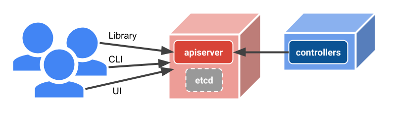

# Kubernetes Resource Management

> This article was authored by Brian Grant (bgrant0607) on 2/20/2018. The original Google Doc can be found [here](https://docs.google.com/document/d/1RmHXdLhNbyOWPW_AtnnowaRfGejw-qlKQIuLKQWlwzs/edit#).

Kubernetes is not just API-driven, but is *API-centric*.

At the center of the Kubernetes control plane is the [apiserver](https://kubernetes.io/docs/admin/kube-apiserver/), which implements common functionality for all of the system’s APIs. Both user clients and components implementing the business logic of Kubernetes, called controllers, interact with the same APIs. The APIs are REST-like, supporting primarily CRUD operations on (mostly) persistent resources. All persistent cluster state is stored in one or more instances of the [etcd](https://github.com/coreos/etcd) key-value store.



With the growth in functionality over the past four years, the number of built-in APIs grown by more than an order of magnitude. Moreover, Kubernetes now supports multiple API extension mechanisms that are not only used to add new functionality to Kubernetes itself, but provide frameworks for constructing an ecosystem of components, such as [Operators](https://coreos.com/operators/), for managing applications, platforms, infrastructure, and other things beyond the scope of Kubernetes itself. In addition to providing an overview of the common behaviors of built-in Kubernetes API resources, this document attempts to explain the assumptions, expectations, principles, conventions, and goals of the **Kubernetes Resource Model** so as to foster consistency and interoperability within that ecosystem as the uses of its API mechanisms and patterns expand. Any API using the same mechanisms and patterns will automatically work with any libraries and tools (e.g., CLIs, UIs, configuration, deployment, workflow) that have already integrated support for the model, which means that integrating support for N APIs implemented using the model in M tools is merely O(M) work rather than O(NM) work.

## Declarative control

In Kubernetes, declarative abstractions are primary, rather than layered on top of the system. The Kubernetes control plane is analogous to cloud-provider declarative resource-management systems (NOTE:  Kubernetes also doesn’t bake-in templating, for reasons discussed in the last section.), but presents higher-level (e.g., containerized workloads and services), portable abstractions. Imperative operations and flowchart-like workflow orchestration can be built on top of its declarative model, however.

Kubernetes supports declarative control by recording user intent as the desired state in its API resources. This enables a single API schema for each resource to serve as a declarative data model, as both a source and a target for automated components (e.g., autoscalers), and even as an intermediate representation for resource transformations prior to instantiation.

The intent is carried out by asynchronous [controllers](/contributors/devel/sig-api-machinery/controllers.md), which interact through the Kubernetes API. Controllers don’t access the state store, etcd, directly, and don’t communicate via private direct APIs. Kubernetes itself does expose some features similar to key-value stores such as etcd and [Zookeeper](https://zookeeper.apache.org/), however, in order to facilitate centralized [state and configuration management and distribution](https://sysgears.com/articles/managing-configuration-of-distributed-system-with-apache-zookeeper/) to decentralized components.

Controllers continuously strive to make the observed state match the desired state, and report back their status to the apiserver asynchronously. All of the state, desired and observed, is made visible through the API to users and to other controllers. The API resources serve as coordination points, common intermediate representation, and shared state.

Controllers are level-based (as described [here](http://gengnosis.blogspot.com/2007/01/level-triggered-and-edge-triggered.html) and [here](https://hackernoon.com/level-triggering-and-reconciliation-in-kubernetes-1f17fe30333d)) to maximize fault tolerance, which enables the system to operate correctly just given the desired state and the observed state, regardless of how many intermediate state updates may have been missed. However, they can achieve the benefits of an edge-triggered implementation by monitoring changes to relevant resources via a notification-style watch API, which minimizes reaction latency and redundant work. This facilitates efficient decentralized and decoupled coordination in a more resilient manner than message buses. (NOTE:  Polling is simple, and messaging is simple, but neither is ideal. There should be a CAP-like theorem about simultaneously achieving low latency, resilience, and simplicity -- pick any 2. Challenges with using "reliable" messaging for events/updates include bootstrapping consumers, events lost during bus outages, consumers not keeping up, bounding queue state, and delivery to unspecified numbers of consumers.)

## Additional resource model properties

The Kubernetes control-plane design is intended to make the system resilient and extensible, supporting both declarative configuration and automation, while providing a consistent experience to users and clients. In order to add functionality conforming to these objectives, it should be as easy as defining a new resource type and adding a new controller.

The Kubernetes resource model is designed to reinforce these objectives through its core assumptions (e.g., lack of exclusive control and multiple actors), principles (e.g., transparency and loose coupling), and goals (e.g., composability and extensibility):

* There are few direct inter-component APIs, and no hidden internal resource-oriented APIs. All APIs are visible and available (subject to authorization policy). The distinction between being part of the system and being built on top of the system is deliberately blurred. In order to handle more complex use cases, there's no glass to break. One can just access lower-level APIs in a fully transparent manner, or add new APIs, as necessary.

* Kubernetes operates in a distributed environment, and the control-plane itself may be sharded and distributed (e.g., as in the case of aggregated APIs). Desired state is updated immediately but actuated asynchronously and eventually. Kubernetes does not support atomic transactions across multiple resources and (especially) resource types, pessimistic locking, other durations where declarative intent cannot be updated (e.g., unavailability while busy), discrete synchronous long-running operations, nor synchronous success preconditions based on the results of actuation (e.g., failing to write a new image tag to a PodSpec when the image cannot be pulled). The Kubernetes API also does not provide strong ordering or consistency across multiple resources, and does not enforce referential integrity. Providing stronger semantics would compromise the resilience, extensibility, and observability of the system, while providing less benefit than one might expect, especially given other assumptions, such as the lack of exclusive control and multiple actors. Resources could be modified or deleted immediately after being created. Failures could occur immediately after success, or even prior to apparent success, if not adequately monitored. Caching and concurrency generally obfuscate event ordering. Workflows often involve external, non-transactional resources, such as git repositories and cloud resources. Therefore, graceful tolerance of out-of-order events and problems that could be self-healed automatically is expected. As an example, if a resource can't properly function due to a nonexistent dependent resource, that should be reported as the reason the resource isn't fully functional in the resource's status field.

* Typically each resource specifies a single desired state. However, for safety reasons, changes to that state may not be fully realized immediately. Since progressive transitions (e.g., rolling updates, traffic shifting, data migrations) are dependent on the underlying mechanisms being controlled, they must be implemented for each resource type, as needed. If multiple versions of some desired state need to coexist simultaneously (e.g., previous and next versions), they each need to be represented explicitly in the system. The convention is to generate a separate resource for each version, each with a content-derived generated name. Comprehensive version control is the responsibility of other systems (e.g., git).

* The reported observed state is truth. Controllers are expected to reconcile observed and desired state and repair discrepancies, and Kubernetes avoids maintaining opaque, internal persistent state. Resource status must be reconstructable by observation.

* The current status is represented using as many properties as necessary, rather than being modeled by state machines with explicit, enumerated states. Such state machines are not extensible (states can neither be added nor removed), and they encourage inference of implicit properties from the states rather than representing the properties explicitly.

* Resources are not assumed to have single, exclusive "owners". They may be read and written by multiple parties and/or components, often, but not always, responsible for orthogonal concerns (not unlike [aspects](https://en.wikipedia.org/wiki/Aspect-oriented_programming)). Controllers cannot assume their decisions will not be overridden or rejected, must continually verify assumptions, and should gracefully adapt to external events and/or actors. Example: we allow users to kill pods under control of a controller; it just replaces them.

* Object references are usually represented using predictable, client-provided names, to facilitate loose coupling, declarative references, disaster recovery, deletion and re-creation (e.g., to change immutable properties or to transition between incompatible APIs), and more. They are also represented as tuples (of name, namespace, API version, and resource type, or subsets of those) rather than URLs in order to facilitate inference of reference components from context.

## API topology and conventions

The [API](https://kubernetes.io/docs/reference/api-concepts/) URL structure is of the following form:

<p align="center">
	/prefix/group/version/namespaces/namespace/resourcetype/name
</p>

The API is divided into [**groups**](https://kubernetes.io/docs/concepts/overview/kubernetes-api/#api-groups) of related **resource types** that co-evolve together, in API [**version**s](https://kubernetes.io/docs/concepts/overview/kubernetes-api/#api-versioning). A client may interact with a resource in any supported version for that group and type.

Instances of a given resource type are usually (NOTE:  There are a small number of non-namespaced resources, also, which have global scope within a particular API service.) grouped by user-created [**namespaces**](https://kubernetes.io/docs/concepts/overview/working-with-objects/namespaces/), which scope [**names**](https://kubernetes.io/docs/concepts/overview/working-with-objects/names/), references, and some policies.

All resources contain common **metadata**, including the information contained within the URL path, to enable content-based path discovery. Because the resources are uniform and self-describing, they may be operated on generically and in bulk. The metadata also include user-provided key-value metadata in the form of [**labels**](https://kubernetes.io/docs/concepts/overview/working-with-objects/labels/) and [**annotations**](https://kubernetes.io/docs/concepts/overview/working-with-objects/annotations/). Labels are used for filtering and grouping by identifying attributes, and annotations are generally used by extensions for configuration and checkpointing.

Most resources also contain the [desired state ](https://kubernetes.io/docs/concepts/overview/working-with-objects/kubernetes-objects/#object-spec-and-status)[(**spec**)](https://kubernetes.io/docs/concepts/overview/working-with-objects/kubernetes-objects/#object-spec-and-status)[ and observed state ](https://kubernetes.io/docs/concepts/overview/working-with-objects/kubernetes-objects/#object-spec-and-status)[(**status**)](https://kubernetes.io/docs/concepts/overview/working-with-objects/kubernetes-objects/#object-spec-and-status). Status is written using the /status subresource (appended to the standard resource path (NOTE:  Note that subresources don’t follow the collection-name/collection-item convention. They are singletons.)), using the same API schema, in order to enable distinct authorization policies for users and controllers.

A few other subresources (e.g., `/scale`), with their own API types, similarly enable distinct authorization policies for controllers, and also polymorphism, since the same subresource type may be implemented for multiple parent resource types. Where distinct authorization policies are not required, polymorphism may be achieved simply by convention, using patch, akin to duck typing.

Supported data formats include YAML, JSON, and protocol buffers.

Example resource:

```yaml
apiVersion: v1
kind: Pod
metadata:
 namespace: default
 name: explorer
 labels:
   category: demo
 annotations:
   commit: 483ac937f496b2f36a8ff34c3b3ba84f70ac5782
spec:
 containers:
   - name: explorer
     image: gcr.io/google_containers/explorer:1.1.3
     args: ["-port=8080"]
     ports:
       - containerPort: 8080
         protocol: TCP
status:
```

API groups may be exposed as a unified API surface while being served by distinct [servers](https://kubernetes.io/docs/tasks/access-kubernetes-api/setup-extension-api-server/) using [**aggregation**](https://kubernetes.io/docs/concepts/api-extension/apiserver-aggregation/), which is particularly useful for APIs with special storage needs. However, Kubernetes also supports [**custom resources**](https://kubernetes.io/docs/concepts/api-extension/custom-resources/) (CRDs), which enables users to define new types that fit the standard API conventions without needing to build and run another server. CRDs can be used to make systems declaratively and dynamically configurable in a Kubernetes-compatible manner, without needing another storage system.

Each API server supports a custom [discovery API](https://github.com/kubernetes/client-go/blob/master/discovery/discovery_client.go) to enable clients to discover available API groups, versions, and types, and also [OpenAPI](https://kubernetes.io/blog/2016/12/kubernetes-supports-openapi/), which can be used to extract documentation and validation information about the resource types.

See the [Kubernetes API conventions](/contributors/devel/sig-architecture/api-conventions.md ) for more details.

## Resource semantics and lifecycle

Each API resource undergoes [a common sequence of behaviors](https://kubernetes.io/docs/admin/accessing-the-api/) upon each operation. For a mutation, these behaviors include:

1. [Authentication](https://kubernetes.io/docs/admin/authentication/)
2. [Authorization](https://kubernetes.io/docs/admin/authorization/): [Built-in](https://kubernetes.io/docs/admin/authorization/rbac/) and/or [administrator-defined](https://kubernetes.io/docs/admin/authorization/webhook/) identity-based policies
3. [Defaulting](/contributors/devel/sig-architecture/api-conventions.md#defaulting): API-version-specific default values are made explicit and persisted
4. Conversion: The apiserver converts between the client-requested [API version](https://kubernetes.io/docs/concepts/overview/kubernetes-api/#API-versioning) and the version it uses to store each resource type in etcd
5. [Admission control](https://kubernetes.io/docs/admin/admission-controllers/): [Built-in](https://kubernetes.io/docs/admin/admission-controllers/) and/or [administrator-defined](https://kubernetes.io/docs/admin/extensible-admission-controllers/) resource-type-specific policies
6. [Validation](/contributors/devel/sig-architecture/api-conventions.md#validation): Resource field values are validated. Other than the presence of required fields, the API resource schema is not currently validated, but optional validation may be added in the future
7. Idempotence: Resources are accessed via immutable client-provided, declarative-friendly names
8. [Optimistic concurrency](/contributors/devel/sig-architecture/api-conventions.md#concurrency-control-and-consistency): Writes may specify a precondition that the **resourceVersion** last reported for a resource has not changed
9. [Audit logging](https://kubernetes.io/docs/tasks/debug-application-cluster/audit/): Records the sequence of changes to each resource by all actors

Additional behaviors are supported upon deletion:

* Graceful termination: Some resources support delayed deletion, which is indicated by **deletionTimestamp** and **deletionGracePeriodSeconds** being set upon deletion

* Finalization: A **finalizer** is block on deletion placed by an external controller, and needs to be removed before the resource deletion can complete

* [Garbage collection](https://github.com/kubernetes/community/blob/master/contributors/design-proposals/api-machinery/garbage-collection.md): A resource may specify **ownerReferences**, in which case the resource will be deleted once all of the referenced resources have been deleted

And get:

* List: All resources of a particular type within a particular namespace may be requested; [response chunking](https://github.com/kubernetes/community/blob/master/contributors/design-proposals/api-machinery/api-chunking.md) is supported

* [Label selection](https://kubernetes.io/docs/concepts/overview/working-with-objects/labels/#list-and-watch-filtering): Lists may be filtered by their label keys and values

* Watch: A client may subscribe to changes to listed resources using the resourceVersion returned with the list results

## Declarative configuration

Kubernetes API resource specifications are designed for humans to directly author and read as declarative configuration data, as well as to enable composable configuration tools and automated systems to manipulate them programmatically. We chose this simple approach of using literal API resource specifications for configuration, rather than other representations, because it was natural, given that we designed the API to support CRUD on declarative primitives. The API schema must already well defined, documented, and supported. With this approach, there’s no other representation to keep up to date with new resources and versions, or to require users to learn. [Declarative configuration](https://goo.gl/T66ZcD) is only one client use case; there are also CLIs (e.g., kubectl), UIs, deployment pipelines, etc. The user will need to interact with the system in terms of the API in these other scenarios, and knowledge of the API transfers to other clients and tools. Additionally, configuration, macro/substitution, and templating languages are generally more difficult to manipulate programmatically than pure data, and involve complexity/expressiveness tradeoffs that prevent one solution being ideal for all use cases. Such languages/tools could be layered over the native API schemas, if desired, but they should not assume exclusive control over all API fields, because doing so obstructs automation and creates undesirable coupling with the configuration ecosystem.

The Kubernetes Resource Model encourages separation of concerns by supporting multiple distinct configuration sources and preserving declarative intent while allowing automatically set attributes. Properties not explicitly declaratively managed by the user are free to be changed by other clients, enabling the desired state to be cooperatively determined by both users and systems. This is achieved by an operation, called [**Apply**](https://docs.google.com/document/d/1q1UGAIfmOkLSxKhVg7mKknplq3OTDWAIQGWMJandHzg/edit#heading=h.xgjl2srtytjt) ("make it so"), that performs a 3-way merge of the previous configuration, the new configuration, and the live state. A 2-way merge operation, called [strategic merge patch](https:git.k8s.io/community/contributors/devel/sig-api-machinery/strategic-merge-patch.md), enables patches to be expressed using the same schemas as the resources themselves. Such patches can be used to perform automated updates without custom mutation operations, common updates (e.g., container image updates), combinations of configurations of orthogonal concerns, and configuration customization, such as for overriding properties of variants.
