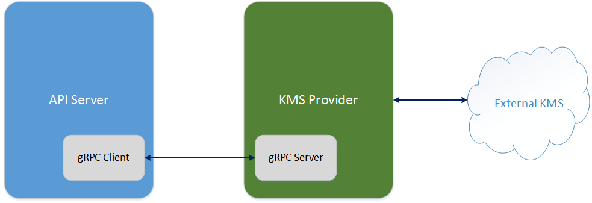
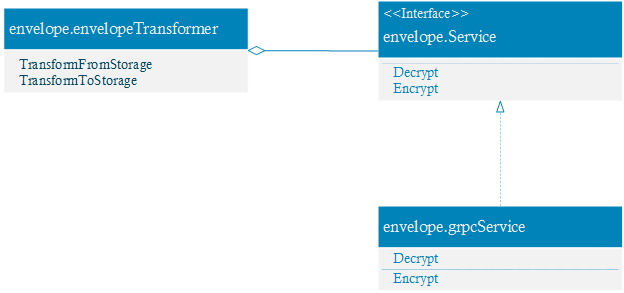

# KMS Plugin API for secrets encryption

## Background

Since v1.7, Kubernetes allows encryption of resources. It supports 3 kinds of encryptions: ``aescbc``, ``aesgcm`` and ``secretbox``. They are implemented as value transformer. This feature currently only supports encryption using keys in the configuration file (plain text, encoded with base64).

Using an external trusted service to manage the keys separates the responsibility of key management from operating and managing a Kubernetes cluster. So a new transformer, “Envelope Transformer”, was introduced in 1.8 ([49350](https://github.com/kubernetes/kubernetes/pull/49350)). “Envelope Transformer” defines an extension point, the interface ``envelope.Service``. The intent was to make it easy to add new KMS provider by implementing the interface. For example the provider for Google Cloud KMS, Hashicorp Vault and Microsoft azure KeyVault.

But as more KMS providers are added, more vendor dependencies are also introduced. So now we wish to pull all KMS providers out of API server, while retaining the ability of the API server to delegate encrypting secrets to an external trusted KMS service .

## High Level Design

At a high-level, (see [51965](https://github.com/kubernetes/kubernetes/issues/51965)), use gRPC to decouple the API server from the out-of-tree KMS providers. There is only one envelope service implementation (implement the interface ``envelope.Service``), and the envelope service communicates with the out-of-tree KMS provider through gRPC. The deployment diagram is like below:



Here we assume the remote KMS provider is accessible from the API server. Not care how to launch the KMS provider process and how to manage it in this document.

API server side (gRPC client) should know nothing about the external KMS. We only need to configure the KMS provider (gRPC server) endpoint for it.

KMS provider (gRPC server) must handle all details related to external KMS. It need know how to connect to KMS, how to pass the authentication, and which key or keys will be used, etc.. A qualified KMS provider implementation should hide all details from API server.

To add new KMS provider, we just implement the gRPC server. No new code or dependencies are added into API server. We configure the API server to make the gRPC client communicate with the new KMS provider.

Following is the class diagram that illustrates a possible implementation:



The class ``envelope.envelopeTransformer`` and the interface ``envelope.Service`` exists in current code base. What we need to do is to implement the class ``envelope.grpcService``.

## Proto File Definition

```protobuf
// envelope/service.proto
syntax = "proto3";

package envelope;

service KeyManagementService {
    // Version returns the runtime name and runtime version.
    rpc Version(VersionRequest) returns (VersionResponse) {}
    rpc Decrypt(DecryptRequest) returns (DecryptResponse) {}
    rpc Encrypt(EncryptRequest) returns (EncryptResponse) {}
}

message VersionRequest {
    // Version of the KMS plugin API.
    string version = 1;
}

message VersionResponse {
    // Version of the KMS plugin API.
    string version = 1;
    // Name of the KMS provider.
    string runtime_name = 2;
    // Version of the KMS provider. The string must be semver-compatible.
    string runtime_version = 3;
}

message DecryptRequest {
    // Version of the KMS plugin API, now use “v1beta1”
    string version = 1;
    bytes cipher = 2;
}

message DecryptResponse {
    bytes plain = 1;
}

message EncryptRequest {
    // Version of the KMS plugin API, now use “v1beta1”
    string version = 1;
    bytes plain = 2;
}

message EncryptResponse {
    bytes cipher = 1;
}
```

## Deployment

To avoid the need to implement authentication and authorization, the KMS provider should run on the master and be called via a local unix domain socket.

Cluster administrators have various options to ensure the KMS provider runs on the master: taints and tolerations is one. On GKE we target configuration at the kubelet that runs on the master directly (it isn't registered as a regular kubelet) and will have it start the KMS provider.

## Performance

The KMS provider will be called on every secret write and make a remote RPC to the KMS provider to do the actual encrypt/decrypt. To keep the overhead of the gRPC call to the KMS provider low, the KMS provider should run on the master. This should mean the extra overhead is small compared to the remote call.

Unencrypted DEKs are cached on the API server side, so gRPC calls to the KMS provider are only required to fill the cache on startup.

## Configuration

The out-of-tree provider will be specified in existing configuration file used to configure any of the encryption providers. The location of this configuration file is identified by the existing startup parameter ``--experimental-encryption-provider-config``. 

To specify the gRPC server endpoint, we add a new configuration parameter ``endpoint`` for the KMS configuration in a current deployment. The endpoint is a unix domain socket connection, for example ``unix:///tmp/kms-provider.sock``.

Now we expect the API server and KMS provider run in the same Pod. Not support TCP socket connection. So it’s not necessary to add TLS support.

Here is a sample configuration file with vault out-of-tree provider configured:

```yaml
kind: EncryptionConfig
apiVersion: v1
resources:
  - resources:
    - secrets
    providers:
    - kms:
        name: grpc-kms-provider
        cachesize: 1000
        endpoint: unix:///tmp/kms-provider.sock
```
