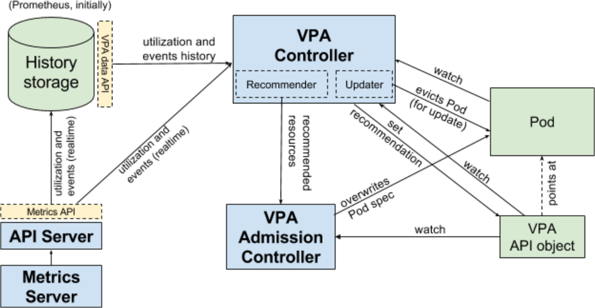

Vertical Pod Autoscaler
=======================
**Authors:** kgrygiel, mwielgus
**Contributors:** DirectXMan12, fgrzadkowski, jszczepkowski, smarterclayton

Vertical Pod Autoscaler
([#10782](https://github.com/kubernetes/kubernetes/issues/10782)),
later referred to as VPA (aka. "rightsizing" or "autopilot") is an
infrastructure service that automatically sets resource requirements of Pods
and dynamically adjusts them in runtime, based on analysis of historical
resource utilization, amount of resources available in the cluster and real-time
events, such as OOMs.

- [Introduction](#introduction)
  - [Background](#background)
  - [Purpose](#purpose)
  - [Related features](#related-features)
- [Requirements](#requirements)
  - [Functional](#functional)
  - [Availability](#availability)
  - [Extensibility](#extensibility)
- [Design](#design)
  - [Overview](#overview)
  - [Architecture overview](#architecture-overview)
  - [API](#api)
  - [Admission Controller](#admission-controller)
  - [Recommender](#recommender)
  - [Updater](#updater)
  - [Recommendation model](#recommendation-model)
  - [History Storage](#history-storage)
  - [Open questions](#open-questions)
- [Future work](#future-work)
  - [Pods that require VPA to start](#pods-that-require-vpa-to-start)
  - [Combining vertical and horizontal scaling](#combining-vertical-and-horizontal-scaling)
  - [Batch workloads](#batch-workloads)
- [Alternatives considered](#alternatives-considered)
  - [Pods point at VPA](#pods-point-at-vpa)
  - [VPA points at Deployment](#vpa-points-at-deployment)
  - [Actuation using the Deployment update mechanism](#actuation-using-the-deployment-update-mechanism)
  
------------
Introduction
------------

### Background ###
* [Compute resources](https://kubernetes.io/docs/user-guide/compute-resources/)
* [Resource QoS](/contributors/design-proposals/node/resource-qos.md)
* [Admission Controllers](https://kubernetes.io/docs/admin/admission-controllers/)
* [External Admission Webhooks](https://kubernetes.io/docs/admin/extensible-admission-controllers/#external-admission-webhooks)

### Purpose ###
Vertical scaling has two objectives:

1. Reducing the maintenance cost, by automating configuration of resource
requirements.

2. Improving utilization of cluster resources, while minimizing the risk of containers running out of memory or getting CPU starved.

### Related features ###
#### Horizontal Pod Autoscaler ####
["Horizontal Pod Autoscaler"](https://kubernetes.io/docs/tasks/run-application/horizontal-pod-autoscale/)
(often abbreviated to HPA) is an infrastructure service that dynamically adjusts
the number of Pods in a replication controller based on realtime analysis of CPU
utilization or other, user specified signals.
Usually the user will choose horizontal scaling for stateless workloads and
vertical scaling for stateful. In some cases both solutions could be combined
([see more](#combining-vertical-and-horizontal-scaling)).

#### Cluster Autoscaler ####
["Cluster Autoscaler"](https://github.com/kubernetes/autoscaler/tree/master/cluster-autoscaler)
is a tool that automatically adjusts the size of the Kubernetes cluster based on
the overall cluster utilization.
Cluster Autoscaler and Pod Autoscalers (vertical or horizontal) are
complementary features. Combined together they provide a fully automatic scaling
solution.

#### Initial resources ####
["Initial Resources"](https://github.com/kgrygiel/community/blob/master/contributors/design-proposals/initial-resources.md)
is a very preliminary, proof-of-concept feature providing initial request based
on historical utilization. It is designed to only kick in on Pod creation.
VPA is intended to supersede this feature.

#### In-place updates ####
In-place Pod updates ([#5774](https://github.com/kubernetes/kubernetes/issues/5774)) is a planned feature to
allow changing resources (request/limit) of existing containers without killing them, assuming sufficient free resources available on the node.
Vertical Pod Autoscaler will greatly benefit from this ability, however it is
not considered a blocker for the MVP.

#### Resource estimation ####
Resource estimation is another planned feature, meant to improve node resource
utilization by temporarily reclaiming unused resources of running containers.
It is different from Vertical Autoscaling in that it operates on a shorter
timeframe (using only local, short-term history), re-offers resources at a
lower quality, and does not provide initial resource predictions.
VPA and resource estimation are complementary. Details will follow once
Resource Estimation is designed.

------------
Requirements
------------

### Functional ###

1. VPA is capable of setting container resources (CPU & memory request/limit) at
   Pod submission time.
   
2. VPA is capable of adjusting container resources of existing Pods, in
   particular reacting to CPU starvation and container OOM events.
   
3. When VPA restarts Pods, it respects the disruption budget.

4. It is possible for the user to configure VPA with fixed constraints on
   resources, specifically: min & max request.
   
5. VPA is compatible with Pod controllers, at least with Deployments.
   In particular:
     * Updates of resources do not interfere/conflict with spec updates.
     * It is possible to do a rolling update of the VPA policy (e.g. min resources)
       on an existing Deployment.
     
6. It is possible to create Pod(s) that start following the VPA  policy
   immediately. In particular such Pods must not be scheduled until VPA policy
   is applied.
   
7. Disabling VPA is easy and fast ("panic button"), without disrupting existing
   Pods.

### Availability ###
1. Downtime of heavy-weight components (database/recommender) must not block
   recreating existing Pods. Components on critical path for Pod creation
   (admission controller) are designed to be highly available.

### Extensibility ###
1. VPA is capable of performing in-place updates once they become available.

------
Design
------

### Overview ###
(see further sections for details and justification)

1. We introduce a new type of **API resource**:
   `VerticalPodAutoscaler`. It consists of a **label selector** to match Pods,
   the **resources policy** (controls how VPA computes the resources), the
   **update policy** (controls how changes are applied to Pods) and the
   recommended Pod resources (an output field).
   
2. **VPA Recommender** is a new component which **consumes utilization signals
   and OOM events** for all Pods in the cluster from the
   [Metrics Server](https://github.com/kubernetes-incubator/metrics-server).
   
3. VPA Recommender **watches all Pods**, keeps calculating fresh recommended
   resources for them and **stores the recommendations in the VPA objects**.
   
4. Additionally the Recommender **exposes a synchronous API** that takes a Pod
   description and returns recommended resources.
   
5. All Pod creation requests go through the VPA **Admission Controller**.
   If the Pod is matched by any VerticalPodAutoscaler object, the admission
   controller **overrides resources** of containers in the Pod with the
   recommendation provided by the VPA Recommender. If the Recommender is not
   available, it falls back to the recommendation cached in the VPA object.

6. **VPA Updater** is a component responsible for **real-time updates** of Pods.
   If a Pod uses VPA in `"Auto"` mode, the Updater can decide to update it with
   recommender resources.
   In MVP this is realized by just evicting the Pod in order to have it
   recreated with new resources. This approach requires the Pod to belong to a
   Replica Set (or some other owner capable of recreating it).
   In future the Updater will take advantage of in-place updates, which would
   most likely lift this constraint.
   Because restarting/rescheduling Pods is disruptive to the service, it must be
   rare.
   
7. VPA only controls the resource **request** of containers. It sets the limit
   to infinity. The request is calculated based on analysis of the current and
   previous runs (see [Recommendation model](#recommendation-model) below).
   
8. **History Storage** is a component that consumes utilization signals and OOMs
   (same data as the Recommender) from the API Server and stores it persistently.
   It is used by the Recommender to **initialize its state on startup**.
   It can be backed by an arbitrary database. The first implementation will use
   [Prometheus](https://github.com/kubernetes/charts/tree/master/stable/prometheus),
   at least for the resource utilization part.
   
### Architecture overview ###


### API ###
We introduce a new type of API object `VerticalPodAutoscaler`, which
consists of the Target, that is a [label selector](https://kubernetes.io/docs/concepts/overview/working-with-objects/labels/#label-selectors)
for matching Pods and two policy sections: the update policy and the resources
policy.
Additionally it holds the most recent recommendation computed by VPA.

#### VPA API object overview ####
```go
// VerticalPodAutoscalerSpec is the specification of the behavior of the autoscaler.
type VerticalPodAutoscalerSpec {
	// A label query that determines the set of pods controlled by the Autoscaler.
	// More info: https://kubernetes.io/docs/concepts/overview/working-with-objects/labels/#label-selectors
	Selector *metav1.LabelSelector

	// Describes the rules on how changes are applied to the pods.
	// +optional
	UpdatePolicy PodUpdatePolicy

	// Controls how the autoscaler computes recommended resources.
	// +optional
	ResourcePolicy PodResourcePolicy
}

// VerticalPodAutoscalerStatus describes the runtime state of the autoscaler.
type VerticalPodAutoscalerStatus {
	// The time when the status was last refreshed.
	LastUpdateTime metav1.Time
	// The most recently computed amount of resources recommended by the
	// autoscaler for the controlled pods.
	// +optional
	Recommendation RecommendedPodResources	
	// A free-form human readable message describing the status of the autoscaler.
	StatusMessage string
}
```

The complete API definition is included [below](#complete_vpa_api_object_definition).

#### Label Selector ####
The label selector determines which Pods will be scaled according to the given
VPA policy. The Recommender will aggregate signals for all Pods matched by a
given VPA, so it is important that the user set labels to group similarly
behaving Pods under one VPA.

It is yet to be determined how to resolve conflicts, i.e. when the Pod is
matched by more than one VPA (this is not a VPA-specific problem though).

#### Update Policy ####
The update policy controls how VPA applies changes. In MVP it consists of a
single field `mode` that enables the feature.

```json
"updatePolicy" {
  "mode": "",
}
```

Mode can be set to one of the following:

1. `"Initial"`: VPA only assigns resources on Pod creation and does not
   change them during lifetime of the Pod.
2. `"Auto"` (default): VPA assigns resources on Pod creation and
   additionally can update them during lifetime of the Pod, including evicting /
   rescheduling the Pod.
3. `"Off"`: VPA never changes Pod resources. The recommender still sets the
   recommended resources in the VPA object. This can be used for a “dry run”.

To disable VPA updates the user can do any of the following: (1) change the
updatePolicy to `"Off"` or (2) delete the VPA or (3) change the Pod labels to no
longer match the VPA selector.

Note: disabling VPA prevents it from doing further changes, but does not revert
resources of the running Pods, until they are updated.
For example, when running a Deployment, the user would need to perform an update
to revert Pod to originally specified resources.

#### Resource Policy ####
The resources policy controls how VPA computes the recommended resources.
In MVP it consists of (optional) lower and upper bound on the request of each
container.
The resources policy could later be extended with additional knobs to let the
user tune the recommendation algorithm to their specific use-case.

#### Recommendation ####
The VPA resource has an output-only field keeping a recent recommendation,
filled by the Recommender. This field can be used to obtain a recent
recommendation even during a temporary unavailability of the Recommender.
The recommendation consists of the recommended target amount of resources as
well as an range (min..max), which can be used by the Updater to make decisions
on when to update the pod.
In the case of a resource crunch the Updater may decide to squeeze pod resources
towards the recommended minimum.
The width of the (min..max) range also reflects the confidence of a
recommendation. For example, for a workload with a very spiky usage it is much
harder to determine the optimal balance between performance and resource
utilization, compared to a workload with stable usage.

#### Complete VPA API object definition ####

```go
// VerticalPodAutoscaler is the configuration for a vertical pod
// autoscaler, which automatically manages pod resources based on historical and
// real time resource utilization.
type VerticalPodAutoscaler struct {
	metav1.TypeMeta
	// Standard object metadata.
	// More info: https://git.k8s.io/community/contributors/devel/api-conventions.md#metadata
	// +optional
	metav1.ObjectMeta

	// Specification of the behavior of the autoscaler.
	// More info: https://git.k8s.io/community/contributors/devel/api-conventions.md#spec-and-status.
	// +optional
	Spec VerticalPodAutoscalerSpec

	// Current information about the autoscaler.
	// +optional
	Status VerticalPodAutoscalerStatus
}

// VerticalPodAutoscalerSpec is the specification of the behavior of the autoscaler.
type VerticalPodAutoscalerSpec {
	// A label query that determines the set of pods controlled by the Autoscaler.
	// More info: https://kubernetes.io/docs/concepts/overview/working-with-objects/labels/#label-selectors
	Selector *metav1.LabelSelector

	// Describes the rules on how changes are applied to the pods.
	// +optional
	UpdatePolicy PodUpdatePolicy

	// Controls how the autoscaler computes recommended resources.
	// +optional
	ResourcePolicy PodResourcePolicy
}

// VerticalPodAutoscalerStatus describes the runtime state of the autoscaler.
type VerticalPodAutoscalerStatus {
	// The time when the status was last refreshed.
	LastUpdateTime metav1.Time
	// The most recently computed amount of resources recommended by the
	// autoscaler for the controlled pods.
	// +optional
	Recommendation RecommendedPodResources	
	// A free-form human readable message describing the status of the autoscaler.
	StatusMessage string
}

// UpdateMode controls when autoscaler applies changes to the pod resources.
type UpdateMode string
const (
	// UpdateModeOff means that autoscaler never changes Pod resources.
	// The recommender still sets the recommended resources in the
	// VerticalPodAutoscaler object. This can be used for a "dry run".
	UpdateModeOff UpdateMode = "Off"
	// UpdateModeInitial means that autoscaler only assigns resources on pod
	// creation and does not change them during the lifetime of the pod.
	UpdateModeInitial UpdateMode = "Initial"
	// UpdateModeAuto means that autoscaler assigns resources on pod creation
	// and additionally can update them during the lifetime of the pod,
	// including evicting / rescheduling the pod.
	UpdateModeAuto UpdateMode = "Auto"
)

// PodUpdatePolicy describes the rules on how changes are applied to the pods.
type PodUpdatePolicy struct {
	// Controls when autoscaler applies changes to the pod resources.
	// +optional
	UpdateMode UpdateMode
}

const (
	// DefaultContainerResourcePolicy can be passed as
	// ContainerResourcePolicy.Name to specify the default policy.
	DefaultContainerResourcePolicy = "*"
)
// ContainerResourcePolicy controls how autoscaler computes the recommended
// resources for a specific container.
type ContainerResourcePolicy struct {
	// Name of the container or DefaultContainerResourcePolicy, in which
	// case the policy is used by the containers that don't have their own
	// policy specified.
	Name string
	// Whether autoscaler is enabled for the container. Defaults to "On".
	// +optional
	Mode ContainerScalingMode
	// Specifies the minimal amount of resources that will be recommended
	// for the container.
	// +optional
	MinAllowed api.ResourceRequirements
	// Specifies the maximum amount of resources that will be recommended
	// for the container.
	// +optional
	MaxAllowed api.ResourceRequirements
}

// PodResourcePolicy controls how autoscaler computes the recommended resources
// for containers belonging to the pod.
type PodResourcePolicy struct {
	// Per-container resource policies.
	ContainerPolicies []ContainerResourcePolicy
}

// ContainerScalingMode controls whether autoscaler is enabled for a speciifc
// container.
type ContainerScalingMode string
const (
	// ContainerScalingModeOn means autoscaling is enabled for a container.
	ContainerScalingModeOn ContainerScalingMode = "On"
	// ContainerScalingModeOff means autoscaling is disabled for a container.
	ContainerScalingModeOff ContainerScalingMode = "Off"
)

// RecommendedPodResources is the recommendation of resources computed by
// autoscaler.
type RecommendedPodResources struct {
	// Resources recommended by the autoscaler for each container.
	ContainerRecommendations []RecommendedContainerResources
}

// RecommendedContainerResources is the recommendation of resources computed by
// autoscaler for a specific container. Respects the container resource policy
// if present in the spec.
type RecommendedContainerResources struct {
	// Name of the container.
	Name string
	// Recommended amount of resources.
	Target api.ResourceRequirements
	// Minimum recommended amount of resources.
	// Running the application with less resources is likely to have
	// significant impact on performance/availability.
	// +optional
	MinRecommended api.ResourceRequirements
	// Maximum recommended amount of resources.
	// Any resources allocated beyond this value are likely wasted.
	// +optional
	MaxRecommended api.ResourceRequirements
}
```

### Admission Controller ###

VPA Admission Controller intercepts Pod creation requests. If the Pod is matched
by a VPA config with mode not set to “off”, the controller rewrites the request
by applying recommended resources to the Pod spec. Otherwise it leaves the Pod
spec unchanged.

The controller gets the recommended resources by fetching
/recommendedPodResources from the Recommender. If the call times out or fails,
the controller falls back to the recommendation cached in the VPA object.
If this is also not available the controller lets the request pass-through
with originally specified resources.

Note: in future it will be possible to (optionally) enforce using VPA by marking
the Pod as "requiring VPA". This will disallow scheduling the Pod before a
corresponding VPA config is created. The Admission Controller will reject such
Pods if it finds no matching VPA config. This ability will be convenient for the
user who wants to create the VPA config together with submitting the Pod.

The VPA Admission Controller will be implemented as an
[External Admission Hook](https://kubernetes.io/docs/admin/extensible-admission-controllers/#external-admission-webhooks).
Note however that this depends on the proposed feature to allow
[mutating webhook admission controllers](/contributors/design-proposals/api-machinery/admission_control_extension.md#future-work).

### Recommender ###
Recommender is the main component of the VPA. It is responsible for
computing recommended resources. On startup the recommender fetches
historical resource utilization of all Pods (regardless of whether
they use VPA) together with the history of Pod OOM events from the
History Storage. It aggregates this data and keeps it in memory.

During normal operation the recommender consumes real time updates of
resource utilization and new events via the Metrics API from
the [Metrics Server](https://github.com/kubernetes-incubator/metrics-server).
Additionally it watches all Pods and all VPA objects in the
cluster. For every Pod that is matched by some VPA selector the
Recommender computes the recommended resources and sets the
recommendation on the VPA object.

It is important to realize that one VPA object has one recommendation.
The user is expected to use one VPA to control Pods with similar
resource usage patterns, typically a group of replicas or shards of
a single workload.

The Recommender acts as an
[extension-apiserver](https://kubernetes.io/docs/concepts/api-extension/apiserver-aggregation/),
exposing a synchronous method that takes a Pod Spec and the Pod metadata
and returns recommended resources.

#### Recommender API ####

```POST /recommendationQuery```

Request body:
```go
// RecommendationQuery obtains resource recommendation for a pod.
type RecommendationQuery struct {
	metav1.TypeMeta
	// +optional
	metav1.ObjectMeta

	// Spec is filled in by the caller to request a recommendation.
	Spec RecommendationQuerySpec

	// Status is filled in by the server with the recommended pod resources.
	// +optional
	Status RecommendationQueryStatus
}

// RecommendationQuerySpec is a request of recommendation for a pod.
type RecommendationQuerySpec struct {
	// Pod for which to compute the recommendation. Does not need to exist.
	Pod core.Pod
}

// RecommendationQueryStatus is a response to the recommendation request.
type RecommendationQueryStatus {
	// Recommendation holds recommended resources for the pod.
	// +optional
	Recommendation autoscaler.RecommendedPodResources
	// Error indicates that the recommendation was not available. Either
	// Recommendation or Error must be present.
	// +optional
	Error string
}
```

Notice that this API method may be called for an existing Pod, as well as for a
yet-to-be-created Pod.

### Updater ###
VPA Updater is a component responsible for applying recommended resources to
existing Pods.
It monitors all VPA objects and Pods in the cluster, periodically fetching
recommendations for the Pods that are controlled by VPA by calling the
Recommender API.
When recommended resources significantly diverge from actually configured
resources, the Updater may decide to update a Pod.
In MVP (until in-place updates of Pod resources are available)
this means evicting Pods in order to have them recreated with the recommended
resources.

The Updater relies on other mechanisms (such as Replica Set) to recreate a
deleted Pod. However it does not verify whether such mechanism is actually
configured for the Pod. Such checks could be implemented in the CLI and warn
the user when the VPA would match Pods, that are not automatically restarted.

While terminating Pods is disruptive and generally undesired, it is sometimes
justified in order to (1) avoid CPU starvation (2) reduce the risk of correlated
OOMs across multiple Pods at random time or (3) save resources over long periods
of time.

Apart from its own policy on how often a Pod can be evicted, the Updater also
respects the Pod disruption budget, by using Eviction API to evict Pods.

The Updater only touches pods that point to a VPA with updatePolicy.mode set
to `"Auto"`.

The Updater will also need to understand how to adjust the recommendation before
applying it to a Pod, based on the current state of the cluster (e.g. quota,
space available on nodes or other scheduling constraints).
Otherwise it may deschedule a Pod permanently. This mechanism is not yet
designed.

### Recommendation model ###

VPA controls the request (memory and CPU) of containers. In MVP it always sets
the limit to infinity. It is not yet clear whether there is a use-case for VPA
setting the limit.

The request is calculated based on analysis of the current and previous runs of
the container and other containers with similar properties (name, image,
command, args).
The recommendation model (MVP) assumes that the memory and CPU consumption are
independent random variables with distribution equal to the one observed in the
last N days (recommended value is N=8 to capture weekly peaks).
A more advanced model in future could attempt to detect trends, periodicity and
other time-related patterns.

For CPU the objective is to **keep the fraction of time when the container usage
exceeds a high percentage (e.g. 95%) of request below a certain threshold**
(e.g. 1% of time).
In this model the "CPU usage" is defined as mean usage measured over a short
interval. The shorter the measurement interval, the better the quality of
recommendations for spiky, latency sensitive workloads. Minimum reasonable
resolution is 1/min, recommended is 1/sec.

For memory the objective is to **keep the probability of the container usage
exceeding the request in a specific time window below a certain threshold**
(e.g. below 1% in 24h). The window must be long (≥ 24h) to ensure that evictions
caused by OOM do not visibly affect (a) availability of serving applications
(b) progress of batch computations (a more advanced model could allow user to
specify SLO to control this).

#### Handling OOMs ####
When a container is evicted due to exceeding available memory, its actual memory
requirements are not known (the amount consumed obviously gives the lower
bound). This is modelled by translating OOM events to artificial memory usage
samples by applying a "safety margin" multiplier to the last observed usage.

### History Storage ###
VPA defines data access API for providers of historical events and resource
utilization. Initially we will use Prometheus as the reference implementation of
this API, at least for the resource utilization part. The historical events
could be backed by another solution, e.g.
[Infrastore](https://github.com/kubernetes/kubernetes/issues/44095).
Users will be able to plug their own implementations.

History Storage is populated with real time updates of resources utilization and
events, similarly to the Recommender. The storage keeps at least 8 days of data.
This data is only used to initialize the Recommender on startup.

### Open questions ###
1. How to resolve conflicts if multiple VPA objects match a Pod.

2. How to adjust the recommendation before applying it to a specific pod,
   based on the current state of the cluster (e.g. quota, space available on
   nodes or other scheduling constraints).

-----------
Future work
-----------

### Pods that require VPA to start ###
In the current proposal the Pod will be scheduled with originally configured
resources if no matching VPA config is present at the Pod admission time.
This may be undesired behavior. In particular the user may want to create the
VPA config together with submitting the Pod, which leads to a race condition:
the outcome depends on which resource (VPA or the Pod) is processed first.

In order to address this problem we propose to allow marking Pods with a special
annotation ("requires VPA") that prevents the Admission Controller from allowing
the Pod if a corresponding VPA is not available.

An alternative would be to introduce a VPA Initializer serving the same purpose.

### Combining vertical and horizontal scaling ###
In principle it may be possible to use both vertical and horizontal scaling for
a single workload (group of Pods), as long as the two mechanisms operate on
different resources.
The right approach is to let the
[Horizontal Pod Autoscaler](https://kubernetes.io/docs/tasks/run-application/horizontal-pod-autoscale/)
scale the group based on the _bottleneck_ resource. The Vertical Pod Autoscaler
could then control other resources. Examples:

1. A CPU-bound workload can be scaled horizontally based on the CPU utilization
while using vertical scaling to adjust memory.

2. An IO-bound workload can be scaled horizontally based on the IO throughput
while using vertical scaling to adjust both memory and CPU.

However this is a more advanced form of autoscaling and it is not well supported
by the MVP version of Vertical Pod Autoscaler. The difficulty comes from the
fact that changing the number of instances affects not only the utilization of
the bottleneck resource (which is the principle of horizontal scaling) but
potentially also non-bottleneck resources that are controlled by VPA.
The VPA model will have to be extended to take the size of the group into account
when aggregating the historical resource utilization and when producing a
recommendation, in order to allow combining it with HPA.

### Batch workloads ###
Batch workloads have different CPU requirements than latency sensitive
workloads. Instead of latency they care about throughput, which means VPA should
base the CPU requirements on average CPU consumption rather than high
percentiles of CPU distribution.

TODO: describe the recommendation model for the batch workloads and how VPA will
distinguish between batch and serving. A possible approach is to look at
`PodSpec.restartPolicy`.
An alternative would be to let the user specify the latency requirements of the
workload in the `PodResourcePolicy`.

-----------------------
Alternatives considered
-----------------------

### Pods point at VPA ###
*REJECTED BECAUSE IT REQUIRES MODIFYING THE POD SPEC*

#### proposal: ####
Instead of VPA using label selectors, Pod Spec is extended with an optional
field `verticalPodAutoscalerPolicy`,
a [reference](https://kubernetes.io/docs/api-reference/v1/definitions/#_v1_localobjectreference)
to the VPA config.

#### pros: ####
* Consistency is enforced at the API level:
    * At most one VPA can point to a given Pod.
    * It is always clear at admission stage whether the Pod should use
      VPA or not. No race conditions.
* It is cheap to find the VPA for a given Pod.

#### cons: ####
* Requires changing the core part of the API (Pod Spec).

### VPA points at Deployment ###

#### proposal: ####
VPA has a reference to Deployment object. Doesn’t use label selector to match
Pods.

#### pros: ####
* More consistent with HPA.

#### cons: ####
* Extending VPA support from Deployment to other abstractions that  manage Pods
  requires additional work. VPA must be aware of all such abstractions.
* It is not possible to do a rolling update of the VPA config.
  For example setting `max_memory` in the VPA config will apply to the whole
  Deployment immediately.
* VPA can’t be shared between deployments.

### Actuation using the Deployment update mechanism ###

In this solution the Deployment itself is responsible for actuating VPA
decisions.

#### Actuation by update of spec ####
In this variant changes of resources are applied similarly to normal changes of
the spec, i.e. using the Deployment rolling update mechanism.

**pros:** existing clean API (and implementation), one common update policy
(e.g. max surge, max unavailable).

**cons:** conflicting with user (config) update - update of resources and spec
are tied together (they are executed at the same rate), problem with rollbacks,
problem with pause. Not clear how to handle in-place updates? (this problem has
to be solved regardless of VPA though).

#### Dedicated method for resource update ####
In this variant Deployment still uses the rolling update mechanism for updating
resources, but update of resources is treated in a special way, so that it can
be performed in parallel with config update.

**pros:** handles concurrent resources and spec updates, solves resource updates
without VPA, more consistent with HPA, all update logic lives in one place (less
error-prone).

**cons:** specific to Deployment, high complexity (multiple replica set created
underneath - exposed to the user, can be confusing and error-prone).
