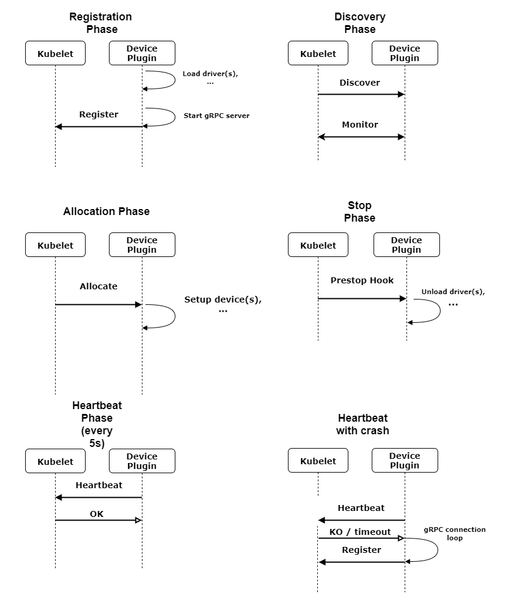
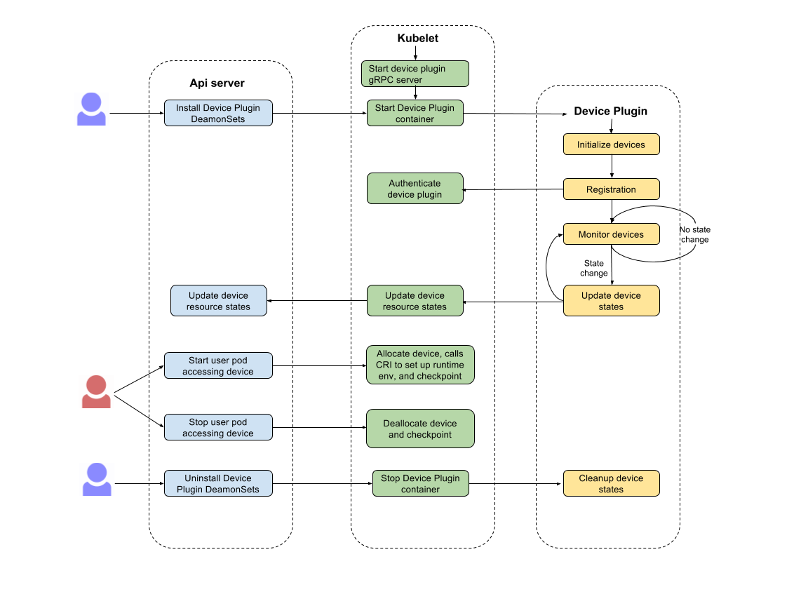

Device Manager Proposal
===============

<!-- BEGIN MUNGE: GENERATED_TOC -->

- [Motivation](#motivation)
- [Use Cases](#use-cases)
- [Objectives](#objectives)
- [Non Objectives](#non-objectives)
- [Proposed Implementation 1](#proposed-implementation-1)
  - [Vendor story](#vendor-story)
  - [End User story](#end-user-story)
  - [Device Plugin](#device-plugin)
    - [Introduction](#introduction)
    - [Registration](#registration)
    - [Unix Socket](#unix-socket)
    - [Protocol Overview](#protocol-overview)
    - [Protobuf specification](#protobuf-specification)
- [Proposed Implementation 2](#proposed-implementation-2)
  - [Device Plugin Lifecycle](#device-plugin-lifecycle)
  - [Protobuf API](#protobuf-api)
  - [Failure recovery](#failure-recovery)
  - [Roadmap](#roadmap)
  - [Open Questions](#open-questions-1)
- [Installation](#installation)
- [Versioning](#versioning)
  - [References](#references)

<!-- END MUNGE: GENERATED_TOC -->

_Authors:_

* @RenaudWasTaken - Renaud Gaubert &lt;rgaubert@NVIDIA.com&gt;

# Motivation

Kubernetes currently supports discovery of CPU and Memory primarily to a
minimal extent. Very few devices are handled natively by Kubelet.

It is not a sustainable solution to expect every vendor to add their vendor
specific code inside Kubernetes to make their devices usable.
Instead, we want a solution for vendors to be able to advertise their resources
to Kubelet and monitor them without writing custom Kubernetes code.
We also want to provide a consistent and portable solution for users to
consume hardware devices across k8s clusters.

This document describes a vendor independant solution to:
  * Discovering and representing external devices
  * Making these devices available to the containers using these devices and
    cleaning them up afterwards
  * Monitoring these devices

Because devices are vendor dependant and have their own sets of problems
and mechanisms, the solution we describe is a plugin mechanism that may run
in a container deployed through the DaemonSets mechanism.
The targeted devices include GPUs, High-performance NICs, FPGAs, InfiniBand,
Storage devices, and other similar computing resources that require vendor
specific initialization and setup.

The goal is for a user to be able to enable vendor devices (e.g: GPUs) through
the following simple steps:
  * `kubectl create -f http://vendor.com/device-plugin-daemonset.yaml`
  * When launching `kubectl describe nodes`, the devices appear in the node spec
  * In the long term users will be able to select them through Resource Class

# Use Cases

 * I want to use a particular device type (GPU, InfiniBand, FPGA, etc.)
   in my pod.
 * I should be able to use that device without writing custom Kubernetes code.
 * I want a consistent and portable solution to consume hardware devices
   across k8s clusters.

# Objectives

1. Add support for vendor specific Devices in kubelet:
    * Through a pluggable mechanism.
    * Which allows discovery and monitoring of devices.
    * Which allows hooking the runtime to make devices available in containers
      and cleaning them up.
2. Define a deployment mechanism for this new API.
3. Define a versioning mechanism for this new API.

# Non Objectives

1. Advanced scheduling and resource selection (solved through
   [#782](https://github.com/Kubernetes/community/pull/782)).
   We will only try to give basic selection primitives to the devices
2. Metrics: this should be the job of cadvisor and should probably either be
   addressed there (cadvisor) or if people feel there is a case to be made
   for it being addressed in the Device Plugin, in a follow up proposal.

# Proposed Implementation 1

## Vendor story

Kubernetes provides to vendors a mechanism called device plugins to:
  * advertise devices.
  * monitor devices (currently perform health checks).
  * hook into the runtime to instruct Kubelet what are the steps to
    take in order to make the device available (or cleanup the device).

A device plugin at it's core is a simple gRPC server usually running in
a container and deployed across clusters through a daemonSet.

```gRPC
service DevicePlugin {
	rpc Discover(Empty) returns (stream Device) {}
	rpc Monitor(Empty) returns (stream DeviceHealth) {}

	rpc Allocate(AllocateRequest) returns (AllocateResponse) {}
	rpc Deallocate(DeallocateRequest) returns (Empty) {}
}

```

The gRPC server that the device plugin must implement is expected to
be advertised on a unix socket in a mounted hostPath (e.g:
`/var/run/Kubernetes/vendor.sock`).

Finally, to notify Kubelet of the existence of the device plugin,
the vendor's device plugin will have to make a request to Kubelet's
onwn gRPC server.
Only then will kubelet start interacting with the vendor's device plugin
through the gRPC apis.

## End User story

When setting up the cluster the admin knows what kind of devices are present
on the different machines and therefore can select what devices they want to
enable.

The cluster admins knows his cluster has NVIDIA GPUs therefore he deploys
the NVIDIA device plugin through:
`kubectl create -f NVIDIA.io/device-plugin.yml`

The device plugin lands on all the nodes of the cluster and if it detects that
there are no GPUs it terminates. However, when there are GPUs it reports them
to Kubelet.
For device plugins reporting non-GPU Devices these are advertised as
OIRs and selected through the same method.

1. A user submits a pod spec requesting X GPUs (or devices)
2. The scheduler filters the nodes which do not match the resource requests
3. The pod lands on the node and Kubelet decides which device
   should be assigned to the pod
4. Kubelet calls `Allocate` on the matching Device Plugins
5. The user deletes the pod or the pod terminates
6. Kubelet calls `Deallocate` on the matching Device Plugins

When receiving a pod which requests Devices kubelet is in charge of:
  * deciding which device to assign to the pod's containers (this will
    change in the future)
  * advertising the changes to the node's `Available` list
  * advertising the changes to the pods's `Allocated` list
  * Calling the `Allocate` function with the list of devices

The scheduler is still be in charge of filtering the nodes which cannot
satisfy the resource requests.
He might in the future be in charge of selecting the device.

## Device Plugin

### Introduction

The device plugin is structured in 5 parts:
1. Registration: The device plugin advertises it's presence to Kubelet
2. Discovery: Kubelet calls the device plugin to list it's devices
3. Allocate / Deallocate: When creating/deleting containers requesting the
   devices advertised by the device plugin, Kubelet calls the device plugin's
   `Allocate` and `Deallocate` functions.
4. Cleanup: Kubelet terminates the communication through a "Stop"
5. Heartbeat: The device plugin polls Kubelet to know if it's still alive
   and if it has to re-issue a Register request

### Registration

When starting the device plugin is expected to make a (client) gRPC call
to the `Register` function that Kubelet exposes.

The communication between Kubelet is expected to happen only through Unix
sockets and follow this simple pattern:
1. The device plugins starts it's gRPC server
2. The device plugins sends a `RegisterRequest` to Kubelet (through a
   gRPC request)
4. Kubelet starts it's Discovery phase and calls `Discover` and `Monitor`
5. Kubelet answers to the `RegisterRequest` with a `RegisterResponse`
   containing any error Kubelet might have encountered

### Unix Socket

Device Plugins are expected to communicate with Kubelet through gRPC
on an Unix socket.
When starting the gRPC server, they are expected to create a unix socket
at the following host path: `/var/run/Kubernetes`.

For non bare metal device plugin this means they will have to mount the folder
as a volume in their pod spec ([see Installation](##installation)).

Device plugins can expect to find the socket to register themselves on
the host at the following path:
`/var/run/Kubernetes/kubelet.sock`.

### Protocol Overview

When first registering themselves against Kubelet, the device plugin
will send:
  * The name of their unix socket
  * [The API version against which they were built](#versioning).
  * Their `Vendor` ID or name of the device plugin

Kubelet answers with the minimum version it supports and whether or
not there was an error. The errors may include (but not limited to):
  * API version not supported
  * A device plugin was already registered for this vendor
  * A device plugin already registered this device
  * Vendor is not consistent across discovered devices

Kubelet will then interact with the plugin through the following functions:
  * `Discover`: List Devices
  * `Monitor`: Returns a stream that is written to when a
     Device becomes unhealty
  * `Allocate`: Called when creating a container with a list of devices
     can request changes to the Container config
  * `Deallocate`: Called when deleting a container can be used for cleanup

The device plugin is also expected to periodically call the `Heartbeat` function
exposed by Kubelet and issue a `Registration` request when it either can't reach
Kubelet or Kubelet answers with a `KO` response.




### Protobuf specification

```go
service PluginRegistration {
	rpc Register(RegisterRequest) returns (RegisterResponse) {}
	rpc Heartbeat(HeartbeatRequest) returns (HeartbeatResponse) {}
}

service DevicePlugin {
	rpc Discover(Empty) returns (stream Device) {}
	rpc Monitor(Empty) returns (stream DeviceHealth) {}

	rpc Allocate(AllocateRequest) returns (AllocateResponse) {}
	rpc Deallocate(DeallocateRequest) returns (Empty) {}
}

message RegisterRequest {
	// Version of the API the Device Plugin was built against
	string version = 1;
	// Name of the unix socket the device plugin is listening on
	string unixsocket = 2;
	// Name of the devices the device plugin wants to register
	// A device plugin can only register one kind of devices
	string vendor = 3;
}

message RegisterResponse {
	// Minimum version the Kubelet API supports.
	string version = 1;
	// Kubelet fills this field if it encounters any errors
	// during the registration process or discover process
	Error error = 2;
}

message HeartbeatRequest {
	string vendor = 1;
}

message HeartbeatResponse {
	// Kubelet answers with a string telling the device
	// plugin to either re-register itself or not
	string response = 1;
	// Kubelet fills this field if it encountered any errors
	Error error = 2;
}

message AllocateRequest {
	repeated Device devices = 1;
}

message AllocateResponse {
	// List of environment variable to set in the container.
	repeated KeyValue envs = 1;
	// Mounts for the container.
	repeated Mount mounts = 2;
}

message DeallocateRequest {
	repeated Device devices = 1;
}

message Error {
	bool error = 1;
	string reason = 2;
}

// E.g:
// struct Device {
//    Kind: "NVIDIA-gpu"
//    Name: "GPU-fef8089b-4820-abfc-e83e-94318197576e"
//    Properties: {
//        "Family": "Pascal",
//        "Memory": "4G",
//        "ECC"   : "True",
//    }
//}
//
message Device {
	string Kind = 1;
	string Name = 2;
	string Health = 3;
	string Vendor = 4;
	map<string, string> properties = 5; // Could be [1, 1.2, 1G]
}

message DeviceHealth {
	string Name = 1;
	string Kind = 2;
	string Vendor = 4;
	string Health = 3;
}
```

# Proposed Implementation 2

The main strategy of this proposed implemenation is that we want to start with
something simple that can show benefits on our immediate use cases, yet the
API design should be extendable to support future requirements.
Here are the main motivations for this alternative proposed implementation:

* Discovery phase: can we eliminate this gRPC procedure? It seems more
  natural for device plugin to send Kubelet the discovered device information
  right after device initialization and the registration gRPC procedure.
* The current implementation uses gRPC to communicate between Kubelet and
  device plugin. Both Kubelet and device plugin need to start a gRPC server
  for two-way communication. This seems a bit complicated. Can we have
  device plugin send enough information to Kubelet so that we only need
  Kubelet to start gRPC server and device plugin is kept as gRPC client?
  The main concern with one-way gRPC communication is that we can NOT
  support device specific operations, like reset device, during
  allocation/deallocation. Depending on how long we expect device specific
  operations to take, we can support this feature later by
  having device plugin also provide a gRPC service or Device Plugin
  can instruct Kubelet to perform device specific operation hooks.
* Do we need checkpointing in the initial prototype implementation?
  Even in alpha release, we may still want to be able to recover from
  various failure scenario. Otherwise, it would affect user experience.
  Currently, it seems the only information we need to record somewhere
  is what device is allocated to what pod/container. There have been
  discussions on different ways and places to record this information.
  The approach taken by the current implementation pushes this information
  to ApiServer by extending NodeStatus interface between Kubelet and ApiServer.
  The major concern on this approach is that it introduced an API extension
  apart from the current model (Currently Node information recorded at ApiServer
  only contains resource capacity information. Resource allocation information
  is kept at Node). The second approach is for Kubelet to checkpoint this
  information. This seems to align with the current Kubernetes model that
  Kubelet is the component to implement allocation/deallocation functionalities.
  The information we want to checkpoint, i.e., what device is allocated to what
  pod/container, also seems generic enough to be implemented at Kubelet.
  It may also allow other use cases outside device plugin, e.g., cpu pin.
  The third approach is to implement this in device plugin. This way,
  device plugin can also record any state information useful to its own
  failure recovery in checkpoints. One concern on this approach is that it
  may add more burdens on vendors to implement their device plugin images.
  Surprises might happen in production if things were not implemented correctly.
  It also seems apart from the current model as today Kubelet is the place
  where allocation/deallocation happens for other types of resources.
* Heartbeat: do we need this to make sure connections can be re-established
  between kubelet and device plugin? Can we reuse keepalive feature from gRPC?
  Or if Kubelet checkpoints device allocation state information, device plugin
  may only need to detect Kubelet failure when it needs to update device
  information. Or can device plugin send periodic device state updates
  (this may be needed anyway if we want to collect device usage stats)
  and use that to detect Kubelet failure or device plugin failure?

## Device Plugin Lifecycle



1. User or cluster admin push vendor-specific device plugin DaemonSets.
   The DaemonSets YAML config includes mountPaths to the host directories
   where device driver, user-space libraries, and tools will be installed.
2. After device plugin container is brought up, it detects the specific
   types of HW devices. If such devices exist, it initializes these devices
   and sets up the environments to access these devices (e.g., install
   device drivers, user-space libraries, and tools).
3. After initialization, device plugin queries HW device states through the
   installed device monitoring tools or other device interfaces. Then device
   plugin connects to the Kubelet device plugin gRPC server and sends it the
   obtained list of HW device information. In the initial prototype, the
   device resource exported by a device plugin can be implemented as an
   [extended OIR](https://github.com/kubernetes/kubernetes/pull/48922)
   with special prefix “extensions.kubernetes.io/”, plus device resource_name
   that uniquely identifies a device plugin on a node.
   Kubelet can use existing API to add this resource to API server so that the
   device resource is available for scheduling.
4. Device plugin runs in a loop to continuously query HW device states. If it
   detects any changes, it sends the Kubelet device plugin gRPC server the new
   list of HW device information. Kubelet can use this information to update its
   device capacity states and if necessary, re-allocate new device to a user
   container with unhealthy allocated devices.
5. When Kubelet receives an allocation request for a HW device advertised
   by a device plugin (i.e., resource with “extensions.kubernetes.io/” prefix
   plus device resource_name), it updates its internal allocation state,
   issues certain calls to CRI to bind mount the host directories where
   user-space libraries and tools are installed to the device-specific
   default directories in user Pod or set up certain environment variables,
   and checkpoints the container-to-device allocation information to persistent
   storage.
6. When user container accessing the device finishes, Kubelet updates its
   internal state to deallocate the device, and updates its checkpoint state
   in persistent storage.
7. When device plugin DaemonSets is removed, clean up device state (e.g., uninstall
   device driver, remove user-space libraries and tools). This step can be
   specified as a preStop
   [container lifecycle step](https://kubernetes.io/docs/tasks/configure-pod-container/attach-handler-lifecycle-event/).
   Note one implication from this approach is that device plugin upgrade process
   will be disruptive. It will need more thinkings if we want to
   support non-disruptive upgrade process.

## Protobuf API

```go

service PluginResource {
	rpc Register(RegisterRequest) returns (RegisterResponse) {}
	rpc ReportDeviceInfo(ReportRequest) returns (ReportResponse) {}
}

message RegisterRequest {
	// Version of the API the Device Plugin was built against
	string version = 1;
	// E.g., "nvidia-gpu". Used to construct OIR:
	// “extensions.kubernetes.io/resourcename”.
	string resourcename = 2;
}

message RegisterResponse {
	bool success = 1;
	// Kubelet fills this field with details if it encounters any errors
	// during the registration process, e.g., for version mismatch, what
	// is the required version and minimum supported version by kubelet.
	string error = 2;
}

message ReportRequest {
	repeated DeviceInfo devices = 1;
}

message DeviceInfo {
      // E.g., "GPU-fef8089b-4820-abfc-e83e-94318197576e".
      // Needs to be unique per device plugin.
	string Id = 1;
      // E.g., UNKNOWN, HEALTHY, UNHEALTHY.
	enum State = 2;
      // E.g., {"/rootfs/nvidia":"/usr/local/nvidia"}
      // Maps from host directory where device library or tools
      // are installed to user pod directory where the library or 
      // tools are expected to be accessed. Kubelet will use this 
      // information to bind mount host directory to the user pod
      // directory during allocation.
       map<string, string> mountpaths = 3;
      // E.g., {"LD_PRELOAD":"xxx.so"}. Kubelet will export these
      // env variables in user pod during allocation.
       map<string, string> envariables = 4;
       // E.g., {"Family":"Pascal"} {"ECC":"True"}
       // These fields can be used as node labels for selection
       map<string, string> labels = 4;
}

message ReportResponse {
	bool success = 1;
	// Kubelet fills this field if it encounters any errors
	// during the report process, e.g., device plugin hasn’t
	// registered yet (could happen when Kubelet restarts).
	string error = 2;
}
```

## Failure recovery

* Device failure: Device plugin should be able to detect device failure and
  report that to Kubelet. Kubelet should then remove the failed device from
  available list. If there is any user container using the failed device,
  Kubelet may terminate the user container and reschedule it on a good
  available device. When a failed device recovers, device plugin will send
  Kubelet the updated device state and Kubelet can add the device to the
  available device list.
* Kubelet crash: When Kubelet restarts after a crash, it should be able to
  recover allocation states from the checkpoints recorded on persistent storage.
  The checkpoint records should include allocated device id to pod mapping
  information as well as non-allocated device information, so Kubelet can
  re-establish precise allocation state. Device plugin should be able to
  detect Kubelet failure when it needs to update device informaiton,
  and re-registers with the new Kubelet.
* Device plugin crash: A device plugin is deployed through DaemonSets.
  If a device plugin process fails, Kubelet will detect that and automatically
  restart it. After restart, device plugin will reconnect to Kubelet and
  report the current device states. Kubelet can compare the reported device
  information with its internal device states, and makes adjustments if
  necessary. One thing we need to pay special attention is that device plugin
  may fail at any time, e.g., during initialization. When the new device plugin
  process starts, it needs to be able to recover from incomplete states.

## Roadmap

* Phase 1: device plugin is supported in alpha mode in 1.8 kubernetes release.
  Make sure it provides the following functionalities: initialize, discover,
  allocate/deallocate, cleanup, basic health check, and can recover from device,
  Kubelet or device plugin failures . Make sure the interface is kept simple and
  extensible, and the document is clear. With the initial implemented API,
  make sure we can use the interface to implement device plugin images for at
  least two types of devices: Nvidia GPU and Solarflare NIC. Note the support
  for Nvidia GPU will help gpu support to enter beta by providing a general
  and extendable api. Test coverage: e2e tests with the developed Nvidia GPU
  image and Solarflare image to make sure these devices can be correctly
  initialized, allocated, deallocated, and cleaned up. Also should test we
  can recover from device failure, Kubelet restarts, and device plugin failure.
* Phase 2: device plugin is supported in beta mode in 1.9 kubernetes release.
  At this phase, the primary design and API should be stabilized. We need to
  implement authentication mechanism to ensure only trusted device plugin
  images can be registered. We can support device specific
  allocation/deallocation requests by having device plugin also provide a gRPC
  service or Device Plugin can instruct Kubelet to perform device specific
  operation hooks during allocation/deallocation procedures.
  Hopefully at this time, we may make good progress on supporting more flexible
  resource allocation policies in Kubernetes, and with that, we can switch
  device plugin from using OIR to using ResourceClass to allow more efficient
  HW specific resource allocations, e.g., topology aware resource allocations,
  NUMA aware resource allocations etc.
* Phase 3: device plugin is supported in GA mode in 1.10 kubernetes release.
  Device plugin should have clear error handling and problem report that
  allows easy debuggability and monitoring on its exported devices.
  We should have clear documentation on how to develop a device plugin and
  how interact with device plugin. The framework needs to be stable and
  demonstrate good user experiences through the support on multiple types
  of devices, such as GPU, Infiniband, high-performance NIC, and etc.

## Open Questions

* The proposal assumes we can omit device specific allocation/deallocation
operations in the alpha release and support this feature in later releases.
If people are concerned that such omission would impact the usability of
alpha release, we will need to come up with a solution that would either
require two-way gRPC communication between Kubelet and Device Plugin or
Device Plugin can instruct Kubelet to perform device specific operation hooks
during allocation/deallocation procedures.

# Installation

The installation process should be straightforward to the user, transparent
and similar to other regular Kubernetes actions.
The device plugin should also run in containers so that Kubernetes can
deploy them and restart the plugins when they fail.
However, we should not prevent the user from deploying a bare metal device
plugin.

Deploying the device plugins through DemonSets makes sense as the cluster
admin would be able to specify which machines it wants the device plugins to
run on, the process is similar to any Kubernetes action and does not require
to change any parts of Kubernetes.

Additionally, for integrated solutions such as `kubeadm` we can add support
to auto-deploy community vetted Device Plugins.
Thus not fragmenting once more the Kubernetes ecosystem.

For users installing Kubernetes without using an integrated solution such
as `kubeadm` they would use the examples that we would provide at:
`https://github.com/Kubernetes/Kubernetes/tree/master/examples/device-plugin.yaml`

YAML example:

```yaml
apiVersion: extensions/v1beta1
kind: DaemonSet
metadata:
spec:
    template:
        metadata:
            labels:
                - name: device-plugin
        spec:
            containers:
                name: device-plugin-ctr
                image: NVIDIA/device-plugin:1.0
                volumeMounts:
                  - mountPath: /device-plugin
                  - name: device-plugin
           volumes:
             - name: device-plugin
               hostPath:
                   path: /var/run/Kubernetes
```

# Versioning

Currently there is only one part (CRI) of Kubernetes which is based on
a protobuf model.

The model used by CRI as of now involves the client (kubelet) checking
if the server (runtime) version is compatible and then continuing to
communicate with the server.
Currently for CRI, compatible means matching the exact version.
This means that every time the CRI spec changes the CRI clients needs to
be updated.

CRI also uses gRPC-go, which requires the same package name between client
and server.
If they are not same, then no API calls can succeed because the generated grpc
code registers a service using the `package_name.service_name` convention,
e.g., The StopPodSandbox method is known as `/v1alpha1.RuntimeService/StopPodSandbox.`

To work around this restriction, CRI adopted the strategy to freeze the
package name at `pkg/kubelet/apis/cri/v1alpha1/runtime`.

Considering the restrictions it seems reasonable to follow the same pattern for
the device plugin proposal to prevent API breaking:
  * Follow protobuf guidelines on versionning:
    * Do not change ordering
    * Do not remove fields or change types
    * Add optional fields
  * Freeze the package name to `apis/device-plugin/v1alpha1`
  * Have kubelet and the Device Plugin negotiate versions if we do break the API

Negotiation would take place in the registration:
1. When registering itself with Kubelet, the Device plugin sends the version
   against which it was built.
2. Kubelet returns the minimum version it supports and if the version sent
   is supported.
3. If Kubelet supports the version sent by the Device Plugin, it
   contacts the Device Plugin
4. If the Device Plugin supports the version sent by Kubelet it can and should
   answer the different calls made by Kubelet

## References

  * [Enable "kick the tires" support for NVIDIA GPUs in COS](https://github.com/Kubernetes/Kubernetes/pull/45136)
  * [Extend experimental support to multiple NVIDIA GPUs](https://github.com/Kubernetes/Kubernetes/pull/42116)
  * [Kubernetes Meeting notes](https://docs.google.com/document/d/1Qg42Nmv-QwL4RxicsU2qtZgFKOzANf8fGayw8p3lX6U/edit#)
  * [Better Abstraction for Compute Resources in Kubernetes](https://docs.google.com/document/d/1666PPUs4Lz56TqKygcy6mXkNazde-vwA7q4e5H92sUc)
  * [Extensible support for hardware devices in Kubernetes (join Kubernetes-dev@googlegroups.com for access)](https://docs.google.com/document/d/1LHeTPx_fWA1PdZkHuALPzYxR0AYXUiiXdo3S0g2VSlo/edit)

