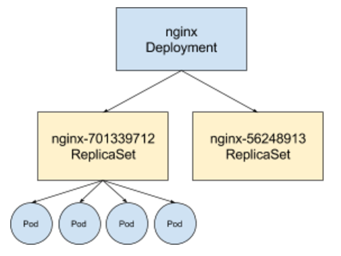
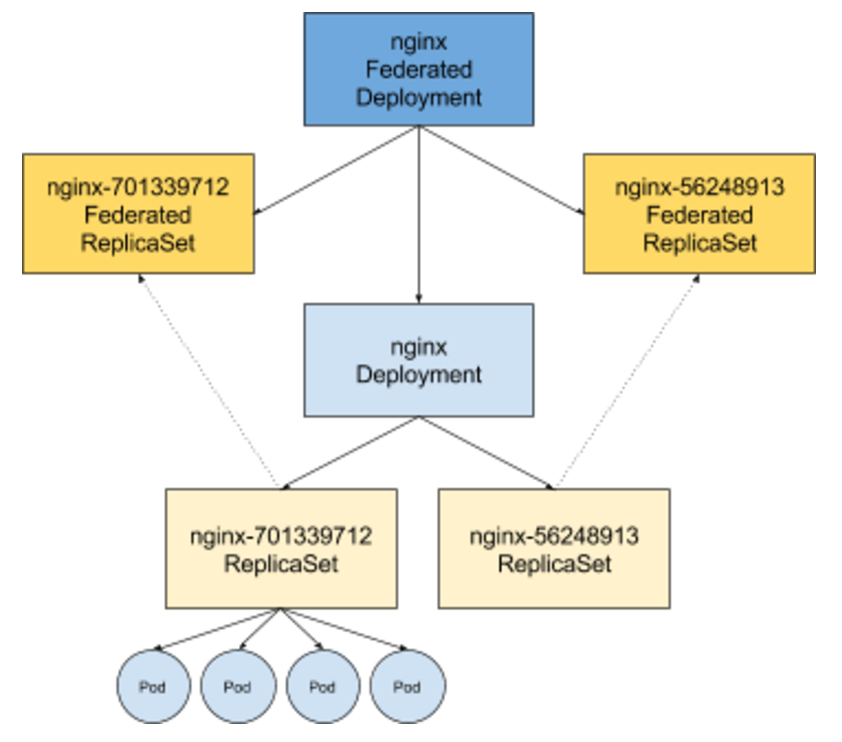
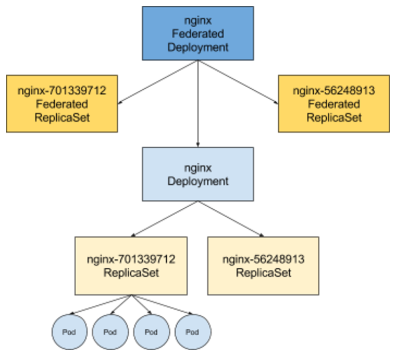

# Federated Deployment
# Design Document

Authors: [Marcin Wielgus](mailto:mwielgus@google.com), [Nikhil Jindal](mailto:nikhiljindal@google.com )

## Introduction

The purpose of this document is to provide a detailed design of how Kubernetes Deployments should be handled in Federation, with the special emphasis on rolling update support in deployment updates. 

The internal design is based on [Federated ReplicaSet](https://github.com/kubernetes/community/blob/master/contributors/design-proposals/federated-replicasets.md)

## Background

With Federation we are trying to provide Kubernetes objects and functionality spanning over multiple clusters. One of the key objects in Kubernetes is Deployment. Deployment allows users to maintain a defined number of pod replicas and conveniently update them if needed. The update functionality is the main thing that differentiate them from replica sets. ReplicaSets update everything at once while Deployments allow a slow, rolling update and rollback in case the update is unsuccessful. 

## Requirements

Federated deployments must provide the similar functionality as regular deployments, in particular :
  + [R1] Work well with kubectl rollout
    + History - provide all of the revisions of federated deployment.
    + Pause/Resume - provide an ability to pause and resume an ongoing update
    + Status - provide rollout status information
    + Undo - provide go back to the previous version
    + Require no/almost-no fixes in kubectl
  + [R2] Allow rolling update
    + One cluster at a time (preferred)
    + All clusters at a time (additional)
  + [R3] Be similar to what is currently implemented in regular Kubernetes.
  + [R4] Allow similar scheduling extra features as Federated ReplicaSet
    + Specifying min/max/weight for each of the clusters
    + Be able to rebalance replicas once a cluster is added, lost or if there is no capacity.
  + [R5] Each of the underlying clusters should be able to work independently if the federation control plane is down,
  or there are some cross-cluster network issues. The clusters, when federation controll plane is down, shoule be as easily updatable/managable as if federation were present. For high availability, federation controll plane should be considered an "addon" that makes some extra features possible, not a component that brings or replaces the core K8S functionality. 
  This basically means that Federated Deployment should create fully-functional deployments in the clusters. 

## Design

Regular Deployments don’t maintain the replicas by themselves. They let ReplicaSets keep track of them. Each of the deployments create a separate ReplicaSet for each of the pod template versions they have. To do a rolling upgrade the deployment slowly adds replicas to the replica set with the new pod template and takes them from the old one. The names of ReplicaSets are in form of deployment_name + “-” + podspec_hash. So it is relatively easy to tell which replicaset is responsible for pods with the given spec (if you are a machine of course). 

When adding the federation layer over the deployment the things get more complicated. Federated deployment needs to control the regular deployment. That’s understandable and in line with other controllers. Now what about ReplicaSets? Requirements [R1] [R2] [R3] imply that there should be ReplicaSets at the federation level. 

However Federated ReplicaSets should not control the ReplicaSets in the underlying clusters because they are already controlled by the local Deployments and having two controllers would lead to race condition issues. Two controllers independently trying to bring the current state to the same desired state will eventually do it, but on the way multiple back and forth steps can be executed. The user looking at this would be really confused and would get an impression that something is really broken there.

On the other hand FederatedReplicaSets should somehow reflect the status of the underlying cluster - like number of total replicas that are there so that kubectl rollout has proper data to work on. 

Federated nginx-701339712 gets all of the statistics as well as spec elements (like the total number of replicas) from ReplicaSets in the underlying clusters. Obviously none of the spec changes should be pushed back. With this change the whole thing would look like as a well-working “whole” while in fact Federated ReplicaSets would be “shadows” (or puppets) - their original functionality (creating rs in clusters and controlling the balancing) would be turned off. 

## Flow

As the above description may be a bit confusing let's describe what happens exactly when a user creates federated deployment:

 1. A user creates a Federated Deployment.
 2. Federated Deployment controller is notified about the new Federated Deployment.
 3. Federated Deployment controller creates Shadow Federated ReplicaSet.
 4. Federated Deployment controller creates Local Deployments in underlying clusters
 5. Local Deployments create Local ReplicaSets (in underlying clusters).
 6. Replicas are created by Local ReplicaSets.
 7. The status of Local ReplicaSets is updated.
 8. Federated ReplicaSet controller learn about changes in the underlying clusters.
 9. Shadow ReplicaSet status is updated based on Local ReplicaSet statuses.

On update the situation looks similar:

 1. A user updates a Federated Deployment.
 2. Federated Deployment controller is notified about the update.
 3. Federated Deployment controller creates a new Shadow Federated ReplicaSet for the updated spec.
 4. Federated Deployment controller updates Local Deployments in underlying clusters
 5. Local Deployments create new Local ReplicaSets (in underlying clusters).
 6. Replicas are moved from the old Local ReplicaSet to the new LocalReplicaSet by Local Deployment controller. 
 7. The status of Local ReplicaSets is updated.
 8. Federated ReplicaSet controller learn about changes in the underlying clusters.
 9. Shadow ReplicaSet status is updated based on Local ReplicaSet statuses.

## Implementation

The implementation of Federated Deployment Controller is largely based on the existing Federated ReplicaSet Controller. The following changes however will be added (on top of obvious changes like “s/replicaset/deployment/”):

+ For each of the pod templates, Federated Deployment will make sure that shadow FederatedReplicaset with the name deployment_name + “-” + pod_template_hash is created, with the appropriate revision number.

+ Local deployment checks will occur according to annotation (if present) or alphabetically. So that the order
of cluster updates is predictable.

+ If Federated Deployment with `strategy == RollingUpdate` spots a Local Deployment with different pod template it updates it only if there is no other update going on. Updates are spotted by checking if:
    + `deployment.status.updatedReplicas != deployment.status.replicas`
    + `deployment.status.unavailableReplicas != 0`
    + `deployment.status.observed_generation != deployment.metadata.generation`

  The Local Deployment will get a chance to be updated at a later time. Every change in Local Deployments trigger a Federated Deployment reconciliation. So once one Local Deployment is done with the update and publishes its new state the reconciliation will be triggered and next Local Deployment update started.
  Obviously if the Federated Deployment itself is updated then all currently going on updates are stopped and a new one is stated.

+ Federated Deployments with `strategy == Recreate` update all clusters at once.
+ FederatedDeployments always update replica numbers (if needed) in the underlying deployments specs, no matter whether some update is going on or not.
+ Rollback REST api is registered.
+ Federated Deployment Controller has support for deleting old Federated ReplicaSets (just like in regular deployments). Federated Replicasets are deleted in a non-cascading way (which means that the by deleting a
shadow federated replicaset we don't delete replicasets in underlying clusters).

Moreover a Shadow Federated ReplicaSet (SFRS) support will be added to Federated Replicaset Controller:

 + SFRS are marked with an annotation. The presence of the annotation makes the FRS a shadow.
 + SFRS are created by Federated Deployments and contain the complete ObjectMeta, ReplicaSetSpec (without replica count) and the proper PodSpec.
 + SFRS monitors all underlying clusters where the replicas could potentially be found and updates their ReplicaSetStatuses and ReplicaSetSpec.Replicas based on the underlying cluster content.
 + SFRS never updates RS in underlying clusters.
 + SFRS will be recreated by federated deployment controller if user deletes it.
 + Federated Deployment controller will overwrite any direct updates to SFRS by user.
 + It will be deleted by federated deployment controller when the federated deployment is deleted.

## Tests

Apart from similar tests that should be done for FRS, FD tests need to check:
 + If a failure in update stops the whoe update.
 + If a new update is requested before the previous one was completed.
 + If all of the rollout mechanics and kubectl command work
 + If Federated ReplicaSets have the correct statuses and replica counts. 
 + If FRS is not deleted unless FD is deleted and is deleted when FD is deleted.
 + Federated deployment controller overrites any direct updates to SFRS by users.

<!-- BEGIN MUNGE: GENERATED_ANALYTICS -->

<!-- END MUNGE: GENERATED_ANALYTICS -->
