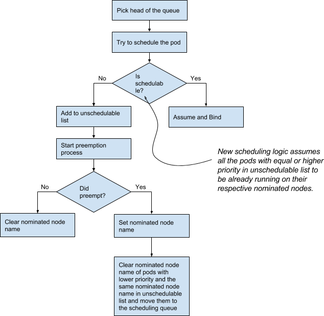
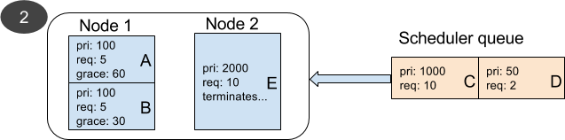
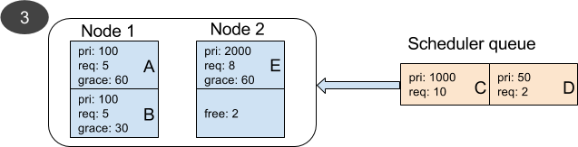
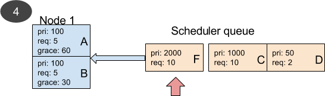

# Pod Preemption in Kubernetes

_Status: Draft_  
_Author: @bsalamat_  

- [Pod Preemption in Kubernetes](#pod-preemption-in-kubernetes)
- [Objectives](#objectives)
   - [Non-Goals](#non-goals)
- [Background](#background)
   - [Terminology](#terminology)
- [Overview](#overview)
- [Detailed Design](#detailed-design)
   - [Preemption scenario](#preemption-scenario)
   - [Scheduler performs preemption](#scheduler-performs-preemption)
   - [Preemption order](#preemption-order)
   - [Preemption - Eviction workflow](#preemption---eviction-workflow)
   - [Race condition in multi-scheduler clusters](#race-condition-in-multi-scheduler-clusters)
   - [Starvation Problem](#starvation-problem)
   - [Supporting PodDisruptionBudget](#supporting-poddisruptionbudget)
   - [Supporting Inter-Pod Affinity on Lower Priority Pods](#supporting-inter-pod-affinity-on-lower-priority-pods?)
   - [Supporting Cross Node Preemption](#supporting-cross-node-preemption?)
- [Interactions with Cluster Autoscaler](#interactions-with-cluster-autoscaler)
- [Alternatives Considered](#alternatives-considered)
   - [Rescheduler or Kubelet performs preemption](#rescheduler-or-kubelet-performs-preemption)
   - [Preemption order](#preemption-order)
- [References](#references)

# Objectives

-  Define the concept of preemption in Kubernetes.
-  Define how priority and other metrics affect preemption.
-  Define scenarios under which a pod may get preempted.
-  Define the interaction between scheduler preemption and Kubelet evictions.
-  Define mechanics of preemption.
-  Propose new changes to the scheduling algorithms.
-  Propose new changes to the cluster auto-scaler.

## Non-Goals

-  How **eviction** works in Kubernetes. (Please see [Background](#background) for the definition of "eviction".)
-  How quota management works in Kubernetes.

# Background

Running various types of workloads with different priorities is a common practice in medium and large clusters to achieve higher resource utilization. In such scenarios, the amount of workload can be larger than what the total resources of the cluster can handle. If so, the cluster chooses the most important workloads and runs them. The importance of workloads are specified by a combination of [priority](https://github.com/bsalamat/community/blob/564ebff843532faf5dcb06a7e50b0db5c5b501cf/contributors/design-proposals/pod-priority-api.md), QoS, or other cluster-specific metrics. The potential to have more work than what cluster resources can handle is called "overcommitment". Overcommitment is very common in on-prem clusters where the number of nodes is fixed, but it can similarly happen in cloud as cloud customers may choose to run their clusters overcommitted/overloaded at times in order to save money. For example, a cloud customer may choose to run at most 100 nodes, knowing that all of their critical workloads fit on 100 nodes and if there is more work, they won't be critical and can wait until cluster load decreases.

## Terminology

When a new pod has certain scheduling requirements that makes it infeasible on any node in the cluster, scheduler may choose to kill lower priority pods to satisfy the scheduling requirements of the new pod. We call this operation "**preemption**". Preemption is distinguished from "[**eviction**](https://kubernetes.io/docs/tasks/administer-cluster/out-of-resource/#eviction-policy)" where kubelet kills a pod on a node because that particular node is running out of resources.

# Overview

This document describes how preemption in Kubernetes works. Preemption is the action taken when an important pod requires resources or conditions which are not available in the cluster. So, one or more pods need to be killed to make room for the important pod. 

# Detailed Design

## Preemption scenario

In this proposal, the only scenario under which a group of pods in Kubernetes may be preempted is when a higher priority pod cannot be scheduled due to various unmet scheduling requirements, such as lack of resources, unsatisfied affinity or anti-affinity rules, etc., and the preemption of the lower priority pods allows the higher priority pod to be scheduled. So, if the preemption of the lower priority pods does not help with scheduling of the higher priority pod, those lower priority pods will keep running and the higher priority pod will stay pending.  
Please note the terminology here. The above scenario does not include "evictions" that are performed by the Kubelet when a node runs out of resources.  
Please also note that scheduler may preempt a pod on one node in order to meet the scheduling requirements of a pending pod on another node. For example, if there is a low-priority pod running on node N in rack R, and there is a high-priority pending pod, and one or both of the pods have a requiredDuringScheduling anti-affinity rule saying they can't run on the same rack, then the lower-priority pod might be preempted to enable the higher-priority pod to schedule onto some node M != N on rack R (or, of course, M == N, which is the more standard same-node preemption scenario).

## Scheduler performs preemption

We propose preemption to be done by the scheduler -- it does it by deleting the being preempted pods. The component that performs the preemption must have the logic to find the right nodes for the pending pod. It must also have the logic to check whether preempting the chosen pods allows scheduling of the pending pod. These require the component to have the knowledge of predicate and priority functions.  
We believe having scheduler perform preemption has the following benefits:

-  Avoids replicating all of the scheduling logic in another component.
-  Reduces the risk of race condition between pod preemption and pending pod scheduling. If both of these are performed by the scheduler, scheduler can perform them serially (although currently not atomically). However, if a different component performs preemption, scheduler may schedule a different pod (than the preemptor) on the node whose pods are preempted.  
The race condition will still exist if we have multiple schedulers. More on this below.

## Preemption order

When scheduling a pending pod, scheduler tries to place the pod on a node that does not require preemption. If there is no such a node, scheduler may favor a node where the number and/or priority of victims (preempted pods) is smallest. After choosing the node, scheduler considers the lowest [priority](https://github.com/bsalamat/community/blob/564ebff843532faf5dcb06a7e50b0db5c5b501cf/contributors/design-proposals/pod-priority-api.md) pods for preemption first. Scheduler starts from the lowest priority and considers enough pods that should be preempted to allow the pending pod to schedule. Scheduler only considers pods that have lower priority than the pending pod.

#### Important notes

-  When ordering the pods from lowest to highest priority for considering which pod(s) to preempt, among pods with equal priority the pods are ordered by their [QoS class](/contributors/design-proposals/node/resource-qos.md#qos-classes): Best Effort, Burstable, Guaranteed.
-  Scheduler respects pods' disruption budget when considering them for preemption.
-  Scheduler will try to minimize the number of preempted pods. As a result, it may preempt a pod while leaving lower priority pods running if preemption of those lower priority pods is not enough to schedule the pending pod while preemption of the higher priority pod(s) is enough to schedule the pending pod. For example, if node capacity is 10, and pending pod is priority 10 and requires 5 units of resource, and the running pods are {priority 0 request 3, priority 1 request 1, priority 2 request 5, priority 3 request 1}, scheduler will preempt the priority 2 pod only and leaves priority 1 and priority 0 running.
-  Scheduler does not have the knowledge of resource usage of pods. It makes scheduling decisions based on the requested resources ("requests") of the pods and when it considers a pod for preemption, it assumes the "requests" to be freed on the node.
   -  This means that scheduler will never preempt a Best Effort pod to make more resources available. That's because the requests of Best Effort pods is zero and therefore, preempting them will not release any resources on the node from the scheduler's point of view.
   -  The scheduler may still preempt Best Effort pods for reasons other than releasing their resources. For example, it may preempt a Best Effort pod in order to satisfy affinity rules of the pending pod.
   -  The amount that needs to be freed (when the issue is resources) is request of the pending pod. 

## Preemption - Eviction workflow

"Eviction" is the act of killing one or more pods on a node when the node is under resource pressure. Kubelet performs eviction. The eviction process is described in separate document by sig-node, but since it is closely related to the "preemption", we explain it briefly here.  
Kubelet uses a function of priority, usage, and requested resources to determine
which pod(s) should be evicted. When pods with the same priority are considered for eviction, the one with the highest percentage of usage over "requests" is the one that is evicted first.  
This implies that Best Effort pods are more likely to be evicted among a set of pods with the same priority. The reason is that any amount of resource usage by Best Effort pods translates into a very large percentage of usage over "requests", as Best Effort pods have zero requests for resources. So, while scheduler does not preempt Best Effort pods for releasing resources on a node, it is likely that these pods are evicted by the Kubelet after scheduler schedules a higher priority pod on the node.  
Here is an example:

1. Assume we have a node with 2GB of usable memory by pods.
1. The node is running a burstable pod that uses 1GB of memory and 500MB memory request. It also runs a best effort pod that uses 1GB of memory (and 0 memory request). Both of the pods have priority of 100.
1. A new pod with priority 200 arrives and asks for 2GB of memory.
1. Scheduler knows that it has to preempt the burstable pod. From scheduler's point of view, the best effort pod needs no resources and its preemption will not release any resources.
1. Scheduler preempts the burstable pod and schedules the high priority pending pod on the node.
1. The high priority pod uses more than 1GB of memory. Kubelet detects the resource pressure and kills the best effort pod.

So, best effort pods may be killed to make room for higher priority pods, although the scheduler does not preempt them directly.  
Now, assume everything in the above example, but the best effort pod has priority 2000. In this scenario, scheduler schedules the pending pod with priority 200 on the node, but it may be evicted by the Kubelet, because Kubelet's eviction function may determine that the  best effort pod should stay given its high priority and despite its usage above request. Given this scenario, scheduler should avoid the node and should try scheduling the pod on a different node if the pod is evicted by the Kubelet. This is an optimization to prevent possible ping-pong behavior between Kubelet and Scheduler.

## Race condition in multi-scheduler clusters

Kubernetes allows a cluster to have more than one scheduler. This introduces a race condition where one scheduler (scheduler A) may perform preemption of one or more pods and another scheduler (scheduler B) schedules a different pod than the initial pending pod in the space opened after the preemption of pods and before the scheduler A has the chance to schedule the initial pending pod. In this case, scheduler A goes ahead and schedules the initial pending pod on the node thinking that the space is still available. However, the pod from A will be rejected by the kubelet admission process if there are not enough free resources on the node after the pod from B has been bound (or any other predicate that kubelet admission checks fails). This is not a major issue, as schedulers will try again to schedule the rejected pod.  
Our assumption is that multiple schedulers cooperate with one another. If they don't, scheduler A may schedule pod A. Scheduler B preempts pod A to schedule pod B which is then preempted by scheduler A to schedule pod A and we go in a loop.

## Starvation Problem

Evicting victim(s) and binding the pending Pod (P) are not transactional.
Preemption victims may have "`TerminationGracePeriodSeconds`" which will create 
even a larger time gap between the eviction and binding points. When a victim 
with termination grace period receives its termination signal, it keeps running 
on the node until it terminates successfully or its grace period is over. This 
creates a time gap between the point that the scheduler preempts Pods and the 
time when the pending Pod (P) can be scheduled on the Node (N). Note that the 
pending queue is a FIFO and when a Pod is considered for scheduling and it 
cannot be scheduled, it goes to the end of the queue. When P is determined 
unschedulable and it preempts victims, it goes to the end of the queue as well. 
After preempting victims, the scheduler keeps scheduling other pending Pods. As 
victims exit or get terminated, the scheduler tries to schedule Pods in the 
pending queue, and one or more of them may be considered and scheduled to N 
before the scheduler considers scheduling P again. In such a case, it is likely 
that when all the victims exit, Pod P won't fit on Node N anymore. So, scheduler
will have to preempt other Pods on Node N or another Node so that P can be 
scheduled. This scenario might be repeated again for the second and subsequent 
rounds of preemption, and P might not get scheduled for a while. This scenario 
can cause problems in various clusters, but is particularly problematic in 
clusters with a high Pod creation rate.

### Solution

#### Changes to the data structures

1.  Scheduler pending queue is changed from a FIFO to a priority queue (heap). 
The head of the queue will always be the highest priority pending pod.
1.  A new list is added to hold unschedulable pods.

#### New Scheduler Algorithm

1.  Pick the head of the pending queue (highest priority pending pod).
1.  Try to schedule the pod.
1.  If the pod is schedulable, assume and bind it.
1.  If the pod is not schedulable, run preemption for the pod.
1.  Move the pod to the list of unschedulable pods.
1.  If a node was chosen to preempt pods, set the node name as an annotation with
 the "scheduler.kubernetes.io/nominated-node-name" key to the pod. This key is referred to as
 "NominatedNodeName" in this doc for brevity.
 When this annotation exists, scheduler knows that the pod is destined to run on the 
 given node and takes it into account when making scheduling decisions for other pods.
1.  When any pod is terminated, a node is added/removed, or when
pods or nodes updated, remove all the pods from the unschedulable pods
list and add them to the scheduling queue. (Scheduler should keep its existing rate
limiting.) We should also put the pending pods with inter-pod affinity back to
the scheduling queue when a new pod is scheduled. To be more efficient, we may check
if the newly scheduled pod matches any of the pending pods affinity rules before
putting the pending pods back into the scheduling queue.

#### Changes to predicate processing

When determining feasibility of a pod on a node, assume that all the pods with 
higher or equal priority in the unschedulable list are already running on their 
respective "nominated" nodes. Pods in the unschedulable list that do not have a
nominated node are not considered running.

If the pod was schedulable on the node in presence of the higher priority pods,
run predicates again without those higher priority pods on the nodes. If the pod
is still schedulable, then run it. This second step is needed, because those
higher priority pods are not actually running on the nodes yet. As a result,
certain predicates, like inter-pod affinity, may not be satisfied.

This applies to preemption logic as well, i.e., preemption logic must follow the
two steps when it considers viability of preemption.

#### Changes to the preemption workflow

The alpha version of preemption already has a logic that performs preemption for
a pod only in one of the two scenarios:

1.  The pod does not have annotations["NominatedNodeName"].
1.  The pod has annotations["NominatedNodeName"], but there is no lower priority
pod on the nominated node in terminating state.

The new changes are as follows:

*   If preemption is tried, but no node is chosen for preempting pods, preemption
function should remove annotations["NominatedNodeName"] of the pod if it already
exists. This is needed to give the pod another chance to be considered for 
preemption in the next round.
*   When a pod NominatedNodeName is set, scheduler reevaluates whether lower
priority pods whose NominatedNodeNames are the same still fit on the node. If they
no longer fit, scheduler clears their NominatedNodeNames and moves them to the
scheduling queue. This gives those pods another chance to preempt other pods on
other nodes.

#### Notes

*   When scheduling a pod, scheduler ignores "NominatedNodeName" of the pod. So,
 it may or may not schedule the pod on the nominated node.

#### Flowchart of the new scheduling algorithm

#### Examples

##### **Example 1**

*   There is only 1 node (other than the master) in the cluster. The node 
capacity is 10 units of resources.
*   There are two pods, A and B, running on the node. Both have priority 100 and
each use 5 units of resources. Pod A has 60 seconds of graceful termination
period and pod B has 30 seconds.
*   Scheduler has two pods, C and D, in its queue. Pod C needs 10 units of
resources and its priority is 1000. Pod D needs 2 units of resources and its priority is 50.
*   Given that pod C's priority is 1000, scheduler preempts both of pods A and B
and sets the nominated node name of C to Node 1. Pod D cannot be scheduled
anywhere. Both are moved to the unschedulable list.
*   After 30 seconds (or less) pod B terminates and 5 units of resources become
available. Scheduler removed C and D from the unschedulable list and puts them
back in Scheduling queue. Scheduler looks at pod C, but it cannot be scheduled
yet. Pod C has a nominated node name so it won't cause more preemption. It is
moved to unschedulable list again.
*   Scheduler tries to schedule pod D, but since pod C in unschedulable list has
higher priority than D, scheduler assumes that it is bound to Node 1 when it
evaluates feasibility of pod D. With this assumption, scheduler determines that
the node does not have enough resources for pod D. So, D is moved to unschedulable
list as well.
*   After 60 seconds (or less) pod A also terminates and scheduler schedules pod
C on the node. Scheduler then looks at pod D, but it cannot be scheduled.

##### Example 2

*   Everything is similar to the previous example, but here we have two nodes.
Node 2 is running pod E with priority 2000 and request of 10 units.
*   Similar to example 1, scheduler preempts pods A and B on Node 1 and sets the
nominated node name of pod C to Node 1. Pod D cannot be scheduled anywhere. C and
D are moved to unschedulable list.
*   While waiting for the graceful termination of pods A and B, pod E terminates on Node 2.
*   Termination of pod E brings C and D back to the scheduling queue and scheduler
finds Node 2 available for pod C. It schedules pod C on Node 2 (ignoring its
nominated node name). D cannot be scheduled. It goes back to unschedulable list.
*   After 30 seconds (or less) pod B terminates. A scheduler pass is triggered
and scheduler schedules pod D on Node 1.
*   **Important note:** This may make an observer think that scheduler preempted
pod B to schedule pod D which has a lower priority. Looking at the sequence of
events and the fact that pod D's nominated node name is not set to Node 1 may
help remove the confusion.

##### Example 3

*   Everything is similar to example 2, but pod E uses 8 units of resources. So,
2 units of resources are available on Node 2.
*   Similar to example 2, scheduler preempts pods A and B and sets the future
node of pod C to Node 1. C is moved to unschedulable list.
*   Scheduler looks at pod D in the queue. Pod D can fit on Node 2.
*   Scheduler goes ahead and binds pod D to Node 2 while pods A and B are in
their graceful termination period and pod C is not bound yet.

##### Example 4

*   Everything is similar to example 1, but while scheduler is waiting for pods
A and B to gracefully terminate, a new higher priority pod F is created and goes
to the head of the queue.
*   Scheduler evaluates the feasibility of pod F and determines that it can be
scheduled on Node 1. So, it sets the nominated node name of pod F to Node 1 and
places it in unschedulable list.
*   Scheduler clears nominated node name of C and moves it to the scheduling queue.
*   C is evaluated for scheduling, but it cannot be scheduled as pod F's nominated
node name is set to Node 1.
*   When B terminates, scheduler brings F, C, and D back to the scheduling queue.
F is evaluated first. They cannot be scheduled.
*   Eventually when pods A and B terminate, pod F is bound to Node 1 and pods C
and D remain unschedulable.

## Supporting PodDisruptionBudget

Scheduler preemption will support PDB for Beta, but respecting PDB is not
guaranteed. Preemption will try to avoid violating PDB, but if it doesn't find
any lower priority pod to preempt without violating PDB, it goes ahead and
preempts victims despite violating PDB. This is to guarantee that higher priority
pods will always get precedence over lower priority pods in obtaining cluster resources.

Here is what preemption will do:

1.  When choosing victims on any evaluated node, preemption logic will try to
reprieve pods whose PDBs are violated first. (In the alpha version, pods are
reprieved by their ascending priority and PDB is ignored.)
1.  In scoring nodes and choosing one for preemption, the number of pods whose
PDBs are violated will be the most significant metric. So, a node with the lowest
number of victims whose PDBs are violated is the one chosen for preemption. In
the alpha version, most significant metric is the highest priority of victims.
If there are more than one node with the same smallest number of victims whose
PDBs are violated, lowest high priority victim will be used (as in alpha) and
the rest of the metrics remain the same as before.

## Supporting Inter-Pod Affinity on lower priority Pods?

The first step of preemption algorithm is to find whether a given Node (N) has
the potential to run the pending pod (P). In order to do so, preemption logic
simulates removal of all Pods with lower priority than P from N and then checks
whether P can be scheduled on N. If P still cannot be scheduled on N, then N is
considered infeasible.

The problem in this approach is that if P has an inter-pod affinity to one of
those lower priority pods on N, then preemption logic determines N infeasible
for preemption, while N may be able to run both P and the other Pod(s) that P
has affinity to.

### Potential Solution

In order to solve this problem, we propose the following algorithm.

1.  Preemption simulates removal of all lower priority pods from N.
1.  It then tries scheduling P on N.
1.  If P fails to schedule for any reason other than "pod affinity", N is infeasible for preemption.
1.  If P fails to schedule because of "pod affinity", get the set of pods among
potential victims that match any of the affinity rules of P.
1.  Find the permutation of pods that can satisfy affinity.
1.  Reprieve each set of pod in the permutation and check whether P can be scheduled on N with these reprieved pods.
1.  If found a set of pods that makes P schedulable, reprieve them first.
1.  Perform the reprieval process as before for reprieving as many other pods as possible.

**Considerations:**

*   Scheduler now has more detailed predicate failure reasons than what it had
in 1.8. So, in step 3, we can actually tell whether P is unschedulable due to
affinity, anti-affinity, or existing pod anti-affinity. Step 3 passes only if
the failure is due to pod affinity.
*   If there are many pods that match one or more affinity rules of P (step 4)
their permutation may produce a large set. Trying them all in step 6 may cause
performance degradation.

### Decision

Supporting inter-pod affinity on lower priority pods needs a fairly complex logic
which could degrade performance when there are many pods matching the pending
pod's affinity rules. We could have limited the maximum number of matching pods
supported in order to address the performance issue, but it would have been very
confusing to users and would have removed predictability of scheduling. Moreover,
inter-pod affinity is a way for users to define dependency among pods. Inter-pod
affinity to lower priority pods creates dependency on lower priority pods. Such
a dependency is probably not desired in most realistic scenarios. Given these
points, we decided not to implement this feature.

## Supporting Cross Node Preemption?

In certain scenarios, scheduling a pending pod (P) on a node (N1), requires
preemption of one or more pods on other nodes. An example of such scenarios is a
lower priority pod with anti-affinity to P running on a different node in the same zone and the 
topology of the anti-affinity is zone. Another example is a lower priority pod
running on a different node than N1 and is consuming a non-local resource that P
needs. In all of such cases, preemption of one or more pods on nodes other than
N1 is required to make P schedulable on N1. Such a preemption is called "cross
node preemption".

### Potential Solution

When a pod P is not schedulable on a node N even after removal of all lower
priority pods from node N, there may be other pods on other nodes that are not
allowing it to schedule. Since scheduler preemption logic should not rely on 
the internals of its predicate functions, it has to perform an exhaustive search
for other pods whose removal may allow P to be scheduled. Such an exhaustive
search will be prohibitively expensive in large clusters.

### Decision

Given that we do not have a solution with reasonable performance for supporting
cross node preemption, we have decided not to implement this feature.

# Interactions with Cluster Autoscaler

Preemption gives higher precedence to most important pods in the cluster and
tries to provide better availability of cluster resources for such pods. As a
result, we may not need to scale the cluster up for all pending pods. Particularly,
scaling up the cluster may not be necessary in two scenarios:

1. The pending pod has already preempted pods and is going to run on a node soon.
1. The pending pod is very low priority and the owner of the cluster prefers to save
money by not scaling up the cluster for such a pod.

In order to address these cases:
1. Cluster Autoscaler will not scale up the cluster for pods with
`scheduler.kubernetes.io/nominated-node-name` annotation.
1. Cluster Autoscaler ignores all the pods whose priority is below a certain value.
This value may be configured by a command line flag and will be zero by default.

# Alternatives Considered

## Rescheduler or Kubelet performs preemption

There are two potential alternatives for the component that performs preemption: rescheduler and Kubelet.  
Kubernetes has a "[rescheduler](https://kubernetes.io/docs/concepts/cluster-administration/guaranteed-scheduling-critical-addon-pods/)" that performs a rudimentary form of preemption today. The more sophisticated form of preemption that is proposed in this document would require many changes to the current rescheduler. The main drawbacks of using the rescheduler for preemption are

-  requires replicating the scheduler logic in another component. In particular, the rescheduler is responsible for choosing which node the pending pod should schedule onto, which requires it to know the predicate and priority functions.
-  increases the race condition between pod preemption and pending pod scheduling.

Another option is for the scheduler to send the pending pod to a node without doing any preemption, and relying on the kubelet to do the preemption(s). Similar to the rescheduler option, this option requires replicating the preemption and scheduling logic. Kubelet already has the logic to evict pods when a node is under resource pressure, but this logic is much simpler than the whole scheduling logic that considers various scheduling parameters, such as affinity, anti-affinity, PodDisruptionBudget, etc. That is why we believe the scheduler is the right component to perform preemption.

## Preemption order

An alternative to preemption by priority and breaking ties with QoS which was proposed earlier, is to preempt by QoS first and break ties with priority. We believe this could cause confusion for users and might reduce cluster utilization. Imagine the following scenario:

-  User runs a web server with a very high priority and is willing to give as much resources as possible to this web server. So, the users chooses a reasonable "requests" for resources and does not set any "limits" to let the web server use as much resources as it needs.

If scheduler uses QoS as the first metric for preemption, the web server will be preempted by lower priority "Guaranteed" pods. This can be counter intuitive to users, as they probably don't expect a lower priority pod to preempt a higher priority one.  
To solve the problem, the user might try running his web server as Guaranteed, but in that case, the user might have to set much higher "requests" than the web server normally uses. This would prevent other Guaranteed pods from being scheduled on the node running the web server and therefore, would lower resource utilization of the node.

# References

-  [Controlled Rescheduling in Kubernetes](/contributors/design-proposals/scheduling/rescheduling.md)
-  [Resource sharing architecture for batch and serving workloads in Kubernetes](https://docs.google.com/document/d/1-H2hnZap7gQivcSU-9j4ZrJ8wE_WwcfOkTeAGjzUyLA)
-  [Design proposal for adding priority to Kubernetes API](https://github.com/kubernetes/community/pull/604/files)
