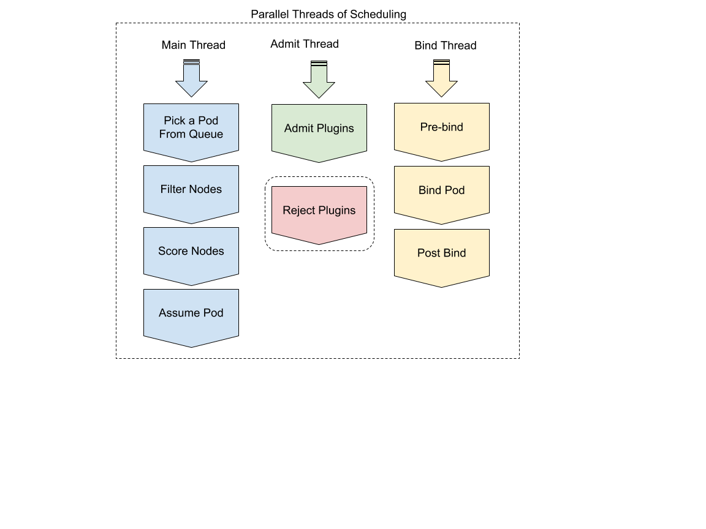

  
Status: Draft  
Created: 2018-04-09   /  Last updated: 2018-06-04  
Author: bsalamat  
Contributors: misterikkit

---

# 
- [SUMMARY ](#summary-)
- [OBJECTIVE](#objective)
   - [Terminology](#terminology)
- [BACKGROUND](#background)
- [OVERVIEW](#overview)
         - [Non-goals](#non-goals)
- [DETAILED DESIGN](#detailed-design)
   - [Bare bones of scheduling](#bare-bones-of-scheduling)
   - [Communication and statefulness of plugins](#communication-and-statefulness-of-plugins)
   - [Plugin registration](#plugin-registration)
   - [Extension points](#extension-points)
      - [Scheduling queue sort](#scheduling-queue-sort)
      - [Pre-filter](#pre-filter)
      - [Filter](#filter)
      - [Post-filter](#post-filter)
      - [Scoring](#scoring)
      - [Post-scoring/pre-reservation](#post-scoringpre-reservation)
      - [Reserve](#reserve)
      - [Permit](#permit)
         - [Approving a Pod binding](#approving-a-pod-binding)
      - [Reject](#reject)
      - [Pre-Bind](#pre-bind)
      - [Bind](#bind)
      - [Post Bind](#post-bind)
- [USE-CASES](#use-cases)
      - [Dynamic binding of cluster-level resources](#dynamic-binding-of-cluster-level-resources)
      - [Gang Scheduling](#gang-scheduling)
- [OUT OF PROCESS PLUGINS](#out-of-process-plugins)
- [CONFIGURING THE SCHEDULING FRAMEWORK](#configuring-the-scheduling-framework)
- [BACKWARD COMPATIBILITY WITH SCHEDULER v1](#backward-compatibility-with-scheduler-v1)
- [DEVELOPMENT PLAN](#development-plan)
- [TESTING PLAN](#testing-plan)
- [WORK ESTIMATES  ](#work-estimates)

# SUMMARY 

This document describes the Kubernetes Scheduling Framework. The scheduling
framework implements only basic functionality, but exposes many extension points
for plugins to expand its functionality. The plan is that this framework (with
its plugins) will eventually replace the current Kubernetes scheduler.

# OBJECTIVE

-  make scheduler more extendable.
-  Make scheduler core simpler by moving some of its features to plugins.
-  Propose extension points in the framework.
-  Propose a mechanism to receive plugin results and continue or abort based
   on the received results.
-  Propose a mechanism to handle errors and communicate it with plugins.

## Terminology

Scheduler v1, current scheduler: refer to existing scheduler of Kubernetes.  
Scheduler v2, scheduling framework: refer to the new scheduler proposed in this
doc. 

# BACKGROUND

Many features are being added to the Kubernetes default scheduler. They keep
making the code larger and logic more complex. A more complex scheduler is
harder to maintain, its bugs are harder to find and fix, and those users running
a custom scheduler have a hard time catching up and integrating new changes.  
The current Kubernetes scheduler provides
[webhooks to extend](./scheduler_extender.md)
its functionality. However, these are limited in a few ways:

1. The number of extension points are limited: "Filter" extenders are called
   after default predicate functions. "Prioritize" extenders are called after
   default priority functions. "Preempt" extenders are called after running
   default preemption mechanism. "Bind" verb of the extenders are used to bind
   a Pod. Only one of the extenders can be a binding extender, and that
   extender performs binding instead of the scheduler. Extenders cannot be
   invoked at other points, for example, they cannot be called before running
   predicate functions.
1. Every call to the extenders involves marshaling and unmarshalling JSON.
   Calling a webhook (HTTP request) is also slower than calling native functions.
1. It is hard to inform an extender that scheduler has aborted scheduling of
   a Pod. For example, if an extender provisions a cluster resource and
   scheduler contacts the extender and asks it to provision an instance of the
   resource for the Pod being scheduled and then scheduler faces errors
   scheduling the Pod and decides to abort the scheduling, it will be hard to
   communicate the error with the extender and ask it to undo the provisioning
   of the resource.
1. Since current extenders run as a separate process, they cannot use
   scheduler's cache. They must either build their own cache from the API
   server or process only the information they receive from the default scheduler.

The above limitations hinder building high performance and versatile scheduler
extensions. We would ideally like to have an extension mechanism that is fast
enough to allow keeping a bare minimum logic in the scheduler core and convert
many of the existing features of default scheduler, such as predicate and
priority functions and preemption into plugins. Such plugins will be compiled
with the scheduler. We would also like to provide an extension mechanism that do
not need recompilation of scheduler. The expected performance of such plugins is
lower than in-process plugins. Such out-of-process plugins should be used in
cases where quick invocation of the plugin is not a constraint.

# OVERVIEW

Scheduler v2 allows both built-in and out-of-process extenders. This new
architecture is a scheduling framework that exposes several extension points
during a scheduling cycle. Scheduler plugins can register to run at one or more
extension points.

#### Non-goals

-  We will keep Kubernetes API backward compatibility, but keeping scheduler
   v1 backward compatibility is a non-goal. Particularly, scheduling policy
   config and v1 extenders won't work in this new framework.
-  Solve all the scheduler v1 limitations, although we would like to ensure
   that the new framework allows us to address known limitations in the future.
-  Provide implementation details of plugins and call-back functions, such as
   all of their arguments and return values.

# DETAILED DESIGN

## Bare bones of scheduling

Pods that are not assigned to any node go to a scheduling queue and sorted by
order specified by plugins (described [here](#scheduling-queue-sort)). The
scheduling framework picks the head of the queue and starts a **scheduling
cycle** to schedule the pod. At the end of the cycle scheduler determines
whether the pod is schedulable or not. If the pod is not schedulable, its status
is updated and goes back to the scheduling queue. If the pod is schedulable (one
or more nodes are found that can run the Pod), the scoring process is started.
The scoring process finds the best node to run the Pod. Once the best node is
picked, the scheduler updates its cache and then a bind go routine is started to
bind the pod.  
The above process is the same as what Kubernetes scheduler v1 does. Some of the
essential features of scheduler v1, such as leader election, will also be
transferred to the scheduling framework.  
In the rest of this section we describe how various plugins are used to enrich
this basic workflow. This document focuses on in-process plugins.
Out-of-process plugins are discussed later in a separate doc.

## Communication and statefulness of plugins

The scheduling framework provides a library that plugins can use to pass
information to other plugins. This library keeps a map from keys of type string
to opaque pointers of type interface{}. A write operation takes a key and a
pointer and stores the opaque pointer in the map with the given key. Other
plugins can provide the key and receive the opaque pointer. Multiple plugins can
share the state or communicate via this mechanism.  
The saved state is preserved only during a single scheduling cycle. At the end
of a scheduling cycle, this map is destructed. So, plugins cannot keep shared
state across multiple scheduling cycle. They can, however, update the scheduler
cache via the provided interface of the cache. The cache interface allows
limited state preservation across multiple scheduling cycle.  
It is worth noting that plugins are assumed to be **trusted**. Scheduler does
not prevent one plugin from accessing or modifying another plugin's state.

## Plugin registration

Plugin registration is done by providing an extension point and a function that
should be called at that extension point. This step will be something like:

```go
register("pre-filter", plugin.foo)
```

The details of the function signature will be provided later.

## Extension points

The following picture shows the scheduling cycle of a Pod and the extension
points that the scheduling framework exposes. In this picture "Filter" is
equivalent to "Predicate" in scheduler v1 and "Scoring" is equivalent to
"Priority function". Plugins are go functions. They are registered to be called
at one of these extension points. They are called by the framework in the same
order they are registered for each extension point.  
In the following sections we describe each extension point in the same order
they are called in a schedule cycle.


### Scheduling queue sort

These plugins indicate how Pods should be sorted in the scheduling queue. A
plugin registered at this point only returns greater, smaller, or equal to
indicate an ordering between two Pods. In other words, a plugin at this
extension point returns the answer to "less(pod1, pod2)". Multiple plugins may
be registered at this point. Plugins registered at this point are called in
order and the invocation continues as long as plugins return "equal". Once a
plugin returns "greater" or "smaller" the invocation of these plugins are
stopped.

### Pre-filter

These plugins are generally useful to check certain conditions that the cluster
or the Pod must meet. These are also useful to perform pre-processing on the pod
and store some information about the pod that can be used by other plugins.  
The pod pointer is passed as an argument to these plugins. If any of these
plugins return an error, the scheduling cycle is aborted.  
These plugins are called serially in the same order registered.

### Filter

Filter plugins filter out nodes that cannot run the Pod. Scheduler runs these
plugins per node in the same order that they are registered, but scheduler may
run these filter function for multiple nodes in parallel. So, these plugins must
use synchronization when they modify state.  
Scheduler stops running the remaining filter functions for a node once one of
these filters fails for the node.

### Post-filter

The Pod and the set of nodes that can run the Pod are passed to these plugins.
They are called whether Pod is schedulable or not (whether the set of nodes is
empty or non-empty).  
If any of these plugins return an error or if the Pod is determined
unschedulable, the scheduling cycle is aborted.  
These plugins are called serially.

### Scoring

These plugins are similar to priority function in scheduler v1. They are
utilized to rank nodes that have passed the filtering stage. Similar to Filter
plugins, these are called per node serially in the same order registered, but
scheduler may run them for multiple nodes in parallel.  
Each one of these functions return a score for the given node. The score is
multiplied by the weight of the function and aggregated with the result of other
scoring functions to yield a total score for the node.  
These functions can never block scheduling. In case of an error they should
return zero for the Node being ranked.

### Post-scoring/pre-reservation

After all scoring plugins are invoked and the score of nodes are determined, the
framework picks the best node with the highest score and then it calls
post-scoring plugins. The Pod and the chosen Node are passed to these plugins.
These plugins have one more chance to check any conditions about the assignment
of the Pod to this Node and reject the node if needed.



### Reserve

This is not a plugin point. At this point scheduler updates its cache by
"reserving" a Node (partially or fully) for the Pod. In scheduler v1 this stage
is called "assume". At this point, only the scheduler cache is updated to
reflect that the Node is (partially) reserved for the Pod. The actual assignment
of the Node to the Pod happens during the "Bind" phase. That is when the API
server updates the Pod object with the Node information.

### Permit

Permit plugins run in a separate go routine (in parallel). Each plugin can return
one of the three possible values: 1) "permit", 2) "deny", or 3) "wait". If all
plugins registered at this extension point return "permit", the pod is sent to
the next step for binding. If any of the plugins returns "deny", the pod is
rejected and sent back to the scheduling queue. If any of the plugins returns
"wait", the Pod is kept in reserved state until it is explicitly approved for
binding. A plugin that returns "wait" must return a "timeout" as well. If the
timeout expires, the pod is rejected and goes back to the scheduling queue.

#### Approving a Pod binding

While any plugin can receive the list of reserved Pod from the cache and approve
them,  we expect only the "Permit" plugins to approve binding of reserved Pods
that are in "waiting" state. Once a Pod is approved, it is sent to the Bind
stage.

### Reject

Plugins called at "Permit" may perform some operations that should be undone if
the Pod reservation fails. The "Reject" extension point allows such clean-up
operations to happen. Plugins registered at this point are called if the
reservation of the Pod is cancelled. The reservation is cancelled if any of the
"Permit" plugins returns "reject" or if a Pod reservation, which is in "wait"
state, times out. 

### Pre-Bind

When a Pod is approved for binding it reaches to this stage. These plugins run
before the actual binding of the Pod to a Node happens. The binding starts only
if all of these plugins return true. If any returns false, the Pod is rejected
and sent back to the scheduling queue. These plugins run in a separate go
routine. The same go routine runs "Bind" after these plugins when all of them
return true.

### Bind

Once all pre-bind plugins return true, the Bind plugins are executed. Multiple
plugins may be registered at this extension point. Each plugin may return true
or false (or an error). If a plugin returns false, the next plugin will be
called until a plugin returns true. Once a true is returned **the remaining
plugins are skipped**. If any of the plugins returns an error or all of them
return false, the Pod is rejected and sent back to the scheduling queue.

### Post Bind

The Post Bind plugins can be useful for housekeeping after a pod is scheduled.
These plugins do not return any value and are not expected to influence the
scheduling decision made in the scheduling cycle.

# USE-CASES

In this section we provide a couple of examples on how the scheduling framework
can be used to solve common scheduling scenarios.

### Dynamic binding of cluster-level resources

Cluster level resources are resources which are not immediately available on
nodes at the time of scheduling Pods. Scheduler needs to ensure that such
cluster level resources are bound to a chosen Node before it can schedule a Pod
that requires such resources to the Node. We refer to this type of binding of
resources to Nodes at the time of scheduling Pods as dynamic resource binding.  
Dynamic resource binding has proven to be a challenge in Scheduler v1, because
Scheduler v1 is not flexible enough to support various types of plugins at
different phases of scheduling. As a result, binding of storage volumes is
integrated in the scheduler code and some non-trivial changes are done to the
scheduler extender to support dynamic binding of network GPUs.  
The scheduling framework allows such dynamic bindings in a cleaner way. The main
thread of scheduling framework process a pending Pod that requests a network
resource and finds a node for the Pod and reserves the Pod. A dynamic resource
binder plugin installed at "Pre-Bind" stage is invoked (in a separate thread).
It analyzes the Pod and when detects that the Pod needs dynamic binding of the
resource, the plugin tries to attach the cluster resource to the chosen node and
then returns true so that the Pod can be bound. If the resource attachment
fails, it returns false and the Pod will be retried.  
When there are multiple of such network resources, each one of them installs one
"pre-bind" plugin. Each plugin looks at the Pod and if the Pod is not requesting
the resource that they are interested in, they simply return "true" for the
pod.

### Gang Scheduling

Gang scheduling allows a certain number of Pods to be scheduled simultaneously.
If all the members of the gang cannot be scheduled at the same time, none of
them should be scheduled. Gang scheduling may have various other features as
well, but in this context we are interested in simultaneous scheduling of Pods.  
Gang scheduling in the scheduling framework can be done with an "Permit" plugin.
The main scheduling thread processes pods one by one and reserves nodes for
them. The gang scheduling plugin at the Permit stage is invoked for each pod.
When it finds that the pod belongs to a gang, it checks the properties of the
gang. If there are not enough members of the gang which are scheduled or in
"wait" state, the plugin returns "wait". When the number reaches the desired
value, all the Pods in wait state are approved and sent for binding.

# OUT OF PROCESS PLUGINS

Out of process plugins (OOPP) are called via JSON over an HTTP interface. In
other words, the scheduler will support webhooks at most (maybe all) of the
extension points. Data sent to an OOPP must be marshalled to JSON and data
received must be unmarshalled. So, calling an OOPP is significantly slower than
in-process plugins.  
We do not plan to build OOPPs in the first version of the scheduling framework.
So, more details on them is to be determined.


# DEVELOPMENT PLAN

Earlier, we wanted to develop the scheduling framework as an independent project
from scheduler V1. However, that would need much engineering resources.
It would also be more difficult to roll out a new and not fully-backward
compatible scheduler in Kubernetes where tens of thousands of users depend on
the behavior of the scheduler.
After revisiting the ideas and challenges, we changed our plan and have decided
to build some of the ideas of the scheduling framework into Scheduler V1 to make
it more extendable.

As the first step, we would like to build:
 1. [Pre-bind plugin point](#pre-bind). This will help us move our existing
 cluster resource binding code, such as persistent volume binding, to plugins.
 1. We will also build
 [the plugin communication mechanism](#communication-and-statefulness-of-plugins).
 This will allow us to build more sophisticated plugins that would require
 communication and also help us clean up existing scheduler's code by removing
 existing transient cache data.
 
More features of the framework can be added to the Scheduler in the future based
on the requirements.

<s>
# CONFIGURING THE SCHEDULING FRAMEWORK

TBD

# BACKWARD COMPATIBILITY WITH SCHEDULER v1

We will build a new set of plugins for scheduler v2 to ensure that the existing
behavior of scheduler v1 in placing Pods on nodes is preserved. This includes
building plugins that replicate default predicate and priority functions of
scheduler v1 and its binding mechanism, but scheduler extenders built for
scheduler v1 won't be compatible with scheduler v2. Also, predicate and priority
functions which are not enabled by default (such as service affinity) are not
guaranteed to exist in scheduler v2.

# DEVELOPMENT PLAN

We will develop the scheduling framework as an incubator project in SIG
scheduling. It will be built in a separate code-base independently from
scheduler v1, but we will probably use a lot of code from scheduler v1. 

# TESTING PLAN

We will add unit-tests as we build functionalities of the scheduling framework.
The scheduling framework should eventually be able to pass integration and e2e
tests of scheduler v1, excluding those tests that involve scheduler extensions.
The e2e and integration tests may need to be modified slightly as the
initialization and configuration of the scheduling framework will be different
than scheduler v1.

# WORK ESTIMATES

We expect to see an early version of the scheduling framework in two release
cycles (end of 2018). If things go well, we will start offering it as an
alternative to the scheduler v1 by the end of Q1 2019 and start the deprecation
of scheduler v1. We will make it the default scheduler of Kubernetes in Q2 2019,
but we will keep the option of using scheduler v1 for at least two more release
cycles.
</s>

