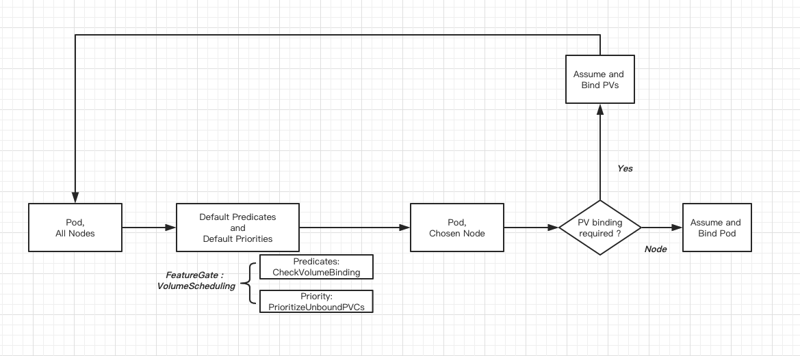

# Volume Topology-aware Scheduling

Authors: @msau42, @lichuqiang

This document presents a detailed design for making the default Kubernetes
scheduler aware of volume topology constraints, and making the
PersistentVolumeClaim (PVC) binding aware of scheduling decisions.

## Definitions
* Topology: Rules to describe accessibility of an object with respect to
  location in a cluster.
* Domain: A grouping of locations within a cluster. For example, 'node1',
  'rack10', 'zone5'.
* Topology Key: A description of a general class of domains. For example,
  'node', 'rack', 'zone'.
* Hierarchical domain: Domain that can be fully encompassed in a larger domain.
  For example, the 'zone1' domain can be fully encompassed in the 'region1'
  domain.
* Failover domain: A domain that a workload intends to run in at a later time.

## Goals
* Allow topology to be specified for both pre-provisioned and dynamic
  provisioned PersistentVolumes so that the Kubernetes scheduler can correctly
  place a Pod using such a volume to an appropriate node.
* Support arbitrary PV topology domains (i.e. node, rack, zone, foo, bar)
  without encoding each as first class objects in the Kubernetes API.
* Allow the Kubernetes scheduler to influence where a volume is provisioned or
  which pre-provisioned volume to bind to based on scheduling constraints on the
  Pod requesting a volume, such as Pod resource requirements and
  affinity/anti-affinity policies.
* No scheduling latency performance regression for Pods that do not use
  PVs with topology.
* Allow administrators to restrict allowed topologies per StorageClass.

## Non Goals
* Fitting a pod after the initial PVC binding has been completed.
    * The more constraints you add to your pod, the less flexible it becomes
in terms of placement.  Because of this, tightly constrained storage, such as
local storage, is only recommended for specific use cases, and the pods should
have higher priority in order to preempt lower priority pods from the node.
* Binding decision considering scheduling constraints from two or more pods
sharing the same PVC.
    * The scheduler itself only handles one pod at a time.  It’s possible the
two pods may not run at the same time either, so there’s no guarantee that you
will know both pod’s requirements at once.
    * For two+ pods simultaneously sharing a PVC, this scenario may require an
operator to schedule them together.  Another alternative is to merge the two
pods into one.
    * For two+ pods non-simultaneously sharing a PVC, this scenario could be
handled by pod priorities and preemption.
* Provisioning multi-domain volumes where all the domains will be able to run
  the workload. For example, provisioning a multi-zonal volume and making sure
  the pod can run in all zones.
    * Scheduler cannot make decisions based off of future resource requirements,
      especially if those resources can fluctuate over time. For applications that
      use such multi-domain storage, the best practice is to either:
        * Configure cluster autoscaling with enough resources to accommodate
          failing over the workload to any of the other failover domains.
        * Manually configure and overprovision the failover domains to
          accommodate the resource requirements of the workload.
* Scheduler supporting volume topologies that are independent of the node's
  topologies.
    * The Kubernetes scheduler only handles topologies with respect to the
      workload and the nodes it runs on. If a storage system is deployed on an
      independent topology, it will be up to provisioner to correctly spread the
      volumes for a workload. This could be facilitated as a separate feature
      by:
        * Passing the Pod's OwnerRef to the provisioner, and the provisioner
          spreading volumes for Pods with the same OwnerRef
        * Adding Volume Anti-Affinity policies, and passing those to the
          provisioner.


## Problem
Volumes can have topology constraints that restrict the set of nodes that the
volume can be accessed on.  For example, a GCE PD can only be accessed from a
single zone, and a local disk can only be accessed from a single node.  In the
future, there could be other topology domains, such as rack or region.

A pod that uses such a volume must be scheduled to a node that fits within the
volume’s topology constraints.  In addition, a pod can have further constraints
and limitations, such as the pod’s resource requests (cpu, memory, etc), and
pod/node affinity and anti-affinity policies.

Currently, the process of binding and provisioning volumes are done before a pod
is scheduled.  Therefore, it cannot take into account any of the pod’s other
scheduling constraints.  This makes it possible for the PV controller to bind a
PVC to a PV or provision a PV with constraints that can make a pod unschedulable.

### Examples
* In multizone clusters, the PV controller has a hardcoded heuristic to provision
PVCs for StatefulSets spread across zones.  If that zone does not have enough
cpu/memory capacity to fit the pod, then the pod is stuck in pending state because
its volume is bound to that zone.
* Local storage exasperates this issue.  The chance of a node not having enough
cpu/memory is higher than the chance of a zone not having enough cpu/memory.
* Local storage PVC binding does not have any node spreading logic.  So local PV
binding will very likely conflict with any pod anti-affinity policies if there is
more than one local PV on a node.
* A pod may need multiple PVCs.  As an example, one PVC can point to a local SSD for
fast data access, and another PVC can point to a local HDD for logging.  Since PVC
binding happens without considering if multiple PVCs are related, it is very likely
for the two PVCs to be bound to local disks on different nodes, making the pod
unschedulable.
* For multizone clusters and deployments requesting multiple dynamically provisioned
zonal PVs, each PVC is provisioned independently, and is likely to provision each PV
in different zones, making the pod unschedulable.

To solve the issue of initial volume binding and provisioning causing an impossible
pod placement, volume binding and provisioning should be more tightly coupled with
pod scheduling.


## Volume Topology Specification
First, volumes need a way to express topology constraints against nodes. Today, it
is done for zonal volumes by having explicit logic to process zone labels on the
PersistentVolume. However, this is not easily extendable for volumes with other
topology keys.

Instead, to support a generic specification, the PersistentVolume
object will be extended with a new NodeAffinity field that specifies the
constraints.  It will closely mirror the existing NodeAffinity type used by
Pods, but we will use a new type so that we will not be bound by existing and
future Pod NodeAffinity semantics.

```
type PersistentVolumeSpec struct {
    ...

    NodeAffinity *VolumeNodeAffinity
}

type VolumeNodeAffinity struct {
    // The PersistentVolume can only be accessed by Nodes that meet
    // these required constraints
    Required *NodeSelector
}
```

The `Required` field is a hard constraint and indicates that the PersistentVolume
can only be accessed from Nodes that satisfy the NodeSelector.

In the future, a `Preferred` field can be added to handle soft node constraints with
weights, but will not be included in the initial implementation.

The advantages of this NodeAffinity field vs the existing method of using zone labels
on the PV are:
* We don't need to expose first-class labels for every topology key.
* Implementation does not need to be updated every time a new topology key
  is added to the cluster.
* NodeSelector is able to express more complex topology with ANDs and ORs.
* NodeAffinity aligns with how topology is represented with other Kubernetes
  resources.

Some downsides include:
* You can have a proliferation of Node labels if you are running many different
  kinds of volume plugins, each with their own topology labeling scheme.
* The NodeSelector is more expressive than what most storage providers will
  need. Most storage providers only need a single topology key with
  one or more domains.  Non-hierarchical domains may present implementation
  challenges, and it will be difficult to express all the functionality
  of a NodeSelector in a non-Kubernetes specification like CSI.


### Example PVs with NodeAffinity
#### Local Volume
In this example, the volume can only be accessed from nodes that have the
label key `kubernetes.io/hostname` and label value `node-1`.
```
apiVersion: v1
kind: PersistentVolume
metadata:
  Name: local-volume-1
spec:
  capacity:
    storage: 100Gi
  storageClassName: my-class
  local:
    path: /mnt/disks/ssd1
  nodeAffinity:
    required:
      nodeSelectorTerms:
      - matchExpressions:
        - key: kubernetes.io/hostname
          operator: In
          values:
          - node-1
```

#### Zonal Volume
In this example, the volume can only be accessed from nodes that have the
label key `failure-domain.beta.kubernetes.io/zone` and label value
`us-central1-a`.
```
apiVersion: v1
kind: PersistentVolume
metadata:
  Name: zonal-volume-1
spec:
  capacity:
    storage: 100Gi
  storageClassName: my-class
  gcePersistentDisk:
    diskName: my-disk
    fsType: ext4
  nodeAffinity:
    required:
      nodeSelectorTerms:
      - matchExpressions:
        - key: failure-domain.beta.kubernetes.io/zone
          operator: In
          values:
          - us-central1-a
```

#### Multi-Zonal Volume
In this example, the volume can only be accessed from nodes that have the
label key `failure-domain.beta.kubernetes.io/zone` and label value
`us-central1-a` OR `us-central1-b`.
```
apiVersion: v1
kind: PersistentVolume
metadata:
  Name: multi-zonal-volume-1
spec:
  capacity:
    storage: 100Gi
  storageClassName: my-class
  gcePersistentDisk:
    diskName: my-disk
    fsType: ext4
  nodeAffinity:
    required:
      nodeSelectorTerms:
      - matchExpressions:
        - key: failure-domain.beta.kubernetes.io/zone
          operator: In
          values:
          - us-central1-a
          - us-central1-b
```

#### Multi Label Volume
In this example, the volume needs two labels to uniquely identify the topology.
```
apiVersion: v1
kind: PersistentVolume
metadata:
  Name: rack-volume-1
spec:
  capacity:
    storage: 100Gi
  storageClassName: my-class
  csi:
    driver: my-rack-storage-driver
    volumeHandle: my-vol
    volumeAttributes:
      foo: bar
  nodeAffinity:
    required:
      nodeSelectorTerms:
      - matchExpressions:
        - key: failure-domain.beta.kubernetes.io/zone
          operator: In
          values:
          - us-central1-a
        - key: foo.io/rack
          operator: In
          values:
          - rack1
```

### Zonal PV Upgrade and Downgrade
Upgrading of zonal PVs to use the new PV.NodeAffinity API can be phased in as
follows:

1. Update PV label admission controllers to specify the new PV.NodeAffinity. New
   PVs created will automatically use the new PV.NodeAffinity. Existing PVs are
   not updated yet, so on a downgrade, existing PVs are unaffected. New PVCs
   should be deleted and recreated if there were problems with this feature.
2. Once PV.NodeAffinity is GA, deprecate the VolumeZoneChecker scheduler
   predicate. Add a zonal PV upgrade controller to convert existing PVs. At this
   point, if there are issues with this feature, then on a downgrade, the
   VolumeScheduling feature would also need to be disabled.
3. After deprecation period, remove VolumeZoneChecker predicate and PV upgrade
   controller.

The zonal PV upgrade controller will convert existing PVs leveraging the
existing zonal scheduling logic using labels to PV.NodeAffinity. It will keep
the existing labels for backwards compatibility.

For example, this zonal volume:
```
apiVersion: v1
kind: PersistentVolume
metadata:
  name: zonal-volume-1
  labels:
    failure-domain.beta.kubernetes.io/zone: us-central1-a
    failure-domain.beta.kubernetes.io/region: us-central1
spec:
  capacity:
    storage: 100Gi
  storageClassName: my-class
  gcePersistentDisk:
    diskName: my-disk
    fsType: ext4
```

will be converted to:
```
apiVersion: v1
kind: PersistentVolume
metadata:
  name: zonal-volume-1
  labels:
    failure-domain.beta.kubernetes.io/zone: us-central1-a
    failure-domain.beta.kubernetes.io/region: us-central1
spec:
  capacity:
    storage: 100Gi
  storageClassName: my-class
  gcePersistentDisk:
    diskName: my-disk
    fsType: ext4
  nodeAffinity:
    required:
      nodeSelectorTerms:
      - matchExpressions:
        - key: failure-domain.beta.kubernetes.io/zone
          operator: In
          values:
          - us-central1-a
        - key: failure-domain.beta.kubernetes.io/region
          operator: In
          values:
          - us-central1
```

### Multi-Zonal PV Upgrade
The zone label for multi-zonal volumes need to be specially parsed.

For example, this multi-zonal volume:
```
apiVersion: v1
kind: PersistentVolume
metadata:
  name: multi-zonal-volume-1
  labels:
    failure-domain.beta.kubernetes.io/zone: us-central1-a__us-central1-b
    failure-domain.beta.kubernetes.io/region: us-central1
spec:
  capacity:
    storage: 100Gi
  storageClassName: my-class
  gcePersistentDisk:
    diskName: my-disk
    fsType: ext4
```

will be converted to:
```
apiVersion: v1
kind: PersistentVolume
metadata:
  name: zonal-volume-1
  labels:
    failure-domain.beta.kubernetes.io/zone: us-central1-a__us-central1-b
    failure-domain.beta.kubernetes.io/region: us-central1
spec:
  capacity:
    storage: 100Gi
  storageClassName: my-class
  gcePersistentDisk:
    diskName: my-disk
    fsType: ext4
  nodeAffinity:
    required:
      nodeSelectorTerms:
      - matchExpressions:
        - key: failure-domain.beta.kubernetes.io/zone
          operator: In
          values:
          - us-central1-a
          - us-central1-b
        - key: failure-domain.beta.kubernetes.io/region
          operator: In
          values:
          - us-central1
```

### Bound PVC Enforcement
For PVCs that are already bound to a PV with NodeAffinity, enforcement is
simple and will be done at two places:
* Scheduler predicate: if a Pod references a PVC that is bound to a PV with
NodeAffinity, the predicate will evaluate the `Required` NodeSelector against
the Node's labels to filter the nodes that the Pod can be schedule to.  The
existing VolumeZone scheduling predicate will coexist with this new predicate
for several releases until PV NodeAffinity becomes GA and we can deprecate the
old predicate.
* Kubelet: PV NodeAffinity is verified against the Node when mounting PVs.

### Unbound PVC Binding
As mentioned in the problem statement, volume binding occurs without any input
about a Pod's scheduling constraints.  To fix this, we will delay volume binding
and provisioning until a Pod is created.  This behavior change will be opt-in as a
new StorageClass parameter.

Both binding decisions of:
* Selecting a precreated PV with NodeAffinity
* Dynamically provisioning a PV with NodeAffinity

will be considered by the scheduler, so that all of a Pod's scheduling
constraints can be evaluated at once.

The detailed design for implementing this new volume binding behavior will be
described later in the scheduler integration section.

## Delayed Volume Binding
Today, volume binding occurs immediately once a PersistentVolumeClaim is
created. In order for volume binding to take into account all of a pod's other scheduling
constraints, volume binding must be delayed until a Pod is being scheduled.

A new StorageClass field `BindingMode` will be added to control the volume
binding behavior.

```
type StorageClass struct {
    ...

    BindingMode *BindingMode
}

type BindingMode string

const (
    BindingImmediate BindingMode = "Immediate"
    BindingWaitForFirstConsumer BindingMode = "WaitForFirstConsumer"
)
```

`BindingImmediate`  is the default and current binding method.

This approach allows us to:
* Introduce the new binding behavior gradually.
* Maintain backwards compatibility without deprecation of previous
  behavior. Any automation that waits for PVCs to be bound before scheduling Pods
  will not break.
* Support scenarios where volume provisioning for globally-accessible volume
  types could take a long time, where volume provisioning is a planned
  event well in advance of workload deployment.

However, it has a few downsides:
* StorageClass will be required to get the new binding behavior, even if dynamic
  provisioning is not used (in the case of local storage).
* We have to maintain two different code paths for volume binding.
* We will be depending on the storage admin to correctly configure the
  StorageClasses for the volume types that need the new binding behavior.
* User experience can be confusing because PVCs could have different binding
  behavior depending on the StorageClass configuration.  We will mitigate this by
  adding a new PVC event to indicate if binding will follow the new behavior.


## Dynamic Provisioning with Topology
To make dynamic provisioning aware of pod scheduling decisions, delayed volume
binding must also be enabled. The scheduler will pass its selected node to the
dynamic provisioner, and the provisioner will create a volume in the topology
domain that the selected node is part of. The domain depends on the volume
plugin. Zonal volume plugins will create the volume in the zone where the
selected node is in. The local volume plugin will create the volume on the
selected node.

### End to End Zonal Example
This is an example of the most common use case for provisioning zonal volumes.
For this use case, the user's specs are unchanged. Only one change
to the StorageClass is needed to enable delayed volume binding.

1. Admin sets up StorageClass, setting up delayed volume binding.
```
apiVersion: storage.k8s.io/v1
kind: StorageClass
metadata:
  name: standard
provisioner: kubernetes.io/gce-pd
bindingMode: WaitForFirstConsumer
parameters:
  type: pd-standard
```
2. Admin launches provisioner.  For in-tree plugins, nothing needs to be done.
3. User creates PVC. Nothing changes in the spec, although now the PVC won't be
   immediately bound.
```
apiVersion: v1
kind: PersistentVolumeClaim
metadata:
  name: my-pvc
spec:
  storageClassName: standard
  accessModes:
  - ReadWriteOnce
  resources:
    requests:
      storage: 100Gi
```
4. User creates Pod. Nothing changes in the spec.
```
apiVersion: v1
kind: Pod
metadata:
  name: my-pod
spec:
  containers:
  ...
  volumes:
  - name: my-vol
    persistentVolumeClaim:
      claimName: my-pvc
```
5. Scheduler picks a node that can satisfy the Pod and
   [passes it](#pv-controller-changes) to the provisioner.
6. Provisioner dynamically provisions a PV that can be accessed from
   that node.
```
apiVersion: v1
kind: PersistentVolume
metadata:
  Name: volume-1
spec:
  capacity:
    storage: 100Gi
  storageClassName: standard
  gcePersistentDisk:
    diskName: my-disk
    fsType: ext4
  nodeAffinity:
    required:
      nodeSelectorTerms:
      - matchExpressions:
        - key: failure-domain.beta.kubernetes.io/zone
          operator: In
          values:
          - us-central1-a
```
7. Pod gets scheduled to the node.


### Restricting Topology
For the common use case, volumes will be provisioned in whatever topology domain
the scheduler has decided is best to run the workload. Users may impose further
restrictions by setting label/node selectors, and pod affinity/anti-affinity
policies on their Pods. All those policies will be taken into account when
dynamically provisioning a volume.

While less common, administrators may want to further restrict what topology
domains are available to a StorageClass. To support these administrator
policies, an AllowedTopologies field can also be specified in the
StorageClass to restrict the topology domains for dynamic provisioning.
This is not expected to be a common use case, and there are some caveats,
described below.

```
type StorageClass struct {
    ...

    // Restrict the node topologies where volumes can be dynamically provisioned.
    // Each volume plugin defines its own supported topology specifications.
    // Each entry in AllowedTopologies is ORed.
    AllowedTopologies []TopologySelector
}

type TopologySelector struct {
    // Topology must meet all of the TopologySelectorLabelRequirements
    // These requirements are ANDed.
    MatchLabelExpressions []TopologySelectorLabelRequirement
}

// Topology requirement expressed as Node labels.
type TopologySelectorLabelRequirement struct{
    // Topology label key
    Key string
    // Topology must match at least one of the label Values for the given label Key.
    // Each entry in Values is ORed.
    Values []string
}
```

A nil value means there are no topology restrictions. A scheduler predicate
will evaluate a non-nil value when considering dynamic provisioning for a node.

The AllowedTopologies will also be provided to provisioners as a new field, detailed in
the provisioner section. Provisioners can use the allowed topology information
in the following scenarios:
* StorageClass is using the default immediate binding mode. This is the
  legacy topology-unaware behavior. In this scenario, the volume could be
  provisioned in a domain that cannot run the Pod since it doesn't take any
  scheduler input.
* For volumes that span multiple domains, the AllowedTopologies can restrict those
  additional domains.  However, special care must be taken to avoid specifying
  conflicting topology constraints in the Pod. For example, the administrator could
  restrict a multi-zonal volume to zones 'zone1' and 'zone2', but the Pod could have
  constraints that restrict it to 'zone1' and 'zone3'.  If 'zone1'
  fails, the Pod cannot be scheduled to the intended failover zone.

Note that if delayed binding is enabled and the volume spans only a single domain,
then the AllowedTopologies can be ignored by the provisioner because the
scheduler would have already taken it into account when it selects the node.

Kubernetes will leave validation and enforcement of the AllowedTopologies content up
to the provisioner.

Support in the GCE PD and AWS EBS provisioners for the existing `zone` and `zones`
parameters will be deprecated. CSI in-tree migration will handle translation of
`zone` and `zones` parameters to CSI topology.

Admins must already create a new StorageClass with delayed volume binding to use
this feature, so the documentation can encourage use of the AllowedTopologies
instead of existing zone parameters. A plugin-specific admission controller
can also validate that both zone and AllowedTopologies are not specified,
although the CSI plugin should still be robust to handle this configuration
error.

##### Alternatives
A new restricted TopologySelector is used here instead of reusing
VolumeNodeAffinity because the provisioning operation requires
allowed topologies to be explicitly enumerated, while NodeAffinity and
NodeSelectors allow for non-explicit expressions of topology values (i.e.,
operators NotIn, Exists, DoesNotExist, Gt, Lt). It would be difficult for
provisioners to evaluate all the expressions without having to enumerate all the
Nodes in the cluster.

Another alternative is to have a list of allowed PV topologies, where each PV
topology is exactly the same as a single PV topology. This expression can become
very verbose for volume types that have multi-dimensional topologies or multiple
selections. As an example, for a multi-zonal volume that needs to select
two zones, if an administrator wants to restrict the selection to 4 zones, then
all 6 combinations need to be explicitly enumerated.

Another alternative is to expand ResourceQuota to support topology constraints.
However, ResourceQuota is currently only evaluated during admission, and not
scheduling.

#### Zonal Example
This example restricts the volumes provisioned to zones us-central1-a and
us-central1-b.
```
apiVersion: storage.k8s.io/v1
kind: StorageClass
metadata:
  name: zonal-class
provisioner: kubernetes.io/gce-pd
parameters:
  type: pd-standard
allowedTopologies:
- matchLabelExpressions:
  - key: failure-domain.beta.kubernetes.io/zone
    values:
    - us-central1-a
    - us-central1-b
```

#### Multi-Zonal Example
This example restricts the volume's primary and failover zones
to us-central1-a, us-central1-b and us-central1-c. The regional PD
provisioner will pick two out of the three zones to provision in.
```
apiVersion: storage.k8s.io/v1
kind: StorageClass
metadata:
  name: multi-zonal-class
provisioner: kubernetes.io/gce-pd
parameters:
  type: pd-standard
  replication-type: regional-pd
allowedTopologies:
- matchLabelExpressions:
  - key: failure-domain.beta.kubernetes.io/zone
    values:
    - us-central1-a
    - us-central1-b
    - us-central1-c
```

Topologies that are incompatible with the storage provider parameters
will be enforced by the provisioner. For example, dynamic provisioning
of regional PDs will fail if provisioning is restricted to fewer than
two zones in all regions. This configuration will cause provisioning to fail:
```
apiVersion: storage.k8s.io/v1
kind: StorageClass
metadata:
  name: multi-zonal-class
provisioner: kubernetes.io/gce-pd
parameters:
  type: pd-standard
  replication-type: regional-pd
allowedTopologies:
- matchLabelExpressions:
  - key: failure-domain.beta.kubernetes.io/zone
    values:
    - us-central1-a
```

#### Multi Label Example
This example restricts the volume's topology to nodes that
have the following labels:

* "zone: us-central1-a" and "rack: rack1" or,
* "zone: us-central1-b" and "rack: rack1" or,
* "zone: us-central1-b" and "rack: rack2"

```
apiVersion: storage.k8s.io/v1
kind: StorageClass
metadata:
  name: something-fancy
provisioner: rack-based-provisioner
parameters:
allowedTopologies:
- matchLabelExpressions:
  - key: zone
    values:
    - us-central1-a
  - key: rack
    values:
    - rack1
- matchLabelExpressions:
  - key: zone
    values:
    - us-central1-b
  - key: rack
    values:
    - rack1
    - rack2
```


## Feature Gates
All functionality is controlled by the VolumeScheduling feature gate,
and must be configured in the
kube-scheduler, kube-controller-manager, and all kubelets.

## Integrating volume binding with pod scheduling
For the new volume binding mode, the proposed new workflow is:
1. Admin pre-provisions PVs and/or StorageClasses.
2. User creates unbound PVC and there are no prebound PVs for it.
3. **NEW:** PVC binding and provisioning is delayed until a pod is created that
references it.
4. User creates a pod that uses the PVC.
5. Pod starts to get processed by the scheduler.
6. Scheduler processes predicates.
7. **NEW:** A new predicate function, called CheckVolumeBinding, will process
both bound and unbound PVCs of the Pod.  It will validate the VolumeNodeAffinity
for bound PVCs.  For unbound PVCs, it will try to find matching PVs for that node
based on the PV NodeAffinity.  If there are no matching PVs, then it checks if
dynamic provisioning is possible for that node based on StorageClass
AllowedTopologies.
8. The scheduler continues to evaluate priority functions
9. **NEW:** A new priority
function, called PrioritizeVolumes, will get the PV matches per PVC per
node, and compute a priority score based on various factors.
10. After evaluating all the predicates and priorities, the
scheduler will pick a node.
11. **NEW:** A new assume function, AssumePodVolumes, is called by the scheduler.
The assume function will check if any binding or
provisioning operations need to be done.  If so, it will update the PV cache to
mark the PVs with the chosen PVCs and queue the Pod for volume binding.
12. AssumePod is done by the scheduler.
13. **NEW:** If PVC binding or provisioning is required, a new bind function,
BindPodVolumes, will be called asynchronously, passing
in the selected node.  The bind function will prebind the PV to the PVC, or
trigger dynamic provisioning.  Then, it waits for the binding or provisioning
operation to complete.
14. In the same async thread, scheduler binds the Pod to a Node.
15. Kubelet starts the Pod.

This diagram depicts the new additions to the default scheduler:



This new workflow will have the scheduler handle unbound PVCs by choosing PVs
and prebinding them to the PVCs.  The PV controller completes the binding
transaction, handling it as a prebound PV scenario.

Prebound PVCs and PVs will still immediately be bound by the PV controller.

Manual recovery by the user will be required in following error conditions:
* A Pod has multiple PVCs, and only a subset of them successfully bind.

The primary cause for these errors is if a user or external entity
binds a PV between the time that the scheduler chose the PV and when the
scheduler actually made the API update.  Some workarounds to
avoid these error conditions are to:
* Prebind the PV instead.
* Separate out volumes that the user prebinds from the volumes that are
available for the system to choose from by StorageClass.

### PV Controller Changes
When the feature gate is enabled, the PV controller needs to skip binding
unbound PVCs with VolumBindingWaitForFirstConsumer and no prebound PVs
to let it come through the scheduler path.

Dynamic provisioning will also be skipped if
VolumBindingWaitForFirstConsumer is set. The scheduler will signal to
the PV controller to start dynamic provisioning by setting the
`annSelectedNode` annotation in the PVC. If provisioning fails, the PV
controller can signal back to the scheduler to retry dynamic provisioning by
removing the `annSelectedNode` annotation. For external provisioners, the
external provisioner needs to remove the annotation.

No other state machine changes are required.  The PV controller continues to
handle the remaining scenarios without any change.

The methods to find matching PVs for a claim and prebind PVs need to be
refactored for use by the new scheduler functions.

### Dynamic Provisioning interface changes
The dynamic provisioning interfaces will be updated to pass in:
* selectedNode, when late binding is enabled on the StorageClass
* allowedTopologies, when it is set in the StorageClass

If selectedNode is set, the provisioner should get its appropriate topology
labels from the Node object, and provision a volume based on those topology
values. In the common use case for a volume supporting a single topology domain,
if nodeName is set, then allowedTopologies can be ignored by the provisioner.
However, multi-domain volume provisioners may still need to look at
allowedTopologies to restrict the remaining domains.

In-tree provisioners:
```
Provision(selectedNode *v1.Node, allowedTopologies *storagev1.VolumeProvisioningTopology) (*v1.PersistentVolume, error)
```

External provisioners:
* selectedNode will be represented by the PVC annotation "volume.alpha.kubernetes.io/selectedNode".
  Value is the name of the node.
* allowedTopologies must be obtained by looking at the StorageClass for the PVC.

#### New Permissions
Provisioners will need to be able to get Node and StorageClass objects.

### Scheduler Changes

#### Predicate
A new predicate function checks all of a Pod's unbound PVCs can be satisfied
by existing PVs or dynamically provisioned PVs that are
topologically-constrained to the Node.
```
CheckVolumeBinding(pod *v1.Pod, node *v1.Node) (canBeBound bool, err error)
```
1. If all the Pod’s PVCs are bound, return true.
2. Otherwise try to find matching PVs for all of the unbound PVCs in order of
decreasing requested capacity.
3. Walk through all the PVs.
4. Find best matching PV for the PVC where PV topology is satisfied by the Node.
5. Temporarily cache this PV choice for the PVC per Node, for fast
processing later in the priority and bind functions.
6. Return true if all PVCs are matched.
7. If there are still unmatched PVCs, check if dynamic provisioning is possible,
   by evaluating StorageClass.AllowedTopologies.  If so,
   temporarily cache this decision in the PVC per Node.
8. Otherwise return false.

Note that we should consider all the cases which may affect predicate cached
results of CheckVolumeBinding and other scheduler predicates, this will be
explained later.

#### Priority
After all the predicates run, there is a reduced set of Nodes that can fit a
Pod. A new priority function will rank the remaining nodes based on the
unbound PVCs and their matching PVs.
```
PrioritizeVolumes(pod *v1.Pod, filteredNodes HostPriorityList) (rankedNodes HostPriorityList, err error)
```
1. For each Node, get the cached PV matches for the Pod’s PVCs.
2. Compute a priority score for the Node using the following factors:
    1. How close the PVC’s requested capacity and PV’s capacity are.
    2. Matching pre-provisioned PVs is preferred over dynamic provisioning because we
       assume that the administrator has specifically created these PVs for
       the Pod.

TODO (beta): figure out weights and exact calculation

#### Assume
Once all the predicates and priorities have run, then the scheduler picks a
Node.  Then we can bind or provision PVCs for that Node.  For better scheduler
performance, we’ll assume that the binding will likely succeed, and update the
PV and PVC caches first.  Then the actual binding API update will be made
asynchronously, and the scheduler can continue processing other Pods.

For the alpha phase, the AssumePodVolumes function will be directly called by the
scheduler.  We’ll consider creating a generic scheduler interface in a
subsequent phase.

```
AssumePodVolumes(pod *v1.pod, node *v1.node) (pvcbindingrequired bool, err error)
```
1. If all the Pod’s PVCs are bound, return false.
2. For pre-provisioned PV binding:
    1. Get the cached matching PVs for the PVCs on that Node.
    2. Validate the actual PV state.
    3. Mark PV.ClaimRef in the PV cache.
    4. Cache the PVs that need binding in the Pod object.
3. For in-tree and external dynamic provisioning:
    1. Mark the PVC annSelectedNode in the PVC cache.
    2. Cache the PVCs that need provisioning in the Pod object.
4. Return true

#### Bind
A separate go routine performs the binding operation for the Pod.

If AssumePodVolumes returns pvcBindingRequired, then BindPodVolumes is called
first in this go routine. It will handle binding and provisioning of PVCs that
were assumed, and wait for the operations to complete.

Once complete, or if no volumes need to be bound, then the scheduler continues
binding the Pod to the Node.

For the alpha phase, the BindPodVolumes function will be directly called by the
scheduler.  We’ll consider creating a generic scheduler interface in a subsequent
phase.

```
BindPodVolumes(pod *v1.Pod, node *v1.Node) (err error)
```
1. For pre-provisioned PV binding:
    1. Prebind the PV by updating the `PersistentVolume.ClaimRef` field.
    2. If the prebind fails, revert the cache updates.
2. For in-tree and external dynamic provisioning:
    1. Set `annSelectedNode` on the PVC.
3. Wait for binding and provisioning to complete.
    1. In the case of failure, error is returned and the Pod will retry
       scheduling. Failure scenarios include:
       * PV or PVC got deleted
       * PV.ClaimRef got cleared
       * PVC selectedNode annotation got cleared or is set to the wrong node

TODO: pv controller has a high resync frequency, do we need something similar
for the scheduler too

#### Access Control
Scheduler will need PV update permissions for prebinding pre-provisioned PVs, and PVC
update permissions for triggering dynamic provisioning.

#### Pod preemption considerations
The CheckVolumeBinding predicate does not need to be re-evaluated for pod
preemption.  Preempting a pod that uses a PV will not free up capacity on that
node because the PV lifecycle is independent of the Pod’s lifecycle.

#### Other scheduler predicates
Currently, there are a few existing scheduler predicates that require the PVC
to be bound.  The bound assumption needs to be changed in order to work with
this new workflow.

TODO: how to handle race condition of PVCs becoming bound in the middle of
running predicates?  One possible way is to mark at the beginning of scheduling
a Pod if all PVCs were bound.  Then we can check if a second scheduler pass is
needed.

##### Max PD Volume Count Predicate
This predicate checks the maximum number of PDs per node is not exceeded.  It
needs to be integrated into the binding decision so that we don’t bind or
provision a PV if it’s going to cause the node to exceed the max PD limit.  But
until it is integrated, we need to make one more pass in the scheduler after all
the PVCs are bound.  The current copy of the predicate in the default scheduler
has to remain to account for the already-bound volumes.

##### Volume Zone Predicate
This predicate makes sure that the zone label on a PV matches the zone label of
the node.  If the volume is not bound, this predicate can be ignored, as the
binding logic will take into account zone constraints on the PV.

However, this assumes that zonal PVs like GCE PDs and AWS EBS have been updated
to use the new PV topology specification, which is not the case as of 1.8.  So
until those plugins are updated, the binding and provisioning decisions will be
topology-unaware, and we need to make one more pass in the scheduler after all
the PVCs are bound.

This predicate needs to remain in the default scheduler to handle the
already-bound volumes using the old zonal labeling, but must be updated to skip
unbound PVC if StorageClass binding mode is WaitForFirstConsumer. It can be
removed once that mechanism is deprecated and unsupported.

##### Volume Node Predicate
This is a new predicate added in 1.7 to handle the new PV node affinity.  It
evaluates the node affinity against the node’s labels to determine if the pod
can be scheduled on that node.  If the volume is not bound, this predicate can
be ignored, as the binding logic will take into account the PV node affinity.

#### Caching
There are two new caches needed in the scheduler.

The first cache is for handling the PV/PVC API binding updates occurring
asynchronously with the main scheduler loop.  `AssumePodVolumes` needs to store
the updated API objects before `BindPodVolumes` makes the API update, so
that future binding decisions will not choose any assumed PVs.  In addition,
if the API update fails, the cached updates need to be reverted and restored
with the actual API object.  The cache will return either the cached-only
object, or the informer object, whichever one is latest.  Informer updates
will always override the cached-only object.  The new predicate and priority
functions must get the objects from this cache instead of from the informer cache.
This cache only stores pointers to objects and most of the time will only
point to the informer object, so the memory footprint per object is small.

The second cache is for storing temporary state as the Pod goes from
predicates to priorities and then assume.  This all happens serially, so
the cache can be cleared at the beginning of each pod scheduling loop.  This
cache is used for:
* Indicating if all the PVCs are already bound at the beginning of the pod
scheduling loop.  This is to handle situations where volumes may have become
bound in the middle of processing the predicates.  We need to ensure that
all the volume predicates are fully run once all PVCs are bound.
* Caching PV matches per node decisions that the predicate had made.  This is
an optimization to avoid walking through all the PVs again in priority and
assume functions.
* Caching PVC dynamic provisioning decisions per node that the predicate had
  made.

#### Event handling

##### Move pods into active queue
When a pod is tried and determined to be unschedulable, it will be placed in
the unschedulable queue by scheduler. It will not be scheduled until being
moved to active queue. For volume topology scheduling, we need to move
pods to active queue in following scenarios:

- on PVC add

  Pod which references nonexistent PVCs is unschedulable for now, we need to
  move pods to active queue when a PVC is added.

- on PVC update

  The proposed design has the scheduler initiating the binding transaction by
  prebinding the PV and waiting for PV controller to finish binding and put it
  back in the schedule queue. To achieve this, we need to move pods to active
  queue on PVC update.

- on PV add

  Pods created when there are no PVs available will be stuck in unschedulable
  queue. But unbound PVs created for static provisioning and delay binding
  storage class are skipped in PV controller dynamic provisioning and binding
  process, will not trigger events to schedule pod again. So we need to move
  pods to active queue on PV add for this scenario.

- on PV update

  In scheduler assume process, if volume binding is required, scheduler will
  put pod to unschedulable queue and wait for asynchronous volume binding
  updates are made. But binding volumes worker may fail to update assumed pod
  volume bindings due to conflicts if PVs are updated by PV controller or other
  entities. So we need to move pods to active queue on PV update for this
  scenario.

- on Storage Class add

  CheckVolumeBindingPred will fail if pod has unbound immediate PVCs. If these
  PVCs have specified StorageClass name, creating StorageClass objects with
  late binding for these PVCs will cause predicates to pass, so we need to move
  pods to active queue when a StorageClass with WaitForFirstConsumer is added.

##### Invalidate predicate equivalence cache
Scheduler now have an optional [equivalence
cache](../scheduling/scheduler-equivalence-class.md#goals) to improve
scheduler's scalability. We need to invalidate
CheckVolumeBinding/NoVolumeZoneConflict predicate cached results in following
scenarios to keep equivalence class cache up to date:

- on PVC add/delete

  When PVCs are created or deleted, available PVs to choose from for volume
  scheduling may change, we need to invalidate CheckVolumeBinding predicate.

- on PVC update

  PVC volume binding may change on PVC update, we need to invalidate
  CheckVolumeBinding predicate.

- on PV add/delete

  When PVs are created or deleted, available PVs to choose from for volume
  scheduling will change, we need to invalidate CheckVolumeBinding
  predicate.

- on PV update

  CheckVolumeBinding predicate may cache PVs in pod binding cache. When PV got
  updated, we should invalidate cache, otherwise assume process will fail
  with out of sync error.

- on StorageClass delete

  When a StorageClass with WaitForFirstConsumer is deleted, PVCs which references
  this storage class will be in immediate binding mode. We need to invalidate
  CheckVolumeBinding and NoVolumeZoneConflict.

#### Performance and Optimizations
Let:
* N = number of nodes
* V = number of all PVs
* C = number of claims in a pod

C is expected to be very small (< 5) so shouldn’t factor in.

The current PV binding mechanism just walks through all the PVs once, so its
running time O(V).

Without any optimizations, the new PV binding mechanism has to run through all
PVs for every node, so its running time is O(NV).

A few optimizations can be made to improve the performance:

1. PVs that don’t use node affinity should not be using delayed binding.
2. Optimizing for PVs that have node affinity:
    1. When a static PV is created, if node affinity is present, evaluate it
against all the nodes.  For each node, keep an in-memory map of all its PVs
keyed by StorageClass.  When finding matching PVs for a particular node, try to
match against the PVs in the node’s PV map instead of the cluster-wide PV list.

For the alpha phase, the optimizations are not required.  However, they should
be required for beta and GA.

### Packaging
The new bind logic that is invoked by the scheduler can be packaged in a few
ways:
* As a library to be directly called in the default scheduler
* As a scheduler extender

We propose taking the library approach, as this method is simplest to release
and deploy.  Some downsides are:
* The binding logic will be executed using two different caches, one in the
scheduler process, and one in the PV controller process.  There is the potential
for more race conditions due to the caches being out of sync.
* Refactoring the binding logic into a common library is more challenging
because the scheduler’s cache and PV controller’s cache have different interfaces
and private methods.

#### Extender cons
However, the cons of the extender approach outweighs the cons of the library
approach.

With an extender approach, the PV controller could implement the scheduler
extender HTTP endpoint, and the advantage is the binding logic triggered by the
scheduler can share the same caches and state as the PV controller.

However, deployment of this scheduler extender in a master HA configuration is
extremely complex.  The scheduler has to be configured with the hostname or IP of
the PV controller.  In a HA setup, the active scheduler and active PV controller
could run on the same, or different node, and the node can change at any time.
Exporting a network endpoint in the controller manager process is unprecedented
and there would be many additional features required, such as adding a mechanism
to get a stable network name, adding authorization and access control, and
dealing with DDOS attacks and other potential security issues.  Adding to those
challenges is the fact that there are countless ways for users to deploy
Kubernetes.

With all this complexity, the library approach is the most feasible in a single
release time frame, and aligns better with the current Kubernetes architecture.

### Downsides

#### Unsupported Use Cases
The following use cases will not be supported for PVCs with a StorageClass with
BindingWaitForFirstConsumer:
* Directly setting Pod.Spec.NodeName
* DaemonSets

These two use cases will bypass the default scheduler and thus will not
trigger PV binding.

#### Custom Schedulers
Custom schedulers, controllers and operators that handle pod scheduling and want
to support this new volume binding mode will also need to handle the volume
binding decision.

There are a few ways to take advantage of this feature:
* Custom schedulers could be implemented through the scheduler extender
interface.  This allows the default scheduler to be run in addition to the
custom scheduling logic.
* The new code for this implementation will be packaged as a library to make it
easier for custom schedulers to include in their own implementation.

In general, many advanced scheduling features have been added into the default
scheduler, such that it is becoming more difficult to run without it.

#### HA Master Upgrades
HA masters adds a bit of complexity to this design because the active scheduler
process and active controller-manager (PV controller) process can be on different
nodes.  That means during an HA master upgrade, the scheduler and controller-manager
can be on different versions.

The scenario where the scheduler is newer than the PV controller is fine.  PV
binding will not be delayed and in successful scenarios, all PVCs will be bound
before coming to the scheduler.

However, if the PV controller is newer than the scheduler, then PV binding will
be delayed, and the scheduler does not have the logic to choose and prebind PVs.
That will cause PVCs to remain unbound and the Pod will remain unschedulable.

TODO: One way to solve this is to have some new mechanism to feature gate system
components based on versions.  That way, the new feature is not turned on until
all dependencies are at the required versions.

For alpha, this is not concerning, but it needs to be solved by GA.

### Other Alternatives Considered

#### One scheduler function
An alternative design considered was to do the predicate, priority and bind
functions all in one function at the end right before Pod binding, in order to
reduce the number of passes we have to make over all the PVs.  However, this
design does not work well with pod preemption.  Pod preemption needs to be able
to evaluate if evicting a lower priority Pod will make a higher priority Pod
schedulable, and it does this by re-evaluating predicates without the lower
priority Pod.

If we had put the MatchUnboundPVCs predicate at the end, then pod preemption
wouldn’t have an accurate filtered nodes list, and could end up preempting pods
on a Node that the higher priority pod still cannot run on due to PVC
requirements.  For that reason, the PVC binding decision needs to be have its
predicate function separated out and evaluated with the rest of the predicates.

#### Pull entire PVC binding into the scheduler
The proposed design only has the scheduler initiating the binding transaction
by prebinding the PV.  An alternative is to pull the whole two-way binding
transaction into the scheduler, but there are some complex scenarios that
scheduler’s Pod sync loop cannot handle:
* PVC and PV getting unexpectedly unbound or lost
* PVC and PV state getting partially updated
* PVC and PV deletion and cleanup

Handling these scenarios in the scheduler’s Pod sync loop is not possible, so
they have to remain in the PV controller.

#### Keep all PVC binding in the PV controller
Instead of initiating PV binding in the scheduler, have the PV controller wait
until the Pod has been scheduled to a Node, and then try to bind based on the
chosen Node.  A new scheduling predicate is still needed to filter and match
the PVs (but not actually bind).

The advantages are:
* Existing scenarios where scheduler is bypassed will work.
* Custom schedulers will continue to work without any changes.
* Most of the PV logic is still contained in the PV controller, simplifying HA
upgrades.

Major downsides of this approach include:
* Requires PV controller to watch Pods and potentially change its sync loop
to operate on pods, in order to handle the multiple PVCs in a pod scenario.
This is a potentially big change that would be hard to keep separate and
feature-gated from the current PV logic.
* Both scheduler and PV controller processes have to make the binding decision,
but because they are done asynchronously, it is possible for them to choose
different PVs.  The scheduler has to cache its decision so that it won't choose
the same PV for another PVC.  But by the time PV controller handles that PVC,
it could choose a different PV than the scheduler.
    * Recovering from this inconsistent decision and syncing the two caches is
very difficult.  The scheduler could have made a cascading sequence of decisions
based on the first inconsistent decision, and they would all have to somehow be
fixed based on the real PVC/PV state.
* If the scheduler process restarts, it loses all its in-memory PV decisions and
can make a lot of wrong decisions after the restart.
* All the volume scheduler predicates that require PVC to be bound will not get
evaluated.  To solve this, all the volume predicates need to also be built into
the PV controller when matching possible PVs.

#### Move PVC binding to kubelet
Looking into the future, with the potential for NUMA-aware scheduling, you could
have a sub-scheduler on each node to handle the pod scheduling within a node.  It
could make sense to have the volume binding as part of this sub-scheduler, to make
sure that the volume selected will have NUMA affinity with the rest of the
resources that the pod requested.

However, there are potential security concerns because kubelet would need to see
unbound PVs in order to bind them.  For local storage, the PVs could be restricted
to just that node, but for zonal storage, it could see all the PVs in that zone.

In addition, the sub-scheduler is just a thought at this point, and there are no
concrete proposals in this area yet.

## Binding multiple PVCs in one transaction
There are no plans to handle this, but a possible solution is presented here if the
need arises in the future.  Since the scheduler is serialized, a partial binding
failure should be a rare occurrence and would only be caused if there is a user or
other external entity also trying to bind the same volumes.

One possible approach to handle this is to rollback previously bound PVCs on
error.  However, volume binding cannot be blindly rolled back because there could
be user's data on the volumes.

For rollback, PersistentVolumeClaims will have a new status to indicate if it's
clean or dirty.  For backwards compatibility, a nil value is defaulted to dirty.
The PV controller will set the status to clean if the PV is Available and unbound.
Kubelet will set the PV status to dirty during Pod admission, before adding the
volume to the desired state.

If scheduling fails, update all bound PVCs with an annotation,
"pv.kubernetes.io/rollback".  The PV controller will only unbind PVCs that
are clean.  Scheduler and kubelet needs to reject pods with PVCs that are
undergoing rollback.

## Recovering from kubelet rejection of pod
We can use the same rollback mechanism as above to handle this case.
If kubelet rejects a pod, it will go back to scheduling.  If the scheduler
cannot find a node for the pod, then it will encounter scheduling failure and
initiate the rollback.


## Testing

### E2E tests
* StatefulSet, replicas=3, specifying pod anti-affinity
    * Positive: Local PVs on each of the nodes
    * Negative: Local PVs only on 2 out of the 3 nodes
* StatefulSet specifying pod affinity
    * Positive: Multiple local PVs on a node
    * Negative: Only one local PV available per node
* Multiple PVCs specified in a pod
    * Positive: Enough local PVs available on a single node
    * Negative: Not enough local PVs available on a single node
* Fallback to dynamic provisioning if unsuitable pre-provisioned PVs

### Unit tests
* All PVCs found a match on first node.  Verify match is best suited based on
capacity.
* All PVCs found a match on second node.  Verify match is best suited based on
capacity.
* Only 2 out of 3 PVCs have a match.
* Priority scoring doesn’t change the given priorityList order.
* Priority scoring changes the priorityList order.
* Don’t match PVs that are prebound


## Implementation Plan

### Alpha
* New feature gate for volume topology scheduling
* StorageClass API change
* Refactor PV controller methods into a common library
* PV controller: Delay binding and provisioning unbound PVCs
* Predicate: Filter nodes and find matching PVs
* Predicate: Check if provisioner exists for dynamic provisioning
* Update existing predicates to skip unbound PVC
* Bind: Trigger PV binding
* Bind: Trigger dynamic provisioning
a Pod (only if alpha is enabled)

### Beta
* Scheduler cache: Optimizations for no PV node affinity
* Priority: capacity match score
* Plugins: Convert all zonal volume plugins to use new PV node affinity (GCE PD,
AWS EBS, what else?)
* Make dynamic provisioning topology aware

### GA
* Predicate: Handle max PD per node limit
* Scheduler cache: Optimizations for PV node affinity


## Open Issues
* Can generic device resource API be leveraged at all?  Probably not, because:
    * It will only work for local storage (node specific devices), and not zonal
storage.
    * Storage already has its own first class resources in K8s (PVC/PV) with an
independent lifecycle.  The current resource API proposal does not have an a way to
specify identity/persistence for devices.
* Will this be able to work with the node sub-scheduler design for NUMA-aware
scheduling?
    * It’s still in a very early discussion phase.
