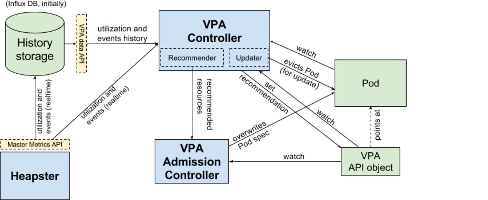

Vertical Pod Autoscaler
=======================
Vertical Pod Autoscaler (VPA, aka. "rightsizing" or "autopilot") is an
infrastructure service that automatically sets resource requirements of Pods and
dynamically adjusts them in runtime, based on analysis of historical resource
utilization, amount of resources available in the cluster and real-time events,
such as OOMs.

- [Introduction](#introduction)
  - [Background](#background)
  - [Purpose](#purpose)
  - [Related features](#related-features)
- [Requirements](#requirements)
  - [Functional](#functional)
  - [Availability](#availability)
  - [Extensibility](#extensibility)
- [Design](#design)
  - [Overview](#overview)
  - [Architecture overview](#architecture-overview)
  - [API](#api)
  - [Admission Controller](#admission-controller)
  - [Life of the Pod](#life-of-the-pod)
  - [Recommender](#recommender)
  - [Updater](#updater)
  - [Recommendation model](#recommendation-model)
  - [History Storage](#history-storage)
  - [Open questions](#open-questions)
- [Alternatives considered](#alternatives-considered)
  - [Pods point at VPA](#pods-point-at-vpa)
  - [VPA points at Deployment](#vpa-points-at-deployment)
  - [Actuation using the Deployment update mechanism](#actuation-using-the-deployment-update-mechanism)
  
------------
Introduction
------------

### Background ###
* [Compute resources](http://kubernetes.io/docs/user-guide/compute-resources/)
* [Resource QoS](https://github.com/kubernetes/community/blob/master/contributors/design-proposals/resource-qos.md)
* [Admission Controllers](http://kubernetes.io/docs/admin/admission-controllers/)

### Purpose ###
Vertical scaling has two objectives: improving utilization of compute resources
and reducing the maintenance cost, by automating configuration of resource
requirements. While ensuring high utilization it tries to minimize the risk of
containers running out of memory or getting CPU starved.

### Related features ###
#### Initial resources ####
["Initial Resources"](https://github.com/kgrygiel/community/blob/master/contributors/design-proposals/initial-resources.md)
is a very preliminary, proof-of-concept feature providing initial request based
on historical utilization. It is designed to only kick in on Pod creation.
VPA is intended to supersede this feature.

#### In-place updates ####
In-place Pod updates is a planned feature to allow changing resources
(request/limit) of existing containers without killing them, assuming sufficient
free resources available on the node. Vertical Pod Autoscaler will greatly
benefit from this ability, however it is not considered a blocker for the MVP.
#### Resource estimation ####
Resource estimation is another planned feature, meant to improve node resource
utilization by temporarily reclaiming unused resources of running containers.
It is different from Vertical Autoscaling in that it operates on a shorter
timeframe (using only local, short-term history), re-offers resources at a
lower quality, and does not provide initial resource predictions.
VPA and resource estimation are complementary. Details will follow once
Resource Estimation is designed.

------------
Requirements
------------

### Functional ###

1. VPA is capable of setting container resources (CPU & memory request/limit) at
   Pod submission time.
   
2. VPA is capable of adjusting container resources of existing Pods, in
   particular reacting to CPU starvation and container OOM events.
   
3. When VPA restarts Pods it respects the disruption budget.

4. It is possible for the user to configure VPA with fixed constraints on
   resources, specifically: min & max request.
   
5. VPA is compatible with Pod controllers, at least with Deployments.
   In particular:
     * Updates of resources do not interfere/conflict with spec updates.
     * It is possible to do a rolling update of the VPA policy on an existing
       Deployment.
     
6. It is possible to create Pod(s) that start following the VPA  policy
   immediately. In particular such Pods must not be scheduled until VPA policy
   is applied.
   
7. Disabling VPA is easy and fast ("panic button"), without disrupting existing
   Pods.

### Availability ###
1. Downtime of heavy-weight components (database/recommender) must not block
   recreating existing Pods. Components on critical path for Pod creation
   (admission controller) are designed to be highly available.

### Extensibility ###
1. VPA is capable of performing in-place updates once they become available.

------
Design
------

### Overview ###
(see further sections for details and justification)

1. We introduce a new type of **API resource**:
   `VerticalPodAutoscaler`. It consists of a **label selector** to match Pods,
   the **resources policy** (controls how VPA computes the resources), the
   **update policy** (controls how changes are applied to Pods) and the
   recommended Pod resources (an output field).
   
2. **VPA Recommender** is a new component which **consumes utilization signals
   and OOM events** for all Pods in the cluster from Heapster (or another
   monitoring solution).
   
3. VPA Recommender **watches all Pods**, keeps calculating fresh recommended
   resources for them and **stores the recommendations in the VPA objects**.
   
4. Additionally the Recommender **exposes a synchronous API** that takes a Pod
   description and returns recommended resources.
   
5. All Pod creation requests go through the VPA **Admission Controller**.
   If the Pod is matched by any VerticalPodAutoscaler object, the admission
   controller **overrides resources** of containers in the Pod with the
   recommendation provided by the VPA Recommender. If the Recommender is not
   available, it falls back to the recommendation cached in the VPA object.
   
6. Pods can use the [**Initializer**](https://github.com/kubernetes/kubernetes/issues/3585)
   mechanism to ensure they are not scheduled until a matching VPA object is
   present. This is a recommended way of using VPA.
   
7. **VPA Updater** is a component responsible for **real-time updates** of Pods.
   If a Pod uses VPA in `"auto"` mode, the Updater can decide to update it with
   recommender resources.
   In MVP this is realized by just evicting the Pod in order to have it
   recreated with new resources. This approach requires the Pod to belong to a
   Replica Set (or some other owner capable of recreating it).
   In future the Updater will take advantage of in-place updates, which would
   most likely lift this constraint.
   Because restarting/rescheduling Pods is disruptive to the service, it must be
   rare.
   
8. VPA only controls the resource **request** of containers. It sets the limit
   to infinity. The request is calculated based on analysis of the current and
   previous runs (see [Recommendation model](#recommendation-model) below).
   
9. **History Storage** is a component that consumes utilization signals and OOMs
   (same data as the Recommender) from Heapster and stores it persistently.
   It is used by the Recommender to **initialize its state on startup**.
   First implementation will be InFluxDB.
   
### Architecture overview ###


### API ###
We introduce a new type of API object `VerticalPodAutoscaler`, which
consists of the [label selector](https://kubernetes.io/docs/api-reference/v1.5/#labelselector-unversioned)
for matching Pods and two policy sections: the update policy and the resources
policy.

#### Example VPA object ####
```json
"target": {
  "matchLabels": [{
    "key": "app",
    "value": "my-nginx-1",
  }]
}
"updatePolicy" {
  "mode": "auto",
}
"resourcesPolicy" {
  "containers": [{
    "name": "my-nginx",
    "requests": {
      "cpu": {
        "min": "500m",
      },
      "memory": {
        "min": "200Mi",
      }
    }
  }]
}
"recommendation" {
  "containers": [{
    "name": "my-nginx",
    "resources": {
      "requests": {
        "cpu": "1200m",
        "memory": "450Mi",
      }
    }
  }]
}
```

#### Label Selector ####
The label selector determines which Pods will be scaled according to the given
VPA policy. The Recommender will aggregate signals for all Pods matched by a
given VPA, so it is important that the user set labels to group similarly
behaving Pods under one VPA.

It is yet to be determined how to resolve conflicts, i.e. when the Pod is
matched by more than one VPA (this is not a VPA-specific problem though).

#### Update Policy ####
The update policy controls how VPA applies changes. In MVP it consists of a
single field `mode` that enables the feature.

```json
"updatePolicy" {
  "mode": "",
}
```

Mode can be set to one of the following:

1. `"initial"`: VPA only assigns resources on Pod creation and does not
   change them during lifetime of the Pod.
2. `"auto"` (default): VPA assigns resources on Pod creation and
   additionally can update them during lifetime of the Pod, including evicting /
   rescheduling the Pod.
3. `"off"`: VPA never changes Pod resources. The recommender still sets the
   recommended resources in the VPA object. This can be used for a “dry run”.

To disable VPA updates the user can do any of the following: (1) change the
updatePolicy to `"off"` or (2) delete the VPA (and remove VPA Initializers,
in case they were used) or (3) change the Pod labels to no longer match the VPA
selector.

Note: disabling VPA prevents it from doing further changes, but does not revert
resources of the running Pods, until they are updated.
For example, when running a Deployment, the user would need to perform an update
to revert Pod to originally specified resources.

#### Resource Policy ####
The resources policy controls how VPA computes the recommended resources.
In MVP it consists of (optional) lower and upper bound on the request of each
container.
The resources policy could later be extended with additional knobs to let the
user tune the recommendation algorithm to their specific use-case.

#### Recommendation ####
The VPA resource has an output-only field keeping a recent recommendation,
filled by the Recommender. Its primary function is to act as a recommendation
cache, to limit the impact of temporary unavailability of the Recommender.

#### Initializers ####
[Initializers](https://github.com/kubernetes/kubernetes/issues/3585)
are a planned feature which will allow different agents to asynchronously
initialize parts of the resource at creation time.
Users of VPA will be able (and encouraged) to use Initializers to ensure that
Pods are not scheduled before a matching VPA is present.
This allows to avoid race conditions when Pods are submitted before or shortly
after the VPA object was added, in which case it’s not possible to predict
whether the Pods will be scheduled using original resources or recommended
resources.
Both VPA Admission Controller and VPA Controller will remove the VPA initializer
after setting Pod resources. Details of this mechanism will be designed when
Initializers are available.

### Admission Controller ###

VPA Admission Controller intercepts Pod creation requests. If the Pod is matched
by a VPA config with mode not set to “off”, the controller rewrites the request
by applying recommended resources to the Pod spec. Otherwise it leaves the Pod
spec unchanged.

The controller gets the recommended resources by fetching
/recommendedPodResources from the Recommender. If the call times out or fails,
the controller falls back to the recommendation cached in the VPA object.
If this is also not available and the Pod doesn’t have a VPA Initializer, it is
rejected.

### Life of the Pod ###
There are two paths for a Pod using VPA to get scheduled.

1. A synchronous (fast) path: if a matching VPA exists at the time of creating
   the Pod and it is able to obtain a recommendation (either by calling the
   Recommender or by using a cached value in the VPA resource), the Admission
   Plugin sets resources synchronously. It also immediately deletes the VPA
   initializer if one was present, to shorten the critical path for Pod
   creation.

2. An asynchronous (slower) path. A Pod is created with the Initializer.
   The Admission Plugin doesn't see a matching VPA so it passes the Pod
   unchanged. Once a matching VPA appears, the VPA controller sets the Pod
   resources and removes the Initializer (one could also consider adding
   optional deadline to the Initializer to let the Pod schedule if the VPA
   doesn’t appear).


### Recommender ###
Recommender is the main component of the VPA. It is responsible for
computing recommended resources. On startup the recommender fetches
historical resource utilization of all Pods (regardless of whether
they use VPA) together with the history of Pod OOM events from the
History Storage. It aggregates this data and keeps it in memory.

During normal operation the recommender consumes real time updates of
resource utilization and new events via the Master Metrics API from
Heapster. Additionally it watches all Pods and all VPA objects in the
cluster. For every Pod that is matched by some VPA selector the
Recommender computes the recommended resources and sets the
recommendation on the VPA object.

It is important to realize that one VPA object has one recommendation.
The user is expected to use one VPA to control Pods with similar
resource usage patterns, typically a group of replicas or shards of
a single workload.

The Recommender exposes a synchronous RPC interface that takes a Pod
Spec and the Pod metadata and returns recommended resources:

```json
GET /recommendedPodResources
{
  "metadata": { },
  "spec": { }
}
```

The response:

```json
{
  "containers": [
    {"name": "...", "resources": { }}
  ]
}
```

Notice that this API may be called for an existing Pod, as well as for a
yet-to-be-created Pod.
It is not guaranteed that this API will return the same recommendation for all
Pods matched by one VPA.

### Updater ###
VPA Updater is a component responsible for applying recommended resources to
existing Pods. In MVP (until in-place updates of Pod resources are available)
this means evicting Pods whose recommended resources significantly diverge from
actual resources, in order to have them recreated with the recommended
resources.

While terminating Pods is disruptive and generally undesired, it is sometimes
justified in order to (1) avoid CPU starvation (2) reduce the risk of correlated
OOMs across multiple Pods at random time or (3) save resources over long periods
of time.

Apart from its own policy on how often a Pod can be evicted, the Updater also
respects the Pod disruption budget, by using Eviction API to evict pods.

The Updater only touches Pods that (1) point to a VPA with updatePolicy.mode set
to “auto” and (2) belong to a Replica Set.

Note: the Updater may in future be extracted to a separate process.

### Recommendation model ###

VPA controls the request (memory and CPU) of containers. In MVP it always sets
the limit to infinity. It is not yet clear whether there is a use-case for VPA
setting the limit.

The request is calculated based on analysis of the current and revious runs of
the container and other containers with similar properties (name, image,
command, args).
The recommendation model (MVP) assumes that the memory and CPU consumption are
independent random variables with distribution equal to the one observed in the
last N days (recommended value is N=8 to capture weekly peaks).
A more advanced model in future could attempt to detect trends, periodicity and
other time-related patterns.

For CPU the objective is to **keep the fraction of time when the container usage
exceeds a high percentage (e.g. 95%) of request below a certain threshold**
(e.g. 1% of time).
In this model the “CPU usage” is defined as mean usage measured over a short
interval. The shorter the measurement interval, the better the quality of
recommendations for spiky, latency sensitive workloads. Minimum reasonable
resolution is 1/min, recommended is 1/sec.

For memory the objective is to **keep the probability of the container usage
exceeding the request in a specific time window below a certain threshold**
(e.g. below 1% in 24h). The window must be long (≥ 24h) to ensure that evictions
caused by OOM do not visibly affect (a) availability of serving applications
(b) progress of batch computations (a more advanced model could allow user to
specify SLO to control this).

#### Handling OOMs ####
When a container is evicted due to exceeding available memory, its actual memory
requirements are not known (the amount consumed obviously gives the lower
bound). This is modelled by translating OOM events to artificial memory usage
samples by applying a "safety margin" multiplier to the last observed usage.

### History Storage ###
VPA defines data access API for providers of historical events and resource
utilization. Initially we will use InfluxDB as the reference implementation of
this API. Users will be able to plug their own implementations.

History Storage is populated with real time updates of resources utilization and
events from Heapster, similarly to the Recommender. The storage keeps at least
8 days of data. This data is only used to initialize the Recommender on startup.

### Open questions ###
1. How to resolve conflicts if multiple VPA objects match a Pod.

2. What happens to VPA API objects, if for any reason admin decides to disable
   VPA in the cluster.

-----------------------
Alternatives considered
-----------------------

### Pods point at VPA ###
*REJECTED BECAUSE IT REQUIRES MODIFYING THE POD SPEC*

#### proposal: ####
Instead of VPA using label selectors, Pod Spec is extended with an optional
field `verticalPodAutoscalerPolicy`,
a [reference](https://kubernetes.io/docs/api-reference/v1/definitions/#_v1_localobjectreference)
to the VPA config.

#### pros: ####
* Consistency is enforced at the API level:
    * At most one VPA can point to a given Pod.
    * It is always clear at admission stage whether the Pod should use
      VPA or not. No race conditions.
* It is cheap to find the VPA for a given Pod.

#### cons: ####
* Requires changing the core part of the API (Pod Spec).

### VPA points at Deployment ###

#### proposal: ####
VPA has a reference to Deployment object. Doesn’t use label selector to match
Pods.

#### pros: ####
* More consistent with HPA.

#### cons: ####
* Extending VPA support from Deployment to other abstractions that  manage Pods
  requires additional work. VPA must be aware of all such abstractions.
* It is not possible to do a rolling update of the VPA config.
  For example setting `max_memory` in the VPA config will apply to the whole
  Deployment immediately.
* VPA can’t be shared between deployments.

### Actuation using the Deployment update mechanism ###

In this solution the Deployment itself is responsible for actuating VPA
decisions.

#### Actuation by update of spec ####
In this variant changes of resources are applied similarly to normal changes of
the spec, i.e. using the Deployment rolling update mechanism.

**pros:** existing clean API (and implementation), one common update policy
(e.g. max surge, max unavailable).

**cons:** conflicting with user (config) update - update of resources and spec
are tied together (they are executed at the same rate), problem with rollbacks,
problem with pause. Not clear how to handle in-place updates? (this problem has
to be solved regardless of VPA though).

#### Dedicated method for resource update ####
In this variant Deployment still uses the rolling update mechanism for updating
resources, but update of resources is treated in a special way, so that it can
be performed in parallel with config update.

**pros:** handles concurrent resources and spec updates, solves resource updates
without VPA, more consistent with HPA, all update logic lives in one place (less
error-prone).

**cons:** specific to Deployment, high complexity (multiple replica set created
underneath - exposed to the user, can be confusing and error-prone).
