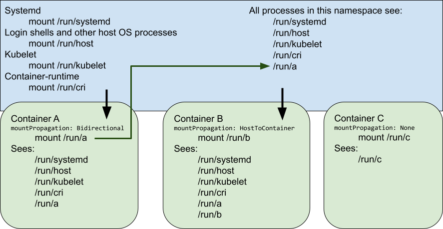
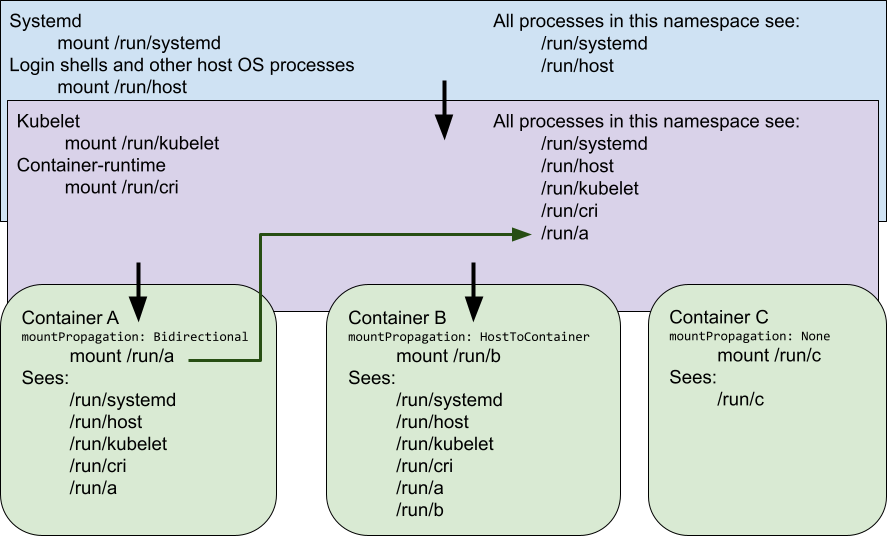

# Managing a Separate Mount Namespace for Kubernetes

## What does this mean?

Originally, Kubelet and the Container Runtime all ran in the same mount namespace as
the host OS (systemd, login shells, system daemons).



_Fig 1: Original mount propagation_

However, in order to support the full range of cloud-native applications, only
two guarantees need to be made about the relationship of mountpoints:

1. Mounts originating in the host OS are visible to the Container Runtime, OCI
   hooks, Kubelet, and container volumeMounts with `MountPropagation:
   HostToContainer` (or `Bidirectional`)
2. Mounts originating in the Container Runtime, OCI hooks, Kubelet, and
   container volumeMounts with `mountPropagation: Bidirectional` are visible to
   each other and container volumeMounts with `MountPropagation:
   HostToContainer`

The fact that mounts originating in the Container Runtime, OCI hooks, Kubelet,
and container volumeMounts with `mountPropagation: Bidirectional` were visible
to the host OS in the original implementations of Kubernetes was incidental to
the implementation, and there are a number of real-world benefits to changing
the way Kubernetes is installed in order to hide the container-specific mount
points from the host OS.



_Fig 2: Container-Runtime-scoped mount propagation_

## Benefits

### Systemd Efficiency

Today systemd's CPU usage is adversely affected by a large number of
mountpoints. This feature of systemd, which scans all /proc/1/mount to invoke
udev events for every change suffers from two issues:

- The first was an inefficiency in systemd’s processing logic. This was fixed
  in systemd-248, and this fix reportedly reduced the systemd
  mount-scanning-related overhead by 30-50%
- The second is a lack of granularity in the events the kernel sends to systemd
  about mountpoint changes, which necessitates a full rescan of all mountpoints
  even on a minor change or single mountpoint addition. The kernel change to
  remedy this seems unlikely to move forward in the near term.

For example, a fairly small OpenShift deployment today (which does not yet have
systemd-248) has upwards of 400 mountpoints on every node owned by Kubelet, the
Container Runtime, and infrastructure containers like OVN or CSI operators.
Hiding the container mountpoints reduces the steady-state systemd CPU
utilization from ~10% to ~0% on every worker node. On a more heavily loaded
system, with 1000’s of container mountpoints, systemd’s usage will cap out at
100% of a single CPU core. Even with the 30-50% reduction in systemd usage
expected from systemd-248, having systemd take up as much as 50-70%
of a single CPU in the worst-case scenario is a lot of unnecessary overhead.

Administrators of other OSes with other host OS services that monitor or
process mountpoints indiscriminately could also benefit from hiding these
container-specific mountpoints from the OS at large.

### Tidiness and Encapsulation

These container overlay mounts, secret and configmap mounts, and namespace
mounts are all internal implementation details around the way the Kubernetes
and the Container Runtime allocate resources to containers. For normal
day-to-day operation, there is no need for these special-use mounts to be
visible in the host OS's top-level `mount` or `findmnt` output.

### Security

While access to container-specific mounts in Kubernetes (like secrets) today
are protected by filesystem permissions, the fact that the locations are
visible to unprivileged users via the `mount` command can provide information
which could be used in conjunction with other vulnerabilities to decipher
secrets or other protected container mount contents. Locking access to even
listing the mountpoints behind the ability to enter the mount namespace (which
in turn requires `CAP_SYS_CHROOT` and `CAP_SYS_ADMIN`) removes one level of
potential access to container-specific mounts.

### No one uses it (that we know of)

After much investigation and conversation on both the sig-node and sig-storage
mailing lists, as well as within Red Hat's OpenShift communities, we have yet
to turn up a use case that relies on this container-to-host propagation.

### Testing implications

With separate mount namespaces, it would be possible to run multiple instances
of Kubernetes on a single host without the various mountpoints interfering with
one another. There may be other inter-instance difficulties besides the mount
namespace, but this does move in that direction without resorting to more
complicated solutions like trying to run Kubernetes inside of containers.

## Costs and Implications

If a Kubernetes deployment intends to implement this mount-hiding mode of
operation, there are a number of costs and implications that should be
documented for system administrators.

### Privileged pods

Privileged pods that previously expected to have direct access to the host's
root mount namespace (such as the one spawned by `oc debug`), will now be
rooted in the new container-runtime mount namespace.  They will still have
visibility into the host OS's mount points as granted by the normal volumeMount
permissions, but any mounts made in these privileged pods will not by default
propagate up to be visible by the Host OS. In order for shells or utilities in
privileged pods like this to propagate mounts up to the host OS, they can enter
the host OS namespace by running `nsenter -t 1 -m` (assuming they have the host
OS's /proc filesystem mounted so they can reach the mount namespace of the real
init process in /proc/1/ns/mnt)

### Legacy Tools

Any monitoring tool that relies on the ability to run in the host OS and have
visibility of mountpoints created by Kubelet, the Container Runtime, or
containers themselves, will need to enter the container mount namespace in
order to see these mountpoints.  This could be done by:

- Converting the legacy tool to be containerized
- Altering the scripts that launch the legacy tool to run it inside the
  container-mount namespace
- Altering the legacy tool to be aware of the container-mount namespace and
  enter it as needed to probe or interact with the container-specific
  mountpoints
- Providing a system-wide mechanism to revert the Kubernetes installation back
  to the original "all mounts in the Host OS" mode of operation.

### Administrative Access

An administrator logged in to the host OS wishing to obtain information about
the Kubernetes system for debugging or auditing purposes will need to be aware
of the new mount namespace, and will need to run `nsenter` to view or interact
with these mountpoints.

## Implementation Suggestions

This does not require a change to Kubelet, the Container Runtime, or any other
existing component, but can be accomplished entirely through changes to the
environment and init scripts which launch Kublete and the Container Runtime.

### Mount Namespace Creation

The new mount namespace must be set up as a `slave+shared` mountpoint (according to
[mount_namespace(7)](https://man7.org/linux/man-pages/man7/mount_namespaces.7.html)):
- It must be a child of the host OS namespace so it sees the host mountpoints
  and is able to propagate them down to the lower-level namespaces created for
  containers, without container- or Container Runtime-created mounts
  propagating back up to the host OS.
- It must be also marked as `shared` so that when containers request bound
  subtrees they properly receive mountpoint propagations intended to be shared
  from the Container Runtime or other containers.
- The creation should be separate from the Kubelet or Container Runtime, so
  that a restart of one or the other does not create a new mount namespace -
  Kubelet and the Container Runtime must always be in the same mount namespace
  to function properly.

#### Example systemd service

```
[Unit]
Description=Manages a mount namespace that both Kubelet and the Container Runtime can use to share their container-specific mounts

[Service]
Type=oneshot
RemainAfterExit=yes
RuntimeDirectory=container-mount-namespace
Environment=RUNTIME_DIRECTORY=%t/container-mount-namespace
Environment=BIND_POINT=%t/container-mount-namespace/mnt
ExecStartPre=bash -c "findmnt ${RUNTIME_DIRECTORY} || mount --make-unbindable --bind ${RUNTIME_DIRECTORY} ${RUNTIME_DIRECTORY}"
ExecStartPre=touch ${BIND_POINT}
ExecStart=unshare --mount=${BIND_POINT} --propagation slave mount --make-rshared /
ExecStop=umount -R ${RUNTIME_DIRECTORY}
```

### Launch Kubelet and the Container Runtime in the namespace

With a systemd service creating the namespace, we can add a systemd dependency
on the service that creates the namespace, as well as a nsenter wrapper, to
both Kubelet and the Container Runtime so they enter that mount namespace after
it is created:

```
nsenter --mount=/run/container-mount-namespace/mnt ... original commandline ...
```

### System configuration

In case of emergency, or legacy containers, it's prudent to have some mechanism
to revert a node or cluster to the previous "everything in the host OS mount
namespace" mode.

### Documentation

Having sufficient documentation to understand the mount namespace scheme, its
relationship to the host OS, and how to get into and out of it (both
temporarily and permanently) would be advisable.

The same `nsenter` line as detailed above for Kubelet and the Container Runtime
wrappers can be provided as a utility script so that administrators or legacy
tools have an easy way to join the namespace if needed.
