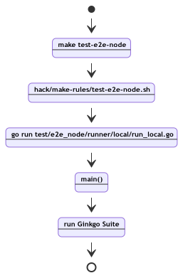
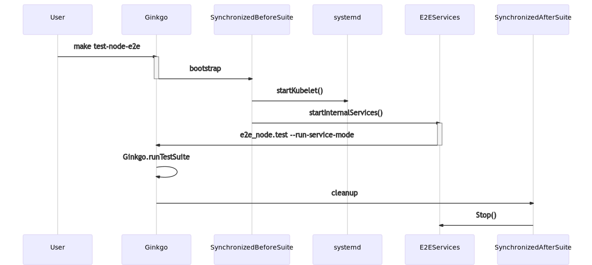

# Node End-To-End (e2e) Code Documentation

Kubernetes end-to-end (e2e) tests, at their core, work by compiling test code and creating an executable.
The executable, in a way, is very much like any other application: it performs some tasks (it runs e2e tests) and to
run it needs a Kubernetes cluster or a machine to run on.

Normal Kubernetes e2e tests require an entire cluster. The cluster is created during each CI run by prow and some
other [test infra](https://github.com/kubernetes/test-infra) components.

Node e2e tests differ from regular e2e tests in the fact that node e2e tests aim only to test the node component
of Kubernetes, the kubelet. In this scenario, the infrastructure needed is a kubelet, an API server
(since it is the managing component of Kubernetes), and an ETCD server for the API server.

Because of this difference in infrastructure and environment needs, we had to create a test suite that would
allow us to automate the management of the needed components during test runs and to allow
contributors to work on developing tests.

The two core goals of the node test suite are to 1.) run e2e tests that verify the kubelet is working
during CI test runs and 2.) to allow contributors to develop and iterate on tests outside of CI easily.

- *Goal #1* is implemented in the all too familiar way by compiling test code and using ginkgo to implement
an entrypoint that will hand down control from the caller of the binary to ginkgo itself, which in turn manages
what e2e tests to run and how.

- *Goal #2* is done by offering two entry points into the node test suite: a local and a remote runner. 
The local runner executes the node test suite in the machine in which it is called. 
The remote runner executes the node test suite in a remote machine (it currently only has an integration with GCP).

## Running node tests

As we already mentioned, node e2e tests can be executed locally or remotely (in a GCE VM). 
In either case, in order to run e2e tests we will make use of a couple of utility scripts and programs 
that exist in Kubernetes.

One of the tools we will use the most is the [Makefile](https://github.com/kubernetes/kubernetes/blob/master/build/root/Makefile) 
that is found at the root of the k/k repository. 
 
In order to run node e2e tests, we will focus on the Makefile 
[test-e2e-node](https://github.com/kubernetes/kubernetes/blob/master/build/root/Makefile#L264-L270) target.


### Local Runner

This is a compilation of notes on how to run E2E locally. Here will come the dissection of the
steps that Make goes until Ginkgo runs the tests throughout the Kubernetes E2E framework.
The first step to run the test in a local machine it should be:

```
make test-e2e-node
```` 

The test-e2e-node target can take a variety of arguments, to show them all you can print a help
message by running:

```
make test-e2e-node PRINT_HELP=y
```

When running the make target without the helper option, the following shell script is called:
*hack/make-rules/test-e2e-node.sh*, with the arguments from the target. 

Some other prerequisites targets exist ginkgo, which builds the Ginkgo binary and generated_files, 
collecting all generated files sets into a single rule. 
(**gen_deepcopy**, **gen_defaulter**, **gen_conversion**, **gen_openapi**, etc.)

There are two kinds of runners for the E2E tests, the first analyzed here is the local runner, 
it uses the machine to build and run the tests, the other is the remote mode used in the CI. 

The header of the shell script will set the internal variables and check if *REMOTE=true*
is passed as an argument, otherwise, the make target will run the local runner with some 
translations and defaulting in the arguments not inserted. 

The entrypoint for the local runner is the file: *test/e2e_node/runner/local/run_local.go*:

```bash
if [ "${remote}" = true ] ; then
  ...
else
  # Test using the host the script was run on
  # Provided for backwards compatibility
  go run test/e2e_node/runner/local/run_local.go \
   --system-spec-name="${system_spec_name}" --extra-envs="${extra_envs}" \
   --ginkgo-flags="${ginkgoflags}" --test-flags="--container-runtime=${runtime} \
   --alsologtostderr --v 4 --report-dir=${artifacts} --node-name $(hostname) \
   ${test_args}" --build-dependencies=true 2>&1 | tee -i "${artifacts}/build-log.txt"
fi
```

On *run_local.go*, The first step is to build the targets used to run the tests (*builder.BuildGo()*), 
including the entire suite via Ginkgo pre-compilation, this is made with the flag *--build-dependencies=true*: 

```go
var buildTargets = []string{
    "cmd/kubelet",
    "test/e2e_node/e2e_node.test",
    "vendor/github.com/onsi/ginkgo/ginkgo",
    "cluster/gce/gci/mounter",
}

targets := strings.Join(buildTargets, "")
exec.Command("make", "-C", KUBEROOT, fmt.Sprintf("WHAT=%s", targets)
```

Since you will have the pre-compiled suite of tests in the *_output/local/go/bin/e2e_node.test*, 
and they can be invoked manually, the tool executes as a second step the runCommand, 
using Ginkgo to bootstrap the suite of tests and the binaries necessary to run it:

```bash
$KUBEROOT/_output/local/go/bin/ginkgo  -nodes=8 \
  -skip="\[Flaky\]|\[Slow\]|\[Serial\]"
  -untilItFails=false    
  $KUBEROOT/_output/local/go/bin/e2e_node.test --
    --container-runtime=docker
    --alsologtostderr --v 4
    --report-dir=/tmp/_artifacts/200719T231746 
    --node-name raspberrypi     
    --kubelet-flags="--container-runtime=docker"
    --kubelet-flags="--network-plugin= --cni-bin-dir="
```

Here is the flow we have from the Makefile target (test-e2e-node) 
until the actual run of the ginkgo script suite.



### Starting Ginkgo

A simple sequence diagram represents the run spec flow:



The entry point for the system is *test/e2e_node/e2e_node_suite_test.go*, where it executes *init()*
and *AddFileSource* registering providers for files that maybe be needed at runtime,
after *TestMain* is called to register the flags and start Ginkgo setup.

The second phase is the **TestE2eNode**, which bootstrap the tests and the following modes can be used:
 
```go
var runServicesMode = flag.Bool("run-services-mode", false, "If true, only run services (etcd, apiserver) in current process, and not run test.")
var runKubeletMode = flag.Bool("run-kubelet-mode", false, "If true, only start kubelet, and not run test.")
var systemValidateMode = flag.Bool("system-validate-mode", false, "If true, only run system validation in current process, and not run test.")
```

If no mode is used the test suite is executed, first a new *Fail handler* is registered, and then the 
specs are started with a custom Junit format. Otherwise, the flags will control the startup of the
cluster components.
 
```go
if *runServicesMode { RunE2EService(); return }
if *runKubeletMode { RunKubelet(); return }
if *systemValidateMode { ValidateSpec(); return }
```

### ginkgo.SynchronizedBeforeSuide 

The first inner call is a Ginkgo helper function called before running the entire suite.

It starts with *validateSystem()*, this call the binary again with the *--system-validate-mode* flag, 
validating some system characteristics required to run (docker, OS-level, etc. the library is on k8s.io/system-validators).

In the sequence, if the option exist in the configuration, the images used in the tests are 
pre-pulled and must exist in the system, the list is on *NodePrePullImageList*. 
PrePullImages make sure the list is downloaded via *puller.Pull()* (can be docker or remote).

Finally, we have a crucial part that starts the required background services to run the test suite.
 
```go
if *startServices {
 e2es = services.NewE2EServices(*stopServices)
 e2es.Start()
}

waitForNodeReady()
```

### Services

The files on *test/e2e_node/services* manages the e2e services in a separated process.

*E2EServices.Start()* brings Kubelet in the background if the framework is not running as NodeConformance,
and *startInternalServices* calls the test binary with the flag *--run-services-mode*.

When running in service-mode it starts *test/e2e_node/services/internal_services.go:46:run*, which brings etcd, 
APIserver and starts a namespace controller.
 
```go
klog.Info("Starting e2e services...")

err := es.startEtcd(t)
if err != nil {
 return err
}

err = es.startAPIServer(es.etcdStorage)
if err != nil {
 return err
}

err = es.startNamespaceController()
if err != nil {
 return nil
}

klog.Info("E2E services started.")
return nil
```