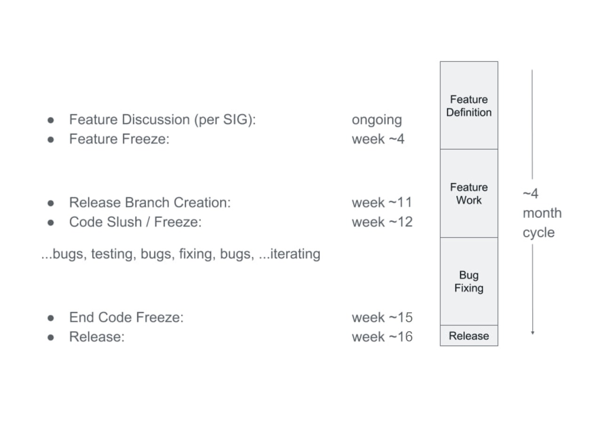

# Targeting enhancements, Issues and PRs to Release Milestones

This document is focused on Kubernetes developers and contributors who need to
create an enhancement, issue, or pull request which targets a specific release
milestone.

- [TL;DR](#tldr)
  - [Normal Dev (Weeks 1-11)](#normal-dev-weeks-1-11)
  - [Code Freeze (Weeks 12-14)](#code-freeze-weeks-12-14)
  - [Post-Release (Weeks 14+)](#post-release-weeks-14+)
- [Definitions](#definitions)
- [The Release Cycle](#the-release-cycle)
- [Removal Of Items From The Milestone](#removal-of-items-from-the-milestone)
- [Adding An Item To The Milestone](#adding-an-item-to-the-milestone)
  - [Milestone Maintainers](#milestone-maintainers)
  - [Feature additions](#feature-additions)
  - [Issue additions](#issue-additions)
  - [PR Additions](#pr-additions)
- [Other Required Labels](#other-required-labels)
  - [SIG Owner Label](#sig-owner-label)
  - [Priority Label](#priority-label)
  - [Issue/PR Kind Label](#issuepr-kind-label)

The process for shepherding enhancements, issues, and pull requests into a
Kubernetes release spans multiple stakeholders:

- the enhancement, issue, and pull request owner(s)
- SIG leadership
- the [Release Team][release-team]

Information on workflows and interactions are described below.

As the owner of an enhancement, issue, or pull request (PR), it is your
responsibility to ensure release milestone requirements are met. Automation and
the Release Team will be in contact with you if updates are required, but
inaction can result in your work being removed from the milestone. Additional
requirements exist when the target milestone is a prior release (see
[cherry pick process][cherry-picks] for more information).

## TL;DR

If you want your PR to get merged, it needs the following required labels and
milestones, represented here by the Prow /commands it would take to add them:

### Normal Dev (Weeks 1-11)

- /sig {name}
- /kind {type}
- /lgtm
- /approved

### [Code Freeze][code-freeze] (Weeks 12-14)

- /milestone {v1.y}
- /sig {name}
- /kind {bug, failing-test}
- /lgtm
- /approved

### Post-Release (Weeks 14+)

Return to 'Normal Dev' phase requirements:

- /sig {name}
- /kind {type}
- /lgtm
- /approved

Merges into the 1.y branch are now [via cherry picks][cherry-picks], approved
by [Release Managers][release-managers].

In the past, there was a requirement for a milestone-targeted pull requests to
have an associated GitHub issue opened, but this is no longer the case.
Features or enhancements are effectively GitHub issues or [KEPs][keps] which
lead to subsequent PRs.

The general labeling process should be consistent across artifact types.

## Definitions

- *issue owners*: Creator, assignees, and user who moved the issue into a
  release milestone

- *Release Team*: Each Kubernetes release has a team doing project management
  tasks described [here][release-team].

  The contact info for the team associated with any given release can be found
  [here](https://git.k8s.io/sig-release/releases/).

- *Y days*: Refers to business days

- *enhancement*: see "[Is My Thing an Enhancement?](https://git.k8s.io/enhancements/README.md#is-my-thing-an-enhancement)"

- *[Enhancements Freeze][enhancements-freeze]*:
  the deadline by which [KEPs][keps] have to be completed in order for
  enhancements to be part of the current release

- *[Exception Request][exceptions]*:
  The process of requesting an extension on the deadline for a particular
  Enhancement

- *[Code Freeze][code-freeze]*:
  The period of ~4 weeks before the final release date, during which only
  critical bug fixes are merged into the release.

- *[Pruning](https://git.k8s.io/sig-release/releases/release_phases.md#pruning)*:
  The process of removing an Enhancement from a release milestone if it is not
  fully implemented or is otherwise considered not stable.

- *release milestone*: semantic version string or
  [GitHub milestone](https://help.github.com/en/github/managing-your-work-on-github/associating-milestones-with-issues-and-pull-requests)
  referring to a release MAJOR.MINOR `vX.Y` version.

  See also
  [release versioning](https://git.k8s.io/sig-release/release-engineering/versioning.md).

- *release branch*: Git branch `release-X.Y` created for the `vX.Y` milestone.

  Created at the time of the `vX.Y-rc.0` release and maintained after the
  release for approximately 12 months with `vX.Y.Z` patch releases.

  Note: releases 1.19 and newer receive 1 year of patch release support, and
  releases 1.18 and earlier received 9 months of patch release support.

## The Release Cycle

Kubernetes releases currently happen approximately three times per year.

The release process can be thought of as having three main phases:

- Enhancement Definition
- Implementation
- Stabilization

But in reality, this is an open source and agile project, with feature planning
and implementation happening at all times. Given the project scale and globally
distributed developer base, it is critical to project velocity to not rely on a
trailing stabilization phase and rather have continuous integration testing
which ensures the project is always stable so that individual commits can be
flagged as having broken something.

With ongoing feature definition through the year, some set of items will bubble
up as targeting a given release. **[Enhancements Freeze][enhancements-freeze]**
starts ~4 weeks into release cycle. By this point all intended feature work for
the given release has been defined in suitable planning artifacts in
conjunction with the Release Team's [Enhancements Lead](https://git.k8s.io/sig-release/release-team/role-handbooks/enhancements/README.md).

After Enhancements Freeze, tracking milestones on PRs and issues is important.
Items within the milestone are used as a punchdown list to complete the
release. *On issues*, milestones must be applied correctly, via triage by the
SIG, so that [Release Team][release-team] can track bugs and enhancements (any
enhancement-related issue needs a milestone).

There is some automation in place to help automatically assign milestones to
PRs.

This automation currently applies to the following repos:

- `kubernetes/enhancements`
- `kubernetes/kubernetes`
- `kubernetes/release`
- `kubernetes/sig-release`
- `kubernetes/test-infra`

At creation time, PRs against the `master` branch need humans to hint at which
milestone they might want the PR to target. Once merged, PRs against the
`master` branch have milestones auto-applied so from that time onward human
management of that PR's milestone is less necessary. On PRs against release
branches, milestones are auto-applied when the PR is created so no human
management of the milestone is ever necessary.

Any other effort that should be tracked by the Release Team that doesn't fall
under that automation umbrella should be have a milestone applied.

Implementation and bug fixing is ongoing across the cycle, but culminates in a
code freeze period.

**[Code Freeze][code-freeze]** starts in week ~12 and continues for ~2 weeks.
Only critical bug fixes are accepted into the release codebase during this
time.

There are approximately two weeks following Code Freeze, and preceding release,
during which all remaining critical issues must be resolved before release.
This also gives time for documentation finalization.

When the code base is sufficiently stable, the master branch re-opens for
general development and work begins there for the next release milestone. Any
remaining modifications for the current release are cherry picked from master
back to the release branch. The release is built from the release branch.

Each release is part of a broader Kubernetes lifecycle:

## Removal Of Items From The Milestone

Before getting too far into the process for adding an item to the milestone,
please note:

Members of the [Release Team][release-team] may remove issues from the
milestone if they or the responsible SIG determine that the issue is not
actually blocking the release and is unlikely to be resolved in a timely
fashion.

Members of the Release Team may remove PRs from the milestone for any of the
following, or similar, reasons:

- PR is potentially de-stabilizing and is not needed to resolve a blocking
  issue
- PR is a new, late feature PR and has not gone through the enhancements
  process or the [exception process][exceptions]
- There is no responsible SIG willing to take ownership of the PR and resolve
  any follow-up issues with it
- PR is not correctly labelled
- Work has visibly halted on the PR and delivery dates are uncertain or late

While members of the Release Team will help with labelling and contacting
SIG(s), it is the responsibility of the submitter to categorize PRs, and to
secure support from the relevant SIG to guarantee that any breakage caused by
the PR will be rapidly resolved.

Where additional action is required, an attempt at human to human escalation
will be made by the Release Team through the following channels:

- Comment in GitHub mentioning the SIG team and SIG members as appropriate for
  the issue type
- Emailing the SIG mailing list
  - bootstrapped with group email addresses from the
    [community sig list][sig-list]
  - optionally also directly addressing SIG leadership or other SIG members
- Messaging the SIG's Slack channel
  - bootstrapped with the slackchannel and SIG leadership from the
    [community sig list][sig-list]
  - optionally directly "@" mentioning SIG leadership or others by handle

## Adding An Item To The Milestone

### Milestone Maintainers

The members of the [`milestone-maintainers`](https://github.com/orgs/kubernetes/teams/milestone-maintainers/members)
GitHub team are entrusted with the responsibility of specifying the release
milestone on GitHub artifacts.

This group is [maintained](https://git.k8s.io/sig-release/release-team/README.md#milestone-maintainers)
by SIG Release and has representation from the various SIGs' leadership.

### Feature additions

Feature planning and definition takes many forms today, but a typical example
might be a large piece of work described in a [KEP][keps], with associated task
issues in GitHub. When the plan has reached an implementable state and work is
underway, the enhancement or parts thereof are targeted for an upcoming milestone
by creating GitHub issues and marking them with the Prow "/milestone" command.

For the first ~4 weeks into the release cycle, the Release Team's Enhancements
Lead will interact with SIGs and feature owners via GitHub, Slack, and SIG
meetings to capture all required planning artifacts.

If you have an enhancement to target for an upcoming release milestone, begin a
conversation with your SIG leadership and with that release's Enhancements
Lead.

### Issue additions

Issues are marked as targeting a milestone via the Prow "/milestone" command.

The Release Team's [Bug Triage Lead](https://git.k8s.io/sig-release/release-team/role-handbooks/bug-triage/README.md)
and overall community watch incoming issues and triage them, as described in
the contributor guide section on
[issue triage](/contributors/guide/issue-triage.md).

Marking issues with the milestone provides the community better visibility
regarding when an issue was observed and by when the community feels it must be
resolved. During [Code Freeze][code-freeze], a milestone must be set to merge
a PR.

An open issue is no longer required for a PR, but open issues and associated
PRs should have synchronized labels. For example a high priority bug issue
might not have its associated PR merged if the PR is only marked as lower
priority.

### PR Additions

PRs are marked as targeting a milestone via the Prow "/milestone" command.

This is a blocking requirement during Code Freeze as described above.

## Other Required Labels

[Here is the list of labels and their use and purpose.](https://git.k8s.io/test-infra/label_sync/labels.md#labels-that-apply-to-all-repos-for-both-issues-and-prs)

### SIG Owner Label

The SIG owner label defines the SIG to which we escalate if a milestone issue
is languishing or needs additional attention. If there are no updates after
escalation, the issue may be automatically removed from the milestone.

These are added with the Prow "/sig" command. For example to add the label
indicating SIG Storage is responsible, comment with `/sig storage`.

### Priority Label

Priority labels are used to determine an escalation path before moving issues
out of the release milestone. They are also used to determine whether or not a
release should be blocked on the resolution of the issue.

- `priority/critical-urgent`: Never automatically move out of a release
  milestone; continually escalate to contributor and SIG through all available
  channels.
  - considered a release blocking issue
  - requires daily updates from issue owners during [Code Freeze][code-freeze]
  - would require a patch release if left undiscovered until after the minor
    release
- `priority/important-soon`: Escalate to the issue owners and SIG owner; move
  out of milestone after several unsuccessful escalation attempts.
  - not considered a release blocking issue
  - would not require a patch release
  - will automatically be moved out of the release milestone at Code Freeze
    after a 4 day grace period
- `priority/important-longterm`: Escalate to the issue owners; move out of the
  milestone after 1 attempt.
  - even less urgent / critical than `priority/important-soon`
  - moved out of milestone more aggressively than `priority/important-soon`

### Issue/PR Kind Label

The issue kind is used to help identify the types of changes going into the
release over time. This may allow the Release Team to develop a better
understanding of what sorts of issues we would miss with a faster release
cadence.

For release targeted issues, including pull requests, one of the following
issue kind labels must be set:

- `kind/api-change`: Adds, removes, or changes an API
- `kind/bug`: Fixes a newly discovered bug.
- `kind/cleanup`: Adding tests, refactoring, fixing old bugs.
- `kind/design`: Related to design
- `kind/documentation`: Adds documentation
- `kind/failing-test`: CI test case is failing consistently.
- `kind/feature`: New functionality.
- `kind/flake`: CI test case is showing intermittent failures.

[cherry-picks]: /contributors/devel/sig-release/cherry-picks.md
[code-freeze]: https://git.k8s.io/sig-release/releases/release_phases.md#code-freeze
[enhancements-freeze]: https://git.k8s.io/sig-release/releases/release_phases.md#enhancements-freeze
[exceptions]: https://git.k8s.io/sig-release/releases/release_phases.md#exceptions
[keps]: https://git.k8s.io/enhancements/keps
[release-managers]: https://kubernetes.io/releases/release-managers/
[release-team]: https://git.k8s.io/sig-release/release-team
[sig-list]: /sig-list.md
