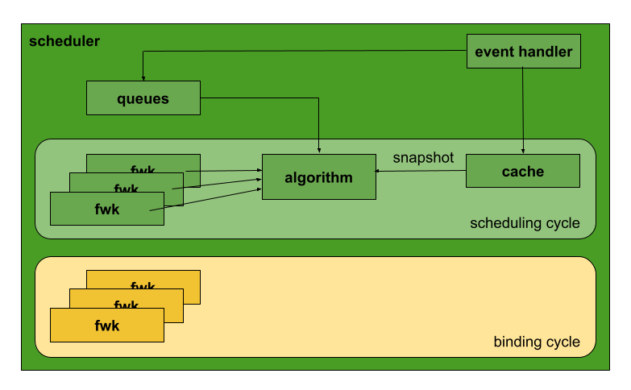

# Scheduler code hierarchy overview

## Introduction

The scheduler watches for newly created Pods that have no Node assigned.
For every Pod that the scheduler discovers, the scheduler becomes responsible
for finding the best Node for that Pod to run on.
Scheduling in general is quite an extensive field in computer science which takes
into account various range of constraints and limitations.
Each workload may require a different approach to achieve optimal scheduling results.
The kube-scheduler provided by Kubernetes project was constructed with a goal
to provide high throughput at the cost of being simple.
To help in building a scheduler (the default or a custom one) and to share
elements of the scheduling logic,
[the scheduling framework](https://kubernetes.io/docs/concepts/scheduling-eviction/scheduling-framework/)
was implemented.
The framework does not provide all pieces to build a new scheduler from scratch.
Queues, caches, scheduling algorithms and other building elements are still needed to assemble
a fully functional unit. This document aims at describing how all the individual
pieces are put together and what’s their role in the overall architecture
so a developer can quickly orient in the code.

## Scheduling a pod

The default scheduler instance has a loop running indefinitely
which (everytime there’s a pod) is responsible for invoking the scheduling logic
and making sure a pod gets either a node assigned or requeued for future processing.
Each loop consists of a blocking scheduling and a non-blocking binding cycle.
The scheduling cycle is responsible for running the scheduling algorithm selecting
the most suitable node for placing the pod.
The binding cycle makes sure the kube-apiserver is made aware of the selected
node at the right time. A pod may be bound immediately, or in the case of gang scheduling,
wait until all its sibling pods have their node assigned.

### Scheduling cycle

Each cycle honors the following steps:
1. Get the next pod for scheduling
1. Schedule a pod with provided algorithm
1. If a pod fails to be scheduled due to `FitError`, run preemption plugin in
   `PostFilterPlugin` (if the plugin is registered) to nominate a node where
   the pods can run. If preemption was successful,
   let the current pod be aware of the nominated node.
   Handle the error, get the next pod and start over.
1. If the scheduling algorithm finds a suitable node, store the pod into
   the scheduler cache (`AssumePod` operation) and run plugins from the `Reserve`
   and `Permit` extension point in that order. In case any of the plugins fails,
   end the current scheduling cycle, increase relevant metrics and handle
   the scheduling error through the `Error` handler.
1. Upon successfully running all extension points, proceed to the binding cycle.
   At the same time start processing another pod (if there’s any).

### Binding cycle

Consists of the following four steps ran in the same order:
- Invoking [WaitOnPermit](https://github.com/kubernetes/kubernetes/blob/a651804427dd9a15bb91e1c4fb7a79994e4817a2/pkg/scheduler/scheduler.go#L560)
  (internal API) of plugins from `Permit` extension point. Some plugins from the extension point
  may send a request for an operation requiring to wait for a condition
  (e.g. wait for additional resources to be available or wait for all pods
  in a gang to be assumed).
  Under the hood, `WaitOnPermit` waits for such a condition to be met within a timeout threshold.
- Invoking plugins from [PreBind](https://github.com/kubernetes/kubernetes/blob/a651804427dd9a15bb91e1c4fb7a79994e4817a2/pkg/scheduler/scheduler.go#L580) extension point
- Invoking plugins from [Bind](https://github.com/kubernetes/kubernetes/blob/a651804427dd9a15bb91e1c4fb7a79994e4817a2/pkg/scheduler/scheduler.go#L592) extension point
- Invoking plugins from [PostBind](https://github.com/kubernetes/kubernetes/blob/a651804427dd9a15bb91e1c4fb7a79994e4817a2/pkg/scheduler/scheduler.go#L611) extension point

In case of processing of any of the extension points fails, `Unreserve` operation
of all `Reserve` plugins is invoked (e.g. free resources allocated for a gang of pods).

## Configuring and assembling the scheduler

The scheduler codebase spans across various locations. Last but not least to mention:
- [cmd/kube-scheduler/app](https://github.com/kubernetes/kubernetes/tree/a651804427dd9a15bb91e1c4fb7a79994e4817a2/cmd/kube-scheduler/app):
  location of the controller code alongside definition of CLI arguments (honors the standard setup for all Kubernetes controllers)
- [pkg/scheduler](https://github.com/kubernetes/kubernetes/tree/a651804427dd9a15bb91e1c4fb7a79994e4817a2/pkg/scheduler):
  the default scheduler codebase root directory
- [pkg/scheduler/core](https://github.com/kubernetes/kubernetes/tree/a651804427dd9a15bb91e1c4fb7a79994e4817a2/pkg/scheduler/core):
  location of the default scheduling algorithm
- [pkg/scheduler/framework](https://github.com/kubernetes/kubernetes/tree/a651804427dd9a15bb91e1c4fb7a79994e4817a2/pkg/scheduler/framework):
  scheduling framework alongside plugins
- [pkg/scheduler/internal](https://github.com/kubernetes/kubernetes/tree/a651804427dd9a15bb91e1c4fb7a79994e4817a2/pkg/scheduler/internal):
  implementation of the cache, queues and other internal elements
- [staging/src/k8s.io/kube-scheduler](https://github.com/kubernetes/kubernetes/tree/a651804427dd9a15bb91e1c4fb7a79994e4817a2/staging/src/k8s.io/kube-scheduler):
  location of ComponentConfig API types
- [test/e2e/scheduling](https://github.com/kubernetes/kubernetes/tree/a651804427dd9a15bb91e1c4fb7a79994e4817a2/test/e2e/scheduling):
  scheduling e2e
- [test/integration/scheduler](https://github.com/kubernetes/kubernetes/tree/a651804427dd9a15bb91e1c4fb7a79994e4817a2/test/integration/scheduler)
  scheduling integration tests
- [test/integration/scheduler_perf](https://github.com/kubernetes/kubernetes/tree/a651804427dd9a15bb91e1c4fb7a79994e4817a2/test/integration/scheduler_perf)
  scheduling performance benchmarks

### Initial startup configuration

Code under `cmd/kube-scheduler/app` is responsible for collecting scheduler
configuration and initializing logic allowing the kube-scheduler to run
as part of the Kubernetes control plane. The code includes:
- Initializing [command line options](https://github.com/kubernetes/kubernetes/blob/a651804427dd9a15bb91e1c4fb7a79994e4817a2/cmd/kube-scheduler/app/server.go#L96)
  (along with a default `ComponentConfig`) and [validation](https://github.com/kubernetes/kubernetes/blob/a651804427dd9a15bb91e1c4fb7a79994e4817a2/cmd/kube-scheduler/app/server.go#L300)
- Initializing [metrics](https://github.com/kubernetes/kubernetes/blob/a651804427dd9a15bb91e1c4fb7a79994e4817a2/cmd/kube-scheduler/app/server.go#L238)
  (`/metrics`), [health check](https://github.com/kubernetes/kubernetes/blob/a651804427dd9a15bb91e1c4fb7a79994e4817a2/cmd/kube-scheduler/app/server.go#L268)
  (`/healthz`) and [other handlers](https://github.com/kubernetes/kubernetes/blob/a651804427dd9a15bb91e1c4fb7a79994e4817a2/cmd/kube-scheduler/app/server.go#L225-L236)
  (authorization, authentication, panic recovery, etc.)
- Reading and defaulting configuration of [KubeSchedulerConfiguration](https://github.com/kubernetes/kubernetes/blob/4740173f3378ef9d0dc59b0aa9299444a97d0818/pkg/scheduler/apis/config/types.go#L49-L106)
- Building a registry with plugins (in-tree, [out-of-tree](https://github.com/kubernetes/kubernetes/blob/a651804427dd9a15bb91e1c4fb7a79994e4817a2/cmd/kube-scheduler/app/server.go#L312-L317))
- Initializing the scheduler with various options such as [profiles, algorithm source, pod back off, etc.](https://github.com/kubernetes/kubernetes/blob/a651804427dd9a15bb91e1c4fb7a79994e4817a2/cmd/kube-scheduler/app/server.go#L326-L337)
- Invocation of [LogOrWriteConfig](https://github.com/kubernetes/kubernetes/blob/a651804427dd9a15bb91e1c4fb7a79994e4817a2/cmd/kube-scheduler/app/server.go#L342) which logs the final scheduler configuration for debugging purposes
- Right before running, `/configz` [is registered](https://github.com/kubernetes/kubernetes/blob/a651804427dd9a15bb91e1c4fb7a79994e4817a2/cmd/kube-scheduler/app/server.go#L141),
  [events broadcaster started](https://github.com/kubernetes/kubernetes/blob/a651804427dd9a15bb91e1c4fb7a79994e4817a2/cmd/kube-scheduler/app/server.go#L148),
  [leader election initiated](https://github.com/kubernetes/kubernetes/blob/a651804427dd9a15bb91e1c4fb7a79994e4817a2/cmd/kube-scheduler/app/server.go#L198-L216),
   and [the server](https://github.com/kubernetes/kubernetes/blob/a651804427dd9a15bb91e1c4fb7a79994e4817a2/cmd/kube-scheduler/app/server.go#L185)
   with all the configured handlers and [informers](https://github.com/kubernetes/kubernetes/blob/a651804427dd9a15bb91e1c4fb7a79994e4817a2/cmd/kube-scheduler/app/server.go#L192)
   is started.

Once initialized, the scheduler can run.

In more detail, there’s a [Setup](https://github.com/kubernetes/kubernetes/blob/a651804427dd9a15bb91e1c4fb7a79994e4817a2/cmd/kube-scheduler/app/server.go#L299)
function accomplishing what is essentially
the initialization of the scheduler’s core process.
First, it validates the options that have been passed through (the flags added
in `NewSchedulerCommand()` are set directly on this options struct’s fields).
If the options passed so far don’t raise any errors, it then calls `opts.Config()`
which sets up the final internal settings including secure serving, leader election,
clients, and begins parsing options related to the algorithm source
(like loading config files and initializing empty profiles as well as handling
deprecated options like policy config). The next lines call `c.Complete()` to complete
the config by filling in any empty values. At this point any out-of-tree plugins
are registered by creating a blank registry and adding entries in that registry
for each plugin’s New function. It should be noted that the Registry is simply
a map of plugin names to their factory functions. For the default scheduler,
this step does nothing (because our main function in `cmd/kube-scheduler/scheduler.go`
passes nothing to `NewSchedulerCommand()`).
This means the default set of plugins is initialized in `scheduler.New()`.

Given the initialization is performed outside the scheduling framework,
different consumers of the framework can initialize the environment differently
to cover their needs. For example, a simulator can inject its own object
through informers. Or custom plugins may be provided instead of the default ones.
Known consumers of the scheduling framework:
- [cluster-autoscaler](https://github.com/kubernetes/autoscaler/blob/master/cluster-autoscaler/simulator/scheduler_based_predicates_checker.go#L48-L79)
- [cluster-capacity](https://github.com/kubernetes-sigs/cluster-capacity/blob/8e9c2dcf3644cb5f73fca3d35d4e22899c265ad5/pkg/framework/simulator.go#L370-L383)

### Assembling the scheduler

The code is located under `pkg/scheduler`.
This is where implementation of the default scheduler lives.
Various elements of the scheduler are initialized and put together here:
- Default scheduling options such as node percentage, initial and maximum backoff, profiles
- Scheduler cache and queues
- Scheduling profiles instantiated to tailor a framework for each profile
  to better suit pod placement (each profile defines a set of plugins to use)
- Handler functions for getting the next pod for scheduling (`NextPod`) and error handling (`Error`)

The following steps are taken during the process of creating a scheduler instance:
- Scheduler [cache is initialized](https://github.com/kubernetes/kubernetes/blob/a651804427dd9a15bb91e1c4fb7a79994e4817a2/pkg/scheduler/scheduler.go#L206)
- Both in-tree and out-of-tree registries with plugins are [merged together](https://github.com/kubernetes/kubernetes/blob/a651804427dd9a15bb91e1c4fb7a79994e4817a2/pkg/scheduler/scheduler.go#L208-L211)
- Metrics are [registered](https://github.com/kubernetes/kubernetes/blob/a651804427dd9a15bb91e1c4fb7a79994e4817a2/pkg/scheduler/scheduler.go#L232)
- [Configurator](https://github.com/kubernetes/kubernetes/blob/a651804427dd9a15bb91e1c4fb7a79994e4817a2/pkg/scheduler/scheduler.go#L215-L230)
  building a scheduler instance (wiring the cache, plugin registry,
  scheduling algorithm and other elements together)
- Event handlers [are registered](https://github.com/kubernetes/kubernetes/blob/a651804427dd9a15bb91e1c4fb7a79994e4817a2/pkg/scheduler/scheduler.go#L273)
  to allow the scheduler to react on changes in PVs,
  PVCs, services and other objects relevant for scheduling (eventually,
  each plugin will define a set of events on which it reacts,
  see [kubernetes/kubernetes#100347](https://github.com/kubernetes/kubernetes/issues/100347)
  for more details).

The following diagram shows how individual elements are connected together
once initialized. Event handlers make sure pods are properly enqueued
in the [scheduling queues](https://github.com/kubernetes/community/blob/master/contributors/devel/sig-scheduling/scheduler_queues.md),
the cache is updated with pods and nodes
as they go (to provide up-to-date snapshot). Scheduling algorithm and the binding cycle
have the right instances of the framework available (one instance of the framework per a profile).

#### Scheduling framework

Its code is currently located under `pkg/scheduler/framework`.
It contains [various plugins](https://github.com/kubernetes/kubernetes/tree/a651804427dd9a15bb91e1c4fb7a79994e4817a2/pkg/scheduler/framework/plugins)
responsible for filtering and scoring nodes (among others).
Used as building blocks for any scheduling algorithm.

When a [plugin is initialized](https://github.com/kubernetes/kubernetes/blob/4740173f3378ef9d0dc59b0aa9299444a97d0818/pkg/scheduler/framework/runtime/framework.go#L310),
it’s passed a [framework handler](https://github.com/kubernetes/kubernetes/blob/4740173f3378ef9d0dc59b0aa9299444a97d0818/pkg/scheduler/framework/runtime/framework.go#L251-L264)
which provides interfaces to access and/or manipulate pods, nodes, clientset,
event recorder and other handlers every plugin needs to implement its functionality.

#### Scheduler cache

Cache is responsible for capturing the current state of a cluster.
Keeping a list of nodes and assumed pods alongside states of pods and images.
The cache provides methods for reconciling pod and node objects
(invoked through event handlers) keeping the state of the cluster up to date.
Allowing to update the snapshot of a cluster (to pin the cluster state while a scheduling
algorithm is run) with the latest state at the beginning of each scheduling cycle.

The cache also allows to run assume operation which temporarily stores a pod
in the cache and makes it look as the pod is actually already
running on a designated node for all consumers of the snapshot.
Assume operation exists to remove the time the pod actually gets updated
on the kube-apiserver side and thus increasing the scheduler’s throughput.
The following operations manipulate with the assumed pods:
- `AssumePod`: to signal the scheduling algorithm found a feasible node so the next
  pod can be attempted while the current pod enters the binding cycle
- `FinishBinding`: used to signal Bind finished so the pod can be removed
  from the list of assumed pods
- `ForgetPod`: removes pod from the list of assumed pods, used in case the pod
  fails to get processed in the binding cycle successfully
  (e.g. during `Reserve`, `Permit`, `PreBind` or `Bind` evaluation)

The cache keeps track of the following three metrics:
- `scheduler_cache_size_assumed_pods`: number of pods in the assume pods list
- `scheduler_cache_size_pods`: number of pods in the cache
- `scheduler_cache_size_nodes`: number of nodes in the cache

#### Snapshot

The [snapshot](https://github.com/kubernetes/kubernetes/blob/a651804427dd9a15bb91e1c4fb7a79994e4817a2/pkg/scheduler/internal/cache/snapshot.go)
captures the state of a cluster carrying information about all nodes
in a cluster and objects located on each node.
Namely node objects, pods assigned on each node, requested resources of all pods
on each node, node’s allocatable, images pulled and other information needed
to make a scheduling decision. Every time a pod is scheduled,
a snapshot of the current state of the cluster is captured.
To avoid a case where a pod or node gets changed while plugins are processed
which might lead to data inconsistency as some plugins might get a different
view of the cluster.

#### Configurator

A [configurator](https://github.com/kubernetes/kubernetes/blob/a651804427dd9a15bb91e1c4fb7a79994e4817a2/pkg/scheduler/factory.go#L90)
builds the scheduler instance by wiring plugins, cache, queues,
handlers and other elements together. Each profile [is initialized](https://github.com/kubernetes/kubernetes/blob/a651804427dd9a15bb91e1c4fb7a79994e4817a2/pkg/scheduler/factory.go#L138-L147)
with its own framework (with all frameworks sharing informers, event recorders, etc.).

At this point it’s still possible to have the configurator create the instance
[from a policy file](https://github.com/kubernetes/kubernetes/blob/a651804427dd9a15bb91e1c4fb7a79994e4817a2/pkg/scheduler/factory.go#L213).
Though, this approach is deprecated and will be removed
from the configuration eventually. Keeping only the kube scheduler configuration
as the only way to provide the configuration.

#### Default scheduling algorithm

The codebase defines a [ScheduleAlgorithm](https://github.com/kubernetes/kubernetes/blob/a651804427dd9a15bb91e1c4fb7a79994e4817a2/pkg/scheduler/core/generic_scheduler.go#L61-L66)
interface.
Any implementation of the interface can be used as a scheduling algorithm.
There are two methods:
- `Schedule`: responsible for scheduling a pod using plugins from `PreFilter`
  up to `NormalizeScore` extension points, provides [ScheduleResult](https://github.com/kubernetes/kubernetes/blob/a651804427dd9a15bb91e1c4fb7a79994e4817a2/pkg/scheduler/core/generic_scheduler.go#L70-L77)
  containing a scheduling decision (the most suitable nodes) with additional
  accompanying information such as how many nodes were evaluated
  and how many nodes were found feasible for scheduling.
- `Extenders`: currently exposed only for testing

Each cycle of the default algorithm implementation consists of:
1. Taking the [current snapshot](https://github.com/kubernetes/kubernetes/blob/a651804427dd9a15bb91e1c4fb7a79994e4817a2/pkg/scheduler/core/generic_scheduler.go#L101)
   from the scheduling cache
1. [Filter out all nodes](https://github.com/kubernetes/kubernetes/blob/a651804427dd9a15bb91e1c4fb7a79994e4817a2/pkg/scheduler/core/generic_scheduler.go#L110)
   not feasible for scheduling a pod
   1. Run [PreFilter plugins](https://github.com/kubernetes/kubernetes/blob/a651804427dd9a15bb91e1c4fb7a79994e4817a2/pkg/scheduler/core/generic_scheduler.go#L230)
      first (preprocessing phase, e.g. computing pod [anti-]affinity relations)
   1. Run [Filter plugins](https://github.com/kubernetes/kubernetes/blob/a651804427dd9a15bb91e1c4fb7a79994e4817a2/pkg/scheduler/core/generic_scheduler.go#L261) in parallel:
      filter out all nodes which does not satisfy pod’s constraints
      (e.g. sufficient resources, node affinity, etc.), including running filter extenders
   1. Run [PostFilter plugins](https://github.com/kubernetes/kubernetes/blob/a651804427dd9a15bb91e1c4fb7a79994e4817a2/pkg/scheduler/scheduler.go#L479)
      if no node can fit the incoming pod
1. In case there are at least two feasible nodes for scheduling, run [scoring plugins](https://github.com/kubernetes/kubernetes/blob/a651804427dd9a15bb91e1c4fb7a79994e4817a2/pkg/scheduler/core/generic_scheduler.go#L133):
   1. Run [PreScore plugins](https://github.com/kubernetes/kubernetes/blob/a651804427dd9a15bb91e1c4fb7a79994e4817a2/pkg/scheduler/core/generic_scheduler.go#L427)
      first (preprocessing phase)
   1. Run [Score plugins](https://github.com/kubernetes/kubernetes/blob/a651804427dd9a15bb91e1c4fb7a79994e4817a2/pkg/scheduler/core/generic_scheduler.go#L433) in parallel:
      each node is given a score vector (each coordinate corresponding to one plugin)
   1. Run [NormalizeScore plugins](https://github.com/kubernetes/kubernetes/blob/a651804427dd9a15bb91e1c4fb7a79994e4817a2/pkg/scheduler/framework/runtime/framework.go#L798):
      to have all plugins given a score in <0; 100> interval
   1. Compute [weighted score](https://github.com/kubernetes/kubernetes/blob/a651804427dd9a15bb91e1c4fb7a79994e4817a2/pkg/scheduler/framework/runtime/framework.go#L810-L828)
      for each node (each score plugin can have
      a weight assigned indicating how much its score is preferred over others)
   1. Run [score extenders](https://github.com/kubernetes/kubernetes/blob/a651804427dd9a15bb91e1c4fb7a79994e4817a2/pkg/scheduler/core/generic_scheduler.go#L456)
      and add it to the total score of each node
1. [Select](https://github.com/kubernetes/kubernetes/blob/a651804427dd9a15bb91e1c4fb7a79994e4817a2/pkg/scheduler/core/generic_scheduler.go#L138)
   and [give back a node](https://github.com/kubernetes/kubernetes/blob/a651804427dd9a15bb91e1c4fb7a79994e4817a2/pkg/scheduler/core/generic_scheduler.go#L141-L145)
   with the highest score. If there’s only a [single feasible node](https://github.com/kubernetes/kubernetes/blob/a651804427dd9a15bb91e1c4fb7a79994e4817a2/pkg/scheduler/core/generic_scheduler.go#L125-L131)
   skip `PreScore`, `Score` and `NormalizeScore` extension points
   and give back the node right away. If there’s no feasible node, report it.

Be aware of:
- If a plugin provides score normalization, it needs to return non-nil
when [ScoreExtensions()](https://github.com/kubernetes/kubernetes/blob/a651804427dd9a15bb91e1c4fb7a79994e4817a2/pkg/scheduler/framework/plugins/podtopologyspread/scoring.go#L254-L256) gets invoked
