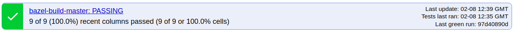
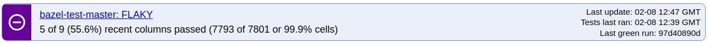
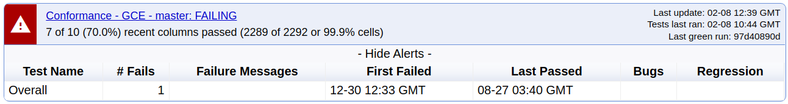
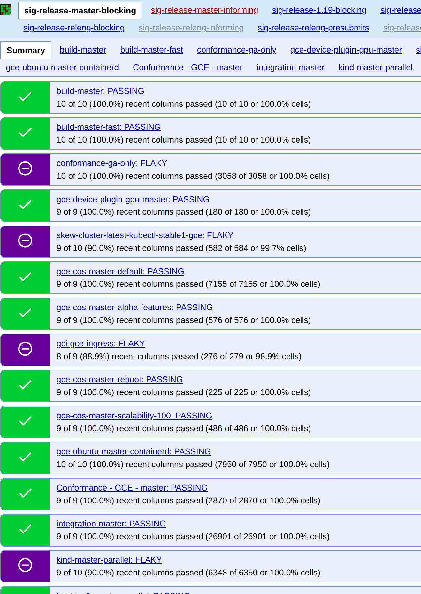
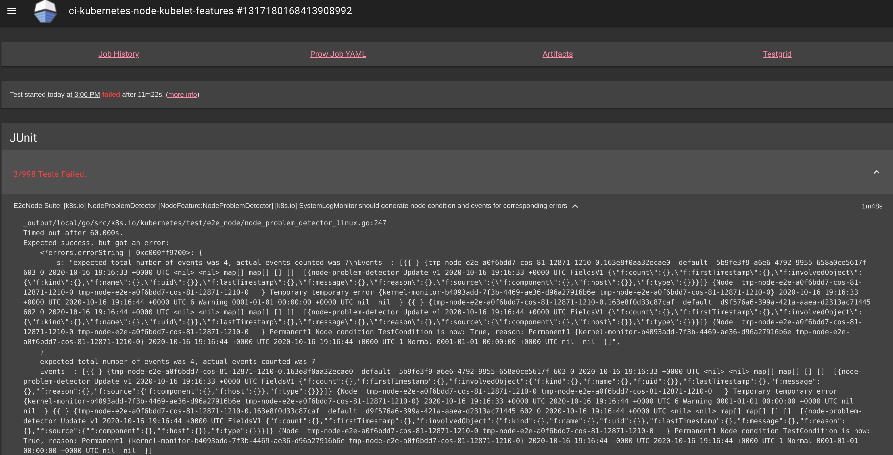
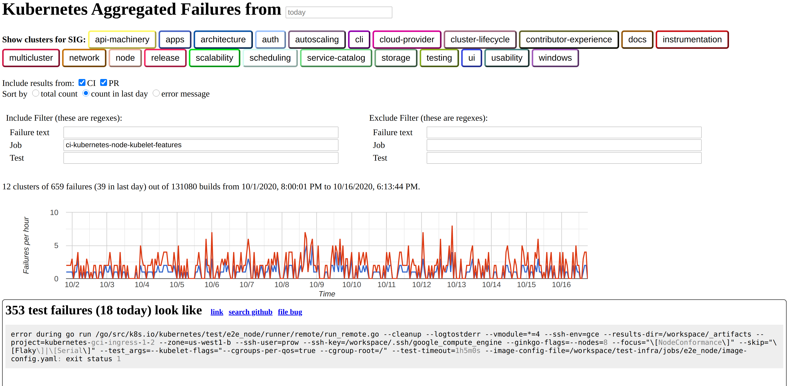

## Monitoring Kubernetes Health

### Table of Contents

- [Monitoring the health of Kubernetes with TestGrid](#monitoring-the-health-of-kubernetes-with-testgrid)
- [What dashboards should I monitor?](#what-dashboards-should-i-monitor)
- [Test failures that block my Pull Request](#pr-test-failures)
- [What do I do when I see a TestGrid alert?](#what-do-i-do-when-i-see-a-testgrid-alert)
- [Communicate your findings](#communicate-your-findings)
- [Fill out the issue](#fill-out-the-issue)
- [Iterate](#iterate)

## Overview

This document describes the tools used to monitor CI jobs that check the
correctness of changes made to core Kubernetes.

## Monitoring the health of Kubernetes CI Jobs with TestGrid

TestGrid is a highly-configurable, interactive dashboard for viewing your test
results in a grid. TestGrid's back end components are open sourced and can be
viewed in the [TestGrid repo]  The front-end code
that renders the dashboard is not currently open sourced.

The Kubernetes community has its own [TestGrid instance] which we use to monitor
and observe the health of the project.

Each Special Interest Group or [SIG] has its own set of dashboards. Each
dashboard is composed of different jobs (build, unit test, integration test,
end-to-end (e2e) test, etc.) These dashboards allow different teams to monitor
and understand how their areas are doing.

End-to-End test (e2e) jobs are in turn made up of test stages (e.g.,
bootstrapping a Kubernetes cluster, tearing down a Kubernetes cluster) and e2e
tests are organized hierarchically per Component and Subcategory within that
component. e.g., the [Kubectl client component tests]
 have tests that describe the expected behavior of [Kubectl logs],
one of which is described as [should be able to retrieve and filter logs].

This hierarchy is not currently reflected in TestGrid so a test row will contain
a flattened name which concatenates all of these strings in to a single string.

We highly encourage SIGs to periodically monitor the dashboards related to the
sub-projects that they own. If you see that a job or test has been failing,
please raise an issue with the corresponding SIG in either their mailing list or
in Slack.

In particular, we always welcome the following contributions:

- [Triage Flaky Tests]
- [Fix Flaky Tests]

**Note**: It is important that all SIGs periodically monitor their jobs and
tests. Furthermore, if jobs or tests are failing or flaking, then pull requests
will take a lot longer to be merged. For more information on how flaking tests
disrupt PR merging and how to eliminate them see [Flaky Tests]

### What dashboards should I monitor?

This depends on what areas of Kubernetes you want to contribute to. You should
monitor the dashboards owned by the SIG you are working with.

Additionally, you should check:

- [sig-release-master-blocking]
- [sig-release-master-informing]

since these jobs run tests that are used by SIG Release to determine the overall
quality of Kubernetes and whether or not the commit on master can be considered
suitable for release. Failing tests on a job in sig-release-master-blocking
block a release from taking place.

If your contributions involve code for past releases of kubernetes (e.g.
cherry-picks or backports), we recommend you periodically check on the
*blocking* and *informing* dashboards for [past releases]

---

## Pull request test failures caused by tests unrelated to your change

If a test fails on your Pull Request, and it's clearly not related to the code
your wrote, this presents an opportunity to improve the signal delivered by CI.

Find any open issues that appear related (have the name of the test in them,
describe a similar error, etc.). You can link the open issue in a comment you
use to retrigger jobs, either calling the job out specifically:

```markdown
./test pull-kubernetes-foo
https://github.com/kubernetes/kubernetes/issues/foo
```

or even if just invoking retest

```markdown
./retest
https://github.com/kubernetes/kubernetes/issues/foo
```

(Note the . prefixes are so you don't actually trigger Prow)

You can back-link from the issue to your PR that encountered it, to bump the
issue's last updated date.

When you do this you are adding evidence to support the need to fix the issue by
documenting the pain contributors are experiencing.

## What do I do when I see a TestGrid alert?

If you are part of a SIG's mailing list, occasionally you may see emails from
TestGrid reporting that a job or a test has recently failed.

Alerts are also displayed on the Summary Page of TestGrid dashboards when you
click on the Show All Alerts button at the top of the Summary or Show Alerts
for an individual Job.

However, if you are viewing the summary page of a Testgrid dashboard alerts are
only of secondary interest as the current status of the jobs that are part of
the dashboard are displayed more prominently as follows :

- Passing jobs look like this

- Flaky jobs like this

- Failing job with alert shown


Taken from [sig-release-master-blocking]

Note the metadata on the right hand side showing job run times, the commit id of
the last green (passing) job run and the time at which the summary page was
loaded (refreshing the browser updates the browser and the update time)

### Communicate your findings

The number one thing to do is to communicate your findings: a test or job has
been flaking or failing. If you saw a TestGrid alert on a mailing list, please
reply to the thread and mention that you are looking into it.

First, check GitHub to see if an issue has already been logged by checking the
following:

- [Issues logged as Flaky Tests - not triaged]
- [Issues logged as Flaky Tests - triaged]
- [CI Signal Board] flaky tests issues segmented by problem resolution workflow.

If an issue has already been opened for the test, you can add any new findings
that are not already documented in the issue.

For example, if a test is flaking intermittently and you have found another
incident where the test has failed that has not been recorded in the issue, then
add the new information to the existing issue.

You can:

- Add a link to the Prow job where the latest test failure has occurred, and
- Note the error message
  
New evidence is especially useful if the root cause of the problem with the test
has not yet been determined and the issue still has a *needs-triage* label.

If the issue has not already been logged, please [create a new issue] in the
kubernetes/kubernetes repo, and choose the appropriate issue template.

You can jump to create either test issue type using the following links :

- [create a new issue - Failing Test]
- [create a new issue - Flaking Test]

#### Filling out an issue

Both test issue templates are reasonably self-explanatory, what follows are
guidelines and tips on filling out the templates.

When logging a Flaking or Failing test please:

- use plain text when referring to test names and job names. Inconsistent
  formatting of names makes it harder to process issues via automation.
- keep an eye out for test names that contain markdown parse-able formatting.

If you are a test maintainer, refrain from including markdown in strings that
are used to name your tests and test components.

#### Fill out the issue for a Flaking Test

1 **Which jobs are flaking**

The example below was taken from the SIG Release dashboard:



We can see that the following jobs were flaky at the time this screenshot was taken:

- [conformance-ga-only]
- [skew-cluster-latest-kubectl-stable1-gce]
- [gci-gce-ingress]
- [kind-master-parallel]

1. **Which tests are flaking**

Let's grab an example from the SIG release dashboards and look at the
`node-kubelet-master` job in sig-release-master [node-kubelet-master].


Here we see that at 07.19 IST the tests

```text
E2eNode Suite.[sig-node] Summary API [NodeConformance] when querying /stats/summary should report resource usage through the stats api [cos-stable2]
kubetest.Node Tests [runner]
```

Failed for Kubernetes commit `d8f9e4587` 
The corresponding test-infra commit was `fe9c22dc8`

3. **Since when has it been flaking**

You can get the start time of a flake from the header of the TestGrid page
showing you all the tests. The red numbers in the screen shot above annotate the
grid headings.

They are:

- 1 This row has the times each Prow job was started, each column on the grid
  represents a single run of the Prow job
- 2 This row is the Prow job run id number
- 3 This is the kubernetes/kubernetes commit id that was tested
- 4 Theses are the kubernetes/test-infra commit ids that were used to build and
run the Prow Job; kubernetes/test-infra contains CI job definition yaml, builds
for container images used in CI on the Kubernetes project, and also code that
implements a lot of the components used to deliver CI, such as Prow, SpyGlass
and other components.

Click on a cell in the grid to take you to SpyGlass which displays the Prow job
results.

You can also find this data in Triage (see below).

4. **Reason for failure**

Logging an issue brings the flake or failure to the attention of the wider
community, as the issue reporter you do not have to find the reason for failure
right away (nor the solution). You can just log the error reported by the test
when the job was run.

Click on the failed runs (the red cells in the grid)  to see the results in 
SpyGlass.

For `node-kubelet-master`, we see the following:


Here we see that 2 tests failed (both related to the node problem detector) and
the `e2e.go: Node Tests` stage was marked as failed (because the node problem
detector tests failed).

You will often see "stages" (steps in an e2e job) as mixed with the tests
themselves. The stages tell you what was going on in the e2e job when an error
occurred.

If we click on the first test error, we will see logs that will (hopefully) help
us figure out why the test failed.


Further down the page you will see all the logs for the entire test run.
Please copy any information you think may be useful from here into the issue.

You can reference a specific line in the logs by click on the line number and
then copying the URL which will now include an anchor to the specific line.

5. **Anything else we need to know**

It is important to review the behavior of the flaking test across a range of
jobs using [Triage].

We can use the Triage tool to see if a test we see failing in a given job has
been failing in others and to understand how jobs are behaving.

For example, we can see how the job we have been looking at has been behaving
recently.

One important detail is that the job names you see on tabs in TestGrid are often
aliases. Job definition details including the job name, the job definition
configuration file and a description of the job can be found below the tab name
in TestGrid with a URL pointing to the yaml file where the job is configured.

For example, when we clicked on a test run for [node-kubelet-master],
the job name, `ci-kubernetes-node-kubelet-features`, can be found at the top left
corner of the Spyglass page (notice the "ci-kubernetes-" prefix).

Then we can run a query on Triage using [ci-kubernetes-node-kubelet-features in
the job field] Note that the Triage query can be bookmarked and can be used as a
deep link that can be added to GitHub issues to assist test maintainers in
understanding what is wrong with a test.

At the time of this writing we saw the following:



**Note**: notice that you can also improve your query by filtering or excluding
results based on test name or failure text.

Sometimes, Triage will help you find patterns to figure out the root cause of
the problem. In this instance, we can also see that this job has been failing
about 2 times per hour.

### Iterate

Once you have filled out the issue, please mention it in the appropriate mailing
list thread (if you see an email from TestGrid mentioning a job or test failure)
and share it with the appropriate SIG in the Kubernetes Slack.

Don't worry if you are not sure how to debug further or how to resolve the
issue! All issues are unique and require a bit of experience to figure out how
to work on them. For the time being, reach out to people in Slack or the mailing
list.

[TestGrid repo]: https://github.com/GoogleCloudPlatform/testgrid
[TestGrid instance]: https://testgrid.k8s.io/

[SIG]: https://github.com/kubernetes/community/blob/master/sig-list.md

[Kubectl client component tests]: https://github.com/kubernetes/kubernetes/blob/master/test/e2e/kubectl/kubectl.go#L229
[Kubectl logs]:https://github.com/kubernetes/kubernetes/blob/master/test/e2e/kubectl/kubectl.go#L1389
[should be able to retrieve and filter logs]:https://github.com/kubernetes/kubernetes/blob/master/test/e2e/kubectl/kubectl.go#L1412

[Triage Flaky Tests]:https://github.com/kubernetes/kubernetes/issues?q=is%3Aissue+is%3Aopen+kind%2Fflake
[Fix Flaky Tests]:https://github.com/kubernetes/kubernetes/issues?q=is%3Aissue+is%3Aopen+kind%2Fflake+-label%3Aneeds-triage+

[Flaky Tests]:https://github.com/kubernetes/community/blob/master/contributors/devel/sig-testing/flaky-tests.md#flaky-tests

[sig-release-master-blocking]:https://testgrid.k8s.io/sig-release-master-blocking
[sig-release-master-informing]:https://testgrid.k8s.io/sig-release-master-informing

[past releases]:https://testgrid.k8s.io/sig-release

[create a new issue]:https://github.com/kubernetes/kubernetes/issues/new/choose
[create a new issue - Failing Test]:https://github.com/kubernetes/kubernetes/issues/new?assignees=&labels=kind%2Ffailing-test&template=failing-test.md
[create a new issue - Flaking Test]:https://github.com/kubernetes/kubernetes/issues/new?assignees=&labels=kind%2Fflake&template=flaking-test.md

[Issues logged as Flaky Tests - not triaged]:https://github.com/kubernetes/kubernetes/issues?q=is%3Aissue+is%3Aopen+kind%2Fflake
[Issues logged as Flaky Tests - triaged]:https://github.com/kubernetes/kubernetes/issues?q=is%3Aissue+is%3Aopen+kind%2Fflake+-label%3Aneeds-triage+

[CI Signal Board]:https://github.com/orgs/kubernetes/projects/11

[conformance-ga-only]:https://testgrid.k8s.io/sig-release-master-blocking#conformance-ga-only
[skew-cluster-latest-kubectl-stable1-gce]:https://testgrid.k8s.io/sig-release-master-blocking#skew-cluster-latest-kubectl-stable1-gce
[gci-gce-ingress]:https://testgrid.k8s.io/sig-release-master-blocking#gci-gce-ingress
[kind-master-parallel]:https://testgrid.k8s.io/sig-release-master-blocking#kind-master-parallel
[node-kubelet-master]:https://testgrid.k8s.io/sig-release-master-blocking#node-kubelet-master

[Triage]:https://go.k8s.io/triage
[ci-kubernetes-node-kubelet-features in the job field]:https://go.k8s.io/triage?pr=1&job=ci-kubernetes-node-kubelet-features
