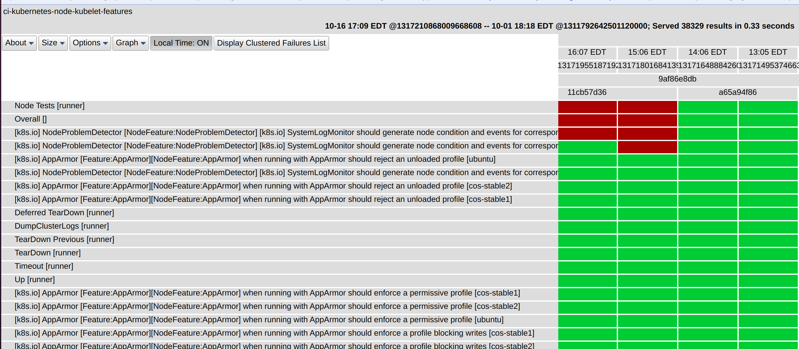
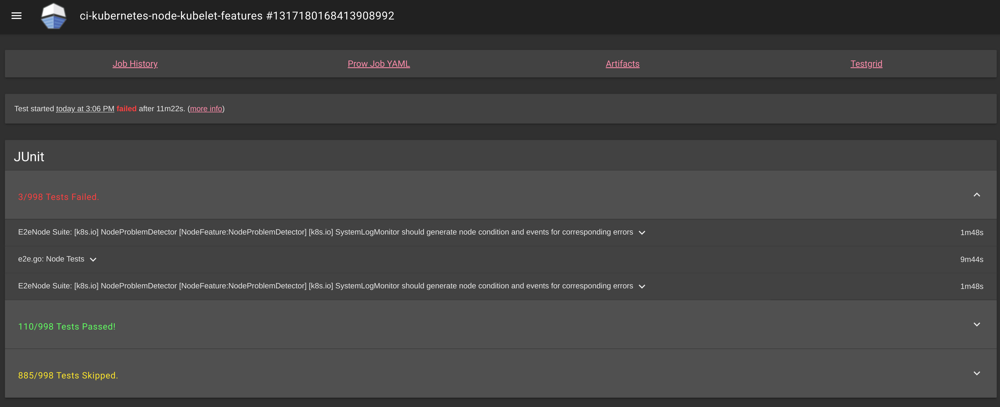

# Monitoring Kubernetes Health

**Table of Contents**

- [Monitoring Kubernetes Health](#monitoring-kubernetes-health)
  - [Monitoring the health of Kubernetes with TestGrid](#monitoring-the-health-of-kubernetes-with-testgrid)
    - [What dashboards should I monitor?](#what-dashboards-should-i-monitor)
  - [What do I do when I see a TestGrid alert?](#what-do-i-do-when-i-see-a-testgrid-alert)
    - [Communicate your findings](#communicate-your-findings)
    - [Fill out the issue](#fill-out-the-issue)
    - [Iterate](#iterate)


## Monitoring the health of Kubernetes with TestGrid

TestGrid is a highly-configurable, interactive dashboard for viewing your test
results in a grid, see https://github.com/GoogleCloudPlatform/testgrid.

The Kubernetes community has its own instance of TestGrid, https://testgrid.k8s.io/,
which we use to monitor and observe the health of the project.

Each SIG has its own set of dashboards, and each dashboard is composed of
different end-to-end (e2e) jobs.
E2E jobs are in turn made up of test stages (e.g., bootstrapping a Kubernetes
cluster, tearing down a Kubernetes cluster) and e2e tests (e.g., Kubectl client
Kubectl logs should be able to retrieve and filter logs).
These views allow different teams to monitor and understand how their areas
are doing.

We highly encourage anyone to periodically monitor these dashboards.
If you see that a job or test has been failing, please raise an issue with the
corresponding SIG in either their mailing list or in Slack.

Help maintaining tests, fixing broken tests, improving test success rates, and
overall test improvements are always highly needed throughout the project.

**Note**: It is important that all SIGs periodically monitor their jobs and
tests. These are used to figure out when to release Kubernetes.
Furthermore, if jobs or tests are failing or flaking, then pull requests will
take a lot longer to be merged.


### What dashboards should I monitor?

This depends on what areas of Kubernetes you want to contribute to.
You should monitor the dashboards owned by the SIG you are working with.
Additionally, you should check:

* https://testgrid.k8s.io/sig-release-master-blocking and
* https://testgrid.k8s.io/sig-release-master-informing

since these jobs run tests owned by other SIGs.
Also, make sure to periodically check on the "blocking" and "informing"
dashboards for past releases.

---

## What do I do when I see a TestGrid alert?

If you are part of a SIG's mailing list, occasionally you may see emails from
TestGrid reporting that a job or a test has recently failed.
If you are casually browsing through TestGrid, you may also see jobs labeled as
"flaky" (in purple) or as "failing" (in red).
This section is to help guide you on what to do in these occasions.

### Communicate your findings

The number one thing to do is to communicate your findings: a test or job has
been flaking or failing.
If you saw a TestGrid alert on a mailing list, please reply to the thread and
mention that you are looking into it.
It is important to communicate to prevent duplicate work and to ensure CI
problems get attention.

In order to communicate with the rest of the community and to drive the work,
please open up an issue on Kubernetes,
https://github.com/kubernetes/kubernetes/issues/new/choose, and choose the appropriate issue
template.

### Fill out the issue

1. **Which job(s) are failing or flaking**

The job is the tab in TestGrid that you are looking at.


The above example was taken from the SIG Release dashboard and we can see that
* `conformance-ga-only` https://testgrid.k8s.io/sig-release-master-blocking#conformance-ga-only,
* `skew-cluster-latest-kubectl-stable1-gce` https://testgrid.k8s.io/sig-release-master-blocking#skew-cluster-latest-kubectl-stable1-gce,
* `gci-gce-ingress` https://testgrid.k8s.io/sig-release-master-blocking#gci-gce-ingress,
* `kind-master-parallel` https://testgrid.k8s.io/sig-release-master-blocking#kind-master-parallel

are flaky (we should have some issues opened up for these to investigate why
:smile:).

2. **Which tests are failing or flaking**

Let's grab an example from the SIG release dashboards and look at the
`node-kubelet-features-master` job in
https://testgrid.k8s.io/sig-release-master-informing#node-kubelet-features-master.



Here we see that at 16.07 EDT and 15:07 EDT the job
```
[k8s.io] NodeProblemDetector [NodeFeature:NodeProblemDetector] [k8s.io] SystemLogMonitor should generate node condition and events for corresponding errors [ubuntu]
```
Failed for Kubernetes commit `9af86e8db` (this value is a row below the time -
the value above it is the run ID).
The corresponding test-infra commit was `11cb57d36` (the value below the commit
for Kubernetes).

At 15:07 EDT, the job
```
[k8s.io] NodeProblemDetector [NodeFeature:NodeProblemDetector] [k8s.io] SystemLogMonitor should generate node condition and events for corresponding errors [cos-stable2]
```

failed as well.

If one or both of these jobs continue failing, or if they fail frequently
enough, we should open an issue and investigate.

3. **Since when has it been failing or flaking**

This information you can get from the header of the page showing you all the
tests.
Going from top to bottom, you will see:
* date
* time
* job run ID
* Kubernetes commit that was tested
* (Most often) test-infra commit

4. **Reason for failure**

The aim for this issue is to begin investigating - you don't have to find the
reason for failure right away (nor the solution).
However, do post any information you find useful.

One way of getting useful information is to click on the failed runs (the red
rectangles).
This will send you to a page called [**Spyglass**](https://github.com/kubernetes/test-infra/tree/master/prow/spyglass).

If we do this for the above test failures in `node-kubelet-features-master`, we
will see the following



Right away it will show you what tests failed.
Here we see that 2 tests failed (both related to the node problem detector) and
the `e2e.go: Node Tests` stage was marked as failed (because the node problem
detector tests failed).

You will often see "stages" (steps in an e2e job) as mixed with the tests
themselves.
The stages tell you what was going on in the e2e job when an error
occurred.

If we click on the first test error, we will see logs that will (hopefully) help
us figure out why the test failed.


Further down the page you will see all the logs for the entire test run.
Please copy any information you think may be useful from here into the issue.

5. **Anything else we need to know**

There is this wonderful page built by SIG testing that often comes in handy:
https://storage.googleapis.com/k8s-gubernator/triage/index.html?pr=1
This page is called **Triage**.
We can use it to see if a test we see failing in a given job has been failing in
others and, in general, to understand how jobs are behaving.

For example, we can see how the job we have been looking at has been behaving
recently.

There is one important detail we have to mention at this point, the job names
you see on TestGrid are often aliases.
For example, when we clicked on a test run for
`node-kubelet-features-master`
(
https://testgrid.k8s.io/sig-release-master-informing#node-kubelet-features-master
), at the top left corner of spyglass the page tells us the real job name,
`ci-kubernetes-node-kubelet-features` (notice the "ci-kubernetes-" prefix).
Then we can use this full job name in Triage

https://storage.googleapis.com/k8s-gubernator/triage/index.html?pr=1&job=ci-kubernetes-node-kubelet-features

At the time of this writing we saw the following


**Note**: notice that you can also improve your query by filtering or excluding
results based on test name or failure text.

Sometimes, Triage will help you find patterns to figure out what's wrong.
In this instance, we can also see that this job has been failing rather
frequently (about 2 times per hour).

### Iterate

Once you have filled out the issue, please mention it in the appropriate mailing
list thread (if you see an email from TestGrid mentioning a job or test
failure) and share it with the appropriate SIG in the Kubernetes Slack.

Don't worry if you are not sure how to debug further or how to resolve the
issue!
All issues are unique and require a bit of experience to figure out how to work
on them.
For the time being, reach out to people in Slack or the mailing list.
