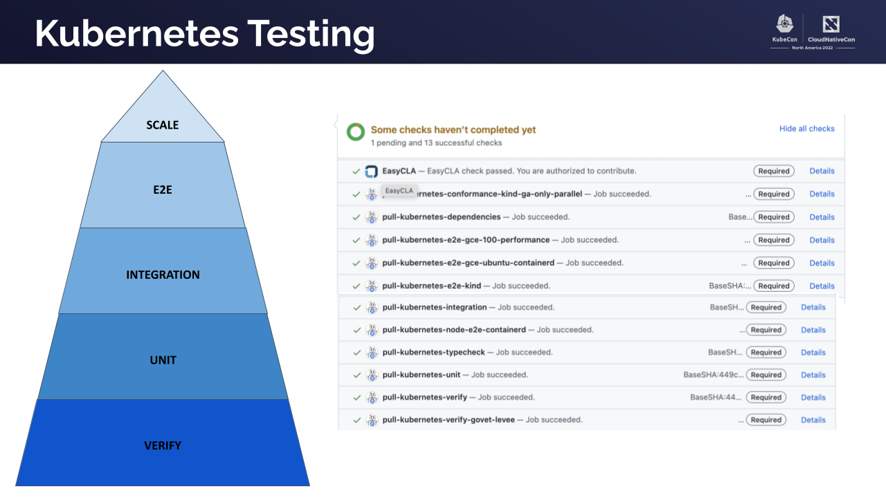

## Defining a Robust Testing Strategy

This document outlines a testing strategy for Kubernetes features based on past experiences and lessons learned taking into consideration the existing CI system's characteristics.

### The Testing Pyramid

The [**testing pyramid**](https://martinfowler.com/articles/practical-test-pyramid.html) is
a metaphor, nothing else, that helps visualize how to structure software tests. It's not a rigid prescription, but a general guideline for creating a balanced and effective testing strategy.



Prioritize tests based on the testing pyramid, refer to the [Testing Guide](./testing.md):

- **Unit Tests:**  The foundation. Fast (a package *should* be able to run all its unit tests in seconds), isolated (doesn't depend on environment or non-local network), and cover individual components.
- **Integration Tests:** Verify interactions between components within your subsystem. These are preferred for tests which require cluster components to be run with test-specific configurations.
- **E2E Tests:**  Test the entire system, including interactions with external dependencies. These are the most expensive and prone to flakiness. Every cluster component configuration variant requires a distinct e2e job.

### CI Job Types

The Kubernetes job uses [prow](https://prow.k8s.io) to implement the CI system. We can differentiate between different types of jobs:

- **Presubmit:** Runs before code is merged.
    - **Blocking:** Prevents merging if tests fail. Use cautiously due to potential project-wide impact. We aim to have a very high bar on these jobs and ask for proof
    of stability, reliability and performance.
    - **Non-Blocking/Informational:** Provides feedback without blocking merges.
- **Postsubmit:** Runs after code is merged. Useful for building artifacts.
- **Periodic:** Runs at scheduled intervals. Ideal for monitoring trends and catching regressions.

#### SIG Release Blocking and Informing jobs

SIG Release maintains two sets of jobs that decide whether the release is
healthy: Blocking and Informing.

If your feature or area is critical for the release please follow the instructions provided in https://github.com/kubernetes/sig-release/blob/master/release-blocking-jobs.md to promote your periodic jobs to be Blocking or Informing.

A condition necessary for Presubmit Blocking jobs is to be also a Release Blocking jobs.
Presubmit Blocking jobs should be even faster than Release Blocking jobs (under one hour, preferably under 30 minutes).
Jobs should only be promoted to presubmit blocking if we are **frequently** identifying bugs only after they disrupt the release blocking jobs. A few times per release is not sufficient, you can use testgrid to bisect the commits that merged between pass / fail and revert or fix the relevant PR.

Presubmit blocking jobs are much more expensive to run than release blocking jobs because they must run on every pushed PR, not just merged code, and issues with them disrupt ALL contributors, so we do not add presubmit blocking jobs lightly.

### Mitigating E2E Test Flakiness

E2E tests, especially in a complex project like Kubernetes, are susceptible to flakiness due to external dependencies. To mitigate this:

- **Identify Patterns:** Utilize periodic jobs and Testgrid to monitor test results and identify patterns in failures.
- **Isolate Failures:**  Improve test isolation to minimize the impact of external factors.
- **Retry Mechanisms:** Implement retry mechanisms in CI jobs to handle transient failures.
It is important to differentiate clearly what are retriable errors, or you may have the risk
of masking legit bugs that will be present in clusters running in production.
- **Robust Infrastructure:** Ensure the test infrastructure itself is reliable and stable.

###  Testing Strategy for Specific Features/Areas

If your focus is on a specific feature or area within Kubernetes, it is your responsibility
to ensure that tests for that a) run in the CI and b) remain healthy.
SIG Testing provides the *tooling* for running tests, but is not
responsible for *running* specific tests.

 Consider this strategy:

1. **Periodic Jobs:**
    - Run expensive E2E tests periodically (e.g., every 6 hours).
    - Use Testgrid to monitor trends and receive alerts for failures. This helps identify patterns and troubleshoot issues effectively.
    - Subscribe to alerts, Testgrid provides early signals if changes elsewhere in Kubernetes break your feature.

2. **Non-Blocking Presubmit Jobs:**
    - Configure presubmit jobs to run only when specific files or folders are modified. This can be done using the `run_if_changed` [trigger in prow](https://docs.prow.k8s.io/docs/jobs/#triggering-jobs-based-on-changes).
    - Use OWNERS files to require approval from maintainers of the relevant codebase. This acts as a "soft block," ensuring review and accountability without the risk of halting the entire project.
    - Encourages maintainers to take ownership of their code's quality and stability.

### Example: CI Configuration

There are a large number of CI jobs configurations that depend on multiple facvtos, here's a basic example. Remember to adapt it to your specific needs.

```yaml
presubmits:
  kubernetes/my-feature:
    - name: my-feature-e2e-tests
      always_run: false
      run_if_changed: 'my-feature/**/*'
      optional: true
      decorate: true
      path_alias: 'kubernetes/my-feature'
      spec:
        containers:
        - image: gcr.io/k8s-testimages/kubekins-e2e:v20241104-master-5917669-master
          command:
          - runner.sh
          - ./test/e2e.sh
          args:
         # Run tests labeled with "MyFeature", and only with that.
         -ginkgo.label-filter='Feature: containsAny MyFeature && Feature: isSubsetOf MyFeature && !Flaky'
      annotations:
        testgrid-dashboards: sig-my-feature
        testgrid-tab-name: My Feature E2E Tests

periodics:
  kubernetes/my-feature:
    - name: my-feature-periodic-e2e-tests
      interval: 6h
      decorate: true
      path_alias: 'kubernetes/my-feature'
      spec:
        containers:
        - image: gcr.io/k8s-testimages/kubekins-e2e:v20241104-master-5917669-master
          command:
          - runner.sh
          - ./test/e2e.sh
          args:
          - -ginkgo.label-filter='Feature: containsAny MyFeature && Feature: isSubsetOf MyFeature && !Flaky'
      annotations:
        testgrid-dashboards: sig-my-feature
        testgrid-tab-name: My Feature Periodic E2E Tests
```
