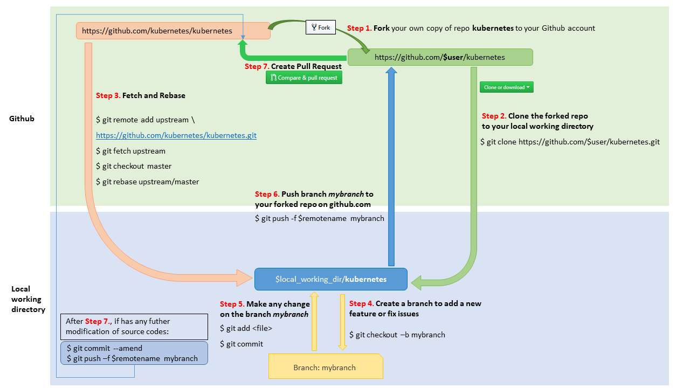

### 1 Fork in the cloud

1. Visit https://github.com/kubernetes/kubernetes
2. Click `Fork` button (top right) to establish a cloud-based fork.

### 2 Clone fork to local storage

Per Go's [workspace instructions][go-workspace], place Kubernetes' code on your
`GOPATH` using the following cloning procedure.

[go-workspace]: https://golang.org/doc/code.html#Workspaces

Define a local working directory:

```sh
# If your GOPATH has multiple paths, pick
# just one and use it instead of $GOPATH here.
# You must follow exactly this pattern,
# neither `$GOPATH/src/github.com/${your github profile name/`
# nor any other pattern will work.
export working_dir=$GOPATH/src/k8s.io
```

> If you already do Go development on github, the `k8s.io` directory
> will be a sibling to your existing `github.com` directory.

Set `user` to match your github profile name:

```sh
export user={your github profile name}
```

Both `$working_dir` and `$user` are mentioned in the figure above.

Create your clone:

```sh
mkdir -p $working_dir
cd $working_dir
git clone https://github.com/$user/kubernetes.git
# or: git clone git@github.com:$user/kubernetes.git

cd $working_dir/kubernetes
git remote add upstream https://github.com/kubernetes/kubernetes.git
# or: git remote add upstream git@github.com:kubernetes/kubernetes.git

# Never push to upstream master
git remote set-url --push upstream no_push

# Confirm that your remotes make sense:
git remote -v
```

### 3 Branch

Get your local master up to date:

```sh
cd $working_dir/kubernetes
git fetch upstream
git checkout master
git rebase upstream/master
```

Branch from it:
```sh
git checkout -b myfeature
```

Then edit code on the `myfeature` branch.

#### Build

This workflow is process-specific; for quick start build instructions for [kubernetes/kubernetes](https://git.k8s.io/kubernetes) please [see here](/contributors/devel/development.md#building-kubernetes-on-a-local-osshell-environment).

### 4 Keep your branch in sync

```sh
# While on your myfeature branch
git fetch upstream
git rebase upstream/master
```

Please don't use `git pull` instead of the above `fetch` / `rebase`. `git pull`
does a merge, which leaves merge commits. These make the commit history messy
and violate the principle that commits ought to be individually understandable
and useful (see below). You can also consider changing your `.git/config` file via
`git config branch.autoSetupRebase always` to change the behavior of `git pull`.

### 5 Commit

Commit your changes.

```sh
git commit
```
Likely you go back and edit/build/test some more then `commit --amend`
in a few cycles.

### 6 Push

When ready to review (or just to establish an offsite backup or your work),
push your branch to your fork on `github.com`:

```sh
git push -f ${your_remote_name} myfeature
```

### 7 Create a pull request

1. Visit your fork at `https://github.com/$user/kubernetes`
2. Click the `Compare & Pull Request` button next to your `myfeature` branch.
3. Check out the pull request [process](/contributors/guide/pull-requests.md) for more details and
   advice.

_If you have upstream write access_, please refrain from using the GitHub UI for
creating PRs, because GitHub will create the PR branch inside the main
repository rather than inside your fork.

#### Get a code review

Once your pull request has been opened it will be assigned to one or more
reviewers.  Those reviewers will do a thorough code review, looking for
correctness, bugs, opportunities for improvement, documentation and comments,
and style.

Commit changes made in response to review comments to the same branch on your
fork.

Very small PRs are easy to review.  Very large PRs are very difficult to review.

#### Squash and Merge

Upon merge (by either you or your reviewer), all commits left on the review
branch should represent meaningful milestones or units of work.  Use commits to
add clarity to the development and review process.

Before merging a PR, squash any _fix review feedback_, _typo_, _merged_, and
_rebased_ sorts of commits.

It is not imperative that every commit in a PR compile and pass tests
independently, but it is worth striving for.

In particular, if you happened to have used `git merge` and have merge
commits, please squash those away: they do not meet the above test.

A nifty way to manage the commits in your PR is to do an [interactive
rebase](https://git-scm.com/book/en/v2/Git-Tools-Rewriting-History),
which will let you tell git what to do with every commit:

```sh
git fetch upstream
git rebase -i upstream/master
```

For mass automated fixups (e.g. automated doc formatting), use one or more
commits for the changes to tooling and a final commit to apply the fixup en
masse. This makes reviews easier.

### Reverting a commit

In case you wish to revert a commit, use the following instructions.

_If you have upstream write access_, please refrain from using the
`Revert` button in the GitHub UI for creating the PR, because GitHub
will create the PR branch inside the main repository rather than inside your fork.

1. Create a branch and sync it with upstream.

```sh
# create a branch
git checkout -b myrevert

# sync the branch with upstream
git fetch upstream
git rebase upstream/master
```

2. If the commit you wish to revert is a:

- merge commit:

```sh
# SHA is the hash of the merge commit you wish to revert
git revert -m 1 SHA
```

- single commit:

```sh
# SHA is the hash of the single commit you wish to revert
git revert SHA
```

3. This will create a new commit reverting the changes.
Push this new commit to your remote.

```sh
git push ${your_remote_name} myrevert
```

4. [Create a Pull Request](#7-create-a-pull-request) using this branch.
