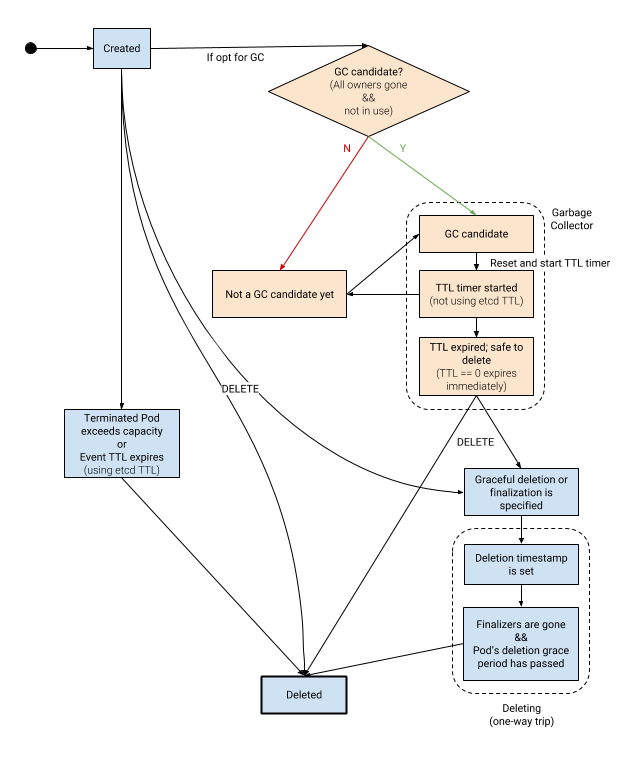

# Garbage Collection

## Table of Contents

   * [Garbage Collection](#garbage-collection)
      * [Table of Contents](#table-of-contents)
      * [Summary](#summary)
      * [Motivation](#motivation)
         * [Goals](#goals)
         * [Non-Goals](#non-goals)
      * [Background](#background)
         * [Garbage Collection in Kubernetes](#garbage-collection-in-kubernetes)
            * [OwnerReference-based Garbage Collection  (Generic)](#ownerreference-based-garbage-collection--generic)
            * [Capacity-based Garbage Collection (Pods and Controller History only)](#capacity-based-garbage-collection-pods-and-controller-history-only)
            * [TTL-based Garbage Collection (Events only)](#ttl-based-garbage-collection-events-only)
            * [Summary](#summary-1)
         * [Existing Problems](#existing-problems)
            * [Non-generic Capacity-based Garbage Collection](#non-generic-capacity-based-garbage-collection)
            * [Non-generic TTL-based Garbage Collection](#non-generic-ttl-based-garbage-collection)
            * ["Root" Resources Without an Owner](#root-resources-without-an-owner)
            * [Immutable Pattern: Short-lived, Frequently-created Resources](#immutable-pattern-short-lived-frequently-created-resources)
            * [Cannot Centralize Cleanup of Multiple Resources with OwnerReferences](#cannot-centralize-cleanup-of-multiple-resources-with-ownerreferences)
      * [Proposal](#proposal)
         * [Generic TTL-based Garbage Collection](#generic-ttl-based-garbage-collection)
         * [Clean Up Resources After Use](#clean-up-resources-after-use)
         * [Summary](#summary-2)
         * [User Stories](#user-stories)
            * [Story 1: Clean up old Jobs](#story-1-clean-up-old-jobs)
            * [Story 2: Secrets and ConfigMaps](#story-2-secrets-and-configmaps)
            * [Story 3: CustomResourceDefinitions (CRDs) and custom resources](#story-3-customresourcedefinitions-crds-and-custom-resources)
         * [Implementation Details](#implementation-details)
         * [Risks and Mitigations](#risks-and-mitigations)
      * [Graduation Criteria](#graduation-criteria)
      * [Implementation History](#implementation-history)
      * [Future Work](#future-work)
         * [Generic Capacity-based Garbage Collection](#generic-capacity-based-garbage-collection)
         * [Namespace-wide Garbage Collection Policy](#namespace-wide-garbage-collection-policy)
         * [Move Event TTL out of etcd TTL](#move-event-ttl-out-of-etcd-ttl)
         * [Make Pod GC and Event GC Work Better with Garbage Collector](#make-pod-gc-and-event-gc-work-better-with-garbage-collector)
         * [Move deletionGracePeriodSeconds from metadata to Pod spec](#move-deletiongraceperiodseconds-from-metadata-to-pod-spec)
      * [Alternatives](#alternatives)

## Summary

We propose to expand Kubernetes garbage collection to handle common uses which
are awkward today. We will add an object-lifecycle-respecting TTL mechanism to
the garbage collector. We will also allow users to mark resource objects to be
cleaned up by the garbage collector after those objects are no longer in use:
either terminated, completed, or not referenced by other resource objects.

## Motivation

Make it easy for users to clean up frequently-created, short-lived Kubernetes
resources objects.

One common use case is [ConfigMaps][] and [Secrets][]. The users roll out
ConfigMaps and Secrets by creating new ConfigMaps or Secrets and updating the
references to those ConfigMaps or Secrets in containers ([#22368][]). The old
ConfigMaps and Secrets, if not referenced by any container, are no longer
needed. 

Another common use case is completed [Jobs][]. Users keep creating Jobs to run
some batch tasks, and those Jobs, once complete, are no longer needed in the
system.

Failing to clean up those resources could cause cluster instability (e.g. API
server requests timeouts and health-check failures) and cost more compute
resource usage than actually needed -- this is not a hypothetical problem but a
real, long-standing Kubernetes usability issue.

[ConfigMaps]: https://kubernetes.io/docs/tasks/configure-pod-container/configure-pod-configmap/
[Secrets]: https://kubernetes.io/docs/concepts/configuration/secret/
[#22368]: https://github.com/kubernetes/kubernetes/issues/22368
[Jobs]: https://kubernetes.io/docs/concepts/workloads/controllers/jobs-run-to-completion/

### Goals

A successful mechanism must:

* Be declarative. 
* Be able to deal with custom (extension) resources and custom controllers. 
* Allow users to opt-in and opt-out of this feature without breaking
  functionality.
* Can be safely enabled / rolled out and then disabled / rolled back.
* Maintain backward compatibility. 
* Have a low cognitive burden. Easy to set up and reason about what resources
  should be garbage collected.
* Be efficient enough that it wouldn’t introduce a new scalability bottleneck.

### Non-Goals

Other related features, such as the design of resource immutability,
cluster-wide resource quota, or undo resource deletion, are orthogonal to
garbage collection and their design won’t be discussed in this proposal.

## Background

### Garbage Collection in Kubernetes

Currently in Kubernetes, there are 3 flavors of garbage collection: 
ownerReference-based, capacity-based, and TTL-based.

#### OwnerReference-based Garbage Collection  (Generic)

[OwnerReference-based garbage collection][] supports cascading deletion for all
Kubernetes resources. This is managed by a controller named generic garbage
collector. The generic garbage collector deletes Kubernetes objects that once
had an owner, but no longer have an owner. A Kubernetes object defines its owner
by adding its owner to its own  `.metadata.ownerReferences` field. You can think
of `.metadata.ownerReferences` as a list of pointers to a resource's parents
(owners). 

For example, when a Deployment owns a ReplicaSet, that ReplicaSet's
`.metadata.ownerReferences` will include the Deployment. If the generic garbage
collector finds that the Deployment doesn't exist in the system anymore, and if
the Deployment is the ReplicaSet's only owner, it will delete the ReplicaSet. 

[OwnerReference-based garbage collection]: https://kubernetes.io/docs/concepts/workloads/controllers/garbage-collection/

#### Capacity-based Garbage Collection (Pods and Controller History only)

Capacity-based garbage collection removes resources when they exceeds specified
capacity. Terminated pod garbage collection and controller history objects
garbage collection are both capacity-based.

* **Terminated pod garbage collection:** It is managed by a controller named
  Pod GC controller. Pod-GC controller deletes terminated Pods when a
  cluster-wide threshold is hit. Pod-GC controller sorts terminated pods by
  creation timestamp before deleting them, so that the oldest terminated pod is
  deleted first. Pod-GC controller is enabled by default, and can be managed
  through flags `--controllers=podgc` and `--terminated-pod-gc-threshold` of
  [kube-controller-manager].
* **Controller history garbage collection:** It is managed by each of the
  workload controllers that retain controller history objects, including
  [Deployments][], [StatefulSets][], [DaemonSets][], and [CronJobs][]. The
  capacity is set with an API field, and the workload controller deletes the
  controller history objects it manages based on that capacity. For example,
  Deployment controller only keeps a number of zero-replica [ReplicaSets][] for
  a Deployment object based on the Deployment's `.spec.revisionHistoryLimit`.
  Similar to Pod GC controller, the workload controller deletes older history
  objects first. Note that the controller history resources can only be garbage
  collected if it's managed by a high-level controller, for example, a Job will
  not be garbage collected if it's not managed by a CronJob. 

[kube-controller-manager]: https://kubernetes.io/docs/reference/command-line-tools-reference/kube-controller-manager/
[Deployments]: https://kubernetes.io/docs/concepts/workloads/controllers/deployment/
[StatefulSets]: https://kubernetes.io/docs/concepts/workloads/controllers/statefulset/
[DaemonSets]: https://kubernetes.io/docs/concepts/workloads/controllers/daemonset/
[CronJobs]: https://kubernetes.io/docs/concepts/workloads/controllers/cron-jobs/
[ReplicaSets]: https://kubernetes.io/docs/concepts/workloads/controllers/replicaset/

#### TTL-based Garbage Collection (Events only)

TTL-based garbage collection assigns a TTL (time to live) when creating an
object (in API server, using [etcd][] TTL) and the API server will delete the
object once the TTL expires. The TTL can only be assigned at the resource object
creation time.

Event garbage collection is TTL-based. API server assigns a TTL to a Kubernetes
Event when creating it, and deletes it when the TTL expires. The same TTL is
used for all events in the cluster and can be defined via a flag `--event-ttl`
of [kube-apiserver][].

[etcd]: https://github.com/coreos/etcd
[kube-apiserver]: https://kubernetes.io/docs/reference/command-line-tools-reference/kube-apiserver/

#### Summary

In summary, here are the Kubernetes resources that can be garbage collected.

| Resources                                               | GC Flavor      | GC controller         |
|---------------------------------------------------------|----------------|-----------------------|
| Any resource with non-empty `.metadata.ownerReferences` | OwnerReference | Generic GC controller |
| Terminated Pods                                         | Capacity       | Pod GC controller     |
| Controller history resources                            | Capacity       | Workload controller   |
| Events                                                  | TTLs           | API server (etcd TTL) |

### Existing Problems

Even though Kubernetes provides several different flavors of garbage collection,
there are still some problems that need to be solved. 

#### Non-generic Capacity-based Garbage Collection

Current capacity-based garbage collection has the following issues:

* Not generic. Only supports terminated pods and controller history resources. 
* Terminated pod garbage collection can only be configured via component flag,
  and any changes to it requires restarting the component. 
* No fairness for terminated pod garbage collection. For example, capacity
  cannot be split equally by namespace. 
* Terminated pods are deleted in the order of creation time, instead of
  terminated time. 
* Capacity has no relation to [resource quotas][]. 
* Garbage collecting terminated pods without looking at their owner references
  can potentially break Jobs, because Job depends on the Pods it owns to exist
  (see [#28486]).

[resource quotas]: https://kubernetes.io/docs/concepts/policy/resource-quotas/
[#28486]: https://github.com/kubernetes/kubernetes/issues/28486

#### Non-generic TTL-based Garbage Collection

Current TTL-based garbage collection has the following issues:

* Not generic. Only supports Events. 
* Can only be configured via component flag, and changes require restarting the
  component. 
* TTLs can only be set at Event creation time and cannot be changed later. 
* Depends on etcd.
* Because etcd TTL is used, it does not respect other lifecycle guarantees,
  such as finalizers.

#### "Root" Resources Without an Owner

Resources that are not terminated Pods, Events, or controllers history
resources, can only be garbage collected with ownerReference-based garbage
collection. 

However, OwnerReference-based garbage collection can only handle the case when a
resource has at least an owner. However, not all resources have owners (i.e.
non-empty `.metadata.ownerReferences`). You can think of the resources that
don't have owners as root nodes in a DAG (directed acyclic graph). Those
resources without owners may never be deleted after they're no longer needed. 

Most of the Kubernetes resources that users create directly won't have owners. 

#### Immutable Pattern: Short-lived, Frequently-created Resources

Short-lived resources, such as Jobs (that are not managed by CronJobs), Secrets
and ConfigMaps, are often treated as _immutable_ resources -- they are
frequently created and not updated by users. We also have discussed making such
resources immutable ([#10179][]).

However, it's difficult for the users to clean up those resources automatically,
because those resources don't have owners. Without a way to clean up those
frequently created, short-lived resources, those resources can accumulate and
overload a Kubernetes cluster very easily. Even if we can avoid the overload
issue by implementing a cluster-wide (global) resource quota, users won't be
able to create new resources without cleaning up old ones first. 

[#10179]: https://github.com/kubernetes/kubernetes/issues/10179#issuecomment-384019058

#### Cannot Centralize Cleanup of Multiple Resources with OwnerReferences

Moreover, people building declarative application description with several
Kubernetes resources cannot easily centralize clean up using owner references,
meaning, to create a bunch of objects and deleting one of them to make the other
objects to go away with it. 

One of the reasons is that owner resource [UID][] is required when specifying
owner references, but UID is unknown until after a resource is created. Even if
Kubernetes removes this limitation and allow named based owner references,
there’s still a resource creation ordering problem: any child resource created
before its parent resource is prone to be cleaned up by the garbage collector
unexpectedly.

What's more, a child resource may depend on many other parent resources. It's
likely for the list of owners of a child resource to be excessively long, and
hit Kubernetes resource size limit. The resource then cannot be updated anymore
and becomes useless. 

[UID]: https://kubernetes.io/docs/concepts/overview/working-with-objects/names/#uids

## Proposal

The design has three main parts: 

1. **Object-lifecycle-respecting TTL mechanism.** Provide observability before
   deletion, and address the resource creation ordering problems. See [detailed
   design of TTL][].
1. **Garbage collect resources that finish execution.** Delete a resource object
   when it finishes execution (either terminates or completes). See [detailed
   design of GC after use (part 1)][].
1. **Garbage collect resources that are not used by other resources.** Extract
   usage references of a resource object and delete the object when it is no
   longer referenced. Garbage collector will count usage references and address
   the problem of unbounded list of owner references. See [detailed design of GC
   after use (part 2)][].

This will be coherent with existing owner-reference-based garbage collection
mechanism. This means that the resource object will stay in existence until all
garbage collection mechanisms (owner reference, usage references, TTL) agree it
should be deleted.

[detailed design of TTL]: https://goo.gl/9AUQ3n
[detailed design of GC after use (part 1)]: https://goo.gl/ws9t3b
[detailed design of GC after use (part 2)]: https://goo.gl/KeHPiQ

### Generic TTL-based Garbage Collection

First, we need to clarify what TTL means in this context. TTL represents the
earliest safe time when a resource can be garbage collected. 

Generic TTL-based garbage collection will allow the user to set a TTL on each of
Kubernetes resources. The TTL starts when a resource is eligible for garbage
collection and stops when the resource is no longer eligible; the system will
only garbage collect the resource after the TTL expires. This is useful when the
user expects a resource to be needed intermittently and/or want to keep the
resource around for a while before garbage collection kicks in.

Note that we will not use etcd TTL to support this feature, because etcd TTLs
won’t respect other lifecycle guarantees (e.g. finalizers). This also allows the
feature to be independent of etcd.

### Clean Up Resources After Use

A resource is no longer *in use* either when it finishes execution (such as a
terminated Pod or a completed Job), or when it’s not referenced/used by other
resources (such as a Secret referenced in a PodSpec of any active Pods or
workload API resources like Deployments).

The garbage collector is responsible for checking whether a resource is still in
use or not. To do this, the garbage collector will count "usage reference" of a
resource object, instead of using owner references directly. Not using owner
references here provides several benefits:

* It’s quick and easy to enable and then disable this feature without updating
  owner references lists in resources. 
* Does not require frequent updates, because a resource object is only updated
  with it’s eligible to be garbage collected.
* Avoid the problem of unbounded list of owner references.

When a resource is no longer in use, and when the resource’s owners
are all gone, the garbage collector sets a timestamp on the resource. The
garbage collector will later clean up those resources based on their timestamps.
This is similar to [mark-and-sweep][] garbage collection. 

This timestamp represents the last time this resource is needed and shouldn’t be
garbage collected. It will be empty when the resource is still in use, and will
only be set when this resource is no longer needed. This is important, so that
we can avoid the need for frequent updates (like a heartbeat) which could cause
performance and scalability issues. The timestamp only needs to be updated when
a resource is either in use or not in use.

Combining with TTL, users can specify the earliest safe time to clean up
resources after they no longer need those resources. For example, a Job gets
deleted 1 day after it completes, a Secret gets deleted 30 minutes after it is
no longer used by another other resources, and a Pod without an owner gets
deleted 1 hour after it terminates.

[mark-and-sweep]: https://www.geeksforgeeks.org/mark-and-sweep-garbage-collection-algorithm/

### Summary

In summary, resource garbage collection with TTL is illustrated below:

The orange boxes in the above diagram represents the new design of the garbage
collector. 

When all garbage collection mechanisms agree a resource should be deleted, the
resource becomes "garbage collection candidate" and then the user-specified TTL
kicks in. If somehow the resource leaves the "garbage collection candidate"
state, the TTL will be reset. The resource will only be deleted when it is a
garbage collection candidate and its TTL has expired (zero TTL expires
immediately). Garbage collector will implement its own TTL mechanism instead of
using etcd TTL.

Note that current Pod garbage collection ([capacity-based][]) and Event garbage
collection ([TTL-based][], using etcd TTL) are not handled by the garbage
collector. They are kept as-is for backward compatibility. In the future, we may
move them into garbage collector, or deprecate them and delete them entirely.

[capacity-based]: #non-generic-capacity-based-garbage-collection
[TTL-based]: #non-generic-ttl-based-garbage-collection

### User Stories

#### Story 1: Clean up old Jobs

The users keep creating Jobs in a small Kubernetes cluster with 4 nodes. The
Jobs accumulates over time, and 1 year later, the cluster ended up with more
than 100k old Jobs. This caused etcd hiccups, long high latency etcd requests,
and eventually made the cluster unavailable.

The problem could have been avoided easily by enabling TTL-based garbage
collection with Jobs completion time. 

The steps are as easy as:

1. In Job’s metadata, the user sets TTL to 1 hour and that the Job should be
   cleaned up after it completes (unused).
1. The user deploys Jobs as usual.
1. After the Job completes, the result is observed asynchronously within an hour
   and stored elsewhere. 
1. The garbage collector cleans up those Jobs 1 hour after Job completion. 

#### Story 2: Secrets and ConfigMaps

Secrets and ConfigMaps are used and referenced by other resources, such as Pods,
ReplicaSets, and Deployments. An advised pattern is to treat application
configurations as immutable so that application revisions are intact and
rollbacks are reliable. When the users deploy their applications, they treat
Secrets and ConfigMaps as immutable resources, and therefore Secrets and
ConfigMaps are frequently created and deployed to a Kubernetes cluster, but
never updated or cleaned up. Secrets and ConfigMaps accumulate over time, which
could cause master component downtime. 

The problem could have been avoided easily by enabling TTL-based garbage
collection of Secrets and ConfigMaps by last used time. 

The steps are as easy as:

1. In the ConfigMap and Secret’s metadata, the user sets TTL to 1 hour and that
   the ConfigMap and Secret should be cleaned up after they are no longer used
   by other resources (Pods, ReplicaSets, Deployments, etc.)
1. The user then deploys applications, including ConfigMaps and Secrets of those
   applications, as usual. Users can create new ConfigMaps and Secrets when they
   need to change the configuration of their applications. They don’t need to
   manually check which ConfigMaps and Secrets are not used and can be cleaned
   up. If the ConfigMaps and Secrets are shared among applications, other
   applications can still use them before TTL expires. 

#### Story 3: CustomResourceDefinitions (CRDs) and custom resources

Users may create [custom resources][] in their Kubernetes clusters. Users can
handpick one or more types of garbage collection for each of their custom
resources and even the definition of those resources
([`CustomResourceDefinitions`][]/CRDs). For example, a custom resource such as
Build, Workflow or Function can be cleaned up after they complete or are not in
use. The TTL provides time for asynchronous clients to observe their final state
before they are deleted.

[custom resources]: https://kubernetes.io/docs/concepts/extend-kubernetes/api-extension/custom-resources/
[`CustomResourceDefinitions`]: https://kubernetes.io/docs/tasks/access-kubernetes-api/extend-api-custom-resource-definitions/

### Implementation Details

Implementation details of the three main parts of the design are discussed
elsewhere:

1. Object-lifecycle-respecting TTL mechanism: [detailed design of TTL][].
1. Garbage collect resources that finish execution: [detailed design of GC after
   use (part 1)][].
1. Garbage collect resources that are not used by other resources: [detailed
   design of GC after use (part 2)][].

### Risks and Mitigations

The changes to garbage collector will affect the whole system and need to be
carefully tested. Tests including, but not limited to:

* Basic tests for each of the garbage collection features:
  * Resources can be garbage collected.
  * Resources that opt-out of garbage collection shouldn’t be deleted.
* When this feature is enabled and disabled, resources won’t be garbage
  collected.
* All garbage collection mechanisms can work coherently.
* Works in clusters with local timezone that changes +/-1hr for DST. 

This feature will also be feature gated.

## Graduation Criteria

This can be promoted to beta when it satisfies users' need for cleaning up
resources after use, without regressions.

This will be promoted to GA once it's gone a sufficient amount of time as beta
with no changes. 

## Implementation History

TBD

## Future Work

### Generic Capacity-based Garbage Collection

We may potentially want to support generic capacity-based garbage collection.
Generic capacity-based garbage collection will allow users to set a cluster-wide
threshold on each of Kubernetes resources, and garbage collect resources after
the threshold is hit. Note that only resources that are no longer in use can be
cleaned up. 

Points to consider when implementing the capacity-based garbage collection:

* Fairness: for example, the capacity can be shared equally among namespaces.
* Resource quota: capacity should be supplementary to resource quotas and can be
  set according to resource quota.
* Be generic and configurable.
* Remove resources based on their last used time, instead of creation time.
* Be coherent with other existing garbage collection mechanism.

### Namespace-wide Garbage Collection Policy

We can implement a garbage collection policy that applies to all resources in
the same namespace by default for easier garbage collection policy management.

### Move Event TTL out of etcd TTL

We may consider moving Event TTL out of etcd TTL, and use the TTL mechanism in
garbage collector for Events. 

### Make Pod GC and Event GC Work Better with Garbage Collector

Pod GC and Event GC don't respect OwnerReference-based garbage collector today.
The biggest problem caused by Pod GC is that it breaks Job controller
([#28486][]).

We may move Pod GC and Event GC into garbage collector, or deprecate them and
delete them entirely.

### Move deletionGracePeriodSeconds from metadata to Pod spec

`deletionGracePeriodSeconds` is currently in `.metadata` of all resources,
although it only applies to Pods. This is confusing to the users.

Because users cannot set or modify this field on a non-Pod resource (the field
will be silently dropped), it will be compatible to move it outside of
`.metadata` of resources other than Pod. This field can be part of a
Pod-specific `.metadata`, or can even move this field to Pod spec in the future
(in Pod v2 API).

## Alternatives

We have considered using owner references, instead of counting usage reference,
to clean up resources after use. However, it has the following drawbacks:

* Owner references of a resource may be excessively long. Resources like
  ConfigMap can be referenced by Pods, ReplicaSets, and Deployments. If a
  Deployment has 1k replicas, it will create 1k Pods and the ConfigMap needs to
  add those 1k Pods to the ConfigMap’s owner references list. It will be easy
  for the ConfigMap to hit Kubernetes resource object size limit. After the
    limit is hit, the resource object cannot be updated anymore. 
* Using owner references to implement this feature will make the feature harder
  to be safely disabled after it’s enabled, because that requires all the added
  owner references to be removed immediately before the garbage collector starts
  reacting to it. It will cause resource objects to be cleaned up unexpectedly. 
* Using owner references is conceptually more complex.

We have also considered implementing a cluster wide cleanup policy. However we
have concluded that the garbage collection should be driven by users instead of
cluster admins.
