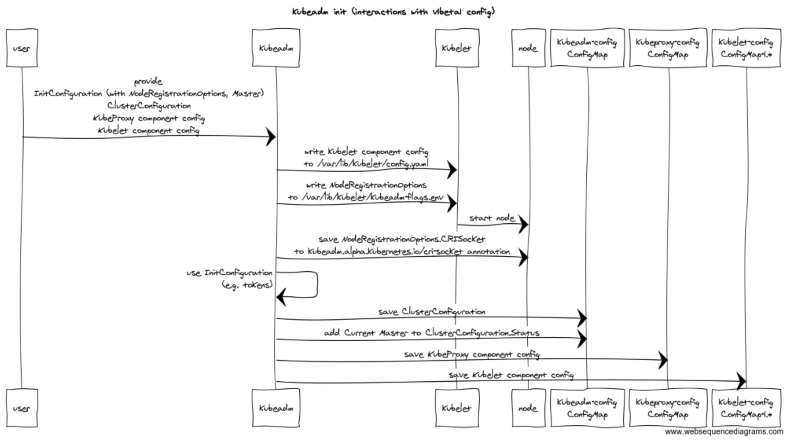

# kubeadm Config file graduation to v1beta1

## Table of Contents

<!-- TOC -->

- [kubeadm Config file graduation to v1beta1](#kubeadm-config-file-graduation-to-v1beta1)
    - [Table of Contents](#table-of-contents)
    - [Summary](#summary)
    - [Motivation](#motivation)
        - [Goals](#goals)
        - [Non-Goals](#non-goals)
    - [Proposal](#proposal)
        - [Decoupling the kubeadm types from other ComponentConfig types](#decoupling-the-kubeadm-types-from-other-componentconfig-types)
        - [Re-design how kubeadm configurations are persisted](#re-design-how-kubeadm-configurations-are-persisted)
        - [Use substructures instead of the current "single flat object"](#use-substructures-instead-of-the-current-single-flat-object)
        - [Risks and Mitigations](#risks-and-mitigations)
    - [Graduation Criteria](#graduation-criteria)
    - [Implementation History](#implementation-history)
    - [Drawbacks](#drawbacks)
    - [Alternatives](#alternatives)

<!-- /TOC -->

## Summary

This KEP is meant to describe design goal and the proposed solution for implementing the kubeadm
config file `v1beta1` version.

The kubeadm config file today is one of the first touch points with Kubernetes for many users and
also for higher level tools leveraging kubeadm; as a consequence, providing a more stable and
reliable config file format is considered one of the top priorities for graduating kubeadm itself
to GA and for the future of kubeadm itself.

## Motivation

The kubeadm config file is a set of YAML documents with versioned structs that follow the Kubernetes
API conventions with regards to `apiVersion` and `kind`, but these types aren’t exposed as an
API endpoint in the API server. kubeadm follows the ComponentConfig conventions.

The kubeadm config file was originally created as alternative to command line flags for `kubeadm init`
and `kubeadm join` actions, but over time the number of options supported by the kubeadm config file
has grown continuously, while the number of command line flags is intentionally kept under control
and limited to the most common and simplest use cases.

As a consequence today the kubeadm config file is the only viable way for implementing many use cases
like e.g. usage of an external etcd, customizing Kubernetes control plane components or kube-proxy
and kubelet parameters.

Additionally, the kubeadm config file today acts also as a persistent representation of the cluster
specification that can be used at a any points in time after `kubeadm init` e.g. for executing
`kubeadm upgrade` actions.

The `v1beta1` version of kubeadm config file is a required, important consolidation step of the
current config file format, aimed at rationalize the considerable number of attributes added in the
past, provide a more robust and clean integration with the component config API, address the
weakness of the current design for representing multi master clusters, and ultimately lay down
a more sustainable foundation for the evolution of kubeadm itself.

### Goals

- To provide a solution for decoupling the kubeadm ComponentConfig types from other Kubernetes
  components’ ComponentConfig types.

- To re-design how kubeadm configurations are persisted, addressing the known limitations/weakness
  of the current design; more in detail, with the aim to provide a better support for high
  availability clusters, it should be provided a clear separation between cluster wide settings,
  control plane instance settings, node/kubelet settings and runtime settings (setting used
  by the current command but not persisted).

- Improve the current kubeadm config file format by using specialized substructures instead
  of the current "single flat object with only fields".

### Non-Goals

- To steer/coordinate all the implementation efforts for adoption of ComponentConfig across all
  the different Kubernetes components.

- To define a new home for the Bootstrap Token Go structs

## Proposal

### Decoupling the kubeadm types from other ComponentConfig types

The `v1alpha2` kubeadm config types currently embeds the ComponentConfig for
kube-proxy and kubelet into the **MasterConfiguration** object; it is expected that also
ComponentConfig for kube-controller manager, kube-scheduler and kube-apiserver will be added
in future (non goal of this KEP).

This strong type of dependency - embeds - already created some problem in the v1.10 cycle, and
despite some improvements, the current situation is not yet ideal, because e.g embedded dependency
could impact the kubeadm config file life cycle, forcing kubeadm to change its own config file
version every time one of the embedded component configurations changes.

`v1beta1` config file version is going to address this problem by removing embedded dependencies
from the _external_ kubeadm config types.

Instead, the user will be allowed to pass other component’s ComponentConfig in separated YAML
documents inside of the same YAML file given to `kubeadm init --config`.

> please note that the _kubeadm internal config_ will continue to embed components config
> for the foreseeable future because kubeadm requires the knowledge of such data structures e.g.
> for propagating network configuration settings to kubelet, setting defaults, validating
> or manipulating YAML etc.

### Re-design how kubeadm configurations are persisted

Currently the kubeadm **MasterConfiguration** struct is persisted as a whole into the
`kubeadm-config` ConfigMap, but this situation has well know limitations/weaknesses:

- There is no clear distinction between cluster wide settings (e.g. the kube-apiserver server
  extra-args that should be consistent across all instances) and control plane instance settings
  (e.g. the API server advertise address of a kube-apiserver instance).
  NB. This is currently the main blocker for implementing support for high availability clusters
  in kubeadm.

- There is no clear distinction between cluster wide settings and node/kubelet specific
  settings (e.g. the node name of the current node)

- There is no clear distinction between cluster wide settings and runtime configurations
  (e.g. the token that should be created by kubeadm init)

- ComponentConfigs are stored both in the `kubeadm-config` and in the `kubeproxy-config` and
  `kubelet-config-vX.Y` ConfigMaps, with the first used as authoritative source for updates,
  while the others are the one effectively used by components.

Considering all the above points, and also the split of the other components ComponentConfigs
from the kubeadm **MasterConfiguration** type described in the previous paragraph, it should
be re-designed how kubeadm configuration is persisted.

The proposed solution leverage on the new kubeadm capability to handle separated YAML documents
inside of the same kubeadm-config YAML file. More in detail:

- **MasterConfiguration** will be split into two other top-level kinds: **InitConfiguration**
  and **ClusterConfiguration**.
- **InitConfiguration** will host the node-specific options like the node name, kubelet CLI flag
  overrides locally, and ephemeral, init-only configuration like the Bootstrap Tokens to initialize
  the cluster with.
- **ClusterConfiguration** will host the cluster-wide configuration, and **ClusterConfiguration**
  is the object that will be stored in the `kubeadm-config` ConfigMap.
- Additionally, **NodeConfiguration** will be renamed to **JoinConfiguration** to be consistent with
  **InitConfiguration** and highlight the coupling to the `kubeadm join` command and its
  ephemeral nature.

The new `kubeadm init` flow configuration-wise is summarized by the attached schema.

[link](0023-kubeadm-init.png)

As a consequence, also how the kubeadm configuration is consumed by kubeadm commands should
be adapted as described by following schemas:

- [kubeadm join and kubeadm join --master](0023-kubeadm-join.png)
- [kubeadm upgrade apply](0023-kubeadm-upgrade-apply.png)
- [kubeadm upgrade node](0023-kubeadm-upgrade-node.png)
- [kubeadm reset](0023-kubeadm-reset.png)

### Use substructures instead of the current "single flat object"

Even if with few exceptions, the kubeadm **MasterConfiguration** and **NodeConfiguration** types
in `v1alpha1` and `v1alpha2` are basically single, flat objects that holds all the configuration
settings, and this fact e.g. doesn’t allow to a clearly/easily understand which configuration
options relate to each other or apply to the different control plane components.

While redesigning the config file for addressing the main issues described in previous paragraphs,
kubeadm will provide also a cleaner representation of attributes belonging to single component/used
for a specific goal by creating dedicated objects, similarly to what’s already improved for
etcd configuration in the `v1alpha2` version.

### Risks and Mitigations

This is a change mostly driven by kubeadm maintainers, without an explicit buy-in from customers
using kubeadm in large installations

The differences from the current config file are relevant and kubeadm users can get confused.

Above risks will be mitigated by:

- providing a fully automated conversion mechanism and a set of utilities under the kubeadm
  config command (a goal and requirement for this KEP)
- The new structure could potentially make configuration options less discoverable as they’re
  buried deeper in the code. Sufficient documentation for common and advanced tasks will help
  mitigate this.
- writing a blog post before the release cut
- providing adequate instructions in the release notes

Impact on the code are considerable.

This risk will be mitigated by implementing the change according to following approach:

- introducing a new `v1alpha3` config file as a intermediate step before `v1beta1`
- implementing all the new machinery e.g. for managing multi YAML documents in one file, early
  in the cycle
- ensuring full test coverage about conversion from `v1alpha2` to `v1alpha3`, early in the cycle
- postponing the final rename from `v1alpha3` to `v1beta1` only when all the graduation criteria
  are met, or if this is not the case, iterating the above steps in following release cycles

## Graduation Criteria

The kubeadm API group primarily used in kubeadm is `v1beta1` or higher. There is an upgrade path
from earlier versions. The primary kinds that can be serialized/deserialized are `InitConfiguration`,
`JoinConfiguration` and `ClusterConfiguration`. ComponentConfig structs for other Kubernetes
components are supplied besides `ClusterConfiguration` in different YAML documents.
SIG Cluster Life cycle is happy with the structure of the types.

## Implementation History

TBD

## Drawbacks

The differences from the current kubeadm config are relevant and kubeadm users can get confused.

The impacts on the current codebase are considerable it is required an high commitment from
the SIG. This comes with a real opportunity cost.

## Alternatives

Graduate kubeadm GA with the current kubeadm config and eventually change afterward
(respecting GA contract rules).
