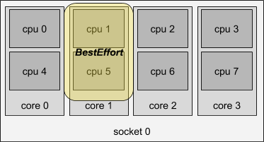

# Per-QoS-Class CPU Affinity Hints

## Table of Contents

* [Per-QoS-Class CPU Affinity Hints](#per-qos-class-cpu-affinity-hints)
  * [Table of Contents](#table-of-contents)
  * [Summary](#summary)
     * [Compatibility with ISOLCPUS / equivalent systemd configuration](#compatibility-with-isolcpus--equivalent-systemd-configuration)
  * [Motivation](#motivation)
     * [Goals](#goals)
     * [Non-Goals](#non-goals)
  * [Proposal](#proposal)
     * [Changes to existing components](#changes-to-existing-components)
     * [Examples](#examples)
        * [Variant 1: Batch workloads targeting AVX, run as Best-Effort](#variant-1-batch-workloads-targeting-avx-run-as-best-effort)
        * [Variant 2: Workloads targeting AVX, run as Burstable or Guaranteed](#variant-2-workloads-targeting-avx-run-as-burstable-or-guaranteed)
        * [Variant 3: Statically partitioned nodes for AVX and non-AVX workloads](#variant-3-statically-partitioned-nodes-for-avx-and-non-avx-workloads)
        * [ISOLCPUS Compatibility](#isolcpus-compatibility)
     * [Implementation Details/Notes/Constraints](#implementation-detailsnotesconstraints)
        * [Compatibility with existing CPU manager policies](#compatibility-with-existing-cpu-manager-policies)
     * [Risks and Mitigations](#risks-and-mitigations)
  * [Alternatives](#alternatives)

## Summary

Mitigate frequency scaling side effects of SIMD ISA usage in a shared environment. Executing vector or SIMD (single-instruction, multiple-data) instructions can require more power than scalar instructions. To mitigate this, processors may lower their clock speed to continue operating under their TDP (Thermal Design Power.) This frequency downscaling affects all workloads executing on that processor, regardless of instruction mix.

There are two frequency numbers to consider: the base frequency, which is guaranteed, and the max turbo frequency. In recent Intel chips, as more CPU cores are loaded, the instantaneous frequency trends toward the base frequency. The base frequency and max turbo frequency are both lower in certain scenarios, such as when more cores are busy with SIMD instructions. ISA extensions can have differing effects on the frequency at which the processor operates. For example, AVX512 instructions may have a larger frequency scaling effect than SSE4 or AVX2 instructions.

### Compatibility with ISOLCPUS / equivalent systemd configuration

"Isolcpus" is a boot-time Linux kernel parameter, which can be used to isolate CPU cores from the generic Linux scheduler. This kernel setting is routinely used within the Linux community to manually isolate, and then assign CPUs to specialized workloads. These CPUs are excluded from periodic load-balancing by the default process scheduler (CFS). This parameter is used to support low-latency use cases such as software packet forwarding in userspace.

## Motivation

Related issues: https://github.com/kubernetes/kubernetes/issues/67355

This behavior is documented in the [Intel optimization guides](https://computing.llnl.gov/tutorials/linux_clusters/intelAVXperformanceWhitePaper.pdf) as well as being [well described](https://www.anandtech.com/show/11544/intel-skylake-ep-vs-amd-epyc-7000-cpu-battle-of-the-decade/8) in consumer computing publications. 

### Goals
 - Allow operators to perform some basic system partitioning to address the scenarios outlined above.

### Non-Goals
 - TBD

## Proposal

Main idea: Allow operators to hint container CPU affinity based on Quality-of-Service class.

### Changes to existing components

Add two new configuration values to the Kubelet:
 - `be-cpuset` (CPUs on which BestEffort can run)
 - `other-cpuset` (CPUs on which Burstable and Guaranteed can run)

Both `be-cpuset` and `other-cpuset` default to all available CPUs.

Update the Kubelet's computation for the allocatable quantity of CPUs:

`min((ALL – sys.reserved - kube.reserved), #OTHER)`

Enforce configured CPU affinity by updating the CPU manager.

Update the CPU Manager static policy to initialize the allocatable CPU pool from the configured `OTHER` cpuset.

### Examples

The following illustrates how the motivating use cases can be satisfied given the proposed changes. Let `ALL`, `ISOLCPUS`, `BE` and `OTHER` be sets of CPU IDs.

#### Variant 1: Batch workloads targeting AVX, run as Best-Effort

Configure `BE` to be a subset of `ALL`. The size of the chosen set represents an acceptable trade-off for your environment, effectively limiting the frequency downscaling due to SIMD and TDP (by capping the number of physical cores issuing AVX instructions.)

*Figure 1: Example BestEffort cpuset. If AVX instructions are only run as `BE`, then this caps the number of physical cores that can issue AVX instructions to one.*

**Optional extension (out of tree):**

An operator might prefer local users to be explicit about mapping pods that use a particular ISA extension to a target QoS class. A validating admission controller could validate for example that pods labeled "AVX" run in the BestEffort QoS class. A more opinionated admission controller could mutate the pod spec, removing resource requests from "AVX" pods, thereby forcing them into the BestEffort class. This or similar mechanisms could exist outside of core Kubernetes, following recommendations from hardware vendors.

#### Variant 2: Workloads targeting AVX, run as Burstable or Guaranteed

Enable the existing CPU manager static policy. Use existing ability to advertise extended resources to allow a limited number of "AVX cores". Enforce that if a container consumes the "AVX cores" resource:
- AVX Cores = CPU
- QoS class is Guaranteed
No more than the advertised amount of AVX cores will issue AVX instructions.

**NOTE:** Can be done today even without this proposal. Compatible with variant 1 above.

#### Variant 3: Statically partitioned nodes for AVX and non-AVX workloads

Use existing features such as taints, tolerations, node labels and node affinity to partition the node pool into AVX and non-AVX.

**NOTE:** This is possible today without this proposal, but can negatively affect cluster efficiency.

#### ISOLCPUS Compatibility

Quoting pending KEP [#2435](https://github.com/kubernetes/community/pull/2435) by [@Levovar](https://github.com/Levovar):

> Another alternative could be to enhance an already existing kubelet configuration flag so it can explicitly express a list of CPUs to be excluded from kubelet's list of node allocatable CPUs.

This proposal takes a similar approach. Using our mnemonics for the involved sets, an operator can configure the host and Kubelet such that:

- `ALL = UNION(ISOLCPUS, BE, OTHER)`
- `ALL - BE - OTHER = ISOLCPUS`

NOTE: Deciding whether the intersection of `BE` and `OTHER` is non-empty is independent, and compatible with, respecting node-level partitioning as described in this example.

### Implementation Details/Notes/Constraints

#### Compatibility with existing CPU manager policies

 - **Static policy**: Because the advertised CPU quantity cannot exceed the cardinality of the `OTHER` cpuset, the scheduling math will work as before. There are no new scenarios where a pod can be correctly bound by a scheduler but fail admission by the Kubelet, etc.
- **None policy**: TBD: should the None policy be updated to respect the new configuration?
- **Dynamic policy (planned)**: The proposed configuration values constitute constraints under which the dynamic policy should operate. However, these constraints are not overly prescriptive and should leave sufficient design space open for this policy.

### Risks and Mitigations

- All of the approaches in this proposal depend on cooperative workload classification. There may not be another option since to date because:
  - it is difficult to infer instructions issued by a particular process
  - it is not possible to disable AVX at the hardware level

## Alternatives

1. Dynamic CPU manager policy that is smart enough to infer frequency scaling, and optionally constrain AVX workloads based on workload mix and relative priority.
2. Use dedicated nodes for AVX.
3. Use pod affinity / anti-affinity so that AVX and non-AVX pods repel each other (soft partitioning)

