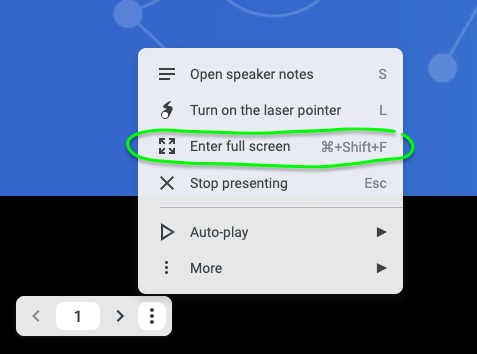

# Video Recording Guide for Contributor Workshop Segments

This guide covers, how to structure, record, upload and update video guides associated with workshop segments.

- [Video Recording Guide for Contributor Workshop Segments](#video-recording-guide-for-contributor-workshop-segments)
  - [Format / Video Style](#format--video-style)
  - [Encoding Guidelines](#encoding-guidelines)
    - [Zoom Recording](#zoom-recording)
    - [OBS](#obs)
    - [Streamyard](#streamyard)
    - [Adobe Media Encoder](#adobe-media-encoder)
  - [Recording Guides](#recording-guides)
    - [Recording in Zoom](#recording-in-zoom)
      - [Install Windowed extension (optional)](#install-windowed-extension-optional)
      - [Start the meeting](#start-the-meeting)
      - [Setting up slides for recording](#setting-up-slides-for-recording)
        - [Without browser extension](#without-browser-extension)
        - [With browser extension](#with-browser-extension)
          - [Note : Exiting the windowed mode](#note--exiting-the-windowed-mode)
      - [Adding your facecam](#adding-your-facecam)
      - [Unmute your audio](#unmute-your-audio)
      - [Recording in Zoom](#recording-in-zoom-1)
        - [Note : Do a test recording first](#note--do-a-test-recording-first)
        - [How to record](#how-to-record)
    - [Recording in OBS](#recording-in-obs)
    - [Recording in Streamyard](#recording-in-streamyard)
  - [Updating / Adding video to a segment](#updating--adding-video-to-a-segment)
    - [Rename your recording](#rename-your-recording)
    - [Update Google Drive](#update-google-drive)
      - [Uploading your video](#uploading-your-video)
        - [What folder to upload to](#what-folder-to-upload-to)
    - [Updating Youtube](#updating-youtube)
      - [Upload the new video](#upload-the-new-video)
        - [Adding the thumbnail image](#adding-the-thumbnail-image)
        - [Setting the description](#setting-the-description)
      - [Update the previous video for the segment if it exists](#update-the-previous-video-for-the-segment-if-it-exists)
        - [Update the title](#update-the-title)
        - [Update the thumbnail image](#update-the-thumbnail-image)
        - [Update the Description](#update-the-description)
        - [Update the Comments](#update-the-comments)
      - [Updating the Segment page with video](#updating-the-segment-page-with-video)
  - [Best Practices & Recommendations](#best-practices--recommendations)
    - [Video](#video)
      - [Camera Type](#camera-type)
    - [Audio](#audio)
      - [Microphone Types](#microphone-types)
      - [Sound Environment](#sound-environment)
        - [Background Noise](#background-noise)
        - [Other Tips](#other-tips)
    - [Screensharing](#screensharing)
    - [Hardware](#hardware)
      - [Headset Microphones](#headset-microphones)
      - [External Microphones](#external-microphones)
      - [Webcams](#webcams)
      - [Presentation remotes](#presentation-remotes)

## Format / Video Style

You can use any format/style as long as the same information in the guide is captured in the video. Slides, A screenshare, greenscreen yourself into the repo even! Be creative.

## Encoding Guidelines

### Zoom Recording
Handled by zoom, Can't change these settings.

### OBS
(todo : match with media encoder)
type : standard
recording format : mp4
encoder: x264
rescale: 1920x1080
rate control : VBR
bitrate : 16000kbps
CRF : ???

### Streamyard
Handled by Streamyard, Can't change these settings.

### Adobe Media Encoder
use Youtube 1080p Full HD

## Recording Guides

Guides on how to record a presentation style video (slides/screen,facecam)

### Recording in Zoom

#### Install Windowed extension (optional)
This makes it easier for you to share the slides to zoom. Allows you to pop out the fullscreen view to a single window.

[GitHub Link](https://github.com/dralletje/Windowed)

#### Start the meeting

Start a meeting in zoom (you can start and record a meeting with a single participant)

#### Setting up slides for recording

Open your slides in Presenter View


It should open a presenter view, with a timer, slide notes, and change the tab from editor to a slideshow presentation


You will use the presenter view to control the slides, and the slide view will be cast to the zoom call.

##### Without browser extension

Share the window which is displaying the slides view.


##### With browser extension

When moving your mouse on the slide view a small dialog with the slide number, and triple dots will appear. Select the triple dots and enter full screen



After selecting the fullscreen option, you will be presented further options on how to display the slides.

Select the windowed option


A new window with only the slides will appear, Share this window in zoom.


###### Note : Exiting the windowed mode

To exit out of this view, and go back the editor, select the window with the slide view back into focus, move your mouse until the triple dots mentioned earlier appear. Select the triple dots again and ``Exit Full Screen``


#### Adding your facecam

If you haven't done so already, start your video in Zoom.

#### Unmute your audio

If you haven't done so already, unmute your audio in Zoom.

#### Recording in Zoom

Now that you've got your slides, video and audio setup, you're ready to record!

##### Note : Do a test recording first

It's good practice to create a test recording of your whole setup in action.
If you change shares between windows, check that changing the shares appears how you want it to in the video.

##### How to record

Select the ``Record`` button in zoom.

If you have the option between saving locally, and in the cloud, select locally.

Once you have finished recording, end the meeting.

A popup should appear with progress on converting the recording.
Once the recording is converted, a file browser window with the recording will be opened. Rename the recording from ``zoom_0.mp4`` to the format described in [Rename your recording](#rename-your-recording)

### Recording in OBS

Coming soon

### Recording in Streamyard

Coming soon

## Updating / Adding video to a segment

### Rename your recording

Rename your recording to ``YYYY-MM-DD-<Segement Name>-<gh-handle>.mp4`` 

Where 
* ``YYYY-MM-DD`` being date, is the date video was recorded
* ``<Segement Name>`` being the name of the markdown file associated with that segment. see [CONTRIBUTING.md](https://github.com/kubernetes/contributor-site/tree/workshop/content/en/workshop/CONTRIBUTING.md#list-of-segments)
* ``<gh-handle>`` being the github handle of the person who recorded the video, if there are multiple presenters just add another dash and the handle. ``<gh-handle>-<gh-handle>``

For example

``2021-05-10-why-contribute-alisondy.mp4`` 
``2021-05-10-why-contribute-alisondy-mrbobbytables.mp4`` 

### Update Google Drive

#### Uploading your video

You will upload your recording to the folder associated with your segment. More details in [What folder to upload to](#what-folder-to-upload-to)

##### What folder to upload to
There should be a folder for your segment. If one doesn't exist, create a new one with the segment name.

segment name being the name of the markdown file associated with that segment. see [CONTRIBUTING.md](https://github.com/kubernetes/contributor-site/tree/workshop/content/en/workshop/CONTRIBUTING.md#list-of-segments)

For example

``why-contribute``

### Updating Youtube

Once you have uploaded the video to drive, upload it to youtube, and update the previous recording on youtube ( if any )

#### Upload the new video

In youtube, upload the same video and title it as follows

```txt
Contributor Workshop : <Segment Name> with <Presenter Name> | <Month> <Year>
```

For example

```txt
Contributor Workshop : Why Contribute? with @alisondy | May 2021
```

##### Adding the thumbnail image

```markdown
TODO : Instructions on how to generate a thumbnail image, similar to https://gist.github.com/alisondy/e4ff3b483a32330ade0c880b4a4a10b1
```

Set the thumbnail to the image generated in the previous step

##### Setting the description

Use the following template for setting the video description

```txt
This is the video guide for the Contributor Workshop segment <Segment Name>

Link to this segments page:
https://kubernetes.dev/docs/workshop/<page-name>

Link to the workshop:
https://kubernetes.dev/docs/workshop/
```

#### Update the previous video for the segment if it exists

If you're updating an already existing video, follow the next steps to update the following on the previous video
- title
- thumbnail
- description
- comments section

##### Update the title
Update the title on the previous video to match the following format

```txt
Contributor Workshop : <Segment Name> | <Month> <Year> | 🚨🚨 DEPRECATED 🚨🚨
```

For example

```txt
Contributor Workshop : Why Contribute? with @alisondy | May 2021 | 🚨🚨 DEPRECATED 🚨🚨
```

##### Update the thumbnail image

Update the Thumbnail image on the previous video to

insert-deprecation-thumbnail-here.jpeg
```txt


THIS VIDEO IS DEPRECATED!
See the comments & description for details on where to find the new video guide!


```

##### Update the Description

On the previous video, add the following to the start of the description
```txt
🚨🚨 DEPRECATED , Please see <link to new video> 🚨🚨
```

##### Update the Comments

On the previous video, add the following as a comment as Kubernetes YT & pin to the top of the comments

```txt
🚨🚨 DEPRECATED , Please see <link to new video> 🚨🚨
```

Close the comment section of the deprecated video

#### Updating the Segment page with video

If adding to a segment page where video doesn't exist, Paste this at the top, after the frontmatter. Fill in the details with the youtube id of the video you just uploaded.

If adding to a segment page where a video already exists, update the youtube id in the shortcode, with the video id of your newly uploaded video.

```txt
## Video Walkthrough


```

## Best Practices & Recommendations

### Video

#### Camera Type
Use an external camera or webcam to capture your video. 

Built in webcams restrict the angle of you webcam, to the viewing angle of your display, and often provide a low quality image.

* Use an external webcam. 1080p preferred or 720p at a minimum. Typically, either will be better quality than the built-in camera on your laptop.
* Lighting - Adjusting your lighting may help you get a better camera feed in less than optimal lighting conditions. 
  * Optimize the ambient lighting within your space first. 
    * There should be no window or strong light source behind you that darkens your face
    * There should be no strong light source from one side that casts a shadow on the opposite side of your face.
    * Good ambient lighting from your ceiling lights or windows may be enough as long as they are in front of you. 
    * Diffused lighting is better than harsh, direct lighting.
*   Background – keep it clean and uncluttered. It’s great to show off your personality/style in your home, just be sure to keep everything appropriate for a general audience and compliant with the Code of Conduct. A plain wall is also just fine, no need to overdo it.
* Camera Position - as close as possible at your eye level, not pointing up towards your nose or the ceiling, or down towards the floor. It can be as simple as raising your laptop via a few books. Or if you have an external webcam, position it on the top edge or close to the top of the screen from which you are advancing your slides/notes.
* Keep eye contact with the camera just like you would look at your audience during an in-person presentation. It's okay to look away for brief moments, just make sure you look towards the camera for the majority of the presentation.
*  Video with more lighting tips [https://youtu.be/rGcAM1CNEU0](https://youtu.be/rGcAM1CNEU0)

### Audio

#### Microphone Types

**Best:** External microphone (condenser recommended over dynamic*) via a USB connection or DAC. This type of microphone will pick up audio from a distance as well as up close really well. This means you can position it a fair distance away from yourself when recording. If using one of these microphones, try to position it out of frame from your video.

**Good:** Headset Microphone, this could be a microphone located on the wires like on mobile earphones, the mic on your wireless earphones as well as the usual fold down microphone on a headset. All of these assist with isolating microphone pick-up from ambient noises within your recording/streaming space. Wired headsets will give you better quality audio than wireless.

**Acceptable:** External microphone built into your webcam. Often better quality than your built-in laptop microphone.

**Worst:** Your built-in laptop microphone. These are generally low-quality microphones, and they have little or no ability to filter out background noise.

#### Sound Environment

##### Background Noise
It’s best to be in a controlled environment with little to no background noise.
If this is not possible you can use your recording software and other software to remove background noise.
Another option to filtering out background noise or being in a controlled environment is using push to talk, or unmuting your mic whenever you need to speak.

** Removing Background noise in Zoom**

In zoom settings under ``Audio``
Change the Suppress background noise setting to ``High``

** Removing Background noise with Krisp**

Krisp provides AI powered background noise cancellation, see [krisp.ai](https://krisp.ai/) for more information.

** Removing Background noise with NVIDIA Broadcast or RTX Voice**

If you're using Windows, and are using certain models of NVIDIA GPU, you can install either NVIDIA Broadcast or RTX Voice to filter out background noise. See [RTX Voice setup guide](https://www.nvidia.com/en-us/geforce/guides/nvidia-rtx-voice-setup-guide/) and [Broadcast app setup guide](https://www.nvidia.com/en-gb/geforce/guides/broadcast-app-setup-guide/) for more information.

##### Other Tips
* Mute all notifications and programs not being recorded
* Disable any unnecessary audio devices

### Screensharing

* Increase the font size when sharing terminals, text editors
* Ensure you have all the windows you need opened before recording.
* Export any sensitive variables needed in your terminals before starting your presentation
* If using a passworded ssh key, Start a ssh-agent in the terminal beforehand.

### Hardware

Here are some equipment recommendations from the CNCF:

#### Headset Microphones

Logitech / Plantronics – i.e. Logitech H111 / Logitech H390 / Plantronics C225

#### External Microphones

Blue / Samson – i.e. Blue Snowball / Blue Yeti / Samson Meteor / Samson G-Track

#### Webcams

Good value – Logitech C270

Value + added features – Logitech B525/C615

Higher resolution, better microphone – Logitech 9series / Microsoft LifeCam 

More info – https://www.tomsguide.com/news/where-to-buy-webcams-now-these-retailers-have-stock

#### Presentation remotes

Logitech / Canon / Kensington / SMK

Tested and recommended for PC or Mac – Logitech R400, R800, Spotlight / Canon PR500, PR100
