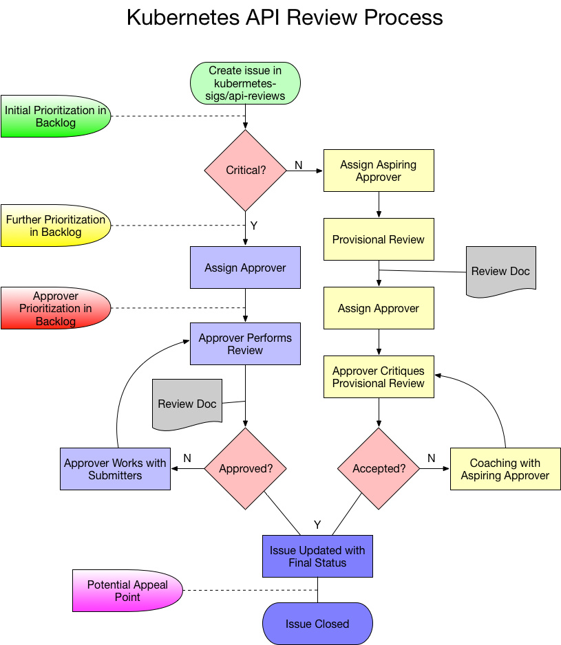

# Kubernetes API Review Process

[API Approvers](mailto:kubernetes-api-reviewers@googlegroups.com): [Clayton Coleman](https://github.com/smarterclayton), [Jordan Liggitt](https://github.com/liggitt), [Tim Hockin](https://github.com/thockin), [Brian Grant](https://github.com/bgrant0607), [Eric Tune](https://github.com/erictune)

# Process Overview and Motivations

Due to the importance of preserving usability and consistency in Kubernetes APIs, all changes and additions require expert oversight. The API review process is intended to maintain logical and functional integrity of API implementations over time, the consistency of user experience and the ability of previously written tools to function with new APIs. Wherever possible, the API review process should help change submitters follow [established conventions](https://github.com/kubernetes/community/blob/master/contributors/devel/api-conventions.md), and not simply reject without cause. 

Because expert reviewer bandwidth is extremely limited, the process provides a curated backlog with highest priority issues at the top. While this does mean some changes may be delayed in favor of other higher priority ones, this will help maintain critical project velocity, transparency, and equilibrium. Ideally, those whose API review priority is shifted in a release-impacting way will be proactively notified by the reviewers.

# Goals of the process

* Provide an easily-navigable process so all parties understand their roles, responsibilities, and expectations

* Protect Kubernetes APIs from disruptive, inconsistent, or destabilizing changes

* Respect, gate, and expand expert reviewer bandwidth while maintaining consistent flow across the process

* Provide transparency, including clear feedback and path forward for API contributors

* Maintain the high standards of the project, including positive user interactions with APIs

* Provide review regardless of method of API defininition (built-in, Extension API Server, or Custom Resource Definition)

* Provide review over both tightly coupled external projects and in-tree API changes.  

* Provide a platform for commenting on popular extensions' APIs, so as to encourage the spread of good API practices throughout the ecosystem

# Non-goals of the process

* Creation or maintenance of the API standards documentation

* Being a "rubber stamp" for changes

# Process Description

## Intake Pre-review Checklist

* The change/addition has been reviewed by the appropriate sub-project stakeholders and SIG chairs as needed, or else the request may be rejected pending initial review

* A KEP has been created if introducing:

    * Any new resource type

    * Any new version of a stable API

    * Any major new functionality added to a stable API as defined by SIG Architecture and the API Reviewers

## What APIs need to be reviewed?

* What are the kind of reviews?

    * **mandatory**: The changer is expected to submit the changes to API review, and the change is blocked on the API reviewer approval 

    * **voluntary**: Changer can request a review, or a 3rd party can nominate the API for review.  The review comments are recommendations.

* Which projects are in scope?

    * github.com/kubernetes/kubernetes, and any kubernetes-* org projects it depends on are required to be reviewed.   (mandatory)

    * any other github projects in the kubernetes-* orgs (informational, for now - may make mandatory in future)

    * Any projects that produce APIs (including CRDs) that are intended to work with kubectl and/or kube-apiserver. (informational - intent is to ensure consistent user experience across the Kubernetes ecosystem)

    * "Critical" or other “highly-integrated” APIs, such as our extension points in the node, apiserver, and controllers as defined by SIG Architecture [TBD].  (mandatory)

* All API implementations (including alpha versions) that are part of kubernetes must be reviewed, including CRDs, so user experience across the Kubernetes ecosystem is consistent.

* What parts of a PR are "API changes"?

    * "Resource APIs" include the versioned data definition (pkg/apis/*/v*/types.go or OpenAPI for CRDs), validation (pkg/apis/*/validation.go or OpenAPI for CRDs).

    * Configuration files, flags, and command line arguments are all part of our user and script facing APIs and must be reviewed.

    * Compiled-in APIs of the kube-apiserver

    * Webhooks request/response formats in kube-apiserver

    * HTTP APIs in kubelet

    * plugins which are not covered by some other standards effort (e.g. CSI and CNI APIs would be deferred to those standards bodies)

## End-states of Reviews

The API review process can result in multiple outcomes depending on the content of the change. For example, a new API could be approved for being builtin, or rejected in favor of out-of-tree development. An API that is reviewed informationally, results in either suggestions for changes, or approval as-is. 

## Information required from the submitter

As much as possible, we will automate the detection of PRs that require API reviews.  Significant changes should be reviewed BEFORE they reach the PR stage, but this is the backstop for anything that gets missed.  Such automation may miss cases, so any PR can be flagged as "needs API review", which triggers this process.

To begin the process, the proposer must produce:

* Create an issue in the kubernetes-sigs/architecture-tracking repository that links to the relevant KEP or documentation

* The KEPs/documentation should include A clear and thoroughly-researched justification on why the change or addition is needed, including, upgrade/downgrade considerations, and alternatives considered.

* The proposer may follow one of two paths:

    * Complete the coding of the API change.  Create a PR.  Request an API review on the PR.  (In future, the request will be automated based on detecting API changes). The API reviewer will /approve the PR, assuming the change was satisfactory

    * Write the KEP/documentation including a detailed description of the API.  Request a review on that.  The API reviewer will note in the API review issue the commit SHA at which the KEP was reviewed.  The reviewee will note the API review issue number.  Later, when the PR is ready to add the API, the reviewee files another review ticket (per above path).  The review is expedited because the reviewer only needs to compare the current PR to what was previously approved.  This two step process allows for automation, and allows for KEPs to get API approval before moving forward.

*  explicit approvals by SIG stakeholders are not checked in the API review process.  This is assumed to be given at the PR stage.

* Any additional GitHub IDs associated with the submission (particularly in the case of multiple authors)

* Acknowledgement that they have read and followed the existing API conventions document 

## Information to be provided from the reviewer(s)

If **approved**/**reviewed**:

* Any non-blocking or nit suggestions should be documented in the review document that will be stored in the repository

* The feedback should be made in the issue with APPROVED or  REVIEWED (for externally-maintained CRDs or external components where there is only feedback, not approval)

* Final status in the issue should be given along with @ notifications for the submitter(s) so they are informed when the review is complete

If **rejected**:

* If completely rejected, e.g. "please do this work outside the Kubernetes org" - an explanation of why the change was rejected - appeals can be requested from the api-approvers mailing list ([kubernetes-api-reviewers@googlegroups.com](mailto:kubernetes-api-reviewers@googlegroups.com)) where the moderator will coordinate a follow-up review.  If that request results in another rejection, there is no further appeal.

* If rejected with "changes requested" - an explanation in the review document of what exactly needs to be changed and why (prior decisions, standards, etc.)

* All applicable in-tree or critical PRs and Issues will be noted as not approved with UNAPPROVED until they successfully pass a review

* Final status in the API Review issue should be given along with @ notifications for the submitter(s) so they are informed when the review is complete

## The Moderator Role

The moderator role is staffed by SIG Architecture and manages the API review backlog on behalf of the reviewer team. They will ensure that reviews are finished within a reasonable time, that information is correct, and that appropriate state labels are applied. They may also help prioritize the backlog, or move cards across the project board. Their mission is to help reviewers spend the majority of their efforts on performing reviews, not doing process administrivia. They may also work with the review team to schedule face-to-face review sessions as needed, or ensure the review is added to the SIG-Architecture meeting agenda.

## Process mechanics (see diagram above)

Timing of API review requests matters.  The larger the change the more time that must be afforded.  New API resources (aka Kinds) may require significantly more thought than single field additions.  API reviews that are requested too late in a release cycle may not complete in time to make the release.  Plan ahead. Also, if you are changing an approved API, you must consult with the [kubernetes-api-reviewers@googlegroups.com](mailto:kubernetes-api-reviewers@googlegroups.com) list to ensure it is still consistent with the approvals already granted. From a process perspective, you would request a new review in that case.

New APIs (groups or Kinds) or substantial changes require KEPs.  Major changes without KEPs will be rejected.

1. Create an API Review request issue in [https://github.com/kubernetes-sigs/architecture-tracking](https://github.com/kubernetes-sigs/architecture-tracking) - the work will be tracked in the corresponding project board

    1. Provide the following information:

        1. Submitter GitHub IDs

        2. Links to code/issues/documentation/KEP (keep in mind that all code will need review as well, as translation errors between proposals/markdown can and do happen)

        3. One line description of the purpose

        4. Acknowledgement of reading/following the API conventions document

2. If the work is currently in GitHub kubernetes/kubernetes (or other explicitly-critical repository) as either a pull request or issue, add a link to the PR/Issue pointing at the API Review request issue

3. An approver or moderator will adjust the prioritization of the request in the backlog, assign an approver (or potentially aspiring reviewer), and add the label status/assigned-to-reviewer (see *training reviews* below for the aspiring reviewer workflow)

4. Assigned approver will either start the review, work with the moderator to schedule face-to-face discussions during SIG-Architecture, or lower its priority in the backlog. They may also request that other reviewers be involved at their discretion.

5. Once the review is completed, the report will be made available to the submitters and one of the three labels applied: APPROVED  REVIEWED or UNAPPROVED These may also be added after face-to-face discussions.

6. Either an appeal happens, or the issue is closed

## Expanding the Reviewer and Approver Pool

There are two levels of authority granted in this process. The reviewer and approver. Reviewers have the expertise to fully assess and make recommendations such that minimal extra effort is required on the part of the approver. Approvers are vested with final decision-making power for the request, and can only be appealed in the manner stated above. 

To become a formal reviewer, you must gain a high level of proficiency in understanding the API conventions, project structure, and the underlying architecture. The best path is to study the work of other aspiring reviewers and approvers. Once familiar with the core concepts, one should contact the moderator to be matched with a reviewer mentor who can help facilitate their eventual inclusion as a formally-recognized reviewer. All issues in the API Reviews backlog can receive an initial pass by a non-approver. These trial run reviews can then be examined and critiqued by other reviewers or approvers. 

The path from reviewer to approver requires significant reviewer experience, endorsement from their mentor, and a body of successfully-completed training reviews.  Aspiring approvers can petition for inclusion in the OWNERS file by sending an email to the SIG-Architecture and Kubernetes-api-reviewers mailing lists with the subject "**Request for API ****Approver**** Status**" with links to all of their completed reviews for the prior six month period. If all of the current approvers LGTM the issue, then the submitter may open a PR against the OWNERS file with their name added.  

To qualify, aspiring approvers should reference at least 5 provisional reviews of new API types and 10 provisional reviews of changes to existing API types with no substantive disagreement or additions by approver. Aspiring approvers must be able to demonstrate competence both for new API review and for compatibility concerns with modifications to existing APIs.

An indication of whether a provisional review was seen as qualifying should be part of the critique/coaching feedback given ("your provisional review caught everything important that I saw, +1")

### Training Reviews

For those wishing to become formal reviewers, the process has an alternate path where API reviews that are not time-sensitive can be initially reviewed, and then collaboratively examined with an approver/mentor. This can be accomplished asynchronously as comments in the review document, or ideally by pairing on the approver examination. 

Once the provisional review has been accepted by the approver, it then goes to the submitters just as it would in the normal process. 

As aspiring reviewers gain proficiency, they may pair with an approver on time-sensitive reviews to better understand the process with less impact on the review duration. 

Aspiring reviewers should reach out the the moderator on slack.  The moderator will add them to the list of aspiring reviewers and assign training reviews as they become available. 

## Aspirations for future iterations of this process

* Make a video on this process as guidance for contributors

* Review the API conventions doc for freshness and organization

* Separate and keep separate the process and the API conventions parts of all our docs.  That way, people who are not subject to our process can read a more succinct set of docs on how to make good APIs.

* Consider a new home for our API docs that is prettier than Github-flavored markdown ( a new tab on kubernetes.io or a new site) 

* Given the level of completeness of the conventions this process should generate documentation of undocumented conventions, which might be pre-existing, or might be new.

* Ideally this process should lend itself to some automation. It currently does not. [ TBD: Create an umbrella issue for this ]

    * [We already tag PRs with api-change](https://github.com/kubernetes/test-infra/blob/1611f3be80713f9df933e25e4cf9a2b538302ef5/mungegithub/misc-mungers/deployment/kubernetes/path-label.txt#L7-L17)

        * We should review whether this can be improved

        * We should look at tabulating these changes at the end of the release

    * We should consider autogenerating API changes docs from openapi, or at least making it easy to review the set of changes

    * We should automate mechanical API review checks

        * For example, this PR: [https://github.com/kubernetes/kubernetes/pull/54887](https://github.com/kubernetes/kubernetes/pull/54887) 

* We may want to move toward the idea and process for "shadow reviewers" outlined in reference [1]

* We need to update other docs to point to this document

* [Updating-docs-for-feature-changes.md](https://github.com/kubernetes/community/blob/930ce65595a3f7ce1c49acfac711fee3a25f5670/contributors/devel/updating-docs-for-feature-changes.md#when-making-api-changes)

* [https://github.com/kubernetes/community/blob/be9eeca6ee3becfa5b4c96bedf62b5b3ff5b1f8d/contributors/devel/api_changes.md](https://github.com/kubernetes/community/blob/be9eeca6ee3becfa5b4c96bedf62b5b3ff5b1f8d/contributors/devel/api_changes.md)

* [https://github.com/kubernetes/community/blob/be9eeca6ee3becfa5b4c96bedf62b5b3ff5b1f8d/contributors/devel/api-conventions.md](https://github.com/kubernetes/community/blob/be9eeca6ee3becfa5b4c96bedf62b5b3ff5b1f8d/contributors/devel/api-conventions.md)

* [Pull-requests.md](https://github.com/kubernetes/community/blob/a74d906f0121c78114d79a3ac105aa2d36e24b57/contributors/devel/pull-requests.md#2-smaller-is-better-small-commits-small-prs) - should be updated to specifically call out API changes as important

* [Owners.md](https://github.com/kubernetes/community/blob/a74d906f0121c78114d79a3ac105aa2d36e24b57/contributors/devel/owners.md#code-review-process) - should be updated

* We should probably add a checkpoint in the release process that covers focused API review

* We should probably re-review all API changes in a release as part of documentation creation as a "last-chance" guarantee of ensuring we don’t ship something we don’t want to support

* We need a special process for "informational" or non-binding reviews

* [https://docs.google.com/document/d/1OkSQngGem7xaENqaO8jzHLDSSIGh2obPUaJGAFDwTUE/edit?disco=AAAAB_-Yzjw](https://docs.google.com/document/d/1OkSQngGem7xaENqaO8jzHLDSSIGh2obPUaJGAFDwTUE/edit?disco=AAAAB_-Yzjw) 

## References

[1] [https://storage.googleapis.com/pub-tools-public-publication-data/pdf/45294.pdf](https://storage.googleapis.com/pub-tools-public-publication-data/pdf/45294.pdf) 

[2] [http://wiki.netbeans.org/APIReviews](http://wiki.netbeans.org/APIReviews) 

[3] [https://cwiki.apache.org/confluence/display/TS/API+Review+Process](https://cwiki.apache.org/confluence/display/TS/API+Review+Process) 

[4] [https://docs.google.com/document/d/135PQSFTDqUmxsBhG7ZwMYtfWnJ3XTirsdAvytlkzOd0/](https://docs.google.com/document/d/135PQSFTDqUmxsBhG7ZwMYtfWnJ3XTirsdAvytlkzOd0/) 

[5] [https://github.com/kubernetes/community/pull/419](https://github.com/kubernetes/community/pull/419) 

