```python
%load_ext autoreload
%autoreload 2
```


```python
import pandas as pd
import numpy as np
import plotnine as p9
import sys

sys.path.append("../")
from k8s_survey_analysis import prepare_2019

pd.options.display.max_columns = 999
from textwrap import wrap
from k8s_survey_analysis.plot_utils import (
    make_bar_chart,
    make_likert_chart,
    make_single_bar_chart,
    make_single_likert_chart,
)

# Silence warnings from PlotNine, mostly about overwriting x_scales
import warnings
from plotnine.exceptions import PlotnineWarning

warnings.filterwarnings("ignore", category=PlotnineWarning)
```

## Prepare data so the format is as compatible with the 2018 data as possible


```python
survey_data = prepare_2019.get_df(
    "2019 Kubernetes Contributor Experience Survey PUBLIC.csv"
)
```

## Examine response rates per  day


```python
(
    p9.ggplot(survey_data, p9.aes(x="date_taken"))
    + p9.geom_bar()
    + p9.theme(axis_text_x=p9.element_text(angle=45, ha="right"))
    + p9.labs(x="Survey Date", y="Number of Responses", title="Responses Per Day")
)
```

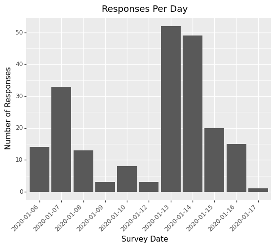


The high spike seen on  1/13/20 aligns with the time when the survey was publicized on Twitter. To consider the potential effects of this, we examine how the response rate varied by various demographic information. 

## Examine response rates by contribution length, level and interest in next level


```python
response_rates = (
    survey_data.groupby(["date_taken", "Contributing_Length", "Level_of_Contributor"])
    .count()
    .reindex(
        pd.MultiIndex.from_product(
            [
                survey_data[survey_data[y].notnull()][y].unique().tolist()
                for y in ["date_taken", "Contributing_Length", "Level_of_Contributor"]
            ],
            names=["date_taken", "Contributing_Length", "Level_of_Contributor"],
        ),
        fill_value=0,
    )
    .reset_index()
)
```


```python
response_rates = response_rates.assign(
    grp=response_rates.Contributing_Length.str.cat(response_rates.Level_of_Contributor)
)
```


```python
(
    p9.ggplot(response_rates,
          p9.aes(x='factor(date_taken)',
                 y='Respondent_ID',
                 group='grp',
                 linetype='Contributing_Length',
                 color='Level_of_Contributor')) + 
    p9.geom_line() + 
    p9.labs(x='Survey Data',
            linetype = "Length of Contribution", 
            color='Contributor Level', 
            y='Number of Responses') +
    p9.theme(axis_text_x = p9.element_text(angle=45, ha='right'))
)

```


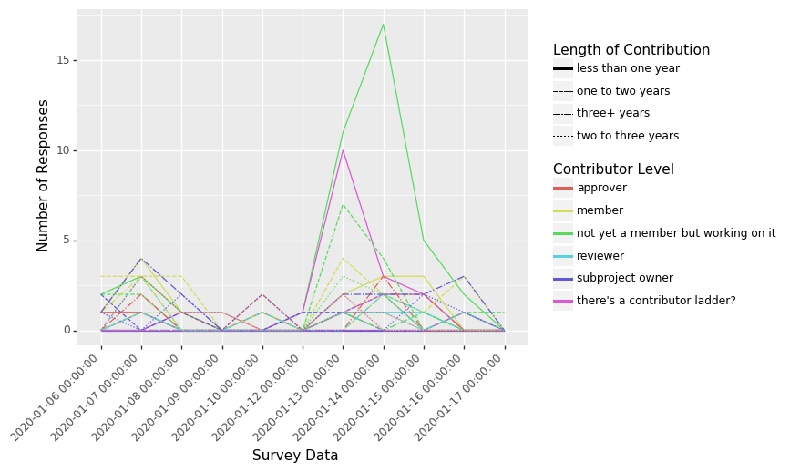


The survey was advertised on Twitter, and two groups had the largest number of disproportionate responses. Those responses came from either contributors working on their membership, or users that have been contributing less than a year. The largest group is users that fall into both categories.


```python
(
    p9.ggplot(survey_data, p9.aes(x="date_taken", fill="factor(Contributing_Length)"))
    + p9.geom_bar()
    + p9.theme(axis_text_x=p9.element_text(angle=45, ha="right"))
    + p9.labs(x="Survey Date", y="Number of Responses", title="Responses Per Day", fill='Contributing Length' )
)
```


```python
(
    p9.ggplot(
        survey_data[survey_data["Level_of_Contributor"].notnull()],
        p9.aes(x="date_taken", fill="factor(Level_of_Contributor)"),
    )
    + p9.geom_bar()
    + p9.theme(axis_text_x=p9.element_text(angle=45, ha="right"))
    + p9.labs(x="Survey Date", y="Number of Responses", title="Responses Per Day", fill='Level of Contributor')
)
```


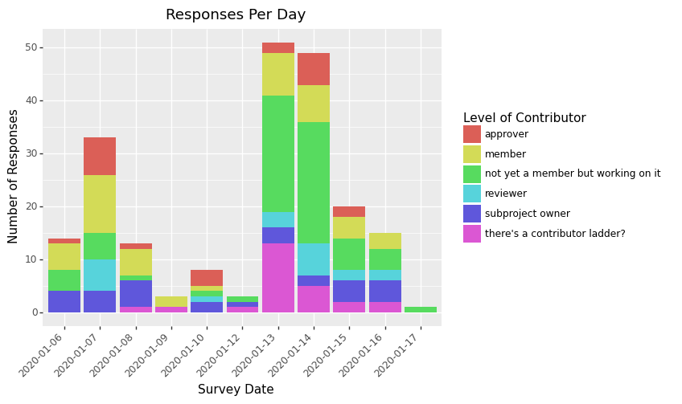


```python
(
    p9.ggplot(
        survey_data[survey_data["Interested_in_next_level"].notnull()],
        p9.aes(x="date_taken", fill="factor(Interested_in_next_level)"),
    )
    + p9.geom_bar()
    + p9.theme(axis_text_x=p9.element_text(angle=45, ha="right"))
    + p9.labs(x="Survey Date", y="Number of Responses", title="Responses Per Day", fill="Interest in Next Level")
)
```

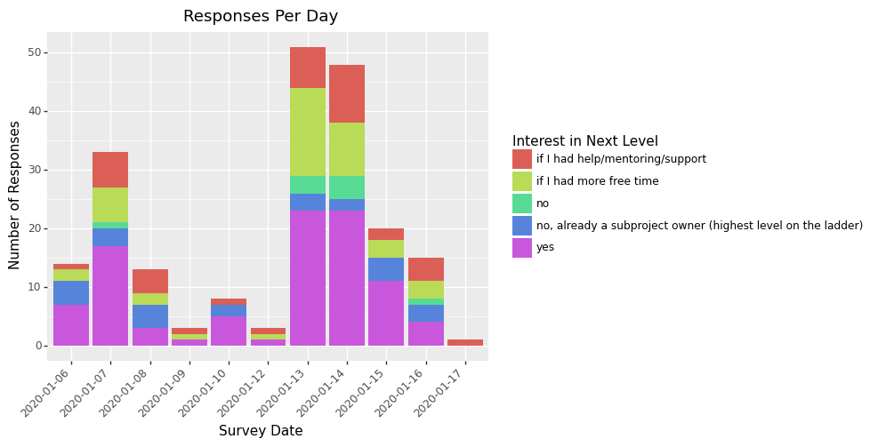


## Univariate histograms

In the following sections, we look at the rest of the demographic variables individually. This allows us to see who responded to the survey.


```python
(
    p9.ggplot(survey_data, p9.aes(x="Contributing_Length"))
    + p9.geom_bar()
    + p9.theme(axis_text_x=p9.element_text(angle=45))
    + p9.scale_x_discrete(
        limits=[
            "less than one year",
            "one to two years",
            "two to three years",
            "3+ years",
        ]
    )
    + p9.ggtitle("Number of Contributors by Length of Contribution")
    + p9.xlab("Length of Contribution")
    + p9.ylab("Number of Contributors")
)
```


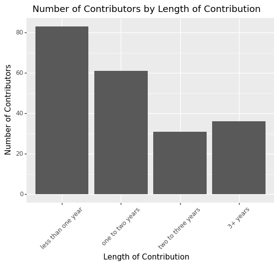


```python
(
    p9.ggplot(
        survey_data[survey_data["Level_of_Contributor"].notnull()],
        p9.aes(x="Level_of_Contributor"),
    )
    + p9.geom_bar()
    + p9.theme(axis_text_x=p9.element_text(angle=45, ha="right"))
    + p9.labs(
        title="Number of Contributors by Contributor Level",
        x="Contributor Level",
        y="Number of Contributors",
    )
    + p9.scale_x_discrete(labels=lambda x: ["\n".join(wrap(label, 20)) for label in x])
)
```


```python
(
    p9.ggplot(
        survey_data[survey_data["World_Region"].notnull()], p9.aes(x="World_Region")
    )
    + p9.geom_bar()
    + p9.labs(
        title="Number of Contributors by World Region",
        x="World Region",
        y="Number of Contributors",
    )
)
```


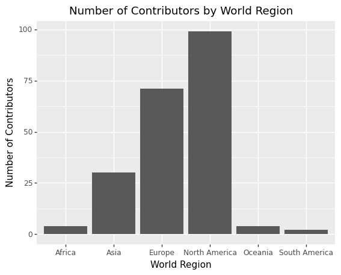


```python
(
    p9.ggplot(
        survey_data[survey_data["Interested_in_next_level"].notnull()],
        p9.aes(x="Interested_in_next_level"),
    )
    + p9.geom_bar()
    + p9.theme(axis_text_x=p9.element_text(angle=45, ha="right"))
    + p9.labs(
        title="Number of Contributors by Interest in Next Level",
        x="Interest in Next Level",
        y="Number of Contributors",
    )
    + p9.scale_x_discrete(labels=lambda x: ["\n".join(wrap(label, 20)) for label in x])
)
```


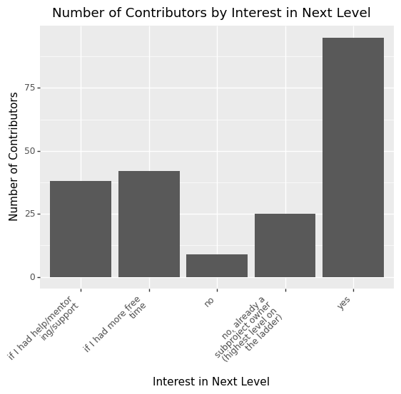


```python
(
    p9.ggplot(survey_data, p9.aes(x="Contribute_to_other_OSS"))
    + p9.geom_bar()
    + p9.theme(axis_text_x=p9.element_text(angle=45, ha="right"))
    + p9.scale_x_discrete(
        limits=["this is my first open source project!", "1 other", "2 or more"]
    )
    + p9.ggtitle("Participation in Other Open Source Projects")
    + p9.xlab("Number of other OSS Projects")
    + p9.ylab("Number of Contributors")
)
```


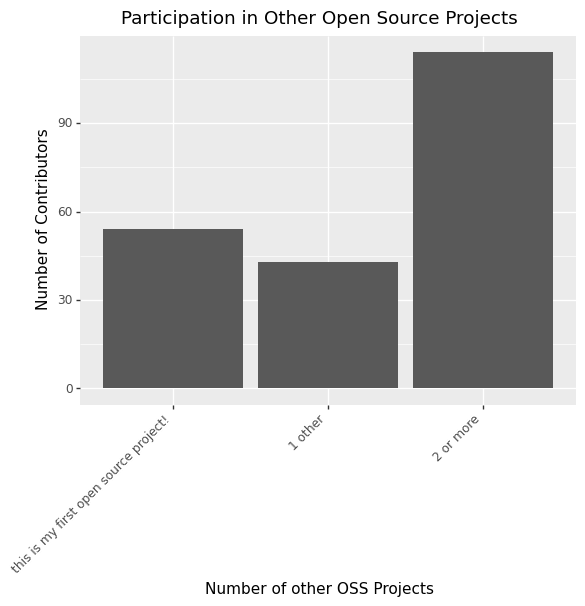


```python
employer_support = (
    p9.ggplot(survey_data, p9.aes(x="Upstream_supported_at_employer"))
    + p9.geom_bar()
    + p9.theme(axis_text_x=p9.element_text(angle=45, ha="right"))
    + p9.labs(title="Support by Employer", x="Support Level", y="Count")
)
employer_support
```


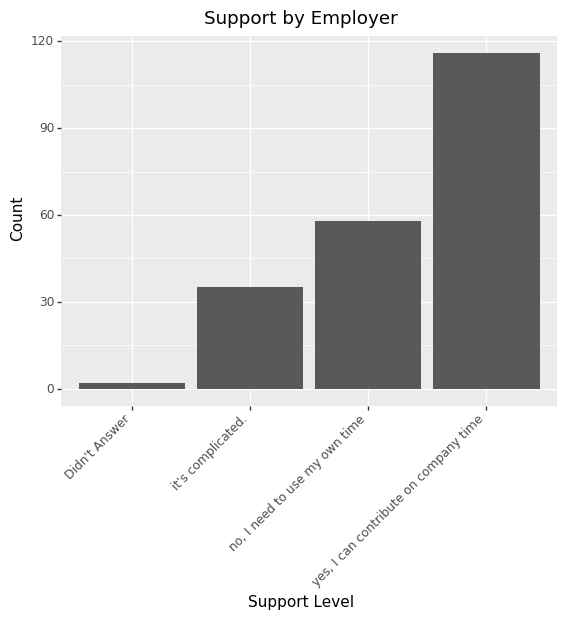


## 2-Way Cross Tabulations

Before we look at the relation between demographic data and questions of interest, we look at two-way cross tabulations in demographic data.


```python
pd.crosstab(survey_data.World_Region, survey_data.Level_of_Contributor)
```


<div>
<table border="1" class="dataframe">
  <thead>
    <tr style="text-align: right;">
      <th>Level_of_Contributor</th>
      <th>approver</th>
      <th>member</th>
      <th>not yet a member but working on it</th>
      <th>reviewer</th>
      <th>subproject owner</th>
      <th>there's a contributor ladder?</th>
    </tr>
    <tr>
      <th>World_Region</th>
      <th></th>
      <th></th>
      <th></th>
      <th></th>
      <th></th>
      <th></th>
    </tr>
  </thead>
  <tbody>
    <tr>
      <th>Africa</th>
      <td>0</td>
      <td>2</td>
      <td>2</td>
      <td>0</td>
      <td>0</td>
      <td>0</td>
    </tr>
    <tr>
      <th>Asia</th>
      <td>2</td>
      <td>5</td>
      <td>15</td>
      <td>5</td>
      <td>0</td>
      <td>3</td>
    </tr>
    <tr>
      <th>Europe</th>
      <td>8</td>
      <td>15</td>
      <td>23</td>
      <td>9</td>
      <td>6</td>
      <td>10</td>
    </tr>
    <tr>
      <th>North America</th>
      <td>12</td>
      <td>22</td>
      <td>27</td>
      <td>5</td>
      <td>22</td>
      <td>11</td>
    </tr>
    <tr>
      <th>Oceania</th>
      <td>0</td>
      <td>1</td>
      <td>1</td>
      <td>1</td>
      <td>0</td>
      <td>1</td>
    </tr>
    <tr>
      <th>South America</th>
      <td>0</td>
      <td>1</td>
      <td>0</td>
      <td>0</td>
      <td>1</td>
      <td>0</td>
    </tr>
  </tbody>
</table>
</div>


```python
pd.crosstab(survey_data.Contributing_Length, survey_data.Level_of_Contributor).loc[
    ["less than one year", "one to two years", "two to three years", "three+ years"]
]
```


<div>
<table border="1" class="dataframe">
  <thead>
    <tr style="text-align: right;">
      <th>Level_of_Contributor</th>
      <th>approver</th>
      <th>member</th>
      <th>not yet a member but working on it</th>
      <th>reviewer</th>
      <th>subproject owner</th>
      <th>there's a contributor ladder?</th>
    </tr>
    <tr>
      <th>Contributing_Length</th>
      <th></th>
      <th></th>
      <th></th>
      <th></th>
      <th></th>
      <th></th>
    </tr>
  </thead>
  <tbody>
    <tr>
      <th>less than one year</th>
      <td>3</td>
      <td>15</td>
      <td>42</td>
      <td>4</td>
      <td>0</td>
      <td>18</td>
    </tr>
    <tr>
      <th>one to two years</th>
      <td>8</td>
      <td>19</td>
      <td>18</td>
      <td>7</td>
      <td>5</td>
      <td>4</td>
    </tr>
    <tr>
      <th>two to three years</th>
      <td>6</td>
      <td>5</td>
      <td>6</td>
      <td>4</td>
      <td>8</td>
      <td>2</td>
    </tr>
    <tr>
      <th>three+ years</th>
      <td>5</td>
      <td>7</td>
      <td>2</td>
      <td>5</td>
      <td>16</td>
      <td>1</td>
    </tr>
  </tbody>
</table>
</div>


```python
pd.crosstab(survey_data.Contributing_Length, survey_data.Contribute_to_other_OSS).loc[
    ["less than one year", "one to two years", "two to three years", "three+ years"],
    ["this is my first open source project!", "1 other", "2 or more"],
]
```


<div>
<table border="1" class="dataframe">
  <thead>
    <tr style="text-align: right;">
      <th>Contribute_to_other_OSS</th>
      <th>this is my first open source project!</th>
      <th>1 other</th>
      <th>2 or more</th>
    </tr>
    <tr>
      <th>Contributing_Length</th>
      <th></th>
      <th></th>
      <th></th>
    </tr>
  </thead>
  <tbody>
    <tr>
      <th>less than one year</th>
      <td>27</td>
      <td>16</td>
      <td>39</td>
    </tr>
    <tr>
      <th>one to two years</th>
      <td>15</td>
      <td>13</td>
      <td>33</td>
    </tr>
    <tr>
      <th>two to three years</th>
      <td>8</td>
      <td>6</td>
      <td>17</td>
    </tr>
    <tr>
      <th>three+ years</th>
      <td>4</td>
      <td>8</td>
      <td>24</td>
    </tr>
  </tbody>
</table>
</div>


```python
pd.crosstab(
    survey_data.Level_of_Contributor, survey_data.Upstream_supported_at_employer
)
```


<div>
<table border="1" class="dataframe">
  <thead>
    <tr style="text-align: right;">
      <th>Upstream_supported_at_employer</th>
      <th>Didn't Answer</th>
      <th>it's complicated.</th>
      <th>no, I need to use my own time</th>
      <th>yes, I can contribute on company time</th>
    </tr>
    <tr>
      <th>Level_of_Contributor</th>
      <th></th>
      <th></th>
      <th></th>
      <th></th>
    </tr>
  </thead>
  <tbody>
    <tr>
      <th>approver</th>
      <td>0</td>
      <td>5</td>
      <td>3</td>
      <td>14</td>
    </tr>
    <tr>
      <th>member</th>
      <td>0</td>
      <td>11</td>
      <td>13</td>
      <td>22</td>
    </tr>
    <tr>
      <th>not yet a member but working on it</th>
      <td>0</td>
      <td>10</td>
      <td>26</td>
      <td>32</td>
    </tr>
    <tr>
      <th>reviewer</th>
      <td>0</td>
      <td>4</td>
      <td>5</td>
      <td>11</td>
    </tr>
    <tr>
      <th>subproject owner</th>
      <td>0</td>
      <td>5</td>
      <td>1</td>
      <td>23</td>
    </tr>
    <tr>
      <th>there's a contributor ladder?</th>
      <td>1</td>
      <td>0</td>
      <td>10</td>
      <td>14</td>
    </tr>
  </tbody>
</table>
</div>


```python
pd.crosstab(
    survey_data.Interested_in_next_level, survey_data.Upstream_supported_at_employer
)
```


<div>

<table border="1" class="dataframe">
  <thead>
    <tr style="text-align: right;">
      <th>Upstream_supported_at_employer</th>
      <th>Didn't Answer</th>
      <th>it's complicated.</th>
      <th>no, I need to use my own time</th>
      <th>yes, I can contribute on company time</th>
    </tr>
    <tr>
      <th>Interested_in_next_level</th>
      <th></th>
      <th></th>
      <th></th>
      <th></th>
    </tr>
  </thead>
  <tbody>
    <tr>
      <th>if I had help/mentoring/support</th>
      <td>0</td>
      <td>12</td>
      <td>12</td>
      <td>14</td>
    </tr>
    <tr>
      <th>if I had more free time</th>
      <td>0</td>
      <td>8</td>
      <td>11</td>
      <td>23</td>
    </tr>
    <tr>
      <th>no</th>
      <td>1</td>
      <td>0</td>
      <td>3</td>
      <td>5</td>
    </tr>
    <tr>
      <th>no, already a subproject owner (highest level on the ladder)</th>
      <td>0</td>
      <td>4</td>
      <td>0</td>
      <td>21</td>
    </tr>
    <tr>
      <th>yes</th>
      <td>0</td>
      <td>11</td>
      <td>31</td>
      <td>53</td>
    </tr>
  </tbody>
</table>
</div>


```python
pd.crosstab(survey_data.Contributing_Length, survey_data.Upstream_supported_at_employer)
```


<div>
<table border="1" class="dataframe">
  <thead>
    <tr style="text-align: right;">
      <th>Upstream_supported_at_employer</th>
      <th>Didn't Answer</th>
      <th>it's complicated.</th>
      <th>no, I need to use my own time</th>
      <th>yes, I can contribute on company time</th>
    </tr>
    <tr>
      <th>Contributing_Length</th>
      <th></th>
      <th></th>
      <th></th>
      <th></th>
    </tr>
  </thead>
  <tbody>
    <tr>
      <th>less than one year</th>
      <td>2</td>
      <td>10</td>
      <td>37</td>
      <td>34</td>
    </tr>
    <tr>
      <th>one to two years</th>
      <td>0</td>
      <td>12</td>
      <td>16</td>
      <td>33</td>
    </tr>
    <tr>
      <th>three+ years</th>
      <td>0</td>
      <td>5</td>
      <td>4</td>
      <td>27</td>
    </tr>
    <tr>
      <th>two to three years</th>
      <td>0</td>
      <td>8</td>
      <td>1</td>
      <td>22</td>
    </tr>
  </tbody>
</table>
</div>


```python
pd.crosstab(survey_data.World_Region, 
            survey_data.Contribute_to_other_OSS)[['this is my first open source project!','1 other','2 or more']]

```


<div>
<table border="1" class="dataframe">
  <thead>
    <tr style="text-align: right;">
      <th>Contribute_to_other_OSS</th>
      <th>this is my first open source project!</th>
      <th>1 other</th>
      <th>2 or more</th>
    </tr>
    <tr>
      <th>World_Region</th>
      <th></th>
      <th></th>
      <th></th>
    </tr>
  </thead>
  <tbody>
    <tr>
      <th>Africa</th>
      <td>2</td>
      <td>1</td>
      <td>1</td>
    </tr>
    <tr>
      <th>Asia</th>
      <td>6</td>
      <td>8</td>
      <td>16</td>
    </tr>
    <tr>
      <th>Europe</th>
      <td>20</td>
      <td>10</td>
      <td>41</td>
    </tr>
    <tr>
      <th>North America</th>
      <td>26</td>
      <td>23</td>
      <td>50</td>
    </tr>
    <tr>
      <th>Oceania</th>
      <td>0</td>
      <td>0</td>
      <td>4</td>
    </tr>
    <tr>
      <th>South America</th>
      <td>0</td>
      <td>1</td>
      <td>1</td>
    </tr>
  </tbody>
</table>
</div>


## Most Important Project

The following plots use offset stacked bar charts, showing the overall rankings of the most important project. They also display the specific distributions of rankings, for each choice.


```python
(
    make_likert_chart(
        survey_data,
        "Most_Important_Proj:",
        ["1", "2", "3", "4", "5", "6", "7"],
        max_value=7,
        sort_x=True,
    )
    + p9.labs(
        x="Project",
        color="Ranking",
        fill="Ranking",
        y="",
        title="Distribution of Ranking of Most Important Projects",
    )
)
```


Mentoring is the most important project, with very few respondents rating it negatively, followed by contributing to documentation. 


```python
(
    make_likert_chart(
        survey_data,
        "Most_Important_Proj:",
        ["1", "2", "3", "4", "5", "6", "7"],
        facet_by=["Level_of_Contributor", "."],
        max_value=7,
        sort_x=True,
    )
    + p9.labs(
        x="Project",
        y="",
        fill="Ranking",
        color="Ranking",
        title="Rankings of projects in order of importance (1-7) by Contributor Level",
    )
    + p9.theme(strip_text_y=p9.element_text(margin={"r": 0.9, "units": "in"}))
)
```


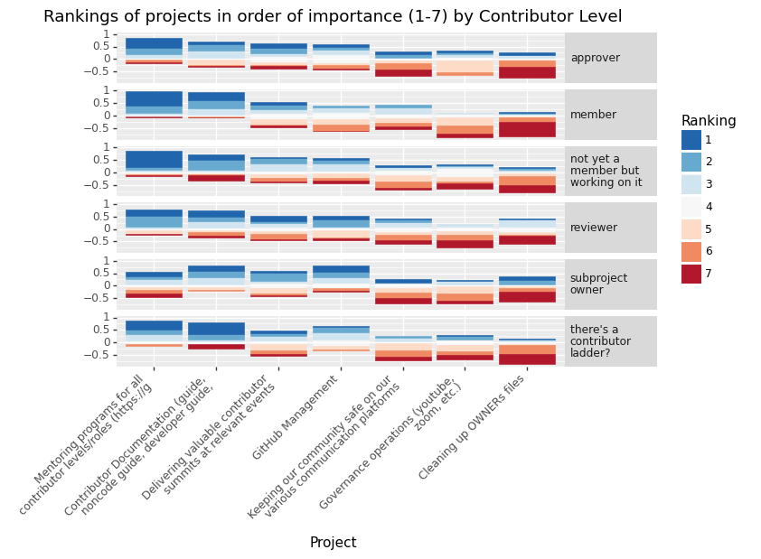


It is reasonable to expect that different roles in Kubernetes may value different projects more highly. The plot above shows that for many issues and role, this is not true. Some items of note are while most groups rate Cleaning  up the OWNERS file as their least important, there is a clear trend for Subproject Owners and Reviewers to view this as more important, although a large portion of them still rate this low. Similarly Subproject Owners view mentoring as less important than other groups. 


```python
(
    make_likert_chart(
        survey_data,
        "Most_Important_Proj:",
        ["1", "2", "3", "4", "5", "6", "7"],
        facet_by=["Interested_in_next_level", "."],
        max_value=7,
        sort_x=True,
    )
    + p9.labs(
        title="Rankings of projects in order of importance (1-7) by Interest in Next Level",
        y="",
        x="Project",
        color="Ranking",
        fill="Ranking",
    )
    + p9.theme(strip_text_y=p9.element_text(margin={"r": 0.9, "units": "in"}))
)
```


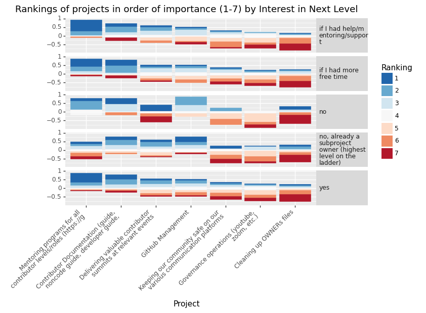


Similarly to contributor roles, the interest in the next level does not appear to be a major factor in the ranking order. Mentoring is still very important to almost all levels of interest, with a minor exception being Subproject Owners. The group that stands out a bit are those who aren't interested in the next level, who value GitHub Management higher than some other projects. 


```python
(
    make_likert_chart(
        survey_data,
        "Most_Important_Proj:",
        ["1", "2", "3", "4", "5", "6", "7"],
        facet_by=["Contributing_Length", "."],
        max_value=7,
        sort_x=True,
    )
    + p9.labs(
        title="Rankings of projects in order of importance (1-7) by Length of Contribution",
        y="",
        x="Project",
        color="Ranking",
        fill="Ranking",
    )
    + p9.theme(strip_text_y=p9.element_text(margin={"r": 0.9, "units": "in"}))
)
```


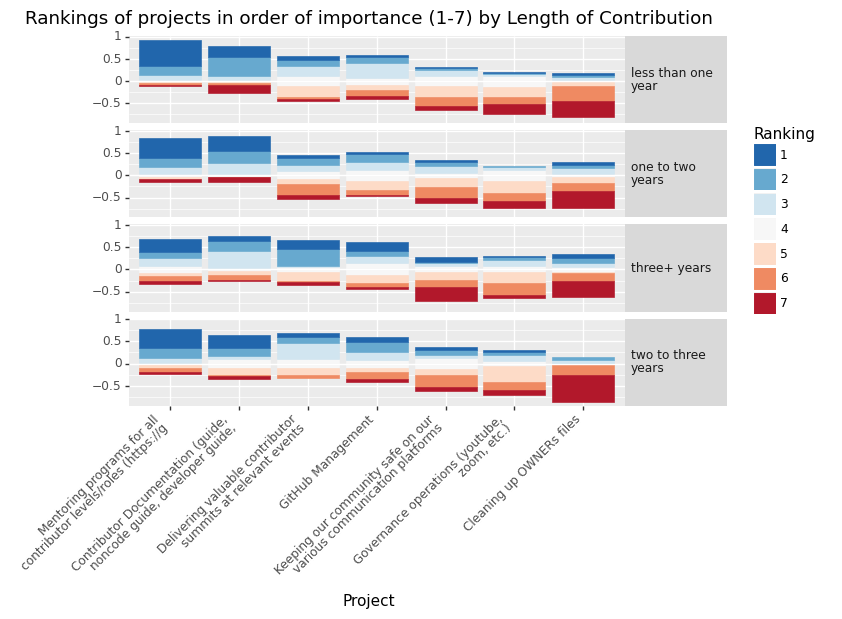


Another interesting take away is that the most important projects do not vary widely across the length of contribution. Once again, Mentoring is the most important project across all demographics.

## Analysis of Common Blockers

In this section, we use offset stacked bar charts again. They visualize which blockers cause the most issues for contributors.


```python
blocker_ratings = list(
    reversed(
        [
            "A frequent blocker",
            "Often a problem",
            "Sometimes a problem",
            "Rarely a problem",
            "Not a problem",
        ]
    )
)


(
    make_likert_chart(survey_data, "Blocker:", blocker_ratings)
    + p9.labs(
        title="Common Blockers", color="Severity", fill="Severity", x="Blocker", y=""
    )
)
```


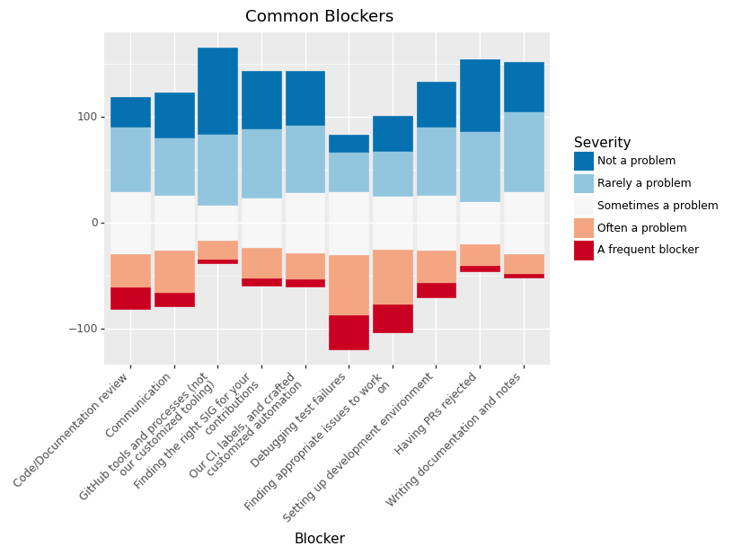


The most frequent blocker across all contributors is debugging test failures, followed by finding issues to work on. 


```python
(
    make_likert_chart(survey_data,'Blocker:',
                   blocker_ratings,
                   ['Contributing_Length','.'],
                   wrap_facets=True) + 
    p9.labs(x='Blocker',
            y='',
            fill='Rating',
            color='Rating', 
            title='Common Blockers by Length of Contribution')  +
    p9.theme(strip_text_y = p9.element_text(margin={'r':.9,'units':'in'}))
)

```


When we look at blockers, by the length of the contributor, we can see that contributors across all lengths have the most issues with debugging test failures. But, finding important issues varies across the groups. Below, we look closer at these two groups.


```python
(
    make_single_likert_chart(survey_data,
                          'Blocker:_Debugging_test_failures',
                          'Contributing_Length',
                          blocker_ratings) + 
    p9.labs(x='Contributing Length',
            y='',
            fill="Rating",
            color="Rating",
            title='Debugging Test Failures Blocker by Contribution Length') + 
    p9.scale_x_discrete(limits=['less than one year', 'one to two years', 'two to three years', '3+ years']) 

)

```


When it comes to debugging, it is less of an issue for new contributors, most likely because they are not as focused on contributing code yet. After their first year, it becomes a larger issue, but slowly improves over time.


```python
( 
    make_single_likert_chart(survey_data,
                           'Blocker:_Finding_appropriate_issues_to_work_on',
                           'Contributing_Length',
                           blocker_ratings) + 
    p9.labs(x='Contributing Length',
            y='',
            fill="Rating",
            color="Rating",
            title='Finding Issues to Work on Blocker by Length of Contribution') + 
    p9.scale_x_discrete(limits=['less than one year', 
                                'one to two years', 
                                'two to three years',
                                '3+ years'])
)

```


Looking at contributors that have trouble finding issues to work on there is a clear trend that the longer you are a Kubernetes contributor, the less of an issue this becomes, suggesting a continued effort is needed to surface good first issues, and make new contributors aware of them. 


```python
(
    make_likert_chart(survey_data,'Blocker:',
                   blocker_ratings,
                   ['Level_of_Contributor','.']) + 
    p9.labs(x='Blocker',
            y='',
            fill='Rating',
            color='Rating',
            title='Common Blockers by Contributor Level')  +
    p9.theme(strip_text_y = p9.element_text(margin={'r':.9,'units':'in'}))
)

```


When we segment the contributors by level, we again see that debugging test failures is the largest blocker among all groups. Most blockers affect contributor levels in similar patterns. The one slight exception, though, is that Subproject Owners are the only cohort to not struggle with finding the right SIG.


```python
(
    make_single_likert_chart(
        survey_data,
        "Blocker:_Debugging_test_failures",
        "Level_of_Contributor",
        blocker_ratings,
    )
    + p9.labs(
        x="Contributor Level",
        y="",
        fill="Rating",
        color="Rating",
        title="Debugging Test Failures Blocker by Level of Contributor",
    )
)
```


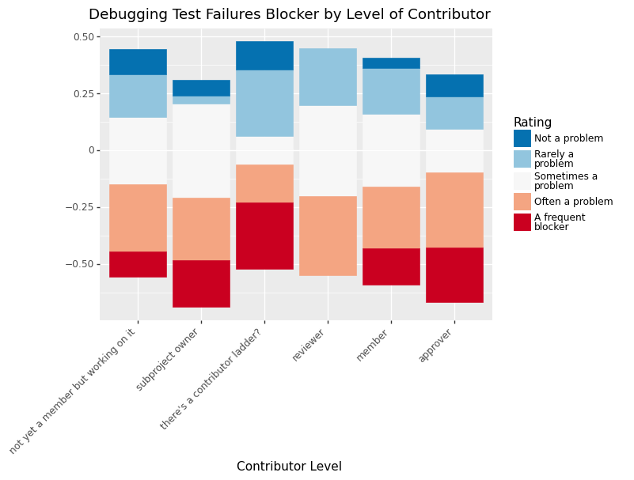


This in-depth view confirms that debugging test failures is an issue across all contributor levels, but is a larger issue for Subproject Owners and Approvers.


```python
(
    make_likert_chart(
        survey_data, "Blocker:", blocker_ratings, ["Interested_in_next_level", "."]
    )
    + p9.labs(
        x="Blocker",
        y="",
        fill="Rating",
        color="Rating",
        title="Common Blockers by Interest in Next Level",
    )
    + p9.theme(strip_text_y=p9.element_text(margin={"r": 0.9, "units": "in"}))
)
```


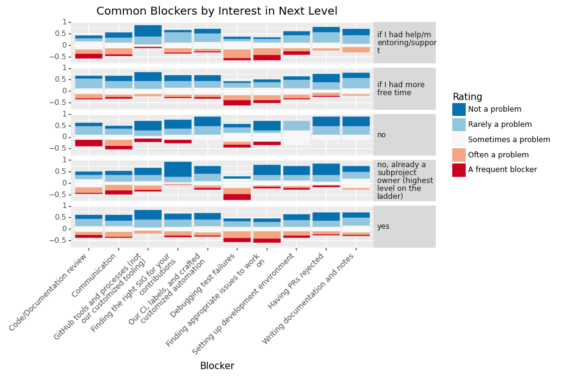


When we look at the spread of blockers across interest in the next level, we see that those are interested are the most likely to struggle finding the best issues to work on. In the plot below, this is shown in more detail.


```python
(
    make_single_likert_chart(survey_data,
                             'Blocker:_Finding_appropriate_issues_to_work_on',
                             'Interested_in_next_level',
                             blocker_ratings) + 
    p9.labs(x='Interest in next level',
            y='Percent',fill="Rating",
            color="Rating",
            title='Finding Issues to Work on Blocker by Interest in the Next Level') 
    )

```


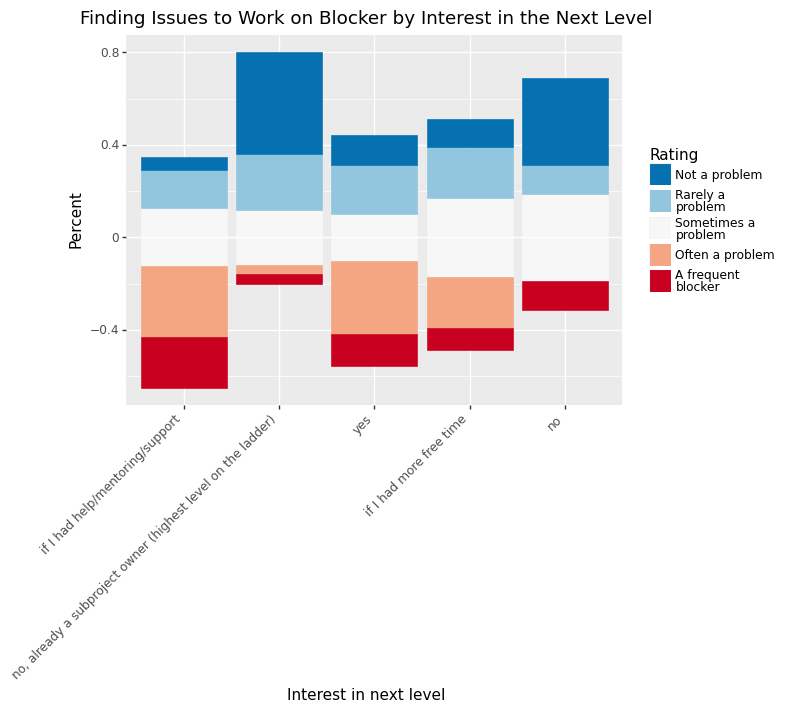


When we look at the spread of blockers across interest in the next level, we see that those are interested are the most likely to struggle finding the best issues to work on. In the plot below, this is shown in more detail.

Because it is expected that the large increase in Twitter users may have affected the results of the survey, we looked at the users who reported using Twitter as their primary source of news, and how they compared to those who didn't.


```python
survey_data.loc[:, "Check_for_news:_@kubernetesio_twitter"] = survey_data[
    "Check_for_news:_@kubernetesio_twitter"
].astype(str)

(
    make_single_likert_chart(
        survey_data,
        "Blocker:_Debugging_test_failures",
        "Check_for_news:_@kubernetesio_twitter",
        blocker_ratings,
    )
    + p9.labs(
        x="Twitter Use",
        y="",
        fill="Rating",
        color="Rating",
        title="Debugging Test Failures Blocker by Twitter Use",
    )
    + p9.scale_x_discrete(labels=["Doesn't Use Twitter", "Uses Twitter"])
)
```


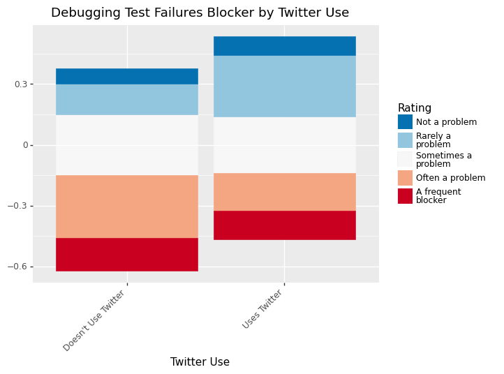


Contributors who use Twitter as their primary source of news, about Kubernetes, are less likely to report struggling with debugging test failures. This is primarily because many Twitter users are newer ones.


```python
(
    make_single_likert_chart(
        survey_data,
        "Blocker:_Finding_appropriate_issues_to_work_on",
        "Check_for_news:_@kubernetesio_twitter",
        blocker_ratings,
    )
    + p9.labs(
        x="Twitter Use",
        y="",
        fill="Rating",
        color="Rating",
        title="Finding Issues Blocker by Twitter Use",
    )
    + p9.scale_x_discrete(labels=["Doesn't Use Twitter", "Uses Twitter"])
)
```


Conversely, those who use Twitter do struggle to find Issues to Work on, again because most contributors who primarily use Twitter for their news tend to be new users.

## First Place News is Seen


```python
#Convert back to an int after converting to a string for categorical views above
survey_data.loc[:,'Check_for_news:_@kubernetesio_twitter'] = survey_data[
    'Check_for_news:_@kubernetesio_twitter'].astype(int)

(
    make_bar_chart(survey_data,'Check_for_news:') + 
    p9.labs(title='Where Contributors See News First',
            x='News Source',
            y='Count')
)

```


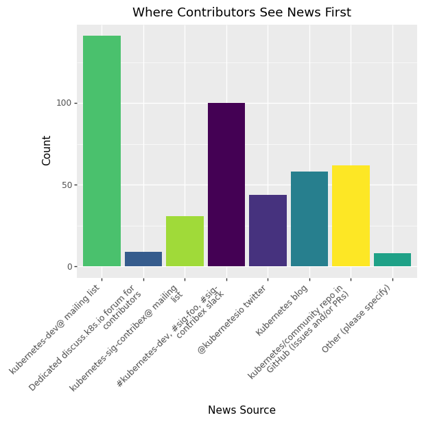


Most contributors are getting their news primarily from the official dev mailing list.


```python
(
    make_bar_chart(
        survey_data, "Check_for_news:", ["Level_of_Contributor", "."], proportional=True
    )
    + p9.labs(
        title="Where Contributors See News First by Contributor Level",
        x="News Source",
        y="Proportion",
        fill="News Source",
    )
    + p9.theme(strip_text_y=p9.element_text(margin={"r": 0.9, "units": "in"}))
)
```


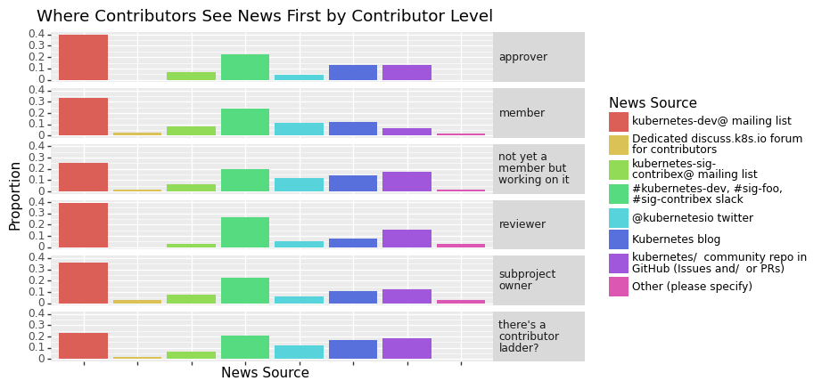


Looking across each level of the contributor ladder, most levels display the same patterns, with all groups primarily using the dev mailing list. The second most common source of news is the three Slack channels.


```python
(
    make_bar_chart(
        survey_data,
        "Check_for_news:",
        ["Interested_in_next_level", "."],
        proportional=True,
    )
    + p9.labs(
        title="Where Contributors See News First by Interest in Next Level",
        x="News Source",
        y="Proportion",
        fill="News Source",
    )
    + p9.theme(strip_text_y=p9.element_text(margin={"r": 0.9, "units": "in"}))
)
```


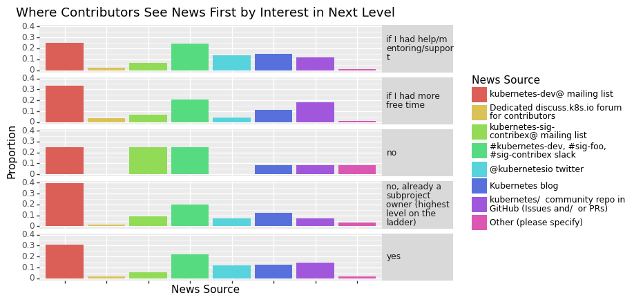


Looking at news sources by interest in next level, we can see that many people who aren't interested rely on the kubernetes-sig-contribex mailing list at a much higher proportion than the other groups. Those who are interested in the next level, either through mentoring or by themselves, tend to use Twitter more. But, this is likely an artifact of the survey being advertised on Twitter.

When we look news use by the length of time, we see that compared to other groups, contributors who have been contributing for less than a year rely on the dev mailing list. They replace this with Twitter, and possibly Slack.

### Twitter Users

Because of the large increase in responses after the survey was advertised on Twitter, we pay special attention to what type of users list Twitter as their primary source of news.


```python
(
    make_single_bar_chart(
        survey_data[survey_data["Level_of_Contributor"].notnull()],
        "Check_for_news:_@kubernetesio_twitter",
        "Level_of_Contributor",
        proportionally=True,
    )
    + p9.labs(
        title="Proportion of Contributors, by contributor level, who get news through Twitter First",
        y="Proportion",
        x="Contributor Level",
    )
)
```


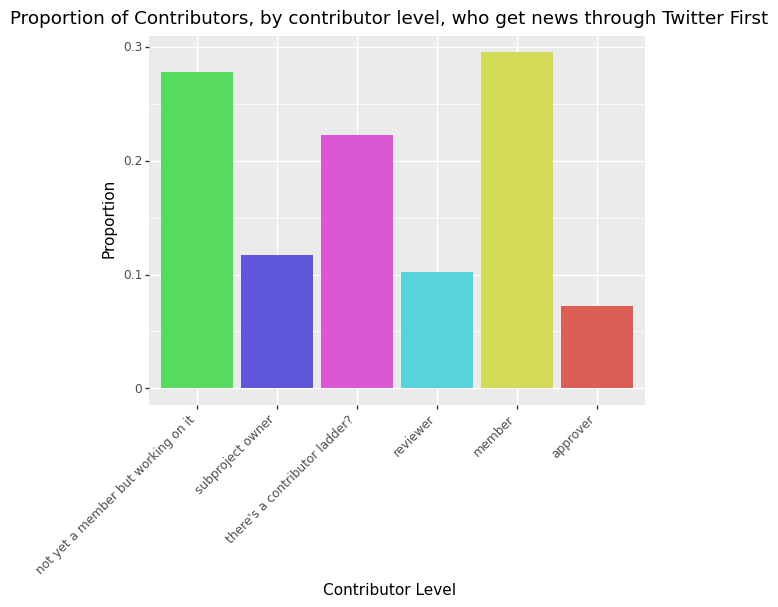


Of users who get their news primarily through Twitter, most are members, or those working on becoming members


```python
(
    make_single_bar_chart(
        survey_data[survey_data["Level_of_Contributor"].notnull()],
        "Check_for_news:_@kubernetesio_twitter",
        "Contributing_Length",
        proportionally=True,
    )
    + p9.labs(
        title="Proportion of Contributors, by contributor level, who get news through Twitter First",
        y="Proportion",
        x="Contributor Level",
    )
)
```


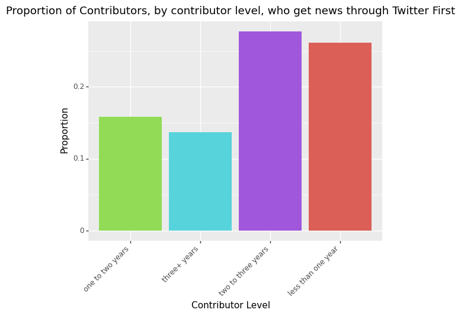


Many contributors, who use Twitter as their primary news source, have been contributing for less than a year. There is also a large proportion of users who have been contributing for two to three years. It is unclear why this cohort appears to use Twitter in large numbers, compared to users who have been contributing for one to two years. It is also unclear that this cohort appears to use Twitter at a level proportionately greater to even new contributors. 

### k/community Use


```python
(
  make_single_bar_chart(survey_data[survey_data['Level_of_Contributor'].notnull()],
                        'Check_for_news:_kubernetes/community_repo_in_GitHub_(Issues_and/or_PRs)',
                        'Contributing_Length',proportionally=True) +
  p9.scale_x_discrete(limits=['less than one year',
                              'one to two years', 
                              'two to three years',
                              '3+ years']) +
  p9.labs(x='Length of Contribution',
          y='Proportion',
          title='Proportion of Contributors who Check k/community GitHub first')
)

```


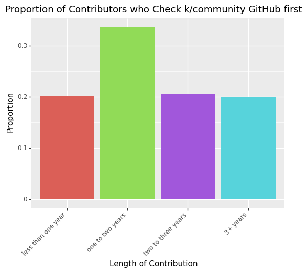


Of the contributors that rely on the k/community GitHub page, there are relatively equal proportions from all contributor length cohorts.


```python
(
    make_single_bar_chart(
        survey_data[survey_data["Level_of_Contributor"].notnull()],
        "Check_for_news:_kubernetes/community_repo_in_GitHub_(Issues_and/or_PRs)",
        "Level_of_Contributor",
        proportionally=True,
    )
    + p9.labs(
        x="Contributor Level",
        y="Proportion",
        title="Proportion of Contributors who Check k/community GitHub first",
    )
)
```


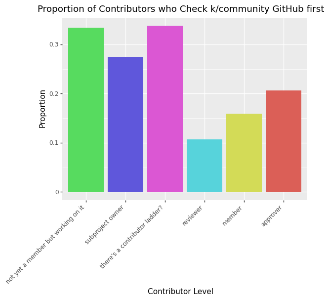
s


The distribution of contributors by their levels is an interesting mix, showing that both the highest and lowest levels of the ladder rely on the k/community GitHub. They rely on this more than the middle levels. This may be a way to connect the two communities, especially on issues of Mentoring support.


```python
(
    make_single_bar_chart(
        survey_data[survey_data["Level_of_Contributor"].notnull()],
        "Check_for_news:_kubernetes/community_repo_in_GitHub_(Issues_and/or_PRs)",
        "Level_of_Contributor",
        proportionally=True,
        facet2="Contributing_Length",
    )
    + p9.labs(
        x="Contributor Level",
        y="Proportion",
        title="Proportion of Contributors who Check k/community GitHub first",
    )
    + p9.theme(strip_text_y=p9.element_text(margin={"r": 1.15, "units": "in"}))
)
```


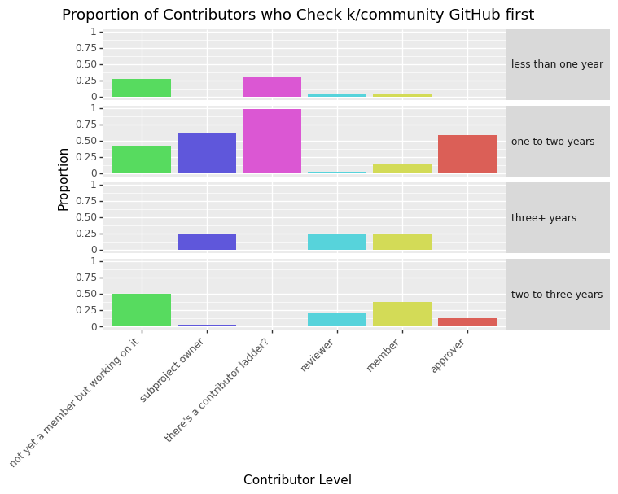


The above plot shows the proportion of users in each bucket created by the two-way faceting, and so it can be a bit misleading. For example, 100% of users who have been contributing one to two years and do not know about the existence of the contributor ladder check k/community first. Using the cross-tabulations above, this is only four people. We can see that across all lengths of contributions, both members and those working on membership use the k/community page. 

## Analysis of Contribution Areas


```python
(
    make_bar_chart(survey_data,'Contribute:') + 
    p9.labs(x='Contribution',y='Count',title="Areas Contributed To")
)

```


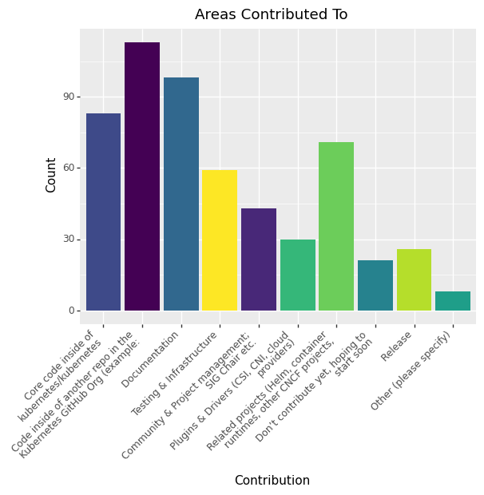


As the Kubernetes community moves towards using more repositories to better organize the code, we can see that more
contributions are being made in other repositories. Most of these are still under the Kuberentes project. Documentation is the second highest area of contributions.


```python
(
    make_bar_chart(survey_data.query("Contributing_Length != 'less than one year'"),'Contribute:') + 
    p9.labs(x='Contribution',y='Count',title="Areas Contributed To (Less than 1 year excluded)")
)

```


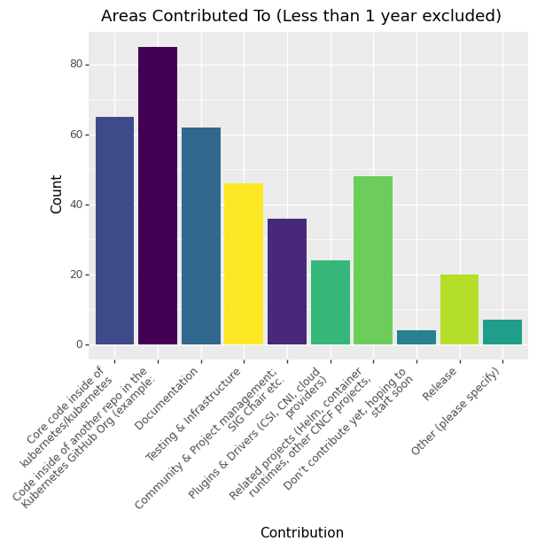


When we exclude first year users, the pattern remains mostly the same, with Documentation being replaced as the second most commonly contributed area by code insides k8s/k8s.


```python
(
    make_bar_chart(
        survey_data,
        "Contribute:",
        facet_by=["Level_of_Contributor", "."],
        proportional=True,
    )
    + p9.labs(
        x="Contribution", y="Count", title="Areas Contributed To", fill="Contribution"
    )
    + p9.theme(strip_text_y=p9.element_text(margin={"r": 0.8, "units": "in"}))
)
```


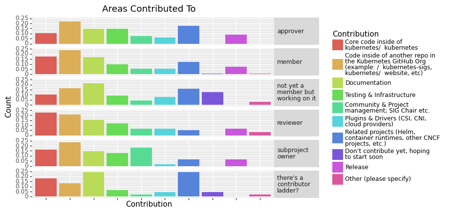


The contribution areas vary by the user level on the ladder, with those working on membership. They are unaware that there is a ladder focusing more on documentation than the other levels. Unsurprisingly, a large proportion of those who do not know there is ladder, have not yet contributed.


```python
(
    make_bar_chart(
        survey_data,
        "Contribute:",
        facet_by=["Contributing_Length", "."],
        proportional=True,
    )
    + p9.labs(
        x="Contribution", y="Count", title="Areas Contributed To", fill="Contribution"
    )
    + p9.theme(strip_text_y=p9.element_text(margin={"r": 0.8, "units": "in"}))
)
```


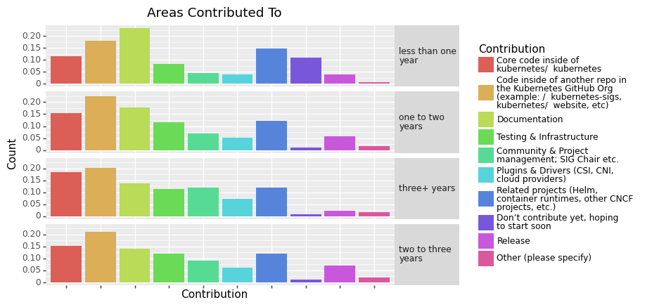


Looking at contribution areas by length of time contributing, it is clear that the primary area that new contributors work with is documentation. Among no cohort is the largest area of contribution the core k8s/k8s repository, showing the ongoing organization effort is successful. 


```python
(
    make_bar_chart(
        survey_data,
        "Contribute:",
        facet_by=["Upstream_supported_at_employer", "."],
        proportional=True,
    )
    + p9.labs(
        title="Contributions Given Employer Support",
        x="Contribution",
        y="Count",
        fill="Contribution",
        color="Contribution",
    )
    + p9.theme(strip_text_y=p9.element_text(margin={"r": 1.15, "units": "in"}))
)
```


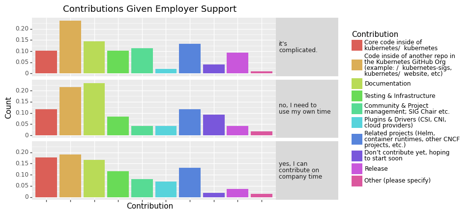


Contributors with employer support are more likely to contribute to the main repository, but a healthy portion of those without employer support, or with a complicated support situation, also contribute. The main areas that see less contributions from those without employer support are community development and plugin work.


```python
(
    make_bar_chart(
        survey_data.query("Contributing_Length != 'less than one year'"),
        "Contribute:",
        facet_by=["Upstream_supported_at_employer", "."],
        proportional=True,
    )
    + p9.labs(
        title="Contributions Given Employer Suppot (Less than 1 year excluded)",
        x="",
        y="Count",
        fill="Contribution",
        color="Contribution",
    )
    + p9.theme(strip_text_y=p9.element_text(margin={"r": 1.15, "units": "in"}))
)
```


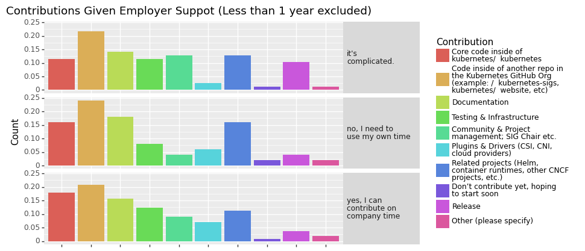


Removing the new users, and repeating the analysis done above does, not change the overall distributions much.

## Resource Use Analysis


```python
use_ratings = [
    "Every Day",
    "Several Times a Week",
    "Several Times a Month",
    "Occasionally",
    "Never",
]
use_ratings.reverse()

(
    make_likert_chart(survey_data, "Use_freq:", use_ratings, max_is_high=True)
    + p9.labs(
        x="Resource",
        y="",
        color="Frequency",
        fill="Frequency",
        title="Resource Use Frequency",
    )
)
```


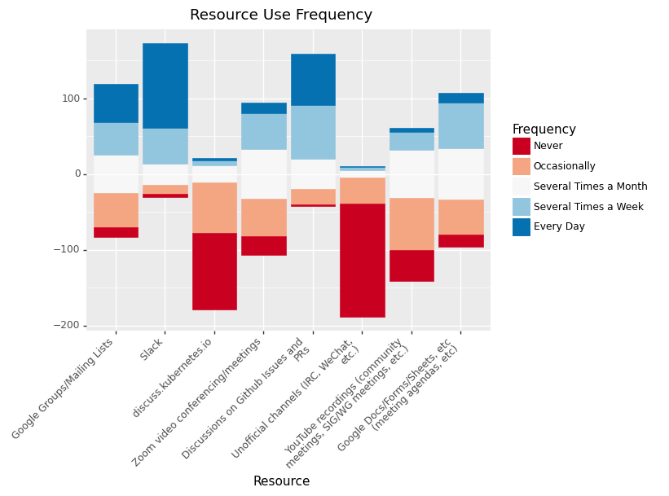


Among all contributors, Slack and GitHub are the most frequently used resources, while dicuss.kubernetes.io and unofficial channels are almost never used. 


```python
(
    make_likert_chart(
        survey_data,
        "Use_freq:",
        use_ratings,
        ["Contributing_Length", "."],
        max_is_high=True,
    )
    + p9.labs(
        x="Resource",
        y="",
        color="Frequency",
        fill="Frequency",
        title="Resource Use Frequency",
    )
    + p9.theme(strip_text_y=p9.element_text(margin={"r": 0.8, "units": "in"}))
)
```

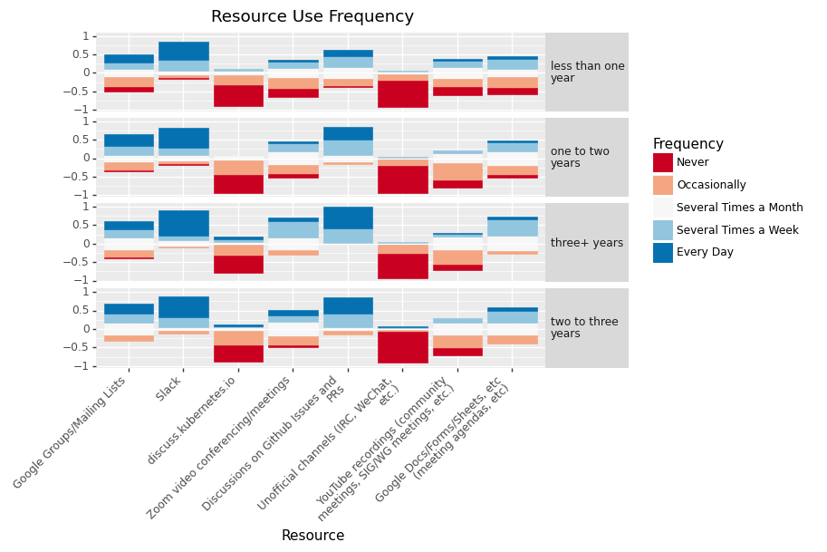


When segmenting out the resource use by contribution length, the pattern stays roughly the same across all cohorts. Google Docs, which is used in more in administrative tasks, increases the longer a contributor is involved in the project.


```python
(
    make_likert_chart(
        survey_data,
        "Use_freq:",
        use_ratings,
        ["Interested_in_next_level", "."],
        max_is_high=True,
    )
    + p9.labs(
        x="Resource",
        y="",
        color="Frequency",
        fill="Frequency",
        title="Resource Use Frequency",
    )
    + p9.theme(strip_text_y=p9.element_text(margin={"r": 0.95, "units": "in"}))
)
```

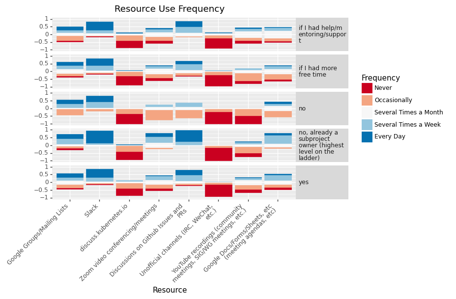


The use of resources, across interest in the next level, shows only one major difference between the groups. Contributors not interested in the next level tend to use GitHub discussions, much less than other groups.


```python
(
    make_likert_chart(
        survey_data,
        "Use_freq:",
        use_ratings,
        ["Level_of_Contributor", "."],
        max_is_high=True,
    )
    + p9.labs(
        x="Resource",
        y="",
        color="Frequency",
        fill="Frequency",
        title="Resource Use Frequency",
    )
    + p9.theme(strip_text_y=p9.element_text(margin={"r": 0.8, "units": "in"}))
)
```
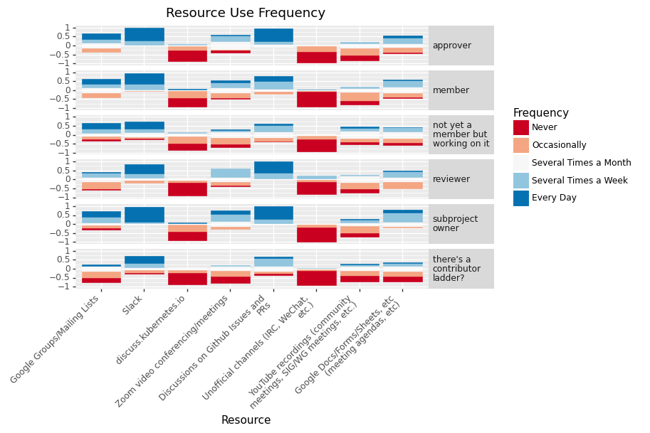


The level of the contributor on the ladder shows a large difference between those that use Google Groups and Mailing Lists, as well as those who use Google Docs, etc. The primary users of Zoom meetings tend to be Subproject Owners.


```python
(
    make_single_likert_chart(
        survey_data,
        "Use_freq:_Google_Groups/Mailing_Lists",
        "Level_of_Contributor",
        use_ratings,
        five_is_high=True,
    )
    + p9.labs(
        title="Use of Google Groups",
        x="Level of Contributor",
        y="Percent",
        fill="Frequency",
        color="Frequency",
    )
)
```

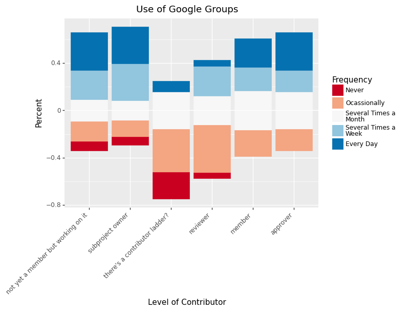


The largest group not using Google Groups are those who do not know that there is a contributor ladder. This suggests that advertising the group may lead to more people knowing about the very existence of a contributor ladder. Or, that the existence of the contributor ladder is discussed more on Google Groups, as compared to other channels.


```python
(
    make_single_likert_chart(
        survey_data,
        "Use_freq:_Google_Docs/Forms/Sheets,_etc_(meeting_agendas,_etc)",
        "Contributing_Length",
        use_ratings,
        five_is_high=True,
    )
    + p9.labs(
        title="Use of Google Drive",
        x="Length of Contributions",
        y="Percent",
        fill="Frequency",
        color="Frequency",
    )
    + p9.scale_x_discrete(
        limits=[
            "less than one year",
            "one to two years",
            "two to three years",
            "3+ years",
        ]
    )
)
```
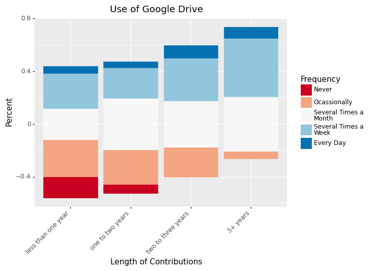


The use of Google Drive, which is primarily used for administrative tasks, increases the longer a contributor is involved in the project, which is not a surprising outcome.


```python
(
    make_single_likert_chart(survey_data,
                             'Use_freq:_YouTube_recordings_(community_meetings,_SIG/WG_meetings,_etc.)',
                             'Contributing_Length',
                             use_ratings,
                             five_is_high=True) + 
    p9.labs(title='Use of YouTube Recordings',
            x='Length of Contributions',
            y='Percent',
            fill="Frequency",
            color='Frequency') +
    p9.scale_x_discrete(limits=['less than one year', 'one to two years', 'two to three years', '3+ years'])   +
    p9.ylim(-0.75,0.75)
)

```


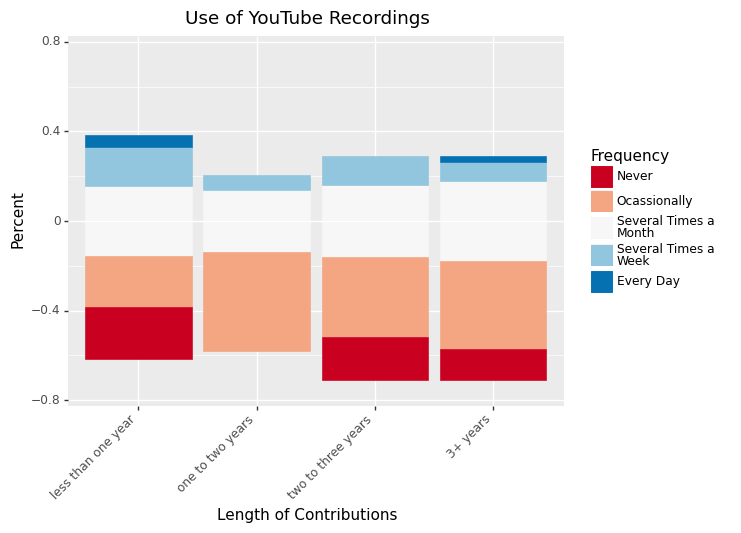
       


There is a slight tendency that the longer the contributor is involved in the project, the less they use YouTube. This is a very weak association, though, and hides the fact that most contributors across all lengths do not use YouTube.


```python
(
    make_single_likert_chart(survey_data[survey_data['Interested_in_next_level'].notnull()],
                             'Use_freq:_YouTube_recordings_(community_meetings,_SIG/WG_meetings,_etc.)',
                             'Level_of_Contributor',
                             use_ratings,
                             five_is_high=True) + 
    p9.labs(title='Use of YouTube Recordings',
            x='Interest in next level',
            y='Percent',
            fill="Frequency",
            color='Frequency') +
    p9.ylim(-0.75,0.75)
)

```

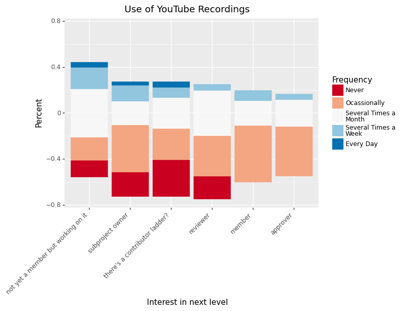


The one group that does tend to use the YouTube recording, at least a few times a month, are those working on membership. This suggests that the resources available on YouTube are helpful to a subset of the community.

## Use of Help Wanted Labels


```python
help_wanted = survey_data[
    survey_data[
        "Do_you_use_the\xa0Help_Wanted_and/or_Good_First_Issue_labels_on_issues_you_file_to_find_contributors"
    ].isna()
    == False
]
```


```python
help_plot = (
    p9.ggplot(
        help_wanted,
        p9.aes(
            x="Do_you_use_the\xa0Help_Wanted_and/or_Good_First_Issue_labels_on_issues_you_file_to_find_contributors",
            fill="Do_you_use_the\xa0Help_Wanted_and/or_Good_First_Issue_labels_on_issues_you_file_to_find_contributors",
        ),
    )
    + p9.geom_bar(show_legend=False)
    + p9.theme(axis_text_x=p9.element_text(angle=45, ha="right"))
    + p9.labs(
        x="Used Label",
        title="Use of Help Wanted and/or Good First Issue Labels",
        y="Count",
    )
)
help_plot
```


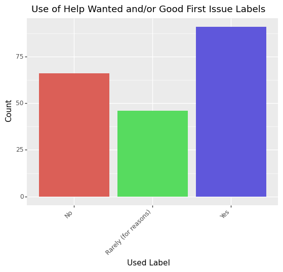


A majority of users, across all demographics, make use of the Help Wanted and Good First Issue labels on GitHub.


```python
(
    help_plot
    + p9.facet_grid(["Contributing_Length", "."])
    + p9.theme(
        strip_text_y=p9.element_text(
            angle=0, ha="left", margin={"r": 1.2, "units": "in"}
        )
    )
)
```


The relative proportions of contributors who use the labels does not change with the length of contribution. The one exception being that very few contributors, who have been doing so for 3+ years, don't use the labels.


```python
(
    p9.ggplot(
        help_wanted[help_wanted["Interested_in_next_level"].notnull()],
        p9.aes(
            x="Do_you_use_the\xa0Help_Wanted_and/or_Good_First_Issue_labels_on_issues_you_file_to_find_contributors",
            fill="Do_you_use_the\xa0Help_Wanted_and/or_Good_First_Issue_labels_on_issues_you_file_to_find_contributors",
        ),
    )
    + p9.geom_bar(show_legend=False)
    + p9.theme(axis_text_x=p9.element_text(angle=45, ha="right"))
    + p9.labs(
        x="Used Label",
        title="Use of Help Wanted and/or Good First Issue Labels",
        y="Count",
    )
    + p9.facet_grid(
        ["Interested_in_next_level", "."],
        labeller=lambda label: "\n".join(wrap(label.replace("/", "/ ").strip(), 20)),
    )
    + p9.theme(
        strip_text_y=p9.element_text(
            angle=0, ha="left", margin={"r": 1.2, "units": "in"}
        )
    )
)
```


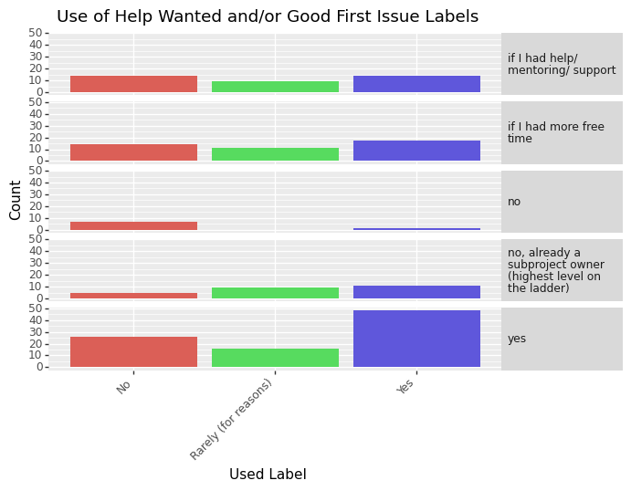


The plot above shows that these labels are especially helpful for those who are interested in the next level of the contributor ladder. 


```python
(
    help_plot
    + p9.facet_grid(
        ["Level_of_Contributor", "."],
        labeller=lambda label: "\n".join(wrap(label.replace("/", "/ ").strip(), 20)),
    )
    + p9.theme(
        strip_text_y=p9.element_text(
            angle=0, ha="left", margin={"r": 1.34, "units": "in"}
        )
    )
)
```


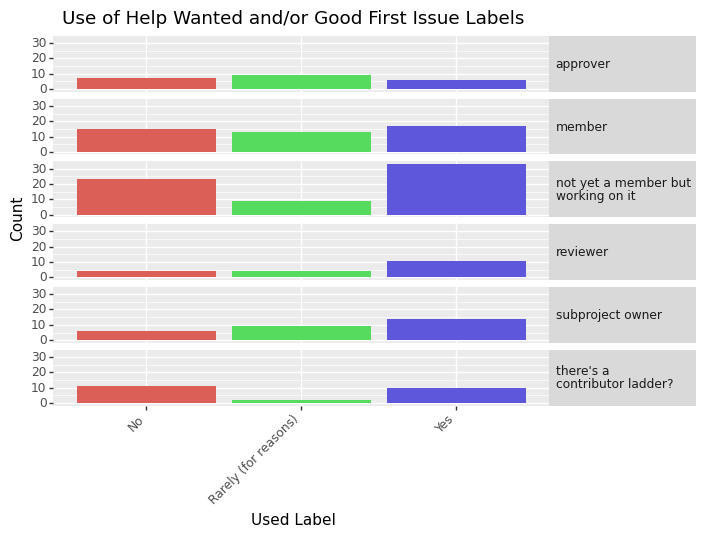


When analyzing the help wanted labels across levels of the contributor ladder, most groups do not have a large majority class, indicating that this is not a variable that predicts the usefulness of the labels.

## Interest in Mentoring


```python
available_to_mentor = list(survey_data.columns)[-8]
mentoring_interest = survey_data[survey_data[available_to_mentor].isna() == False]
```


```python
mentoring_plot = (
    p9.ggplot(
        mentoring_interest, p9.aes(x=available_to_mentor, fill=available_to_mentor)
    )
    + p9.geom_bar(show_legend=False)
    + p9.theme(axis_text_x=p9.element_text(angle=45, ha="right"))
    + p9.labs(x="Interest", title="Interest in Mentoring GSOC or Outreach", y="Count")
    + p9.scale_x_discrete(
        labels=lambda labels_list: [
            "\n".join(wrap(label.replace("/", "/ ").strip(), 30))
            for label in labels_list
        ]
    )
)
mentoring_plot
```


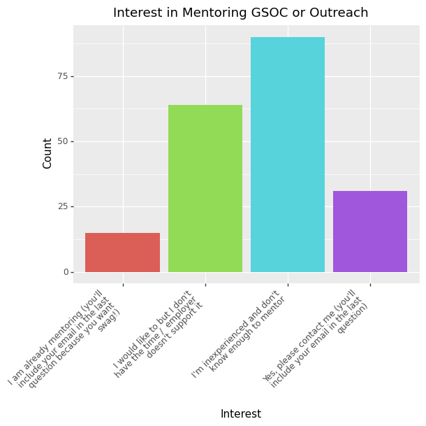


Most contributors feel that they do not have enough experience to mentor others, suggesting that more outreach can be done. This can make all but the newest contributors feel confident that they have something to offer.


```python
(
    mentoring_plot
    + p9.facet_grid(["Upstream_supported_at_employer", "."],
                   labeller=lambda label: "\n".join(wrap(label.replace("/", "/ ").strip(), 20)))
    + p9.theme(strip_text_y=p9.element_text(angle=0, ha="left")) 
    + p9.theme(
        strip_text_y=p9.element_text(
            angle=0, ha="left", margin={"r": 1.34, "units": "in"}
        )
    )
)
```

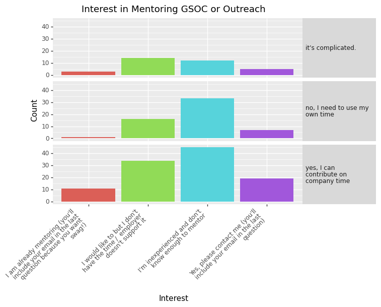


A majority of those who already mentor, as well as those who are interested in mentoring, have employers that support their work on Kubernetes. Those who have a complicated relationship with their employer are the only group to whom the most common response was not having enough time, or support.


```python
(
    mentoring_plot
    + p9.facet_grid(
        ["Interested_in_next_level", "."],
        labeller=lambda label: "\n".join(wrap(label.replace("/", "/ ").strip(), 20)),
    )
    + p9.theme(
        strip_text_y=p9.element_text(
            angle=0, ha="left", margin={"r": 1.34, "units": "in"}
        )
    )
)
```


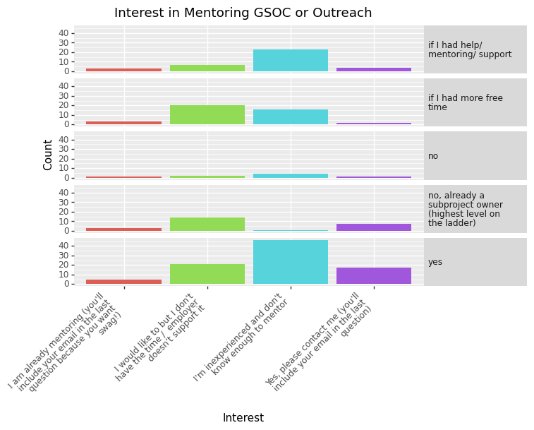


There is no clear pattern between the interest to mentor and interest in the next contributor level. The only exception is that those who want to mentor feel like they don't know enough to do so.

## Participation in Meet our Contributors (MoC)


```python
moc_participation_name = list(survey_data.columns)[-9]
moc_data = survey_data[survey_data[moc_participation_name].isna() == False]
```


```python
moc_plot = (
    p9.ggplot(moc_data, p9.aes(x=moc_participation_name, fill=moc_participation_name))
    + p9.geom_bar(show_legend=False)
    + p9.theme(axis_text_x=p9.element_text(angle=45, ha="right"))
    + p9.labs(title="Watched or Participated in Meet Our Contributors", x="", y="Count")
)
moc_plot
```


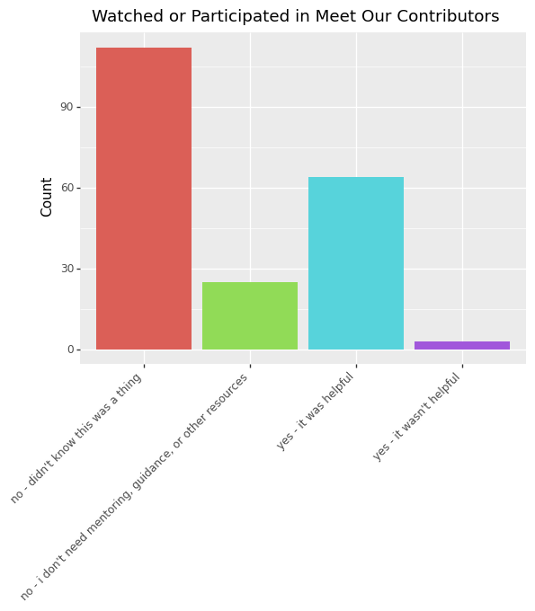


Across all contributors, most do not know about the existence of Meet our Contributors.


```python
(
    p9.ggplot(
        moc_data[moc_data["Interested_in_next_level"].notnull()],
        p9.aes(x=moc_participation_name, fill=moc_participation_name),
    )
    + p9.geom_bar(show_legend=False)
    + p9.facet_grid(
        ["Interested_in_next_level", "."],
        labeller=lambda label: "\n".join(wrap(label.replace("/", "/ ").strip(), 20)),
    )
    + p9.theme(
        strip_text_y=p9.element_text(
            angle=0, ha="left", margin={"r": 1.3, "units": "in"}
        ),
        axis_text_x=p9.element_text(angle=45, ha="right"),
    )
    + p9.labs(
        x="Watched MoC",
        title="Interest in next Level of the Contributor Ladder\n compared to MoC Use",
    )
)
```


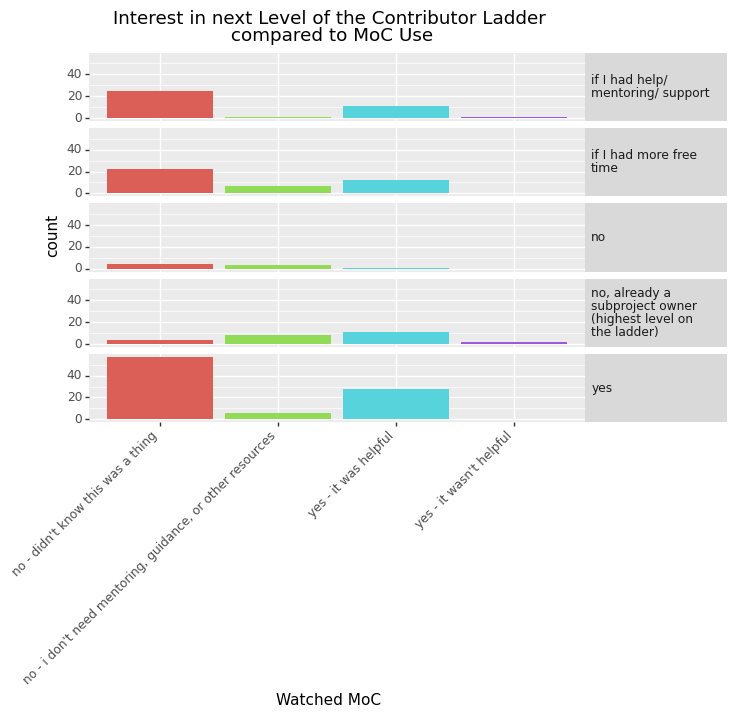


Among all contributors who are interested in the next level of the ladder, most do still not know about MoC. This suggests a larger outreach would be useful, as most who do watch find it helpful.


```python
(
    moc_plot
    + p9.facet_grid(
        ["Level_of_Contributor", "."],
        labeller=lambda label: "\n".join(wrap(label.replace("/", "/ ").strip(), 20)),
    )
    + p9.theme(
        strip_text_y=p9.element_text(
            angle=0, ha="left", margin={"r": 1.34, "units": "in"}
        )
    )
)
```


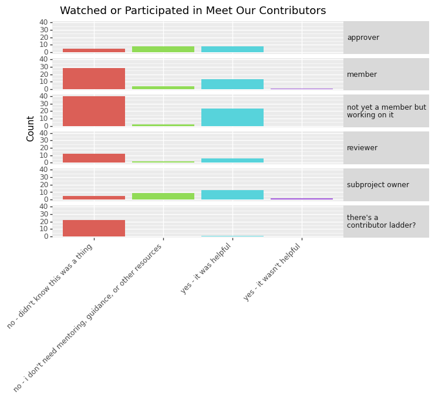


As before, across all cohorts of contributor levels, most do not know about MoC. But, for those who do watch it, they find it helpful. The only levels where more contributors know of it, compared to those that don't, are subproject owners and approvers.

In the next series of plots, we analyze only those contributors who do not know about MoC. 


```python
(
    p9.ggplot(
        moc_data[moc_data['Interested_in_next_level'].notnull() & 
                (moc_data[moc_participation_name] == "no - didn't know this was a thing")],
        p9.aes(x='Interested_in_next_level', fill='Interested_in_next_level')) 
    + p9.geom_bar(show_legend=False) 
    + p9.facet_grid(
        ['Level_of_Contributor','.'],
        labeller=lambda label: "\n".join(wrap(label.replace("/", "/ ").strip(), 20))
    ) 
    + p9.theme(
        strip_text_y = p9.element_text(
            angle=0,ha='left',margin={"r": 1.3, "units": "in"}
        ),
        axis_text_x = p9.element_text(angle=45,ha='right')
    ) 
    + p9.labs(
        x = 'Interested in Next Level',
        y = "Count", 
        title = "Contributors who don't know about MoC")
)

```


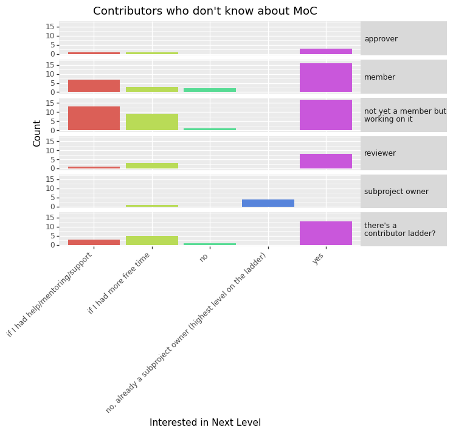


Across all levels of the contributor ladder, many who are interested in the next level do not know about the existence of MoC. 


```python
(
    p9.ggplot(
        moc_data[
            (moc_data[moc_participation_name] == "no - didn't know this was a thing")
        ],
        p9.aes(x="Contributing_Length", fill="Contributing_Length"),
    )
    + p9.geom_bar(show_legend=False)
    + p9.facet_grid(
        ["Level_of_Contributor", "."],
        labeller=lambda label: "\n".join(wrap(label.replace("/", "/ ").strip(), 20)),
    )
    + p9.theme(
        strip_text_y=p9.element_text(
            angle=0, ha="left", margin={"r": 1.34, "units": "in"}
        ),
        axis_text_x=p9.element_text(angle=45, ha="right"),
    )
    + p9.labs(
        x="Length of Contribution",
        y="Count",
        title="Contributors who don't know about MoC",
    )
)
```


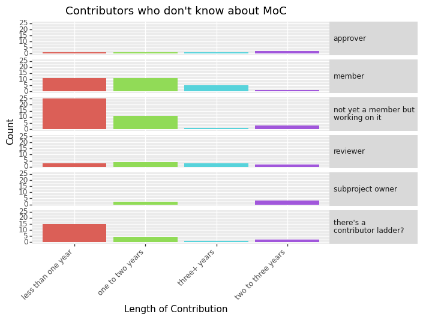


The plot above shows that a majority of those unaware, have not been contributors for very long. This is regardless of their level on the contributor ladder.


```python
(
    p9.ggplot(
        moc_data[
            moc_data["Interested_in_next_level"].notnull()
            & (moc_data[moc_participation_name] == "yes - it was helpful")
        ],
        p9.aes(x="Interested_in_next_level", fill="Interested_in_next_level"),
    )
    + p9.geom_bar(show_legend=False)
    + p9.facet_grid(
        ["Level_of_Contributor", "."],
        labeller=lambda label: "\n".join(wrap(label.replace("/", "/ ").strip(), 20)),
    )
    + p9.theme(
        strip_text_y=p9.element_text(
            angle=0, ha="left", margin={"r": 1.34, "units": "in"}
        ),
        axis_text_x=p9.element_text(angle=45, ha="right"),
    )
    + p9.labs(
        x="Interested in Next Level",
        y="Count",
        title="Contributors who watched or participated in \n MoC and found it helpful",
    )
    + p9.ylim(0, 15)  # Make the same scale as those who don't find it helpful
)
```


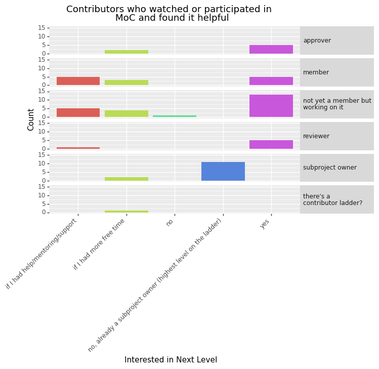


The plot above shows that MoC is found useful by those who watch it. This is the case for those who have either attained the highest level on the ladder, or are interested in the next level. This holds true across all levels of the ladder. This suggests that MoC should not only cover information helpful to those trying to become members, but also those who wish to become approvers, reviewers, and subproject owners. 


```python
(
    p9.ggplot(
        moc_data[(moc_data[moc_participation_name] == "yes - it was helpful")],
        p9.aes(x="Contributing_Length", fill="Contributing_Length"),
    )
    + p9.geom_bar(show_legend=False)
    + p9.facet_grid(
        ["Level_of_Contributor", "."],
        labeller=lambda label: "\n".join(wrap(label.replace("/", "/ ").strip(), 20)),
    )
    + p9.theme(
        strip_text_y=p9.element_text(
            angle=0, ha="left", margin={"r": 1.34, "units": "in"}
        ),
        axis_text_x=p9.element_text(angle=45, ha="right"),
    )
    + p9.labs(
        x="Length of Contribution",
        y="Count",
        title="Contributors who watched or participated in \n MoC and found it helpful",
    )
    + p9.ylim(0, 25)  # Make the same scale as those who don't find it helpful
)
```


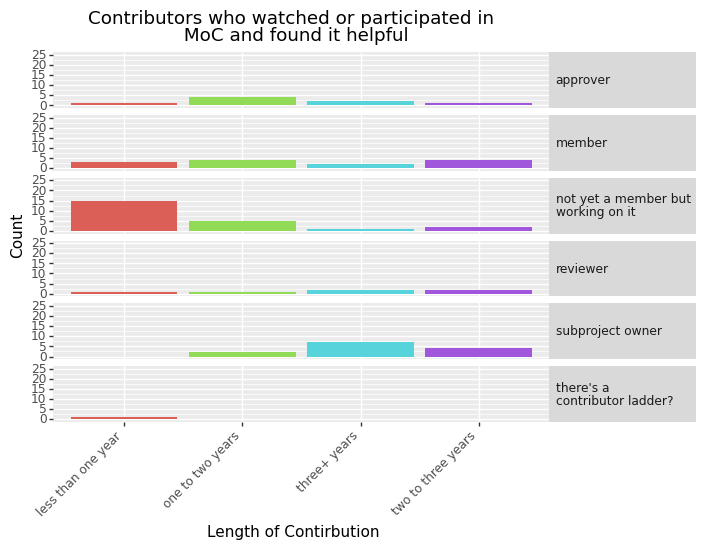


The majority of those who found MoC useful are contributors who are working towards their membership. This is suggesting that while most of the material might be geared towards them, the previous plot shows the importance of striking a balance between the two.

## Ways to Increase Attendance at Thursday Meetings


```python
(
    make_bar_chart(survey_data, "Would_attend_if:")
    + p9.labs(x="Change", y="Count", title="Would attend if")
)
```


The primary reason contributors don't attend Thursday meetings is that they have too many meetings in their personal lives. As this is not something the Kubernetes community can control, we suggest they focus on the second most common suggestion: distributing a full agenda prior to the meeting. 


```python
(
    make_bar_chart(
        survey_data,
        "Would_attend_if:",
        [".", "Level_of_Contributor"],
        proportional=True,
    )
    + p9.labs(x="Change", y="Count", title="Would attend if", fill="Change")
    + p9.theme(
        strip_text_y=p9.element_text(angle=0, ha="left", margin={"r": 1, "units": "in"})
    )
)
```


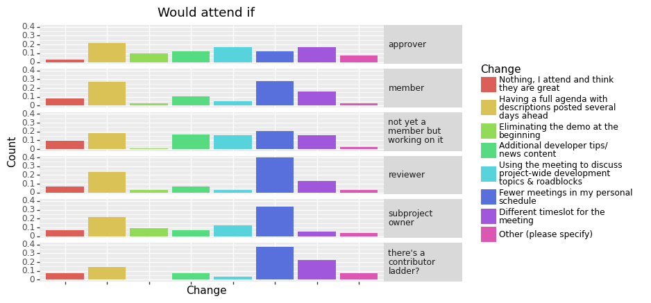


Across contributor levels, the dominant reason for their attendance would be "fewer meetings in my personal schedule". What is interesting is that for those who are not yet members, it is less of a dominating reason than other cohorts. These contributors give almost equal weight to many different changes, some of which may be appropriate to the Thursday meeting, but some of which may indicate the need for new types of outreach programming.


```python
(
    make_bar_chart(
        survey_data, "Would_attend_if:", [".", "Contributing_Length"], proportional=True
    )
    + p9.labs(x="Change", y="Count", title="Would attend if", fill='Reason')
    + p9.theme(
        strip_text_y=p9.element_text(angle=0, ha="left", margin={"r": 1, "units": "in"})
    )
)
```


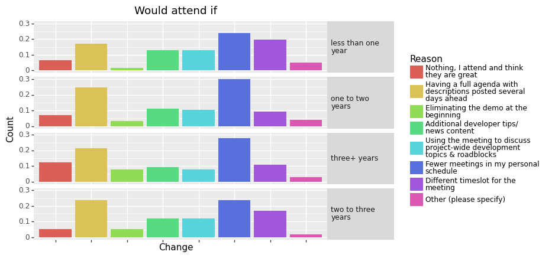


Segmenting the contributors, by their length of contribution, does not reveal any patterns that are widely different than when looking at all the contributors as a whole.


```python
(
    make_single_bar_chart(survey_data[survey_data['World_Region'].notnull()],
                          'Would_attend_if:_Different_timeslot_for_the_meeting', 
                          'World_Region',
                          proportionally=True
                  ) + 
    p9.labs(x='Change',
            y='Count',
            title="Would attend if")
)
```


When looking at the distribution of contributors, who would attend the meetings if they were held at a different time, we can see a large impact that location has. While the number of contributors located in Oceania and Africa is small, it makes forming significant conclusions more difficult. There are many contributors from Asia, indicating that the timing of the meetings is a major barrier to a large portion. This is simply because of the timezones they live in.

## Reasons for Not Attending Summits


```python
unattendance_str = "If_you_haven't_been_able_to_attend_a_previous_summit,_was_there_a_primary_reason_why_(if_multiple,_list_the_leading_reason)"
unattendance_data = survey_data.dropna(subset=[unattendance_str])
```


```python
reason_for_not_going = (
    p9.ggplot(unattendance_data, p9.aes(x=unattendance_str))
    + p9.geom_bar()
    + p9.theme(axis_text_x=p9.element_text(angle=45, ha="right"))
    + p9.labs(
        title="Reasons for not attending summits",
        y="Number of Contributors",
        x="Reason",
    )
)
reason_for_not_going
```

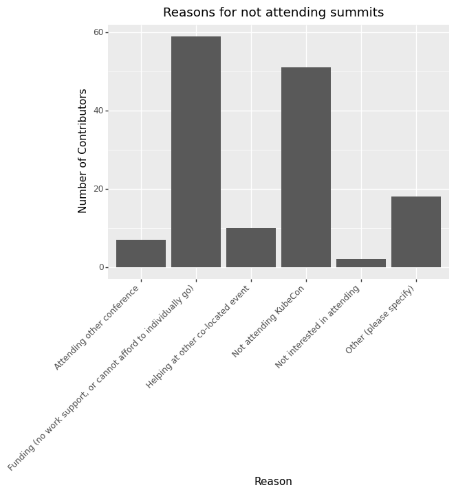


The largest reason for not attending the summits is that contributors feel they do not have enough funding to attend.


```python
unattendance_contrib = (
    unattendance_data.groupby(["Contributing_Length", unattendance_str])
    .count()["Respondent_ID"]
    .reset_index()
    .merge(
        unattendance_data.groupby(["Contributing_Length"])
        .count()["Respondent_ID"]
        .reset_index(),
        on="Contributing_Length",
    )
)
unattendance_contrib = unattendance_contrib.assign(
    percent=unattendance_contrib.Respondent_ID_x / unattendance_contrib.Respondent_ID_y
)
```


```python
(
    p9.ggplot(unattendance_contrib,
           p9.aes(x=unattendance_str,y='percent',fill='Contributing_Length')) +
    p9.geom_bar(stat='identity',position='dodge') +
    p9.theme(axis_text_x = p9.element_text(angle=45,ha='right')) + 
    p9.labs(title="Reasons for not attending summits",
            y = "Proportion of Contributors",
            x= 'Reason',
            fill="Contributing Length") 
)

```


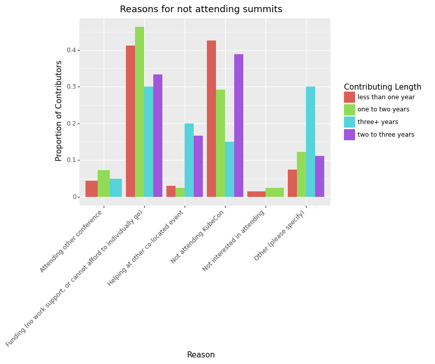


When we look at the reasons for not attending the summits dependent the length of time a contributor has been involved with the project, we see that in addition to lacking funding, the longer tenured contributors tend to help at other events co-located with KubeCon even during the summits.


```python
unattendance_level = unattendance_data.groupby(['Level_of_Contributor',unattendance_str]).count()['Respondent_ID'].reset_index().merge(unattendance_data.groupby(['Level_of_Contributor']).count()['Respondent_ID'].reset_index(), on = 'Level_of_Contributor')
unattendance_level = unattendance_level.assign(percent = unattendance_level.Respondent_ID_x/unattendance_level.Respondent_ID_y)

(
    p9.ggplot(unattendance_level,
           p9.aes(x=unattendance_str,y='percent',fill='Level_of_Contributor')) +
    p9.geom_bar(stat='identity',position=p9.position_dodge(preserve='single')) +
    p9.theme(axis_text_x = p9.element_text(angle=45,ha='right')) + 
    p9.labs(title="Reasons for not attending summits",
            y = "Number of Contributors",
            x= 'Reason',
            fill= 'Level of Contributor') 
)


```

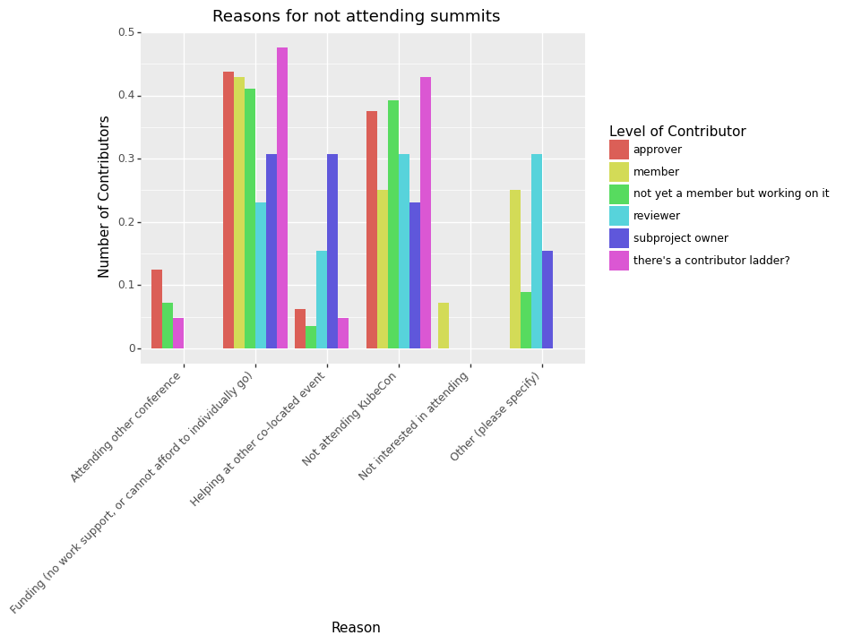


As with above, the higher up the  ladder one is, the more likely the are to be helping out at another event. Interestingly, while approvers are higher on the ladder than reviewers, they are less likely to be attending KubeCon, as well as the summits.


```python
unattendance_support = (
    unattendance_data.groupby(["Upstream_supported_at_employer", unattendance_str])
    .count()["Respondent_ID"]
    .reset_index()
    .merge(
        unattendance_data.groupby(["Upstream_supported_at_employer"])
        .count()["Respondent_ID"]
        .reset_index(),
        on="Upstream_supported_at_employer",
    )
)
unattendance_support = unattendance_support.assign(
    percent=unattendance_support.Respondent_ID_x / unattendance_support.Respondent_ID_y
)

(
    p9.ggplot(
        unattendance_support,
        p9.aes(x=unattendance_str, y="percent", fill="Upstream_supported_at_employer"),
    )
    + p9.geom_bar(stat="identity", position=p9.position_dodge(preserve="single"))
    + p9.theme(axis_text_x=p9.element_text(angle=45, ha="right"))
    + p9.labs(
        title="Reasons for not attending summits",
        y="Number of Contributors",
        x="Reason",
        fill='Employer Support'
    )
)               
```


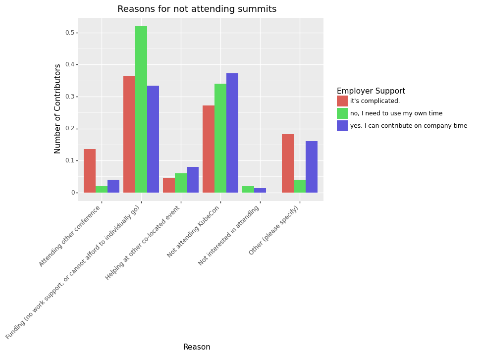


Unsurprisingly, funding is a greater barrier to attendance to those who only work on Kubernetes on their own time, but is still a concern for about a third of those with some support from their employer.

## Agreement with Statements


```python
agree_ratings = ["Strongly Disgree", "Disagree", "Neutral", "Agree", "Strongly Agree"]
(
    make_likert_chart(survey_data, "Agree:", agree_ratings, max_is_high=True)
    + p9.labs(x="Statement", y="Number of Responses", fill="Rating", color="Rating")
)
```


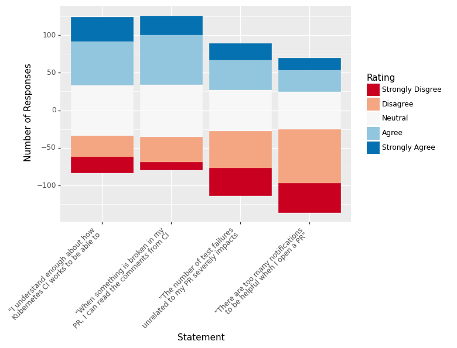


Overall, the plot above displays the proportions one would hope to see. Many contributors are confident in their ability to understand continuous integration, and the related error messages enough to debug their code, while not feeling overburdened by test failures or notifications.


```python
(
    make_likert_chart(
        survey_data[survey_data["Blocker:_Debugging_test_failures"] > 3],
        "Agree:",
        agree_ratings,
        max_is_high=True,
    )
    + p9.labs(x="Statement", y="Number of Responses", fill="Rating", color="Rating")
)
```


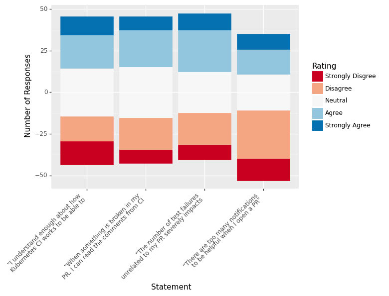


For those contributors who reported that debugging test failures is often or frequently a blocker, we see that the numbers are lower for those who understand CI and it's error messages in a broken PR. This is suggesting that if these areas were improved, less contributors would find debugging test failures to be a major blocker. On the other hand, it may suggest that there is no need to improve these tools, just more of an effort to educate about them. This is an area that could be investigated in future surveys, to best determine how to make debugging less of a blocker.
