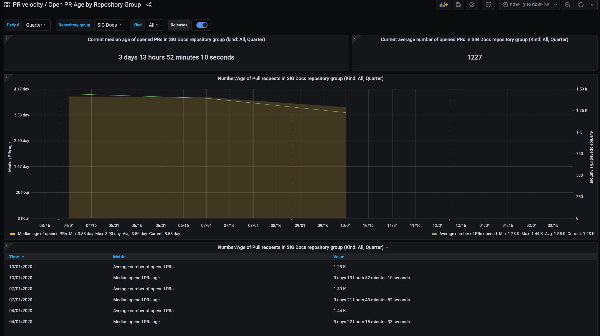

# SIG Docs 2020 Annual Report

**Authors:**

Irvi Aini ([@irvifa](https://github.com/irvifa)),
Jim Angel ([@jimangel](https://github.com/jimangel)),
Karen Bradshaw ([kbhawkey](https://github.com/kbhawkey)),
Kaitlyn Barnard ([@kbarnard10](https://github.com/kbarnard10)),
Taylor Dolezal ([onlydole](https://github.com/onlydole)),
Tim Bannister ([sftim](https://github.com/sftim))

- [Operational](#operational)
- [Membership](#membership)
- [Current initiatives and project health](#current-initiatives-and-project-health)

## Operational

**How are you doing with operational tasks in [sig-governance.md](/committee-steering/governance/sig-governance.md)?**

  - **Is your README accurate? have a CONTRIBUTING.md file?**

    Yes. We also have `Contributing.md` file.
  - **All subprojects correctly mapped and listed in [sigs.yaml](/sig-list.md)?**

    Yes.
      
  - **What’s your meeting culture? Large/small, active/quiet, learnings? Meeting notes up to date?
    Are you keeping recordings up to date/trends in community members watching recordings?**
    
    Quite small (usually 5-10 people) and generally we try to make people feel comfortable to give their opinion.
    Meeting notes are up to date. We have recording of the meetings uploaded.
    
    We have a new sub-project, it's localization sub-project, where we conduct monthly meeting 
    attended by all people from the localizatiin team. This sub-porjcet focusing on sharing any concerns,
    tips, or toolings that may be can be reused by other team as well.

**How does the group get updates, reports, or feedback from subprojects? Are there any springing up or being retired?
Are OWNERS files up to date in these areas?**

Yes it is.

**How does the group get updates, reports, or feedback from Working Groups? Are there any springing up or being retired? 
Are OWNERS files up to date in these areas?**

Yes it is.

**When was your last monthly community-wide update? (provide link to deck and/or recording)**

<!-- TODO -->

## Membership

**Are all listed SIG leaders (chairs, tech leads, and subproject owners) active?**

Yes, they are.

**How do you measure membership? By mailing list members, OWNERs, or something else?**

We don't have an official way of measuring membership.

**How does the group measure reviewer and approver bandwidth? Do you need help in any area now? What are you doing about it?**

PR are generally open for anyone to review. We have [PR wrangler rotation](https://github.com/kubernetes/website/wiki/PR-Wranglers).
In general each of the approver will taking the rotation. Each approver participates in the PR wrangler rotation. Approvers are supported during their rotation by other reviewers and approvers.

For technical reviews, other than SIG Docs Tech Leads, we also notify respective SIGs with necessary knowledge of the technical aspect of the content. SIG Docs receives contributions from community members representing different SIGs. During the PR review process, SIG Docs reaches out to other SIGs when a pull request requires technical review.

**Is there a healthy onboarding and growth path for contributors in your SIG? 
What are some activities that the group does to encourage this? 
What programs are you participating in to grow contributors throughout the contributor ladder?**

There is no official onboarding process. However, the SIG is supportive of new contributors,
willing to walk through the contribution process and eager to see contributions completed.
Issues are created regularly and triaged. Issues are also created specifically for new 
contributors. There are issues labelled for the different contribution areas (web development, 
blog, first time contributors, task, concept, API, etc) which helps new contributors 
identify how to get started.

From time to time we use the weekly meeting Zoom call to help new contributors get onboard.

**What programs do you participate in for new contributors?**

We have an in person session during the KubeCon.

**Does the group have contributors from multiple companies/affiliations? 

Yes

Can end users/companies contribute in some way that they currently are not?**

I suppose we're particular keen to hear about suggested improvements from people who are using Kubernetes in production and can see gaps in what's there.

## Current initiatives and project health

[ ] Please include links to KEPs and other supporting information that will be beneficial to multiple types of community members.

Longer term projects include

- co-ordination with WG naming for things like removing the word “slave” (and other problematic terms) from docs.
- publishing better information about releases kubernetes/website#20293

**What are initiatives that should be highlighted, lauded, shout out, that your group is proud of? 
Currently underway? What are some of the longer tail projects that your group is working on?**

<!-- TODO -->

**Year to date KEP work review: What’s now stable? Beta? Alpha? Road to alpha?**

We have ongoing KEP, but we don't have a deadline set on when it should be finished.

- [Doc policies for third party content](https://github.com/kubernetes/enhancements/tree/master/keps/sig-docs/1326-third-party-content-in-docs)

**What areas and/or subprojects does the group need the most help with?**

- Blog subproject

**What's the average open days of a PR and Issue in your group? / what metrics does your group care about and/or measure?**

We have the information from [devstat](https://k8s.devstats.cncf.io/d/25/open-pr-age-by-repository-group?orgId=1&var-period=q&var-repogroup_name=SIG%20Docs&var-kind_name=All):

For example, based on 10/01/2020 data, we have:
Average number of opened PRs 1.23 K with the median opened PRs age 3 days 13 hours 52 minutes 10 seconds.
