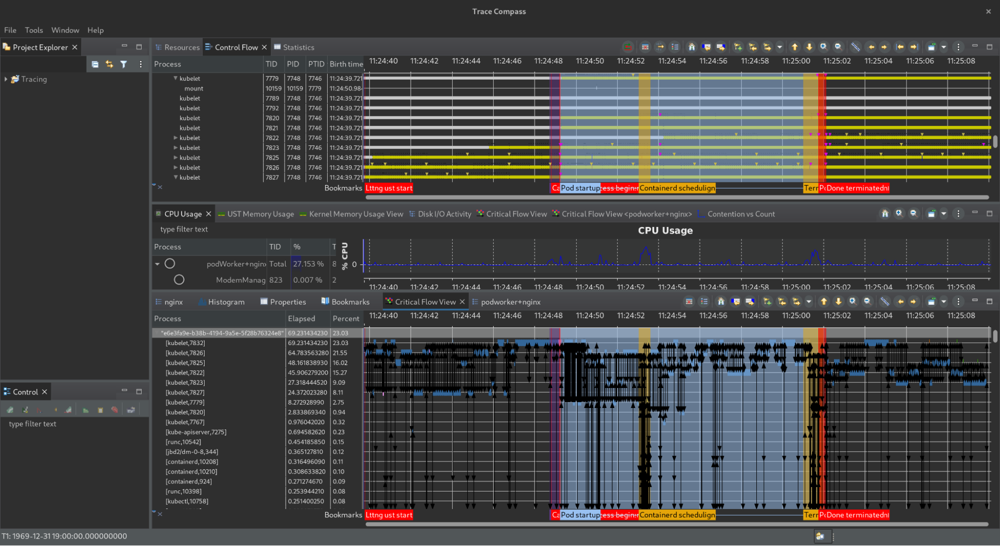

## Triage (2022-12-29)

Cancelled - winter holidays

## Agenda (2022-12-22)

Cancelled - winter holidays

## [NEXT] Triage (2022-12-15)

## Agenda (2022-12-08):

* Deep Dive Video is out on Youtube - 	
* [] - maintaining subprojects + status
    * KSM: new contributors, improving; most active subproject w/3 active
      approvers and 3 new active reviewers, lots of first-time contributors!
    * Metrics-server: We have 2 active reviewers and 1 active approver, only one
      approver. Doing the bare minimum
    * Custom-metrics-apiserver: need to keep maintaining this. Damien only
      approver, doesn’t have time, Olivier is working on it
    * prometheus-metrics-adapter: should we consider archiving? There’s now a
      good replacement, KEDA, with bigger scope
      ([https://keda.sh/docs/1.4/scalers/prometheus/](https://keda.sh/docs/1.4/scalers/prometheus/)).
      Hasn’t been well-maintained, project needs a rewrite because the codebase
      is hard to understand, UX is suboptimal, debugging is very complex and
      tedious. Maybe write a migration guide rather than cleaning up KSM.
    * Can we consider adding people directly to subproject ownership in the new year?
        * Don’t want to give a newbie maintainer status without mentorship
        * Seems reasonable to add people as reviewers right away if requested;
          approver is a higher bar
        * Reviewer status gives you some feelings of ownership and
          responsibility but doesn’t give any privileges above and beyond org
          member. For people who are not yet org members, we can work with them.
* [yangjunmyfm192085] Ask the release plan of metrics-server
    * I think We need to make a release plan for metrics-server v0.6.2 and v0.7.0
    * Marek didn’t have time for a while to cut releases. Damien should now have
      permissions to cut the release, but going forward wants to find someone
      else to do it. Was difficult to release because it had been 6+ months
      between releases so bumping dependencies was tedious. We should be
      releasing every month or 2, at minimum every go version.
    * Han volunteers, Catherine will think about it. Olivier will look into
      contributing as well.
    * Not a lot of new code changes to make, project is pretty stable now, just
      need to keep maintaining (bumping dependencies, bug fixes, CVE management,
      releases, etc.)
* [ehashman] Repo created for [https://github.com/kubernetes-sigs/usage-metrics-collector](https://github.com/kubernetes-sigs/usage-metrics-collector)
    * Got repo created in the last few weeks.
    * Waiting for approval to push code externally, hopefully by end of year, at
      latest January.
    * Once public, we can do a walk-the-code update/demo on a meeting?
* [Paige] Does SIG instrumentation do tracing for system components?
    * Yes! This is being led by David Ashpole (API server)
    * API server tracing should go beta in the next release
    * Kubelet tracing (Sally O’Malley) - currently in alpha, lots of changes
      required before beta

## Agenda (2022-11-10)

* [Pranshu] KSM’s own mixin’s project?
* [Pranshu] Enabling discussions on the repository (can start with KSM).
    * Already enabled
* [Pranshu] Shadow program follow-ups ()?
    * More [members](https://github.com/kubernetes/community/blob/master/community-membership.md#requirements)?
    * Forms rollout, assessing possible major tasks.
* [Benjamin Saint-Cyr] Demo of kernel tracing for kubelets.

* https://github.com/BenjaminSaintCyr/k8s-instrumentation-demo

## Notes from Kubecon SIG F2F:

* Better guidelines/documentations for metrics and logs and traces
    1. Answering basic questions like which logger should we use in k8s custom controllers
* Move documentation to website
* Does kubebuilder use component-base?
    2. Should look into migrating metrics stuff to component-base
* Should we promote metrics/resource to stable?
* Metrics server scalability 
    3. We need to graduate metrics/resource metrics to stable status. 
* Kubelet metrics should possibly sharded to different endpoints
* Better first-time issues 

## Agenda (2022-10-13)

* [pwittrock] [Proposal for new sig project for usage metrics](https://docs.google.com/document/d/12JEje-SpM78N5OhZzWg-_Ba91n6VWRm5c4l_c2U-ljw/edit#)
    * AI: ehashman to open issue with kubernetes/org for repo creation.

## Agenda (2022-09-29)

* Shadow Program: 

## Agenda (2022-09-15)

* [dashpole] Plans for KEPs in 1.26?
    * [https://github.com/kubernetes/enhancements/issues?q=is%3Aopen+is%3Aissue+label%3Asig%2Finstrumentation](https://github.com/kubernetes/enhancements/issues?q=is%3Aopen+is%3Aissue+label%3Asig%2Finstrumentation)
* AI: Document [logtools](https://github.com/kubernetes-sigs/logtools) as a sub-project
* KSM v3.0 planning: [https://github.com/orgs/kubernetes/projects/90/views/1](https://github.com/orgs/kubernetes/projects/90/views/1)

## Agenda (2022-09-01)

* [logicalhan] - [https://github.com/kubernetes/enhancements/pull/3469/](https://github.com/kubernetes/enhancements/pull/3469/)
* [logicalhan] - status of metrics framework KEP
* [dgrisonnet] taking ownership of events/v1 migration [https://github.com/kubernetes/enhancements/issues/383](https://github.com/kubernetes/enhancements/issues/383) 
    * New KEP to plan a safe migration path for all the kube components:
        * Need new per EventSeries backoff mechanism
        * Rate-limiting for unique Events

## Agenda (2022-08-18)

* No agenda items to discuss

## Agenda (2022-08-04)

* [raptorsun (just taking notes)] Metrics API/Server
    * Metrics API stability
    * Resource usage / performance of Metrics server implementation
    * Notes:
        * We can always do a v2 if needed
        * We can always replace the metrics server with a better implementation
* [logicalhan] extending stability update
* [dashpole] Kubelet Tracing made it into 1.25!
    * Follow-ups for etcd:
        * Ask for increasing otel library version to 1.0+ in 3.5?
        * Ask to change the default sampling rate to 0 from 100%. (bug fix)

## Agenda (2022-07-21)

* [raptorsun] kubctl top + node column & memory unit [issue](https://github.com/kubernetes/kubernetes/issues/110722)
* To discuss in next meeting:
    * Metrics API stability
    * Resource usage / performance of Metrics server implementation
    * [after a meeting note from serathius@ (owner of Metrics Server)]. Please reach out to me on Slack if you have any questions.

## Agenda (2022-07-07)

* [serathius] Question about admin experience on reliability of K8s logs.
    * Is anyone running high log generating applications?
    * What’s your experience with log reliability? Have you noticed logs being lost? 
    * Do you measure the percentage of logs delivered?
    * If you or someone you know had this problem, would love to talk. Feel free to reach out to @serathius on K8s Slack

## Agenda (2022-06-23)

* [dgrisonnet] Standardizing metrics initialization and registration in k/k:
    * [https://github.com/kubernetes/kubernetes/pull/110027/files#r872226087](https://github.com/kubernetes/kubernetes/pull/110027/files#r872226087) 
* [serathius] Question about admin experience on reliability of K8s logs.
    * Serathius - will not be able to attend. Feel free to skip.
* [dashpole,dgrisonnet] OpenTelemetry and Prometheus Exponential (Sparse) Histograms continuation
    * Concern about migrating to sparse histogram: Cardinality when producing fixed buckets?
    * AI: Write a strawman document for how we would do a migration.  Share with the prometheus folks to see if any concerns/problems are addressable.
* [catherineF-dev] High cardinitiy metric apiserver_request_duration_seconds_bucket [https://github.com/kubernetes/kubernetes/issues/110742](https://github.com/kubernetes/kubernetes/issues/110742) 
    * Trace + one simplified metric (only capture high latency cases and drop some labels)
    * AI: Look into adding exemplars to the metric and traceid to the audit logs
    * [serathius] ^ Looks like more structured logging thing then audit log

## Agenda (2022-06-09)

* [raptorsun, dgrisonnet] Improve kubectl top UX with PodMetrics
    * [https://github.com/kubernetes/kubernetes/issues/102051](https://github.com/kubernetes/kubernetes/issues/102051) 
    * [https://github.com/kubernetes/kubectl/issues/830](https://github.com/kubernetes/kubectl/issues/830) 
* [dashpole] OpenTelemetry and Prometheus Exponential (Sparse) Histograms
    * 
    * TL;DR they differ on bucket start being inclusive vs exclusive.
    * Do we consider it backwards-compatible to switch from fixed-bucket histograms to exponential histograms (since it changes bucket boundaries)?  Would we switch histograms to exponential histograms if bucket boundaries are the only thing that changes?

## Agenda (2022-05-12)

* KEP planning - Enhancement freeze June 16th

## Agenda (2022-04-28)

* Canceled due to technical difficulties.

## Agenda (2022-04-14)

* Announcements
    * Release delayed until May 3rd: [https://github.com/kubernetes/sig-release/pull/1884](https://github.com/kubernetes/sig-release/pull/1884) 
* Discussion from Chairs/Leads:  
    * Ensuring test flakes get fixed
        * [https://github.com/kubernetes/kubernetes/issues?q=is%3Aopen+is%3Aissue+label%3Asig%2Finstrumentation+label%3Akind%2Fflake](https://github.com/kubernetes/kubernetes/issues?q=is%3Aopen+is%3Aissue+label%3Asig%2Finstrumentation+label%3Akind%2Fflake) 
    * Improving Kubernetes reliability
    * Improving the enhancements process
        * There is a huge amount of toil in writing KEPs/adding metadata,
          particularly when much of the information is available in the git
          history already
        * Kepctl is useful but most people don’t know it exists and it often
          breaks, needs frequent patches in order to work. If documentation was
          improved, might be helpful
        * KEP process is very painful, giant barrier for new contributors; can
          we think bigger and reimagine the process rather than just adding
          tooling (technical solutions to a process problem)?
        * SIG is okay with changes to kep.yaml files so long as tools
          autogenerate all changes, no additional manual work for contributors

## Triage (2022-04-07)

## Agenda (2022-03-31)

Canceled - no agenda

## Agenda (2022-03-17)

* Reminder: code freeze
    * Milestone review: bumped API tracing beta to 1.25
* [serathius,pohly] Needs reviewers for klog
    * [https://github.com/kubernetes/klog/issues/222](https://github.com/kubernetes/klog/issues/222) 
    * **Action:** serathius will run the maintainers script to update OWNERS file

## Agenda (2022-03-03)

* [Leads] Annual report
    * [https://github.com/kubernetes/community/pull/6463](https://github.com/kubernetes/community/pull/6463)
    * Should be merged by Mar. 1
* [dgrisonnet,sanchezl] Adding a new bounded dimension to a stable metric.
  Extending apiserver_admission_webhook_admission_duration with a bounded
  resource label for finer grained SLO.
    * [https://github.com/kubernetes/kubernetes/pull/69895](https://github.com/kubernetes/kubernetes/pull/69895) 
    * [https://github.com/kubernetes/kubernetes/pull/108468](https://github.com/kubernetes/kubernetes/pull/108468) 

## Triage (2022-02-24)

## Agenda (2022-02-17)

* [Leads] Annual report
    * [https://github.com/kubernetes/community/pull/6463](https://github.com/kubernetes/community/pull/6463)
* [ehashman] Charter update FYI
    * Adds tracing, removes heapster
    * [https://github.com/kubernetes/community/pull/6464](https://github.com/kubernetes/community/pull/6464) 
* 

## Triage (2022-02-10)

* [hase1128] Continue to discuss the idea for KEP2312 \
[https://github.com/kubernetes/enhancements/pull/2312](https://github.com/kubernetes/enhancements/pull/2312) \
Doc URL(I uploaded on slack): [https://kubernetes.slack.com/archives/C20HH14P7/p1643912029063699](https://kubernetes.slack.com/archives/C20HH14P7/p1643912029063699)

## Agenda (2022-02-03)

* Announcements
    * Final KEP review: deadline is today
* [dgrisonnet] Improve tooling to make sure that all PRs modifying a metrics.go file, are approved by sig-instrumentation.
* [hase1128] I would like to get feedback about my current idea for KEP2312 \
[https://github.com/kubernetes/enhancements/pull/2312](https://github.com/kubernetes/enhancements/pull/2312) \
Doc URL(I uploaded on slack): [https://kubernetes.slack.com/archives/C20HH14P7/p1643912029063699](https://kubernetes.slack.com/archives/C20HH14P7/p1643912029063699)

## Triage (2022-01-27)

## Agenda (2022-01-20)

* Announcements
    * Damien is our new TL!
    * Reminder: upcoming release dates
* [fromani] (can be postponed, 1.24 or beyond) klog: towards per-flow verbosity	
    * Looking for previous history/attempts (if any) and design yay/nay
    * Probably deserves a full KEP, will write depending on the above bullet point
        * POC/usecase description [here](https://github.com/kubernetes-sigs/scheduler-plugins/pull/289) (caveat: security implications not addressed)
* [dashpole] Stable metric deprecation period discussion: Should stable metrics be permanent?
    * [https://github.com/kubernetes/website/pull/31389#pullrequestreview-856542765](https://github.com/kubernetes/website/pull/31389#pullrequestreview-856542765)

## Triage (2022-01-13)

## Agenda (2022-01-06)

* Announcements
    * 1.24 dates not yet finalized
    * Week 1: January 10
    * Week ???: Release planned for April 19
* [Leads] New TL update
    * Congrats Damien!
    * Lazy consensus: need to submit PR/mailing list post
    * Also need to clean up OWNERS files with leads once done
* [ehashman] 1.24 KEP planning, continued  
* [logicalhan]  
* [dgrisonnet] Possible new KEPs
