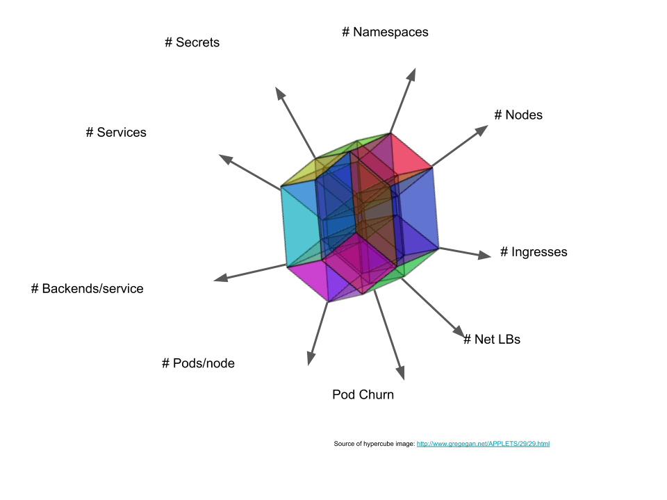

# Kubernetes Scalability thresholds

## Background

As described in [How we define scalability] document, it is impossible
to provide guarantees in a generic situation. One of the prerequisites
for SLOs being satisfied is keeping the load in the cluster within
recommended limits. This document is trying to explicitly summarize
dimensions and limits themselves.

[How we define scalability]: https://github.com/kubernetes/community/blob/master/sig-scalability/slos/slos.md#how-we-define-scalability

## Kubernetes thresholds

Scalability dimensions and thresholds are very complex topic. In fact,
configurations that Kubernetes supports create `Scalability Envelope`:

Some the properties of the envelope:
1. It's NOT a kube, because dimensions are sometimes not independent.
1. It's NOT convex.
1. As you move farther along one dimension, your cross-section wrt other
   dimensions gets smaller.
1. It's bounded.
1. It's decomposable into smaller envelopes.

You can learn more about it in this [Kubecon talk] (or [Kubecon slides]).

There are couple caveats to the thresholds we are presenting below:
1. In majority of cases, thresholds are NOT hard limits - crossing
   the limit results in degraded performance and doesn't mean cluster
   immediately fails over.
1. **Many of the tresholds (for cluster scope) are given for the largest
   possible cluster. For smaller clusters, the limits are proportionally
   lower.**
1. The thresholds may differ (hopefully be non-decreasing) across Kubernetes
   releases. The threshold below are given for Kubernetes head.  
   **TODO:** We are planning to start versioning the table below, but we
   are not there yet.
1. Given that configuration influences thresholds, we are assuming vanilla
   Kubernetes setup.

The table below is **NOT exhaustive** - more content is coming soon.

| Quantity               | Threshold scope=namespace | Threshold: scope=cluster |
|------------------------|---------------------------|--------------------------|
| #Nodes                 | n/a                       | 5000                     |
| #Namespaces            | n/a                       | 10000                    |
| #Pods                  | 3000                      | 150000                   |
| #Pods per node         | min(110, 10*#cores)       | min(110, 10*#cores)      |
| #Services              | 5000                      | 10000                    |
| #All service endpoints | TBD                       | TBD                      |
| #Endpoints per service | 250                       | n/a                      |
| #Secrets               | TBD                       | TBD                      |
| #ConfigMaps            | TBD                       | TBD                      |
| #Deployments           | 2000                      | TBD                      |
| #DaemonSets            | TBD                       | TBD                      |
| #Jobs                  | TBD                       | TBD                      |
| #StatefulSets          | TBD                       | TBD                      |

There are also thresholds that depend on environment/cloud provider. The **NOT
exhaustive** list includes:

| Quantity                         | Threshold scope=namespace | Threshold: scope=cluster |
|----------------------------------|---------------------------|--------------------------|
| #Ingresses                       | TBD                       | TBD                      |
| #PersistentVolumes               | n/a                       | TBD                      |
| #PersistentVolumeClaims          | TBD                       | TBD                      |
| #PersistentVolumeClaims per node | TBD                       | TBD                      |

[Kubecon slides]: https://docs.google.com/presentation/d/1aWjxpY4YJ4KJQUTqaVHdR4sbhwqDiW30EF4_hGCc-gI
[Kubecon talk]: https://www.youtube.com/watch?v=t_Ww6ELKl4Q
