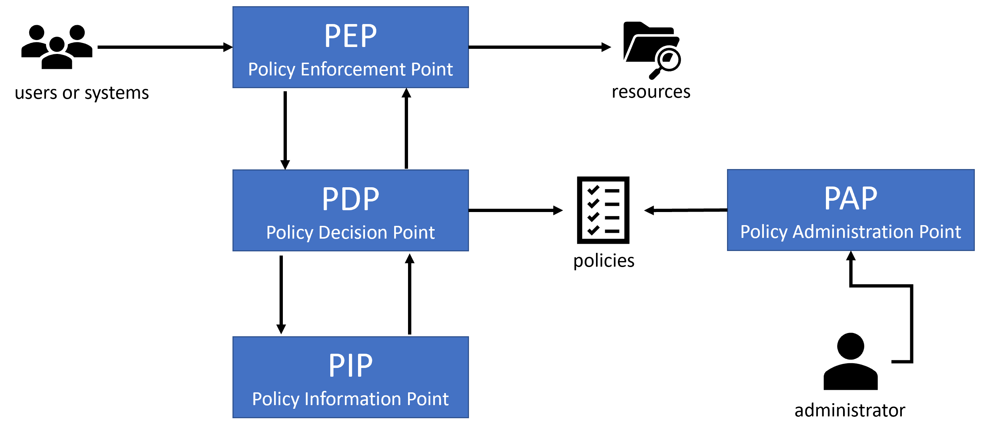
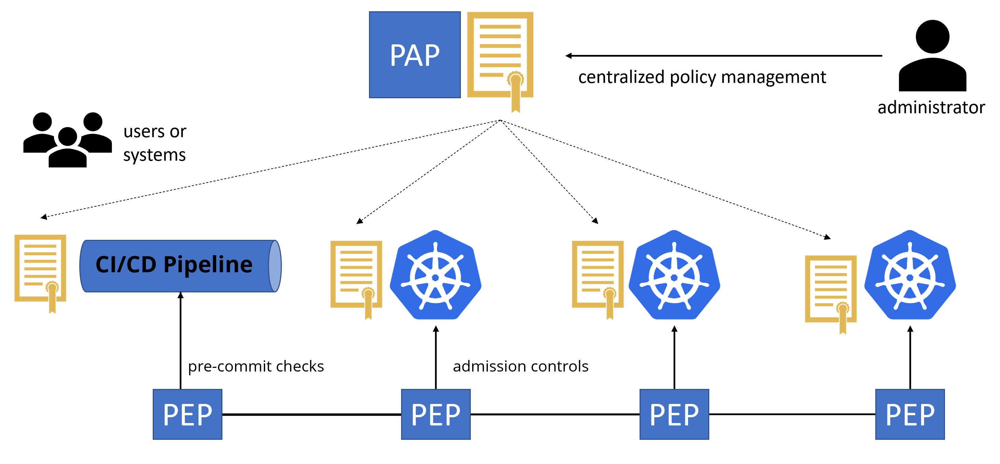
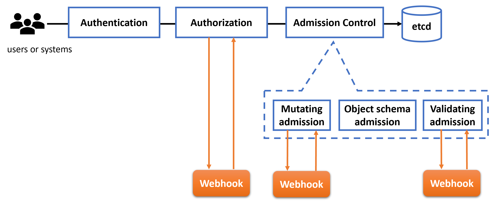
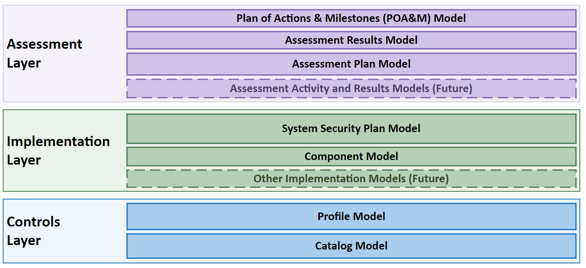

Kubernetes Policy Management
==============================

With the fast growing and widespread adoption of Kubernetes, this paper aims to provide a clear understanding of why Kubernetes policy management is becoming necessary for security and automation. It also describes what problems Kubernetes policies can help solve, and how Kubernetes policies are implemented.

# Contents

- [Introduction](#introduction)
  - [Authors](#authors)
  - [Acknowledgements](#acknowledgements)
  - [Target Audience](#target-audience)
  - [In Scope](#in-scope)
  - [Out of Scope](#out-of-scope)
  - [Policy Engines and Tools](#policy-engines-and-tools)
- [Policy Architecture](#policy-architecture)
    - [Policy Administration Point (PAP)](#policy-administration-point--pap-)
    - [Policy Enforcement Point (PEP)](#policy-enforcement-point--pep-)
      - [Kubernetes Policy Objects](#kubernetes-policy-objects)
      - [Enforcement at admission](#enforcement-at-admission)
      - [Enforcement at runtime](#enforcement-at-runtime)
    - [Policy Decision Point (PDP)](#policy-decision-point--pdp-)
    - [Policy Information Point (PIP)](#policy-information-point--pip-)
- [Lifecycle Phases](#lifecycle-phases)
  - [Develop](#develop)
  - [Distribute](#distribute)
  - [Deploy](#deploy)
  - [Runtime](#runtime)
- [Security Mappings](#security-mappings)
  - [Security Assurance](#security-assurance)
    - [Threat Modeling](#threat-modeling)
    - [Security assurance in the delivery pipeline](#security-assurance-in-the-delivery-pipeline)
    - [Security assurance at runtime](#security-assurance-at-runtime)
    - [Incident Response](#incident-response)
  - [Compliance](#compliance)
- [Conclusion](#conclusion)
- [Roadmap](#roadmap)

# Introduction

A policy is a set of rules adopted by an organization to help achieve desired outcomes. Policies can be used to define rules or guidelines to help achieve desired behaviors across wide ranging concerns like costs, security, and productivity. For example, a corporate expense policy defines guidelines for employee purchases that the finance team can audit. 

In Information Technology (IT), policies define rules for system configurations and behaviors across domains like security, scale, resilience, and best practices. Policies that define rules for system controls can help represent these recommended practices in a declarative manner. Cloud native systems like Kubernetes are extensible, integrating policy management into the system configuration itself. Policy conformace is measured by reports which show the enforcement or audit of the desired system configuration state. This approach enables policy based governance of systems to realize overall audit readiness goals.

A policy in Kubernetes serves as a digital contract between application owners, cluster administrators, and security stakeholders. Kubernetes administrators deploy policies that describe what configurations and behaviors are allowed based on the organization’s security and compliance requirements. The policies are configured to allow, deny, or audit the configurations or behaviours of interest. Such policies are typically authored collaboratively by operators and information security teams. A best practice is to manage the policies as versioned source code in an auditable fashion.

Kubernetes has policy constructs as part of its [APIs](https://kubernetes.io/docs/concepts/overview/kubernetes-api/) (e.g. a [NetworkPolicy](https://kubernetes.io/docs/concepts/services-networking/network-policies/)), and also allows external policy engines to run as part of the Kubernetes [control plane](https://kubernetes.io/docs/reference/glossary/?all=true#term-control-plane) via [dynamic admission control](https://kubernetes.io/docs/reference/access-authn-authz/extensible-admission-controllers/) capabilities. This paper discusses both types of Kubernetes policies.

## Authors

* Anca Salier, IBM
* Ardhna Chetal, TIAA
* Jayashree Ramanathan, Red Hat 
* Jim Bugwadia, Nirmata
* Robert Ficcaglia, Sunstone Secure

## Acknowledgements

The authors wish to thank the following individuals for review and feedback.

* Raj Krishnamurthy, ContiNube
* Itay Shakury,  Aqua Security
* Vishwas Manral, McAfee Enterprise (NanoSec)
* Rory McCune, Aqua Security
* Andres Vega, VMware
* Sayantani Saha, IEM-Kolkata
* Jack Kelly
* Ash Narkar, Styra
* Kapil Bareja, Deloitte
* Karim Benzidane, IBM
* Maor Kuriel, WhiteSource
* Herbert Mühlburger, IT-Ziviltechniker
* Maarten Hoogendoorn, Container Solutions
* Pushkar Joglekar, VMware
* Alok Raj
* Dan Papandrea, Sysdig
* Abdelrahman Essam
* Rahul Jadhav, Accuknox

The authors also wish to thank the chairs and members of the CNCF [TAG Security](https://github.com/cncf/tag-security#readme) and [Kubernetes SIG Security](https://github.com/kubernetes/community/tree/master/sig-security#security-special-interest-group) groups for their collaboration and support.

## Target Audience

This paper is intended for Kubernetes administrators, Site Reliability Engineers (SREs), and other practitioners wanting to Kubernetes clusters and workloads in compliance to organizational standards as well as regulatory compliance standards for security, resiliency, and best practices. 

Additional stakeholders include Chief Security Officers (CSOs), Chief Information Security Officers (CISOs), Chief Technology Officers (CTOs), Security and Compliance personnel, and Auditors of organizations using Kubernetes. This paper also serves as a reference for anyone interested in Kubernetes security, compliance, and governance.

## In Scope

The Kubernetes documentation defines the “[The 4C's of Cloud Native Security](https://kubernetes.io/docs/concepts/security/overview/#the-4c-s-of-cloud-native-security)” model with the applicable layers as Code, Containers, Clusters, and Cloud. 

Policies in Kubernetes are concerned with the middle two layers - Containers and Clusters. This paper focuses on these two layers. While code and cloud are not in scope for this paper, these two layers deserve consideration as part of an overall security strategy. This implies that in addition to securing the Containers and Clusters:

* Cloud, or other infrastructure, security must be enabled and managed
* Application code and 3rd party dependencies running inside of containers must also be secured

In the 4C’s model, Code [refers to the application code running inside a container](https://kubernetes.io/docs/concepts/security/overview/#code). The Kubernetes configurations are a set of desired state declarations for resources. The configuration for an application is typically defined as a set of YAML files referred to as resource manifests. While it's a best practice to manage Kubernetes resource manifests “as code” (i.e. use version control, reviews testing, etc.) these resource manifests are used to describe how containerized applications should be run in a Kubernetes cluster. Hence they are mapped to the Containers layer in the 4C’s model.

## Out of Scope

As discussed above the following layers are not covered in this paper:

* **Cloud**: the infrastructure on which the container platform is running 
* **Code**: Security aspects of application code and 3rd party dependencies 

## Policy Engines and Tools

This paper focuses on the policy management concepts and not on the classification or comparison of policy management tools. Please refer to the [security and compliance section of the cloud native landscape](https://landscape.cncf.io/card-mode?category=security-compliance&grouping=category) for available tools.

# Policy Architecture

**XACML** (eXtensible Access Control Markup Language) is a standard from **OASIS** (Organization for the Advancement of Structured Information Standards) that defines a policy language, architecture and processing model. The XACML architecture provides a good starting point for defining a policy management architecture for Kubernetes.

In the XACML architecture, the **Policy Administration Point (PAP)** creates a **Policy** or a **PolicySet** and makes it available to a **Policy Decision Point (PDP)**. User requests are intercepted by a **Policy Enforcement Point (PEP)**, which communicates with the PDP to determine how the request should be handled. The PDP may enrich policy data with attribute values from the **Policy Information Point (PIP)** and will apply the configured policies. The PDP then instructs the PEP how to proceed, for example if the request should be allowed or denied.

The figure below shows a simplified diagram of the XACML components and their interactions. Please refer to the OASIS [eXtensible Access Control Markup Language (XACML) Version 3.0](http://docs.oasis-open.org/xacml/3.0/xacml-3.0-core-spec-os-en.html) for complete details.

The following sections detail how the XACML architecture can be applied to Kubernetes policy management.

## Policy Administration Point (PAP)

When applied to Kubernetes, the role of a Policy Administration Point (PAP) is typically fulfilled by a central management system that is used to define and distribute policies across a fleet of clusters. The PAP may integrate with backing version control systems or [OCI-compliant](https://opencontainers.org/) registries to store policy definitions. By allowing policies to be managed as versioned code artifacts, a PAP can enable best practices that allow policy definitions to be managed like code artifacts in a software delivery pipeline. The approach of using software development best practices, such as version control and pre-deployment testing and validation, etc. for managing policies, is referred to as “Policy as Code (PaC)”. As the set of policies grow, policy administrators should try to organize policy documents logically by service or domain or control concern, possibly by managing multiple smaller code documents and having the application or service query for specific policy documents, or by dynamic lookup via design patterns, such as composition. For example policies can be organized based on control categories of specific compliance standards and by specific security domains. 

Policies are configured using interfaces provided by the PAP which provides multi cluster policy management, enabling policies to be bound to managed clusters. The PAP deploys the policies to the managed clusters based on this binding. A flexible approach of doing so is by associating labels with the clusters and applying policies to clusters that meet certain placement rules derived from these labels.

The PAP  is used for authoring, deploying, and managing policy changes. However, most real world implementations of a policy management system will also provide capabilities to manage compliance mappings, manage policy results, provide workflows for process automation, enable collaboration across teams, and provide integrations into other enterprise systems such as for identity management, version control, and notifications. In addition to managing and distributing policies, a PAP may perform several other useful functions:

* Consolidate policy results and violations across clusters into graphical views along with contextual data to enable collaboration across various personas such as developer, SRE/cluster administrator, and SecOps. 
* Externalize multi cluster policy violation details using standardized policy report format for easy integration with other IT tools so each managed cluster does not need to integrate individually with each such IT tool.
* Automate the remediation of policy violations per existing enterprise IT operational processes by routing them to IT incident management and security operations center tools. This is to meet enterprise operational standards for change management and security alerting that require integration with such tools.
* Provide long term summarized reporting for compliance and verification. Detailed reporting for specific policy violations will be in the respective tools that serve as the PEP for various controls. While typically how long the PAP stores policy results is configurable, long term results can also be offloaded to external storage.
* Provide security and compliance readiness assessment report and posture details.
* Integrate with enterprise tools such as a Security Operations Center (SOC), incident management tools, Governance Risk and Compliance (GRC) tools. In particular, the integration with SOC and GRC tools allows the mapping of the PDP results to specific compliance regulations (e.g. PCI), laws (e.g. HIPAA), or standards (e.g. NIST 800-53) and their controls.
* Provide translations from the native policy report formats to standards such as NIST Open Security Controls Assessment Language (OSCAL) or to templates available for audit firms.

## Policy Enforcement Point (PEP)

PEPs help enforce policies that ensure that the current state of a Kubernetes cluster matches the desired state as codified by the policy. They can also help to audit the cluster and alert on any API-server resources that violate policy. Policy enforcement in  in Kubernetes can broadly be performed using:

1. Built-in policy objects
2. Kubernetes extensions operating as admission controllers
3. Runtime policy engines

Note that these options are not mutually exclusive, and all three are recommended to be used together for a comprehensive security solution. 

Each of these types of enforcement is described below.

### Kubernetes Policy Objects

Kubernetes has several resources that act as policies or provide a foundation for applying policies. These resources are implemented by Kubernetes controllers.

* **Namespaces**: Kubernetes namespaces ([documentation link](https://kubernetes.io/docs/concepts/overview/working-with-objects/namespaces/)) allow API level segmentation of resources and provide a way to share clusters across workloads and teams. Even when clusters are dedicated to a team or application, namespaces should be used as a security boundary to restrict cluster-wide access. 
* **Role Based Access Controls (RBAC)**: Kubernetes allows cluster-wide and namespaced definitions of roles, with granular permissions, and role-bindings to map users or service accounts to roles ([documentation link](https://kubernetes.io/docs/reference/access-authn-authz/rbac/)).
* **Pod security admission**: Pods are the basic unit of execution in Kubernetes, and each pod has a security context that defines its privileges and other security requirements. The [Pod Security Standards](https://kubernetes.io/docs/concepts/security/pod-security-standards/) defines three levels of security policies to apply to pods, and [Pod Security Admission Controller](https://kubernetes.io/docs/concepts/security/pod-security-admission/) provides an implementation for applying the policies at a namespace level.
* **Quotas**: Kubernetes quotas specify resource requests and limits for workloads and namespaces, ensuring that a workload does not impact the performance of other workloads in the same cluster. 
* **Network Policies**: Network policies control ingress and egress traffic to workloads. While network policies are part of the Kubernetes API, a Container Network Interface (CNI) implementation that supports network policies must be installed to provide the implementation.

### Enforcement at admission

All Kubernetes configuration changes, regardless of whether they originate from administrators, end users, built-in controllers, extensions, or external management systems, are performed using declarative APIs. The lifecycle of all API requests is managed by the Kubernetes API Server, which acts as an extensible enforcement point as shown in the figure below:

Each Kubernetes API request passes through three checkpoints before data is retrieved from or modified in the persistent store (typically etcd):

* **Authentication**: Authentication controls if the user or application making the API call is who they claim to be, by exchanging security credentials for an identity. Kubernetes supports multiple authentication methods (see: [Authenticating](https://kubernetes.io/docs/reference/access-authn-authz/authentication/)). For example, OpenID Connect (OIDC) based authentication tokens with central identity providers can be used to authenticate users, and Service Account Tokens in JWT format can be used to authenticate applications. Policy management can be used to ensure policies are in place to deploy the desired authentication providers and configure them for best practices. 

* **Authorization**: Authorization controls if the authenticated caller is allowed access to the resources they would like to retrieve or modify. Kubernetes supports multiple authorization modes (see: [Kubernetes Authorization Overview](https://kubernetes.io/docs/reference/access-authn-authz/authorization/)). Role Based Access Controls (RBAC) are typically used with namespaced resources such as a Role and RoleBinding, or their cluster-wide equivalents ClusterRole and ClusterRoleBinding.  \
 \
Kubernetes allows registration of a Webhook based authorizer. However, this is seldom used as it requires changing the API server through configuration flags which is not possible in managed Kubernetes distributions. Policy management can be used to ensure that Kubernetes uses policies such as RBAC.

* **Admission Controls**: After the caller is authenticated, and the API request is authorized, Kubernetes runs configured [admission controllers](https://kubernetes.io/blog/2019/03/21/a-guide-to-kubernetes-admission-controllers/) that provide additional controls on how an API request is handled. Kubernetes has many built-in admission controllers that can be enabled or disabled via API server flags (see: [Using Admission Controllers](https://kubernetes.io/docs/reference/access-authn-authz/admission-controllers/)).  \
 \
Admission controls can be used to validate or modify data. For example, the built-in LimitRanger admission controller validates that resource constraints specified for a Namespace in a LimitRange object are not violated, and the DefaultIngressClass admission controller modifies created Ingress resources with a default ingress class. \
 \
In addition to the built-in admission controllers, Kubernetes is designed to allow the secure registration of external controllers as mutating or validating webhooks (as webhook is a software component that receives and responds to HTTP requests). This allows external policy engines to validate and mutate all Kubernetes API requests. Policy Engines can act as a defense-in-depth mechanism to address the commonly used fail-open admission control settings. Policy management can be used to ensure Kubernetes policies are in place enforced by various admission control constructs including various policy engines.

Prior to instantiation, policies can be used at admission controls to audit or enforce a large variety of checks such as:#

* Verifying use of trusted image registries
* Verifying image signatures
* Converting image tags to immutable digests
* Verify supply chain attestations
* Requiring the use of Kubernetes policy resources such as pod security admission, RBAC, Namespaces, Limits and quotas, and Network policies
* Enforce required SECCOMP and SELINUX profiles 
* Blocking insecure configurations such as pod security contexts with root user privileges 
* Automatically remediating insecure configurations (via the mutating webhook)
* Auditing or enforcing best practices, such as setting pod resource quotas and health checks
* Generating default resources, such as a default network policy

### Enforcement at runtime

Runtime enforcement provides an additional layer of security by detecting insecure and unexpected behaviors, such as access to a protected filesystem, for running workloads and providing ways to prevent such behaviors.

In some cases, such as when a new policy is applied to existing workloads, it may be desirable to report policy violations without blocking requests or otherwise impacting critical workloads. A PEP should provide this flexibility on a granular basis.

There are two distinct threat actors for container runtimes: 

1. An attacker who has the control plane rights to create new containers.
2. Threats originating from inside a running container.

The first can be mitigated via Kubernetes Authentication, Authorization, and Admission Control checks that inspect all API requests and policy aspects for this are covered in the prior section. Here, we focus on policy aspects of the second scenario which require both container runtime flags to be set appropriately, and runtime enforcement of policies in the running container to prevent unexpected behaviors.

Kubernetes runtime policy engines can enforce container runtime policies by inspecting and/or terminating offending workload system calls or processes, e.g. by enabling enforcement using Linux Security Modules (LSMs) to directly reject dangerous system calls and hence prevent the violation from occurring. They can enforce least-privilege policies that permit the container to perform only legitimate application activities, e.g. disallow or enforce restrictions or alert on debugfs use, code injection into another process, writing to executable memory region, dynamic code loading, kernel module loading, and process hooks. Policies can be defined to restrict or alert on network connections to container host services, to the Kubernetes API server, to Cloud IAAS metadata services (e.g. AWS EC2 metadata service), or for data exfiltration attempts, or network connections to download new binaries.

Runtime policy engines can also restrict (authorized, expected) Kubernetes API access to cluster resources based on the context and scope defined in the access tokens, or rate limit the requests to avoid queuing or denial of service of controllers. For example, attempts to access resources in a namespace and not in the container's initial set can be blocked, or pulling service information from CoreDNS, or attempts to bypass policy engines by DoS'ing the Admission controller.

Runtime policies can include periodic conformance checks to container security standards such as the [CIS Benchmark for Kubernetes](https://www.cisecurity.org/benchmark/kubernetes/). Compliance operators can implement and automate the CIS benchmark policies checks, enforce the policy, or simply provide monitoring and report violations.

Security teams may wish to integrate Policy Report data with Kubernetes API audit event streams, to get situational awareness of orchestrator actions.

In addition to these enforcement mechanisms, the cloud-native universe is increasingly adopting a “Shift Left” approach to security wherein anyone embracing GitOps for instance should consider evaluating policies in CI and on developer laptops to ensure developers get early feedback on policy evaluation. We'll cover this in more detail in the "Develop" section.

## Policy Decision Point (PDP)

Policy engines act as a Policy Decision Point (PDP). Policy engines can run during Kubernetes admission controls or they could run during runtime as privileged workloads within the cluster.  They can render decisions on policies related to security, resiliency, and software engineering aspects.

When a policy is specified in “inform” or “audit” mode, the PDP detects any mismatches of the control state against the details specified in the policy and conveys these results to the PEP.

A policy engine may have its own language for defining and managing policies. The policy language may be a Domain Specific Language (DSL), a general purpose language, or declarative configuration. In all cases, policy definitions will eventually have to be accessible within the Kubernetes cluster and best practice to externalize them as Kubernetes custom resources.

The [Kubernetes Policy Working Group](https://github.com/kubernetes/community/tree/master/wg-policy) has defined a flexible and reusable definition for reporting policy results. The Policy Report Custom Resource Definition (CRD) is a Kubernetes API object that can be used by any PDP to report policy execution results, and by any PAP to retrieve, store, and report on current and real-time policy data. The PAP can also use Policy Report CR to externalize the overall multi-cluster policy violation details so it can be integrated into external operational tools used for incident management, security operations, and governance/risk/compliance (GRC) for further mapping to regulations and standards controls

In the interlock with external tools, it is useful to consider the personas operating those tools, as we may move from a Kubernetes centric administrator focused operational realm to a compliance focused realm managed by compliance officers and engineers. The key to a successful interlock with the compliance team’s tools such as Compliance Operations and Governance, Risk, and Compliance (GRC) tools is recognizing the difference of expertise and expectations between the two personas: the admins prefer a report by non-compliant inventory assets and severity of affected systems, while the compliance officers prefer a report of failing regulation controls and risk of affected policies. 

To address these dual requirements, this WG designed a reporting policy results schema for the operational interest of the administrator and at the same time, it followed the industry [NIST OSCAL](https://pages.nist.gov/OSCAL/) [oscal] standard terminology. In particular, the CRD schema is mapping to the OSCAL assessment results observations element such that the expected translation of the Kubernetes reporting policy results can be straightforwardly translated to the OSCAL schema.

Remediation involves fixing any policy violations so the control in question is operating to best practices specified in the policy. When the policy is specified in 'enforce' mode, the PEP performs remediation when it finds any mismatches. When the policy is specified in 'inform' mode, the PEP reports mismatches as policy violations to the PAP which can then trigger remediation or route an alert to an incident management system or security operations center (for security related policies) which in turn can initiate remediation actions.

## Policy Information Point (PIP)

Policy decisions often also require other metadata and configuration data. For example, a policy rule may be selectively applied to resources based on namespace labels, which requires a lookup of labels configured on the target namespace. Other examples include looking up existing resource configuration data from the API server to check for limits and other enforceable properties.

Kubernetes policy engines typically leverage the Kubernetes API server to query additional information for data-driven policy decisions. Some policy engines may also allow calls to external systems, for additional information. As with any other API calls, such access should be performant and properly secured. 

# Lifecycle Phases

The previous sections introduced Kubernetes policies and provided a reference architecture. In this section, we will discuss how Kubernetes policies map to the product development lifecycle.

The [Cloud Native Security Whitepaper](https://github.com/cncf/tag-security/blob/main/security-whitepaper/CNCF_cloud-native-security-whitepaper-Nov2020.pdf) from the [CNCF Security Technical Advisory Group (TAG)](https://github.com/cncf/tag-security#cncf-security-technical-advisory-group) defines the following lifecycle phases: **Develop, Distribute, Deploy, Runtime**. 

Kubernetes policy management applies to each of these phases and there are two primary artifacts of concern across these phases:

* **Images**: container images are built as part of a CI/CD pipeline and run when a containerized workload is deployed.
* **Configurations**: Kubernetes resource definitions describe how containerized workloads should be run in a declarative manner. 

Policy as Code (PaC) is becoming a commonly accepted cloud-native practice and moves policy management into the software delivery pipeline. Kubernetes policies can be managed alongside application resource manifests as Custom Resources (CRs) or [ConfigMaps](https://kubernetes.io/docs/concepts/configuration/configmap/).

In this section, we will discuss how Kubernetes policies can be applied in each of the four lifecycle phases, and how Kubernetes policies can be developed, distributed, and managed across the lifecycle phases.

## Develop

Introducing security early in the software development lifecycle makes it easier to find and address issues, reducing overall risks and improving security. Hence, the focus for cloud-native practitioners is to adopt a “shift-left” mindset so security issues are identified early in the product development cycle. 

Application specific Kubernetes policies should be developed and maintained alongside the application code by the application developers. Some examples of these application specific policies are Network Policies, Role Bindings, and other Kubernetes policy resources discussed earlier.

The development stage also includes the creation and validation of the Infrastructure as Code and Policy as Code artifacts which enable teams to easily manage their Kubernetes resources by declaring these resources as version controlled software artifacts. 

As with critical software, it’s vital to implement a comprehensive testing and delivery strategy around policies. Like code, policies can have bugs or unexpected behaviour and the consequences can be severe and difficult to detect. If the policy language and engine in use must allow for previewing policy results and testing for various inputs that mimic user behaviors.

## Distribute

A software supply chain involves many steps to build, test, package, and deliver artifacts and involves different tools for continuous integration (CI) and continuous delivery (CD).

During the distribute phase, application and manifest testing is performed, and container images and Kubernetes workload configurations are scanned and signed. 

Container images are scanned for known vulnerabilities and malware. Once the container image is verified to meet the organization’s security and compliance requirements, it can be signed and pushed to the organization’s registry producing an immutable digest that can be used to reference the image.

Kubernetes configurations are scanned and tested for pod security compliance such as running as a non-root user, as well as best practices such as declaring CPU, memory, and other host resource requests and limits. The configuration manifests are also signed and pushed to a trusted location.

## Deploy

The deployment phase is a final security checkpoint before allowing the execution of workloads. Here, Kubernetes policies are applied as validating and mutating webhooks during the admission control phase of a Kubernetes API request. 

Kubernetes policies are used to verify that images and configurations are trusted and not tampered with during distribution by verifying digital signatures during admission controls.

Emerging best practices include producing a Software Bill of Materials (SBOM), Transparency Logs, and Attestations that are published to metadata repositories during the Distribute phase, and verified via Kubernetes policies prior to workload execution in a cluster in the Deploy phase. 

Kubernetes admission controllers and policy engines also enforce organizational compliance by applying policies for pod and workload security and best practices. Resource manifests that do not comply can be blocked from deployment in production, but policy engines can offer the flexibility of allowing deployment and reporting for less severe violations.

Policy reports inform cluster administrators and workload owners about violations and policy execution results. The Kubernetes Policy Working Group has published a reusable report format that can be used by any policy engine to publish results. The report is a Kubernetes Custom Resource (CR), that can be queried and managed using the Kubernetes API and common tools.

Additionally, Kubernetes policy engines are designed for observability of policy execution with metrics that indicate application of rules, results, and the latency introduced from applying the policy. 

## Runtime

New image vulnerabilities can be reported for container images that are already deployed. Hence, it's important that Kubernetes policies are updated to indicate compliance policy violations for running images with vulnerabilities. 

Similarly, Kubernetes policies for security and best practices compliance will also evolve over time. Hence, policies need to be periodically reapplied to running applications to detect and report new policy violations.

Runtime policy engines also monitor for abnormal and unexpected behaviors, such as an attempt to execute a privileged command in a pod, and are used to block and report such activities.

# Security Mappings

Policies act as a bridge between operations and security domains within cloud native organizations. This section discusses how Kubernetes policies map to other security functions and can provide the assurance of organizational security and compliance. 

## Security Assurance

A policy-based governance approach can be integrated with existing tools used by IT Operations personnel to realize various use cases to conform to enterprise operational standards and enterprise security requirements. In this section, we provide examples of such use cases. 

Security Assurance requires a holistic approach that addresses unique security requirements across all stages of the platform and application design and lifecycle, spanning the build, infrastructure, and runtime. As part of a secure development lifecycle, the first step is to develop a threat model for the platform and the workloads.

### Threat Modeling

In an enterprise context, key risks can be mitigated by defining controls and policies in layers that can provide defense-in-depth. Enforcing policy controls, and governing them through sufficient monitoring is important in a dynamic cloud-native environment. Governance enforced via policies allows representation of best practices for various controls as policies that in turn result in controls being configured to the desired configuration state. Detection of policy violations e.g. Kubernetes workload configurations with root user and host access can feed into data for threat modeling exercises. In this manner, threat models are based on actual state and configurations, and policy violations identified can help enrich information based on which a threat model is produced.  

A policy based approach to managing Kubernetes clusters and workloads can help simplify managing vulnerabilities and threats within the 2Cs (containers and clusters) of the cloud native security model. It is important to define policies for workload isolation and segmentation so that the impact of vulnerabilities is contained and defenses are in place to  minimize the impact of such vulnerabilities. A policy management framework for Kubernetes should be derived from a clear security impact analysis of the threat model across all clusters and containers, and the images and configurations deployed for workloads. Security impact analysis requires understanding of the usage model for workloads, nodes, and clusters. Such information can be explicitly defined using metadata such as labels or annotations. The use of metadata can be governed using policies. For example, DevOps engineers creating a pod controller can label workloads that manage PCI sensitive data (ie cardholder data) to be considered a higher risk and critical asset. 

### Security assurance in the delivery pipeline

Infrastructure as Code and Policy as Code practices broaden the use of a software delivery pipeline. Embedding security as early as possible into the software life cycle is key to securing cloud-native applications and services right. Shifting-left refers to integrating security tools into the CI/CD pipeline to find and remediate vulnerabilities and other risks as the code is created. Scanning capabilities and enforcing bug bars in the pipeline and policies to prevent developers from deploying images with vulnerabilities or insecure code. 

Misconfigurations can lead to privilege escalation, vulnerable images, images from untrusted repositories or containers running as root, kernel manipulation and data loss.

Attackers are increasingly developing new  ways to infiltrate into the software supply chain with malware to carry out sophisticated attacks that can evade traditional application security controls. Software supply chain can be secured using a number of key policies that can be enforced in the CI-CD pipeline, especially validating the identity of the software provider by validating digital signatures, Code integrity, the software bill of materials and contents of the images etc. in addition to scanning the software in a sandboxed environment before introducing it in the enterprise repositories. The [Software Supply Chain Best Practices](https://github.com/cncf/tag-security/blob/main/supply-chain-security/supply-chain-security-paper/CNCF_SSCP_v1.pdf) published by TAG security provides more detailed information on supply chain security.

Assurance that the software being consumed by an Enterprise whether it is inbuilt or procured from a 3rd party is secure is a must and policy based enforcement and detection of violation of these policies is key from an overall security assurance perspective.

### Security assurance at runtime

Security assurance for policies requires observability of policy execution policies defined and alerting generated as a result of a violation. Tracking execution trends, and providing historical data on the violations, is also needed. This collection must be performed at sufficient granularity to avoid any gaps in visibility. The violations must be reviewed to improve policies and strengthen the security posture further. 

Ideally, these violations should be remediated through automation. Automated response to these violations must be established thus revert the configuration changes to predefined as per policies or isolate the containers responsible for violations of the policies so any malicious attempt to violate configurations could lead to wider attacks. For fully automated response, application teams and platform teams need a significant level of maturity in their operational processes as well in the design of the application. 

Some examples of runtime Kubernetes security policies are:

* Monitoring of authentication and access control logs
* Container integrity monitoring e.g., ensuring no rogue processes are running, and no host file updates are performed. 
* Network traffic visibility and network security observability
* Detecting privilege escalation or adding capabilities
* No containers running as Root
* Periodically scanning for CIS compliance
* Detecting and reporting container breakouts
* Vulnerability detection if malware injected through interactive access or through web interfaces
* Container telemetry to inform detection and response
* Detection of malicious scripts like crypto-miners or port scanning tools running within containers

### Incident Response

While incident response is primarily a human process, in this section we discuss how Kuberenetes policy management impacts it. Kubernetes  incident response should be aligned with established DevSecOps operating principles with an emphasis on recognizing the declarative state, ephemeral nature of workloads, and automated controls.

Kubernetes introduces new challenges for planning incident response. The volume of telemetry data required to effectively identify and detect attacks is larger due to the short lifespan of containers, and since the persistence of resources is not guaranteed. Telemetry and audit logs need to be ingested and processed automatically instead of manual review and enrichment so that automation workflows can manage and respond to operational status changes in the infrastructure by extracting actionable events out of raw telemetry data. Existing SIEM and SOAR platforms may not be up to the challenge, having focused on manual human operations.

Increasing adoption of [Chaos Engineering](https://en.wikipedia.org/wiki/Chaos_engineering) into Kubernetes incident response planning and simulation helps surface new threats and design better monitors and telemetry ingestion flows. ML-based telemetry analysis can help proactively identify anomaly scenarios and edge cases. It is increasingly important to build automated remediation, using policy-as-code, and to curate and train ML models so that these tools adapt as attackers evolve. Kubernetes policy reports can provide additional data, with long term data collected and stored in the PAP.

## Compliance

Kubernetes policies can help define compliance controls. For a given regulatory or industry set of requirements (or “controls”) such as PCI, NIST 800-30, NIST 800-53, NIST 800-190, or HIPAA, the concept _policy mapping_ represents the essential glue that links the _compliance objective_ in human terms in the standards documentation or regulatory guidance, to the _technical controls_ for Kubernetes that are specific configuration or runtime requirements, and also how Kubernetes features themselves also help to implement the controls. 

Thus, the _policy mapping_ allows the cluster administrator persona and the application owner persona to define in code how the controls are implemented. For instance, NIST 800-53 control _SC-28 PROTECTION OF INFORMATION AT REST_ (“This control addresses the confidentiality and integrity of information at rest and covers user information and system information.”) can be mapped as follows to technical Kubernetes controls:

* Ensure that container disk encryption is enabled
* Ensure that etcd encryption is enabled
* Ensure that secret store encryption is enabled

Which can in turn be encoded in the Kubernetes policy engine language. Further, for reuse, policy declarations may implement _parameters_, which the provider defines together with the potential baseline or default and possible alternatives for varying risk tolerances (aka profiles). 

Once the policy mapping is complete, with the associated parameters’ values - typically tailored by customers with their specific choice of parameter values - it is ready for deployment and validation against the actual Kubernetes configurations and containers.

Policies managed in a Kubernetes cluster benefit both the security _operations_ team (i.e., cluster admins) as well as the _regulatory_ team (i.e., compliance officers). As a cluster administrator, you need to validate the secure configuration and provisioning of clusters and containers, based on published compliance benchmarks, but a compliance person also wants to assess and share the _regulatory_ _compliance_ of the cluster and containers through the lens of their regulatory specific profile. 

The key to a successful interlock between the operations and the compliance roles is recognizing the difference of expertise and expectations between the two: operational admins prefer a report of non-compliant assets or resources, while the compliance officers prefer a report of deficient or missing control implementations and the corresponding risks to the system and data. 

A standardized assessment result format addresses this dichotomy of perspective and objectives. This enables end to end automation, if using a schema whose formats aim and support the standardization across diverse assets and systems. OSCAL is such a standard schema, with many layers (see below). 

[https://pages.nist.gov/OSCAL/documentation/schema/](https://pages.nist.gov/OSCAL/documentation/schema/)

The [OSCAL Assessment Results model](https://pages.nist.gov/OSCAL/documentation/schema/assessment-results-layer/assessment-results/) defines structured, machine-readable JSON, and YAML representations of the information contained within an assessments report. This model is used by anyone performing assessment or continuous monitoring activities on a system to determine the degree to which that system complies with one or more frameworks. This is especially helpful if looking for increased remediation automation. The Policy WG CRD specification is designed to allow a tool developer or operator with some scripting to extract fields from a Policy Report and generate OSCAL if desired.

In essence, compliant clusters are managed using Kubernetes policies. A policy based approach increases automation and reduces the overall compliance burden by allowing an organization to focus on making their applications and development processes.

Formal methods of policy and compliance state verification remain work in progress, but are emerging in the cloud native community. 

# Conclusion

As organizations transform from traditional infrastructure to cloud native approaches, they are adopting Kubernetes to standardize their operations and management practices and increase agility. 

While Kubernetes enables organizations to move faster at scale, they still need to abide by internal standards for security, resiliency, and software engineering and comply with external regulatory standards. All of this typically requires multiple audits annually. No single role that uses or manage Kubernetes platforms has expertise in all the areas of security, resiliency, and best practice controls necessary to operate such platforms which tend to evolve rapidly. Securing clusters and workloads can become a complex and cumbersome task.

Policy based operations addresses this challenge by providing separating concerns across development, operations, and security roles. Subject matter experts for respective controls represent recommended practices and guidelines for various configuration controls as policies that are deployed across clusters using cloud-native best practices. Kubernetes policies are best enforced in the delivery pipeline and in the cluster using admission controls and runtime scans. Violations can be  routed to the Policy Administration Point (PAP), which integrates with incident response systems and the SOC for rapid resolution. 

By adopting policy based governance, organizations can realize their goal to be measurably more secure and audit ready, without compromising on agility and self-service.

# Roadmap

This document is intended to be a living document that will be updated as Kubernetes evolves. 

To discuss proposals and ideas, or contribute in any other way, join the [Kubernetes Policy Working Group](https://github.com/kubernetes/community/tree/master/wg-policy).

For any suggestions or corrections email the Kubernetes Policy Working Group at [kubernetes-wg-policy@googlegroups.com](mailto:kubernetes-wg-policy@groups.google.com) or reach out on our [slack channel](http://slack.k8s.io/#wg-policy).
