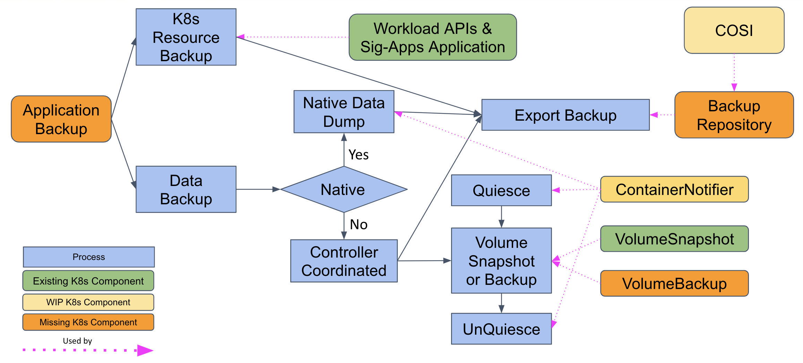
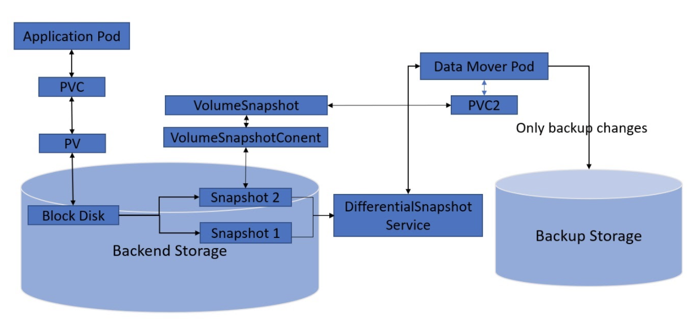

# Data Protection Workflows

**Authors**: Antony Bett, Phuong Hoang, Prashanto Kochavara, Stephen Manley, Tom Manville, Ben Swartzlander, Dave Smith-Uchida, Xing Yang, Xiangqian Yu

This document answers the following questions: why do we need data protection in Kubernetes, what is currently available in Kubernetes, what functionalities are missing in Kubernetes to support data protection? We will describe how to identify resources for data protection, what is the volume backup and restore workflow, and what is the application snapshot, backup, and restore workflow.

<!-- toc -->
  - [Data Protection Definition](#data-protection-definition)
  - [Why do we need Data Protection in Kubernetes?](#why-do-we-need-data-protection-in-kubernetes)
    - [Cloud Native Applications vs Traditional Data Protection](#cloud-native-applications-vs-traditional-data-protection)
      - [Application Evolution](#application-evolution)
      - [Legacy Technologies](#legacy-technologies)
    - [Stateful vs Stateless Applications](#stateful-vs-stateless-applications)
    - [Roles and Scopes in IT](#roles-and-scopes-in-it)
  - [Use Cases](#use-cases)
    - [User Personas in Kubernetes Data Protection](#user-personas-in-kubernetes-data-protection)
      - [Application Protection](#application-protection)
        - [Application Definition](#application-definition)
        - [Application Backup Definition](#application-backup-definition)
        - [Application Disaster Recovery](#application-disaster-recovery)
        - [Application Rollback](#application-rollback)
        - [Application Migration](#application-migration)
        - [Application Cloning](#application-cloning)
        - [Application Retrieval](#application-retrieval)
        - [Resource Recovery](#resource-recovery)
      - [Namespace Protection](#namespace-protection)
      - [Cluster Protection](#cluster-protection)
  - [What is currently available in Kubernetes?](#what-is-currently-available-in-kubernetes)
  - [What are the missing building blocks in Kubernetes?](#what-are-the-missing-building-blocks-in-kubernetes)
    - [Volume Backups](#volume-backups)
      - [Motivation](#motivation)
      - [Desirable Characteristics of Volume Backups](#desirable-characteristics-of-volume-backups)
    - [Change Block Tracking](#change-block-tracking)
      - [Motivation](#motivation-1)
      - [Sample Backup workflow with Differential Snapshots Service](#sample-backup-workflow-with-differential-snapshots-service)
    - [Volume Populator](#volume-populator)
      - [Motivation](#motivation-2)
      - [Status](#status)
    - [Quiesce and Unquiesce Hooks](#quiesce-and-unquiesce-hooks)
      - [Motivation](#motivation-3)
      - [Background](#background)
      - [Container Notifier](#container-notifier)
    - [Volume Group and Group Snapshot](#volume-group-and-group-snapshot)
      - [Motivation](#motivation-4)
      - [Goals](#goals)
      - [Status](#status-1)
    - [Backup Repositories](#backup-repositories)
      - [Why do we need backup repositories](#why-do-we-need-backup-repositories)
      - [Motivation/Objective](#motivationobjective)
    - [Application Snapshots and Backups](#application-snapshots-and-backups)
      - [Motivation](#motivation-5)
      - [Goals](#goals-1)
      - [Status](#status-2)
- [Application Backup and Restore workflows](#application-backup-and-restore-workflows)
  - [Application Backup workflows](#application-backup-workflows)
  - [Application Restore workflows](#application-restore-workflows)
    - [Workflow for restore PVC-snapshot](#workflow-for-restore-pvc-snapshot)
      - [Restore To New](#restore-to-new)
      - [Restore to Production (partial restore)](#restore-to-production-partial-restore)
    - [Workflow for restore logical-dump](#workflow-for-restore-logical-dump)
      - [Restore to New](#restore-to-new-1)
      - [Restore to Production](#restore-to-production)
  - [Appendix](#appendix)
    - [Backup and Restore of Different Databases](#backup-and-restore-of-different-databases)
      - [Relational](#relational)
        - [Mysql](#mysql)
      - [Time series](#time-series)
        - [NuoDB](#nuodb)
        - [Prometheus](#prometheus)
        - [InfluxDB](#influxdb)
      - [Key value store](#key-value-store)
        - [etcd](#etcd)
      - [Message queues](#message-queues)
        - [Kafka](#kafka)
      - [Distributed databases](#distributed-databases)
        - [Mongo](#mongo)
  - [References](#references)
<!-- /toc -->

## Data Protection Definition

The **Data Protection** term in the Kubernetes context is the process of protecting valuable data and configs of applications running in a Kubernetes cluster. The result of the data protection process is typically called as a backup. When unexpected scenarios occur, for example data corruption by a malfunctioning software, data loss during a disaster, such a backup can be used to restore the protected workload to the states preserved in the backup.

In Kubernetes, a stateful application contains two primarily pieces of data:

* A set of Kubernetes resources (a.k.a. application config) which are typically stored and managed in etcd database and accessible via Kubernetes API server. These Kubernetes resources can be typically exported as JSON or YAML files. For example, a classic [WordPress](https://kubernetes.io/docs/tutorials/stateful-application/mysql-wordpress-persistent-volume/) application consists of two _Deployments_ resources, a _Secret_ resource, a couple of _PersistentVolumeClaim_ resources, and two _Service_ resources. These Kubernetes resources together compose the WordPress application.
* Persistent volume data. Kubernetes has the _PersistentVolumeClaim_ API to allow users to provision persistent volumes (represented as _PersistentVolume_ resources in Kubernetes) for user workloads. Persistent volume data will be managed and stored on the underlying storage system.

Data Protection aims at providing backup and restore of the above mentioned two pieces of data. Part of the data protection working group’s charter is to define and implement a list of Kubernetes native constructs to enable backup and restore at different levels. However, it’s **not** the goal of the data protection working group to define application specific orchestrated backup and restore interfaces/processes as different flavors of application will likely have very different strategies/processes to achieve application consistency.

## Why do we need Data Protection in Kubernetes?

Stateful Kubernetes applications use PersistentVolumes to store their data. A PersistentVolume has an independent lifecycle from the Pod/Cluster that is consuming it so that data can be preserved on the underlying storage system even if the Pod/Cluster goes away. However, what if the underlying volume on the storage system gets corrupted for some reason? What if the underlying storage system is stricken by a disaster? When that happens, even data stored on the PersistentVolumes will be lost. To prevent data loss from happening, we need to find a way to protect the data stored in the PersistentVolumes used by stateful Kubernetes applications.

There are three main reasons why Data Protection is needed in Kubernetes:

1.  Cloud native applications vs traditional data protection
2.  Stateful vs stateless applications
3.  Roles and scopes in IT

### Cloud Native Applications vs Traditional Data Protection

#### Application Evolution

Applications have been around forever, however, the architecture of applications has changed gradually over time. The overall evolution of applications can be broken down into the following technological segments:

1. Mainframes - With mainframe computer systems, applications were completely baked into these systems. It was easier to track and manage data as everything remained reasonably static.
2. Server Architecture - With the rise of servers, applications were modularized to run as independent software components; however, the software component still needed to run within the boundaries of an operating system with tightly integrated components.
3. Virtualization - With the advent of virtualization, the server architecture model became more nimble and efficient, where multiple operating systems could take advantage of underlying hardware as virtual machines/servers. However, from an application point of view the architecture remained fairly similar where tightly integrated components of an application would run within the boundaries of a virtual machine to provide services.
4. Cloud-native - Today, the intent of server architecture/virtualization has been enhanced further to break down applications into smaller/lightweight microservices that run independent of each other, each having its own identity and possible attached data, often communicating with each other using a well-defined API, the overall functioning of which contributes to the working of an application.

Reading through the above evolution of applications, it is clear that the architecture of applications has changed a lot over the years, however the paradigm of protecting data has remained constant throughout, while architectures (servers, virtual server, containers) have become more dynamic and short lived. 

The jump from bare metal servers to virtualization increased the utilization of the hardware, but the application architecture remained the same. The metadata information of how the application is run is tied/available within the machine it is running on. Even the data volume is contained within the server(physical/virtual), though it may be mapped on a separate volume, it is still available from within the same machine. 

With cloud-native applications, the architecture is completely different to its predecessors, and hence a new data protection approach is needed for supporting such application architectures. The data volumes are kept separate from the containers, with connection information available only in separate declarative metadata files. So while the overall application architecture has changed dramatically, the data still needs to be protected for business continuity.

#### Legacy Technologies

Organizations that started their cloud-native journey early and adopted containers a few years ago, immediately realized the shortcomings of existing solutions they had in their environment. These solutions focused on monolithic applications, all contained within an OS boundary. They were infrastructure/storage centric and primarily focussed on the data volume since other items such as metadata and application binaries were always available within the physical or virtual server. Scalability of the data protection solution generally required intrusive involvement from IT operations and wasn’t seamless.

In the absence of an end-to-end cloud-native data protection solution, system engineers and solution architects devised ad-hoc scripts and tooling in conjunction with legacy data protection solutions that would enable organizations to backup all the necessary components required for the applications in a cloud-native world. However, the scripts and tooling were fairly static and had to often be updated, adding more operational overhead, to conform to the dynamic nature of cloud-native applications -- components and metadata information is constantly changing based on the demand for the service.

To take full advantage of cloud-native or Kubernetes applications, the data protection solution must be able to grow and scale with the needs of the applications across the enterprise, otherwise it is difficult to manually keep pace with these dynamic environments. Similarly, for an organization embarking on the Kubernetes journey, it is expensive to maintain a legacy technology (server virtualization) to manage a disruptive technology like containers. Also, such an architecture does not allow an organization to really take full advantage of a cloud-native ecosystem.

As a result, a cloud-native solution that can manage cloud-native applications should be the objective of every organization that is looking to modernize their infrastructure and applications.

### Stateful vs Stateless Applications

A stateful application is one that is dependent on previous data transactions, whereas a stateless application is one that does not depend on its previous transactions to perform the next operation or execution.

When containerization was taking off, it was speculated that container applications would not need backup since they are (stateless) ephemeral, but that has changed drastically. A lot of stateful applications are being run within Kubernetes where data needs to be accessed and computed for the application to function successfully. Based on research, 46% of respondents to a survey were already using stateful applications in containers, while 93% of them look at Kubernetes as a viable platform for stateful applications [1]. Additional research also shows databases as the top use case in 2019 [2]

To understand the stateless versus stateful backup needs, it is important to understand all the components of an application in a Kubernetes or cloud-native world. The introduction to Kubernetes section above provides a quick insight into the components, however, objectively at a high-level, Kubernetes applications consist of the following.

1. **Container images** - In a cloud-native world, the images that are run as containers are essentially templates that are deployed within Kubernetes. These images are generally served from a registry which could be public or private. Based on the flexibility of containers explained above - it is sufficient enough to backup the container images or the data volume hosting these images and run it in any Kubernetes environment. However, applications are not based on container images alone, and more often than not have a persistent data volume associated with it.

2. **Metadata** - Kubernetes resource definitions that provide information about how the containers should run and other non-container objects that the container code might need to access to function properly.

For example, Kubernetes has the concept of `secrets` which are used to hold user credential information. A container might need that secret resource to function properly. Similarly, Kubernetes provides a concept of `service` which is a resource to expose an application/container.

3. **Persistent Volume** - The data volume object within which data is stored for access by the container.

Having defined the logical components of a Kubernetes application, we can see that while individual components like a web-server can be stateless (redirecting requests), these stateless entities often interact with other stateful components (databases) that interact with data making the overall application (front-end/back-end) stateful in a way. Similar to a web server, there could be many more internal containers that do not have a persistent volume, but are still integral to the functioning of the application. That container, while stateless, still has precious metadata information that needs to be backed up as part of the application because its image does not provide much value by itself. One could argue that this could be overcome by adding more logic to the container, but then one would be deviating from the principles of Kubernetes or Cloud-native by taking away the flexibility and portability aspect of containers. As a result, in order to have a successful data protection experience, it becomes imperative that applications are protected as a single unit.

To summarize what components need to be backed up for stateless and stateful application:

Container images, or the volumes that they are seated on, need to be protected so that containers can be spun up from the images for executing tasks.

**Stateful:** For stateful applications, assuming the container images are backed up, the declarative YAMLs (metadata) + persistent volume used by the container need to protected so that the data required for container execution and the behavior of the containers in a kubernetes world can be quickly restored.

**Stateless:** Assuming container images are backed up, even with stateless applications, the metadata information (declarative YAML files) on how that container is run, needs to be backed up, so that it can be quickly brought back online, running the same way in another environment.

### Roles and Scopes in IT

One way Kubernetes is making application development and delivery faster and better is by bridging the gap between development and operations teams. The way Kubernetes achieves this is by basing the entire platform on role based access control (RBAC) constructs. The Kubernetes platform is managed/leveraged by users based on granular RBAC policies assigned to the user. As a result, Operations can easily control each and every area of the infrastructure by enabling policies for users. Mini/virtual clusters within a Kubernetes cluster, also known as namespaces are generally dedicated areas for developers to execute their developer operations. 

If an application is not cloud-native or Kubernetes-native, it would be very difficult to obtain the synergy between developers and operations as the onus of RBAC would fall on the application provider. This may or may not be consistent with RBAC functionality of other applications running in the environment.

Having a consistent approach to Kubernetes where teams can use the same application across the organization based on privileges assigned to them enables a common communication medium that helps in orchestrating faster release and product life cycles. It eliminates the need for developers to find applications (untested) which could hamper security (which is one of the biggest challenges in Kubernetes today) within the organization.

As a result, from a data protection perspective, it is important to provide the same experience to developers and operations teams to protect and manage their applications and data. All solutions within a Kubernetes environment function on these lines, and there should be no reason for a data protection solution which is more closely tied to infrastructure needs to function differently.

## Use Cases

### User Personas in Kubernetes Data Protection

Just as Kubernetes connects developers and operations teams to develop and run production applications, Kubernetes data protection must connect application owners and central operations teams. 

Application owners focused on creating, updating, and running applications on clusters. They want to be able to trigger backups before modifying their applications. They also want to run self-service recoveries of all or part of their applications when something goes wrong. Finally, they expect that only they should be able to access backups of their applications. 

Kubernetes cluster administrators, while not in every environment, are focused on keeping the cluster itself available to the application administrators. Therefore, they are interested in cluster disaster recovery and migration of all applications from one cluster to another. They will usually be the gatekeepers of the backup operators installed on the cluster. 

Central operations / backup teams are focused on protecting the application in accordance with corporate best practices and compliance regulations. This includes, but is not limited to: RPO (recovery point objective), RTO (recovery time objective), retention period, and maintaining offsite copies of the backups. The backup team generally manages a central backup repository.

#### Application Protection

The primary Kubernetes protection object is the application because applications drive the business and the protection requirements. Organizations expect to run a full set of protection activities on applications. 

##### Application Definition

Since there is no Kubernetes application object, customers and vendors are creating custom mechanisms to define an application. The challenge is that the application owner knows what comprises the application, while the central backup administrator sets the policies and oversees the process of protection. Custom application definitions enable the application owner and central backup team to have a shared understanding of what to protect.

The components of an application include:

* Kubernetes resources (e.g. pods, secrets, configmaps, etc.)
* Persistent volumes
* External data stores that are not Kubernetes volumes - e.g. Amazon RDS, NAS shares (outside of Kubernetes cluster)

Not all applications will have all components and not all customers will include all resources in the application definition (e.g. some customers may explicitly exclude resources or not choose to include others).

##### Application Backup Definition

Since there is no Kubernetes backup object, customers and vendors are creating custom mechanisms to define a backup. 

The first component of a backup definition is the recipe for how to execute the backup. 

Common aspects of backup recipe include:

1. Databases - Database protection is complex. From simple quiescing to log truncation to replica management, database protection invariably involves customization. Furthermore, customers may choose to use different recipes for different times of day/week (e.g. application consistent once a day vs. crash consistent four times a day).
2. Consistency groups - Often linked to databases, certain components of an application may have I/O consistency, especially when doing a crash consistent backup. 
3. Snapshot vs. backup - In some cases, the customer may want to leverage a local snapshot, while in others they want the data to be copied to an alternate location, either using a standard CLI tool (e.g. mysqldump for MySQL) or a backup vendor’s agent (e.g. customized tar to copy all the files from a file system)
4. How to connect to external datastores for protection
5. Order in which to backup resources (if required)

The application owner may also want to define their backup service requirements - e.g. about the policy definition that should be applied to the application. The vendor may choose to either allow the application owner to specify individual requirements (e.g. RPO, RTO, retention period, offsite protection) or bundle them into the equivalent of a backup class.

Vendors and users need mechanisms to define, publish, and execute these backup recipes which include the equivalent of pre/post scripts, agent configurations, and environment variables. They also need mechanisms to enable application owners to specify their requirements for the backup.

##### Application Disaster Recovery

In the event of a catastrophic application failure, users expect to recover their application(s). Customers expect the application resources and data to be recovered, but not the underlying cluster or its configuration.

They should be able to recover to: 

* The same namespace on the same cluster
* An alternate namespace in the same cluster
* An alternate cluster in the same region
* An alternate region/geography

The vendor can assume that the original application is no longer running. Customers will expect a variety of RPOs and RTOs for these disaster recovery options, and the overhead and performance of the options will likely vary based on RPO, RTO, and location. 

##### Application Rollback

In the event of an unintended change to an application, including configuration and/or data, users expect to revert their application to the point in time a backup was created. Customers expect that the revert not only re-creates/modifies application resources, but also that it will eliminate resources that did not exist at the point of time of the backup.

Customers will also expect an option to not-overwrite existing resources. 
Customers accept application downtime while the application is reverted to a prior point in time. 

They should be able to recover to: 

* The same namespace on the same cluster

##### Application Migration

Customers will want to move applications for multiple reasons, including cost optimization, load balancing, and cluster upgrades. While migration is not strictly a protection use case, many customers leverage their protection tools for migration. 

Similar to disaster recovery, the customers expect to migrate to:

* An alternate namespace in the same cluster
* An alternate cluster in the same region
* An alternate region/geography

Since migrations can include shifting across versions or vendors, the customer also needs an option by which they can modify the definition of the resource when they recover. This could include: storage classes, names, container definitions, etc. 

Depending on how the customer and vendor manage the migration process, the source application may be running concurrently with the migrated application until a “cutover” process occurs to minimize risk and downtime. 

##### Application Cloning

Customers will want to clone applications for multiple reasons, including training, development, and upgrade testing. While cloning is not strictly a protection use case, many customers leverage their protection tools for cloning. 

Similar to migration, the customers expect to clone to:

* An alternate namespace in the same cluster
* An alternate cluster in the same region
* An alternate region/geography

Since the clone will run concurrently with the production instance, the process should ensure that resources do not conflict (e.g. renaming of resources) and that data is copied. 

Customers may also want to retain provenance information for clones to either track the clone copies or to enable updates to the clones (pushing a new “golden copy”).

##### Application Retrieval

Customers will need to retrieve past versions of applications for reasons including legal cases, project retrieval, or regulatory compliance. While the market has traditionally focused on data retrieval, application retrieval is becoming more important. First, it enables the organization to view the data in context. Second, with the emergence of requirements for AI/ML reproducibility, it is increasingly important to recreate the entire application flow. 

Customers expect to recover a backup that could be years old, which brings additional requirements:

* Backward compatibility of versions - Resources from years ago need some mapping to modern clusters
* Kubernetes cluster versions - Kubernetes cluster version may be different between backup and restore
* Container protection and recovery - Backup teams do not necessarily trust container repositories to retain past application versions, so they want to protect the container itself (backup the container images)

##### Resource Recovery

Customers will need to recover a subset of an application for reasons ranging from legal cases to testing a subset of an application to rolling back only one part of an application. 

They should be able to recover to: 

* The same namespace on the same cluster
* An alternate namespace in the same cluster
* An alternate cluster in the same region
* An alternate region/geography

Customers need a mechanism by which they can specify the resources they want to recover, and the vendor must then implement the recovery of just those resources. In certain cases, the vendor must validate that dependent resources are in place to ensure a successful recovery.

#### Namespace Protection

Since there is not a well-defined Kubernetes application object, many customers choose to protect namespaces. In some cases, they only protect the namespace. In others, they protect the namespace in addition to the applications. In still others, they protect the namespace, excluding the resources that are tied to an application.

Namespace protection, however, is not a mechanism for `protecting all applications in a namespace`. While vendors can choose to implement a UI/APIs that treat `namespace` as `Select All Applications in namespace`, this document treats the namespace as the actual object.

The benefit to namespace protection is that the application owner does not need to be involved in the definition of the protection policy. 

The challenge with namespace protection is that it only has the option to use simplistic crash-consistent protection mechanisms, the application owner cannot easily specify a recovery, and there is no clear connection between backup team and application team.

The recovery flows match the application recovery flows, with increased emphasis on resource recovery.

#### Cluster Protection

Much of cluster protection is outside the scope of the backup initiative. 
In the context of backup, cluster protection does not include:

1. Recreating Kubernetes clusters 
2. Backing up and restoring the etcd store on its own 

While there is value in both full cluster disaster recovery and etcd DR and etcd rollback, it is outside our scope. 

Cluster protection is not a mechanism for “protecting all namespaces or applications in a cluster.” While vendors can choose to implement a UI/APIs that treat `cluster` as `Select All Applications in cluster`, this document treats the cluster as the actual protection object.

Some customers, however, are interested in protecting cluster-scoped objects. This includes CRDs and unattached Persistent Volumes. The cluster protection will back up those resources. 

Recovery will likely be at a resource level. 

## What is currently available in Kubernetes?

The data protection working group targets at solving the data protection problem at different levels:

* Persistent volume. Define APIs to enable users to snapshot or backup their persistent volumes, and to restore a persistent volume from a volume snapshot or backup.
* Application. Define APIs to:
    * Group Kubernetes resources which compose an application
    * Trigger Quiesce/Unquiesce operations against an application Pod/Container for application consistent snapshot/backup

Application level data protection will likely employ persistent volume level constructs.

There exist some building blocks in Kubernetes as of today.

* VolumeSnapshot API, this is a GA API which allows users to create snapshots over their persistent volumes. Such VolumeSnapshot resources can later on be used to rehydrate a volume.
* Various workload APIs, i.e., StatefulSet, Deployment, Daemonset etc.
* Application CRD

## What are the missing building blocks in Kubernetes?

We have identified the following as the missing building blocks in Kubernetes:

* Volume backups
* Backup repositories
* Volume populator
* Quiesce and unquiesce hooks
* Change Block Tracking (CBT)
* Volume group and group consistent snapshot
* Application snapshots and backups

The following figure shows the backup workflow with existing and missing building blocks in Kubernetes.

**Figure 1:** Backup Workflow with Missing Building Blocks

The following figure shows the restore workflow with existing and missing building blocks in Kubernetes.

**Figure 2:** Restore Workflow with Missing Building Blocks

### Volume Backups

#### Motivation

The primary motivation for pursuing a volume backup capability is that the existing volume snapshot capability does not give users a way to store their backups in different locations, devices or storage media (per the standard 3-2-1 backup rule).

We use `snapshot` to mean a point-in-time record of data, and `backup` to mean a snapshot that may be stored in a different location from the cluster it came from and has a separate lifecycle from its cluster. Some implementations of snapshots (especially first-generation cloud provider implementations) may be backups (or may be made into backups with magic parameters in the VolumeSnapshotClass), but there is no portable way to explicitly take a backup.  This  makes it impossible to craft a portable data protection policy in Kubernetes.

The goal of this effort is to produce a design for volume backups in Kubernetes. They will be distinct from volume snapshots, but they should have a similar user API (e.g., take a backup of a volume, provision a volume and populate it from a backup).

#### Desirable Characteristics of Volume Backups

For brevity's sake, `snapshot` will be used to mean `volume snapshot` and `backup` to mean `volume backup`.

1. Like a snapshot, a backup should represent a “point in time” capture of the data in a volume.  At a minimum, it should be possible to create a backup from a volume, and it should be possible to _restore_ a volume from a backup (e.g., provision a new volume, populating it from a previously taken backup).
2. Unlike snapshots, backups should have a lifecycle completely distinct (though controllable) from that of the volume and cluster from which it originated.  In particular, backups should survive complete cluster, storage pool, or even data center destruction and it should be possible to restore backups into a different cluster from where they originated. Note: this does not imply that there are no constraints allowed on the storage pool into which a backup is restored - in particular, there may be technology constraints (e.g., same type of storage) - just not identity constraints (e.g., same instance).
3. To satisfy the lifecycle characteristic, backups must actually store a copy of the data from the volume.  However, like snapshots, backups will likely be taken on a regular schedule (to minimize RPO in the event of a failure).  Since geographical distance between the volume and its backups is a desirable attribute, an additional desirable characteristic is that the rate of data transfer between the primary volume and a backup site should scale primarily with rate of change of the data in the volume rather than the size of the volume. The first backup of a volume will probably always involve a full copy, but we’d expect that the majority of subsequent backups would be incremental in nature.
4. The implication of the previous characteristic is that backups from the same volume that are stored in the same location will likely share data. This is expected, but such sharing should be transparent to users (so deleting one backup should never invalidate others).
5. In addition to lifecycle considerations, it should be possible to implement all components of the standard 3-2-1 data protection rule using backups - in particular, backups should generally be stored in a different physical device (so damage to the device doesn’t impact backups) and different device type (so that bugs or exploitable security vulnerabilities in the primary storage shouldn’t put backups at risk), and backup implementations should support storing backups offsite (and offsite storage should be considered as the ‘typical’ case).
6. As a linchpin of data protection strategy, users need to trust the integrity of their backups.  This implies such characteristics as:
    1. Very highly durable storage (likely leveraging replication).
    2. Protection against intentional corruption (e.g., it may be desirable to disallow write access to existing backups and very carefully control delete access).
    3. Some degree of signing and/or encryption.

    Some aspects of this may be appropriate to surface within Kubernetes (e.g., security keys for encryption, etc.).

7. The backup architecture should allow for a separation of concerns between primary storage and backup responsibilities. In particular, it should be possible to support the following “modes”:
  1. Backup:
    1. Performed by the primary storage system.
    1. Performed by a third-party component, which relies upon the ability to gain access to a quiescent copy of the volume (likely via snapshotting or volume cloning) and provides an out-of-band method for calculating differences between the latest volume and the previous backup.
    1. Performed by a third-party component, which relies upon a (not yet fully specified) “here are the changed blocks since your last snapshot/backup” feature to be implemented by primary storage.
  1. Restore:
    1. Primary storage performs volume provisioning and population from backup in one logical operation from the user’s perspective (similar to the existing snapshot model).
    1. Similar user experience as above, but primary storage performs volume provisioning, while a third-party component provides volume population.

8. It might be desirable to try and standardize some common attributes of backups (e.g., object storage buckets, regions where backups are stored, number of copies of each backup, etc.).  However, zeal for pursuing a deep level of such standardization should be tempered by the desire to open up a marketplace of competitive offerings that allow for a healthy degree of freedom for innovation and opportunities for competitive discrimination.

### Change Block Tracking

#### Motivation

Efficient backup of volume data is an important feature for a backup system. Since not all of the data in a volume will change between backups, backing up only the data that has been changed is desirable. Many storage systems track the changes that were made since a previous point-in-time snapshot and are able to expose this to backup applications. The Kubernetes Snapshot feature provides a standard API to snapshot persistent volumes. However, there exists no standard way to find out which data has changed since a particular snapshot.

Differential Snapshots describe the changes between any two arbitrary snapshots on a specific volume.  It is desirable to have a Differential Snapshots Service that provides the following features:

* Provide information so that changed data can be identified quickly and easily for backup.
* Handle changes for both block volumes and file system volumes.
* Provide information of changes between any arbitrary pair of volume snapshots. Changes should be able to be requested against snapshots that have been deleted in which case the service should return a specific value so the caller would take appropriate action.
* For block volumes, the service would be able to support different block sizes in use.  The minimum granularity of changes is a single device block.
* For file system volumes, the service should handle shared volumes.  The service also provides file system differences in multiple levels (File System Volume, directories, files, block within a file)

Incremental snapshots describe the changes since the last snapshot so incremental snapshot is a special case of differential snapshots. Note that there may be a distinction between implementation vs billing when describing these terms.

#### Sample Backup workflow with Differential Snapshots Service

Here is a diagram that shows a sample backup workflow with differential snapshots service.

**Figure 3:** Backup Workflow with Differential Snapshots Service

Below is an example of a backup workflow that utilizes the Differential Snapshots Service to increase backup efficiency:

* Create a VolumeSnapshot of the PVC to be backed up.
* Create a new PVC (PVC2) using the VolumeSnapshot as Source.
* Query the Differential Snapshot service to get the list of changes between two snapshots.  For Block devices, this list of changes is of the format of a list of Changed Blocks(CBT) between 2 snapshots.  For File System volumes, this list of changes is the Changed Files List between the 2 snapshots.
* Based on this list, backup only changed data from the PVC2.  If the list of changes cannot be obtained, backup the entire volume.  Additional metadata may also be saved to synthetize the entire PV from backup data.

Below is another example of a backup workflow that does not involve creating PVC from Snapshot if the backup solution can access the storage device directly.

* Create a VolumeSnapshot of the PVC to be backed up.
* Query the Differential Snapshot service to get the list of changes between two snapshots.  For Block devices, this list of changes is of the format of a list of Changed Blocks(CBT) between 2 snapshots.  For File System volumes, this list of changes is the Changed Files List between the 2 snapshots.
* Based on this list, communicating with backend storage to fetch and backup only changed data in the list.  If the list of changes cannot be obtained, backup the entire volume.

### Volume Populator

#### Motivation

The purpose of volume populators is to create a mechanism that allows users to create PVCs that contain data defined by arbitrary CR which has associated populators. This mechanism will be crucial as part of the workflow to restore a volume from a backup. From an API perspective doing a restore will just be creation of a PVC which has a datasource pointing to a backup CR. The “populator” for backup CRs will perform the restore.

#### Status

Volume populators are an alpha feature in Kubernetes as of v1.23 (redesigned from the earlier alpha version). The new API design, [https://github.com/kubernetes/enhancements/tree/master/keps/sig-storage/1495-volume-populators](https://github.com/kubernetes/enhancements/tree/master/keps/sig-storage/1495-volume-populators), relies on a PVC spec field called `dataSourceRef`. An unlimited number of volume populators can coexist in a given cluster, to facilitate use cases beyond backup/restore as well as multiple possible implementations of backup/restore.

Because there is no common backup API defined for Kubernetes yet, it is likely that different implementations will use implementation-specific CRDs to represent backup objects, and the volume populator design facilitates that. Over the longer run, a common format may emerge which allows sharing of implementation, and possibly even an official backup API supported by SIG storage. In either case, use of the populator API for restore workflows will create a seamless user experience.

### Quiesce and Unquiesce Hooks

#### Motivation

As discussed in the Use Cases section, customers want to protect and recover applications. Many stateful applications use databases and other advanced data services, which recommend and/or require using their mechanisms to bring the service into a consistent state before taking snapshots. We need to provide a mechanism to enable vendors and customers to create application-consistent data copies for databases and other advanced data services. 

#### Background

Consistent backups of advanced data services (e.g. databases) take one or more of the following approaches

1. Application-consistent logical backups. Backup streams are generated by the data service. These are streams of data and not snapshots, so they require triggering, transferring, and storing a data copy.
2. Crash-consistent snapshots. The backup service takes a snapshot without connecting to the database. It depends on the data service being able to recover from a snapshot taken at any point in time. This is generally not recommended by database vendors.
3. Application-consistent snapshots. The backup service connects to the database, triggers its quiesce function (e.g. hot backup mode) so that the database puts itself into a consistent state, takes the snapshot, then puts the database back into standard mode. This is preferred by database vendors.

Customers expect support for all three common backup methodologies. “Crash-consistent snapshots” are addressed by Standard CSI Snapshots and do not require database specific commands. To deliver “Application-consistent snapshots” in a Kubernetes environment, the backup service must be able to execute database-specific commands, typically the databases’ quiesce/unquiese functionality. 

To access the quiesce functionality, we need quiesce and unquiesce hooks. Database quiesce commands are usually available through client binaries or SDKs, so they may be packaged in container images. In many cases, client binaries are available in the service images themselves. In Kubernetes, the commands may be issued by using the pod/exec sub resource and executing commands directly in the service’s pods. Therefore, we need standard hooks to be able to access the commands.

#### Container Notifier

A Kubernetes Enhancement Proposal for a feature called Container Notifier is under review. The proposal introduces a mechanism to notify a selected set of Pods to run pre-specified commands inlined in those Pod specifications. This would allow the author of the pods to define sets of commands that can be executed inside the containers. This mechanism can be used to implement database-specific quiesce/unquiesce hooks. For example, the author of a Pod specification for a database may define a command to flush the database tables to disk in the  `ContainerNotifierHandler` field. Users of the Database may trigger that command by using a proposed core API, `PodNotification. `More information on the status of the proposal can be found here: [https://github.com/kubernetes/enhancements/pull/1995](https://github.com/kubernetes/enhancements/pull/1995).

### Volume Group and Group Snapshot

#### Motivation

While there is already a KEP ([https://github.com/kubernetes/enhancements/pull/1051](https://github.com/kubernetes/enhancements/pull/1051)) that tries to introduce APIs to do application snapshot, backup, and restore, there are other use cases not covered by that KEP.

Use case 1: A VolumeGroup allows users to manage multiple volumes belonging to the same application together and therefore it is very useful in general. For example, it can be used to group all volumes in the same StatefulSet together.

Use case 2: For some storage systems, volumes are always managed in a group. For these storage systems, they will have to create a group for a single volume if they need to implement a create volume function in Kubernetes. Providing a VolumeGroup API will be very convenient for them.

Use case 3: Instead of taking individual snapshots one after another, VolumeGroup can be used as a source for taking a snapshot of all the volumes in the same volume group. This may be a storage level consistent group snapshot if the storage system supports it. In any case, when used together with quiesce hooks, this group snapshot can be application consistent. For this use case, we will introduce another CRD VolumeGroupSnapshot.

Use case 4: VolumeGroup can be used to manage group replication or consistency group replication if the storage system supports it. Note replication is out of scope for this proposal. It is mentioned here as a potential future use case.

Use case 5: VolumeGroup can be used to manage volume placement to either spread the volumes across storage pools or stack the volumes on the same storage pool. Related KEPs proposing the concept of storage pool for volume placement is as follows: [https://github.com/kubernetes/enhancements/pull/1353](https://github.com/kubernetes/enhancements/pull/1353) [https://github.com/kubernetes/enhancements/pull/1347](https://github.com/kubernetes/enhancements/pull/1347) We may not really need a VolumeGroup for this use case. A StoragePool is probably enough. This is to be determined.

Use case 6: VolumeGroup can also be used together with application snapshot. It can be a resource managed by the ApplicationSnapshot CRD.

Use case 7: Some applications may not want to use ApplicationSnapshot CRD because they don’t use Kubernetes workload APIs such as StatefulSet, Deployment, etc. Instead, they have developed their own operators. In this case it is more convenient to use VolumeGroup to manage persistent volumes used in those applications.

#### Goals

In order to support Volume Group and Group Snapshot, we need to add the following APIs:

* An API to manage multiple volumes together in a group.
* An API to support consistency groups for snapshots, ensuring crash consistency across all volumes in the group.
* An API to take a snapshot of a group of volumes, not ensuring crash consistency.

The group API should be generic and extensible so that it may be used to support other features in the future.

#### Status

There is an enhancement proposal that is being reviewed: [https://github.com/kubernetes/enhancements/pull/1551](https://github.com/kubernetes/enhancements/pull/1551).

### Backup Repositories

#### Why do we need backup repositories

A Backup Repository is the target location where application backups are stored. A backup repository is required to centrally store the data in case there is complete outage of a site (compute, network, and storage). Snapshots for this reason are not true backups because generally the snapshots are stored on the same system as the primary storage and hence become a single point of failure. Since data is created at an exponential rate today, storage space, frequency of backups, and count of overall backups is ever increasing. As a result, the backup repository must be intelligent and efficient in terms of handling space, scale, and read/write performance efficiencies.

#### Motivation/Objective

The objective of this section is to provide high-level guidance for data protection vendors for providing target repositories.

1. Provide requirements for Target repository. These requirements should be leveraged for Kubernetes supported APIs
2. Provide high-level guidance on the type of target to use.

The expectation is that the majority of customers will want to host their backup repositories in the public cloud while there might be some still hosting them on-prem due to availability of existing devices.

<table>
  <tr>
   <td><strong>Characteristics</strong>
   </td>
   <td><strong>Why</strong>
   </td>
   <td><strong>Suggested changes/improvements to existing APIs</strong>
   </td>
   <td><strong>Notes</strong>
   </td>
  </tr>
  <tr>
   <td>Multiple protocols
   </td>
   <td>
<ol>

<li>Object Storage for scalability 
<ol>
 
<li>Object naming simplicity
</li> 
</ol>

<li>File storage from lift and shift perspective/performance. \
Not introducing a new type of storage within the environment.

<li>Data Domain type of appliances

<li>EBS (use as a target? Instead of source. Maybe for migration?)
</li>
</ol>
   </td>
   <td>COSI/CSI improvements?
   </td>
   <td>Different Object stores have different size limits that need to be addressed.

Migration use cases will need to be thought through when changing targets.

Maybe an intermediate translation layer would be helpful.
   </td>
  </tr>
  <tr>
   <td>Multiple Locations/Types
   </td>
   <td>On-prem and Cloud based (Azure Blob, AWS S3, Google Cloud Storage) \

   </td>
   <td>Supported by COSI API
   </td>
   <td rowspan="2" >Start using APIs to understand gaps and areas to invest.
   </td>
  </tr>
  <tr>
   <td>Redundancy
   </td>
   <td>Geographic availability - Ability to set HA based on regions (cloud)
   </td>
   <td>Integration with Cloud API services
   </td>
  </tr>
  <tr>
   <td>Long term archival
   </td>
   <td>Ability to move data into low cost storage. S3 -> Glacier as example
   </td>
   <td>Integration with storage API services
   </td>
   <td>Handled by a BU vendor today. Tomorrow should be handled at target level via API?
   </td>
  </tr>
  <tr>
   <td>Permissions
   </td>
   <td>Ability to handle target permissions through one interface
   </td>
   <td>COSI has a set of APIs for bucket access
   </td>
   <td>
   </td>
  </tr>
  <tr>
   <td>Encryption
   </td>
   <td>Ability to set encryption (and select encryption algorithm)

At-REST* (source)

At-REST (target)

In-Flight (Backup Tech/Network)
   </td>
   <td>Key management challenge with storing encrypted backups/user data.

Integration with the user Key Management system.
   </td>
   <td>Backup speeds might suffer based on encryption.

*BU access to plain-text user data that was encrypted
   </td>
  </tr>
  <tr>
   <td>Deduplication/compression
   </td>
   <td>Ability to enable/disable deduplication/compression
   </td>
   <td>Handled by a BU vendor today. Tomorrow should be handled at target level via API?
   </td>
   <td>Intelligent deduplication could speed up backup transfer speeds

Handled by a BU vendor today. Tomorrow should be handled at target level via API?
   </td>
  </tr>
  <tr>
   <td>Target Management by multiple clusters
   </td>
   <td>When multiple clusters access the same target, there needs to be some mechanism of ownership and delegated controls.
   </td>
   <td>Longer discussion and implementation for the future.
   </td>
   <td>
   </td>
  </tr>
</table>

### Application Snapshots and Backups

#### Motivation

The addition of the [VolumeSnapshot](https://kubernetes.io/docs/concepts/storage/volume-snapshots/) API in Kubernetes enables snapshot and restoration support for persistent volumes. With the [VolumeSnapshot](https://kubernetes.io/docs/concepts/storage/volume-snapshots/) API, users can take a snapshot of a persistent volume or restore a volume from a snapshot. When it comes to application snapshot and restoration semantics, however, more things need to be considered than just volume snapshots. An application snapshot captures both its configurations and persistent data. The key is that an application snapshot contains sufficient information to completely create (from scratch) an instance of a stateful application as captured at a particular point in time.

Specifically, an application snapshot contains both a copy of the definitions of Kubernetes resources that the application is composed of and snapshots of persistent volumes used by the application. Particularly, the volume snapshots must be taken at the same time in an application consistent manner. To guarantee application consistency, there may be a need to quiesce the application before taking volume snapshots and unquiesce it after the volume snapshots are successfully taken. The [ContainerNotifier](https://github.com/kubernetes/enhancements/pull/1995) proposal is a general mechanism for users to request execution of arbitrary hook commands in application containers for use cases such as application quiescing and unquiescing.

With the [VolumeSnapshot](https://kubernetes.io/docs/concepts/storage/volume-snapshots/) API and [ContainerNotifier](https://github.com/kubernetes/enhancements/pull/1995) API, we have some of the necessary building blocks to perform application-level snapshot and restoration operations. However, application-level data management operations require higher-level workflows and automation. For example, taking an application snapshot is a multi-step workflow that does more than orchestrating volume snapshots and requesting ContainterNotifier executions. Therefore a new Kubernetes API is needed for supporting snapshot, backup, restoration, and clone semantics at the application-level in an application-consistent manner.

#### Goals

Proposes a Kubernetes API for stateful application data management that supports application-level snapshot, backup, recovery, and clone semantics.

#### Status

This KEP (https://github.com/kubernetes/enhancements/pull/1051) proposes a Kubernetes Stateful Application Data Management API consisting of a set of [CustomResourceDefinitions (CRD)](https://kubernetes.io/docs/concepts/extend-kubernetes/api-extension/custom-resources/) that collectively define the notion of stateful applications, i.e., applications that maintain persistent state, and a set of data management semantics on stateful applications such as snapshot, backup, restoration, and clone. A snapshot of a stateful application is defined as a point-in-time capture of the state of the application, taken in an application-consistent manner. It captures both the application configurations (definitions of Kubernetes resources that make up the application, e.g., StatefulSets, Services, ConfigMaps, Secrets, etc.) and persistent data contained within the application (via persistent volumes).

# Application Backup and Restore workflows

Since there are 2 general methods of backup and restore applications: logical-dump operation and PVC-snapshot, the backup and restore also have 2 types of workflows:

* Logical dump workflows for backup and restore
* PVC-snapshot workflow for backup and restore

## Application Backup workflows

The application backup workflows are facilitated by a Data Protection Controller which listens to Backup object creation on the Kubernetes API Server and executes a backup workflow to backup an application. The workflow may involve a component called a “data-mover” pod which can connect to backup devices (backup repositories) to backup an application’s persistent volume data. 

An application backup workflow may involve the following steps:

1. Backup kubernetes resources that compose the application(StatefulSet, Secrets etc.)
2. Application level action such as execute disable load balancer command before backing up data. ContainerNotifier can be used to select the pod to execute this command. Not all applications require this step.
3. Backup application data: Depend of the application type, one of the following group of actions may be executed
    1. Logical dump(such as mysql dump): a client command that connects to application server pod/service to dump entire application data out to a local backup file or file stream to a remote backup repository.  If a local backup file is created, then there will be an extra step to move the backup file to the backup repository.
    2. Snapshot actions: The following sequence of actions to be done on each of the application pods. Some applications may require some specific order of execution (Ex: secondary pods may need to be done before primary pods).
        1. Execute pre-hook commands, typically to flush application data to disk, and “quiesce” the application such that it is temporarily frozen.
        2. Snapshot all/selected PVCs being used by the pod.
        3. Post-hook command such as “unquiesce” to be executed.
        4. Backup the PVC snapshots to the backup repository. This step is typically done after all volume snapshots have been created to shorten the application frozen time. A potential way of backing up a snapshot can follow these steps:
            * Controller creates a new PVC with the Snapshot as date source.
            * Controller then creates a new data mover pod with the new PVC mounted either as a raw block device or a directory (if PVC is FileSystem mode).
            * Data mover pod transfer data to the backup repository
            * Controller then deletes the data mover pod and the snapshot.
4. Application level action such as execute command to enable load balance after the backup data step has been done regardless of whether the backup succeeds or not.  This step is only needed if step 2 is executed.

## Application Restore workflows

Restore application in general does not require quiesce and unquiesce. One potential scenario in which quiesce might need to take place is for applications using ReadWriteMany PVCs(discussed below). The restore workflows are executed by the Data Protection Controller and it involves a component called a “data-mover” pod which can connect to backup devices (backup repositories) to retrieve metadata and data of the backup images.  This data-mover pod will have to be created on-demand to be able to access PVCs to restore data.

### Workflow for restore PVC-snapshot

#### Restore To New

The general application restore to new process is done as following

* First, the controller restores namespace and cluster-wide resources (except for PV) needed by the application.
* Restore Persistent Volume Claims (and their associate Persistent Volumes) by:
    * Controller first creates empty PVCs with the configuration as the restoring PVCs (size, access mode, storage class…)
    * Controller then creates a data-mover pod with those empty PVCs mounted on the pod.  For Raw Block PVC, mount as a block device.  For File System PVC, mount as a directory.
    * Data mover pod then restore data from the backup device to the target PVCs.
    * Controller then terminates the data-mover pod thus unmounts all PVCs.
* Then restore pods, statefulsets, services etc. which use those PVCs being restored in previous steps.

#### Restore to Production (partial restore)

However, when we restore to an existing/production environment where the application is running, if the application uses PVCs with access mode ReadWriteOne (most common), we cannot directly restore data to those PVCs.  The step would be as followings:

* First, the controller scales down the application deployment to 0 replica.  This effectively releases the PVC to be mounted by a data-mover pod.  (Skip this step if PVCs are ReadWriteMany).
* Restore PVCs data: (PVC/PV won’t be deleted after scaling down) (quiesce before restore)
    * Controller then creates a data-mover pod with those existing PVCs mounted either as raw block or directories (depending on the mode of PVCs).
    * For PVC with ReadWriteMany access mode, controller will issue quiesce command via Container Notifier.  Otherwise, skip this step.
    * The data-mover pod then moves data from backup device to the mounted directories or raw block devices.
    * For PVC with ReadWriteMany access mode, controller will issue unquiesce command via Container Notifier.  Otherwise, skip this step.
    * Controller then terminate the data-move pod, effectively umount all PVCs
* Finally the controller scales up the application deployment to the original replica.  (Skip this step if PVCs are ReadWriteMany).

### Workflow for restore logical-dump

This workflow is much simpler and it can be done by the controller itself because the logical dump operations can be done via network connection to the application server pod without the need to access the application PVCs.  Most applications that support logical-dump operation also support the same operation in reverse direction.  The backup images are generally local files or file streams from remote backup devices.

#### Restore to New

* First, controller restores the namespace, cluster resources etc. will be used by the application
* Controller then restores application pods/deployments.
* Then the controller runs a database/application client with these local files/file streams as input and executes the logical-dump operation in the reserve direction back to the database/application.

#### Restore to Production

* Controller simply runs the logical-dump operation in the reserve direction as mentioned above.

## Appendix

### Backup and Restore of Different Databases

#### Relational

##### Mysql

For MySQL, a typical quiesce command such as “FLUSH TABLES WITH READ LOCK” can be used on the “Notifier []ContainerNotifier” inside the MySQL Container.  So the backup workflow of a MySQL container will be as following:
* Quiesce:
  * External controller shall send Notification object to run Quiesce ContainerNotifier.
  * Kubelet watches for the Notification object and when it sees Notification object created, it will execute the quiesce script on the MySQL container.  The quiesce script will run the quiesce command in the background process (with SLEEP) so it will keep the client session running while snapshots are being taken.
* Take PVC Snapshots.
  * External controller will loop through each PVC being used by the MySQL container and create snapshots for them.
* Unquiesce:
  * External controller shall send Notification object to run Unquiesce ContainerNotifier.
  * Kubelet will then execute the Unquiesce script which simply kills the quiesce background process.
* Cleanup:
  * External controller will clean up all Notification objects (and Snapshots in error cases)

#### Time series

Time series databases are relatively newer compared to relational and object storage databases. As a result, the complexities involved in terms of backup and restore processes of traditional databases have been simplified greatly to provide a smoother data protection in general.

The three time series databases that were researched were:

* NuoDB
* Prometheus
* InfluxDB

Each of these databases provide a CLI library with commands that support consistent backups and consistent restores. A single backup command can snapshot the database and make a consistent copy of the database available to the user running the command. The restore is either a restore command, or simply extracting the data from the consistent copy that was created, and placing it in a path that is recognized by the application as a storage path to the database.

##### NuoDB
* Overview
  * To backup a NuoDB instance there are three options available to the user.
    * Offline Backup - requires redundant storage managers, where one SM is shutdown to copy data.
    *  Online Backup - hot backup for a running database using nuodb hot copy command
      * Full backup
    * Incremental backup
  * Online Hot Copy - Point in time restore using journaling
* Backup Strategy
  * Create BackupSet
  * Low frequency Full backups
  * High frequency incremental backups
  * Highest frequency journal copies
* Restore Strategy
  * Restore Full/incremental/Journal
    * Journals are applied either to previous full or incremental
  * Start SM (storage manager) pointing to the restored archive
* A backup set (directory structure) contains the data collected by the Full backup, incremental backups and online hot copy.
  * Full Backup
    * nuocmd hotcopy database --db-name test --type full --backup-dirs 1 /tmp/hotcopy/2017-12-18
  * Full Restore
    * nuoarchive restore -restore-dir /tmp/restore /tmp/hotcopy/2017-12-18
  * Incremental Backup
    * nuocmd hotcopy database --db-name test --type incremental --default-backup-dir /tmp/hotcopy/2017-12-18
  * Incremental restore
    * nuoarchive restore -restore-dir /tmp/restore /tmp/hotcopy/2017-12-18
  * Journal Copy
    * hotcopy database test host localhost pid 23588 backupSetDirectory /tmp/hotcopy/2017-12-18 type journal
  * Journal Restore
    * nuoarchive restore --restore-snapshot 6658 --restore-dir /tmp/restore /tmp/hotcopy/2017-12-18

##### Prometheus
* Overview
  * Prometheus has its own snapshot capability that captures a point-in-time of the data and stores it locally within the pod.
  * This snapshot of the data is all that we need for a consistent backup and restore.
* Backup Strategy
  * Enable Admin API
  * Port-forwarding port for snapshot creation
  * Copy snapshot locally if needed or keep as-is if restoring the same application
* Restore Strategy
  * Copy data into location pointed by `—storage.tsdb.path `For the new or original prometheus instance
  * Restart Prometheus if needed.
* Commands and operation:
  * Run the snapshot command
    * $ curl -XPOST[ http://localhost:9090/api/v2/admin/tsdb/snapshot](http://localhost:9090/api/v2/admin/tsdb/snapshot) {"name":"20200731T123913Z-6e661e92759805f5"}
    * Get Path of the snapshot
      * kubectl -n monitoring exec -it prometheus-prometheus-operator-prometheus-0 -c prometheus -- /bin/sh -c "ls /prometheus/snapshots/20200731T123913Z-6e661e92759805f5"
    * Copy snapshot locally if needed or keep it as-is on the Pod PV:
    * For restore, point copy contents from the snapshot into the location point to by` —storage.tsdb.path`

##### InfluxDB
* Overview
  * Has its own built-in backup and restore capabilities - scope can be individual databases, shards, with policies etc.
    * A backup creates a copy of the[ metastore](https://docs.influxdata.com/influxdb/v1.8/concepts/glossary/#metastore) and[ shard](https://docs.influxdata.com/influxdb/v1.8/concepts/glossary/#shard) data at that point in time and stores the copy in the specified directory.
    * **Full backup**: Creates a copy of the metastore and shard data.
    * **Incremental backup**: Creates a copy of the metastore and shard data that have changed since the last incremental backup. If there are no existing incremental backups, the system automatically performs a complete backup.
    * **Metastore only backup**: Creates a copy of the metastore data only.
  * Also provides the ability to export and import data for CDR
* Backup Strategy
  * Backup Full/Incremental/MetaOnly
  * Use different folders to store each.
* Restore Strategy
  * Disable anti-entropy before restoring a backup
  * Restore backup - specify new replication factor for the cluster if needed
  * Restart AE
* Commands for operation:
  * Full/Incremental/MetaOnly
    * influxd-ctl [global-options] backup [backup-options] &lt;path-to-backup-directory>
  * Full Restore
    * influxd-ctl [global-options] restore [options] -full &lt;path-to-manifest-file>
  * Incremental Restore
    * influxd-ctl [global-options] restore [restore-options] &lt;path-to-backup-directory>

#### Key value store

##### etcd

Here's a document on how to backup and restore etcd: [https://docs.openshift.com/container-platform/4.5/backup_and_restore/backing-up-etcd.html](https://docs.openshift.com/container-platform/4.5/backup_and_restore/backing-up-etcd.html)

#### Message queues

##### Kafka

Kafka itself is designed to be fault-tolerant.

* Replication: configurable replication factor. Larger replication factor suggests higher tolerance to broker losses.
* Stretched Cluster: Allows setting up a Kafka cluster that spans across multiple data centers. Thus in the case of losing one data center, the cluster can remain functioning without data loss.

However it’s not sufficient to cover the following:

* Bug in Kafka code
* Fat-fingered operations/mis-configuration
* Upgrading failure/rollback

###### What To Backup

In Kafka, there are two major pieces of volume data that we would like to consider for backup

1. Data in Topics
2. Consumer offsets

###### Existing Mechanisms

1. Mirror Maker - asynchronized replication from one cluster to another cluster (consumer offsets + data in topics)
2. Async Replication via consumer connectors - [https://www.confluent.io/hub/confluentinc/kafka-connect-s3](https://www.confluent.io/hub/confluentinc/kafka-connect-s3)
3. And [more](https://blog.softwaremill.com/should-i-backup-my-kafka-cluster-and-how-36b4cab40311)

###### In K8s (Best effort)

Steps to create a Kafka backup in K8s?

1. Freeze Zookeeper volumes
2. Snapshot Zookeeper volumes
3. Unfreeze Zookeeper
4. Take down a broker
5. Snapshot volumes
6. Bring back broker
7. Backup volumes
8. Repeat for all brokers
9. Export both snapshots and Kafka config to cold storage

Problems:

1. Partition rebalancing in Kafka while a Broker is offline might cause data loss.
2. Multiple copies of the same/similar data  - partitions are replicated

#### Distributed databases

##### Mongo

###### Backup with Filesystem Snapshots

MongoDB provides the following 2 commands for quiesce/unquiesce operations:
* db.fsyncLock(): flushes all pending write operations to disk and locks mongodb instance against writes
* db.fsyncUnlock(): Unlocks mongodb instance for writes

To backup non-sharded MongoDB databases:
* Prehook: db.fsyncLock()
* Take snapshot of PVC
* Posthook: db.fsyncUnlock()

For sharded MongoDB databases, the cluster balancer process needs to be stopped prior to taking backup of the MongoDB cluster. The balancer process is responsible for redistributing the chunks evenly among the shards/partitions. To backup sharded MongoDB cluster:

1. Connect to any mongos in the cluster and issue sh.stopBalancer() to stop the cluster balancer.
2. Use sh.getBalancerState() and sh.isBalancerRunning() to verify the balancer is disabled and that no migrations are in progress after disabling the balancer.
3. Backup the config database
4. For an exact point in time snapshot of the cluster, stop all application writes prior to PVC snapshots.
5. For approximate point-in-time snapshots, you can minimize the impact on the cluster by taking the backup from a secondary member of each replica set shard.
6. Execute db.fsyncUnlock() to unlock instances that were locked during prehook.
7. Re-enable cluster balancer using sh.startBalancer().

**MongoDB References:**

1.   db.fsyncLock(): https://docs.mongodb.com/manual/reference/method/db.fsyncLock/
2.   db.fsyncUnlock(): https://docs.mongodb.com/manual/reference/method/db.fsyncUnlock/
3.   cluster balancer: https://docs.mongodb.com/manual/core/sharding-balancer-administration/#sharding-internals-balancing
4.   Backup of sharded MongoDB cluster: https://docs.mongodb.com/manual/tutorial/backup-sharded-cluster-with-filesystem-snapshots/#precision

###### Backup with mongodump

https://docs.mongodb.com/manual/core/backups/#back-up-with-mongodump

## References

[1] [https://containers.robin.io/sem/market-pulse-survey-kuberenetes](https://containers.robin.io/sem/market-pulse-survey-kuberenetes)

[2] [https://diamanti.com/wp-content/uploads/2019/06/Diamanti_2019_Container_Survey.pdf](https://diamanti.com/wp-content/uploads/2019/06/Diamanti_2019_Container_Survey.pdf)
