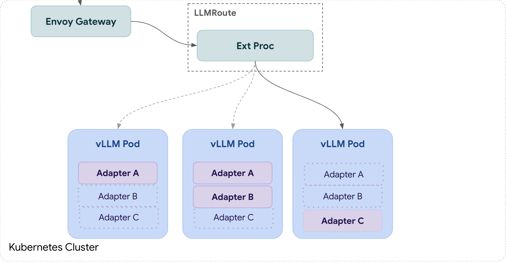
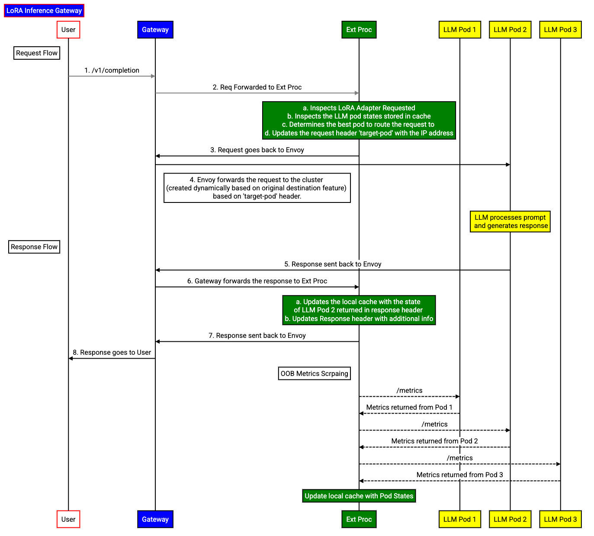

# LLM Instance Gateway
<!-- toc -->

-   [Summary](#summary)
-   [Motivation](#motivation)
    -   [Goals](#goals)
    -   [Non-Goals](#non-goals)
-   [Proposal](#proposal)
    -   [Gateway](#gateway)
    -   [CRDs](#crds)
    -   [Envoy 
    Solution](#envoy-solution)
  -   [Model Server Protocol](#model-server-protocol)
-   [PoC Design Details](#poc-design-details)
    -   [Overview](#overview)
    -   [Request Flow](#request-flow)
    -   [Pod selection algorithm in PoC](#pod-selection-algorithm-in-poc)
    -   [Artifacts](#artifacts) <!-- /toc -->

## Summary

As presented in the [demo](https://youtu.be/NUBZg_uqqXk?si=v681EeYdGUGEVqQQ&t=1458) and building further upon the [joint proposal](https://docs.google.com/document/d/1sFNHQqUWm1DIzC9GxXp3cKRm8cUtTcGuwZYkjkOkUqk/edit?tab=t.0#heading=h.9brozdsx9dqo), we are proposing that a gateway, focused on
multiplexing 
use cases upon shared hardware has distinct advantages in enabling efficient and fair use of multiple use-cases over a shared pool of compute.

## Motivation

Novel advancements in fine-tuning like [LoRA](https://arxiv.org/abs/2106.09685) and [Multi-LoRA](https://arxiv.org/abs/2310.18547) have enabled multiple distinct use cases to share accelerators. As this new tech is adopted, the Day1/2 operational concerns quickly become necessary.

Kubernetes as long been a standard in easing and automating operational tasks of
workloads. A mechanism (gateway) within the K8s ecosystem is a 
reasonable, and expected way for a user to support multiple LLM use cases on shared
accelerators.

### Goals

#### Proposal Goals

-   Create an Inference Gateway project group for wg-serving collaboration,
    including: chat channel & dedicated repo (sponsored by sig-network)

#### Gateway Goals

-   Fast reconfiguration - New use cases (including LoRA adapters or client
    configuration) can be rolled out / back in seconds to clients without waiting for 
    a new model server to start.
-  Efficient accelerator sharing - Use cases can use less than an accelerator
    or temporarily burst without needing to start a new model server leading to
    fewer wasted accelerators and better pooling of shared capacity.
-   Operational resilience - Use cases share available accelerators fairly and
    can have distinct priorities, latency objectives, and failure policies.
-   Standardized LoRA - Simple recommended patterns for deploying and loading
    LoRA adapters on a wide range of Kubernetes environments into model servers.
-   Composability - Approach should be composable with:
    - K8s Gateway API
-  Other gateway features and projects, including high level LLM gateways  
    - existing deployment tools like kserve or kaito
    - different model servers

### Non-Goals


#### Proposal Non-Goals
-   Creation of a fully realized KEP

#### Gateway Non-Goals

-   Replacing the features of pre-existing Gateways
-   Defining how serving workloads must be deployed

## Proposal

### Gateway

#### CRD(s)

To adequately achieve the above goals, we propose the addition of 1 or more CRDs
to express:

-   The boundaries of a compute pool that shares a base model
    -   Including the deployment of a routing solution (PoC details below)
-   A specific use case upon one or more backend pools
    -   The objectives that this use case needs to achieve

The example API we showed in our demo looked like:

```
kind: LLMRoute
apiVersion: inference.x-k8s.io/v1alpha1
metadata:
  name: assistant
spec:
  parentRefs:
  - name: ai-gw
  backendRefs:
  - name: assistant
  adapter:
    name: sentiment
    priority: 100
    objectives:
    - type: OutputTokenLatency

      latency:        
        value: 2s
        quantile:
          numerator: 99
    metrics:
      
      format: Prometheus
```

#### Envoy Solution

Any gateway solution *must* be compatible with Envoy Proxy, and have a plan with
how to integrate these features into the Envoy ecosystem over the long term.

#### Model Server Protocol

In the PoC investigation we discovered the need for certain control and data to
be exposed by the model server. In order for a model server to work properly
with this LLM Instance Gateway, the model server would need to implement this
protocol.

Key requirements would roughly look like: 
- A method, or set of methods to dynamically update the available LoRA catalog on a model server 
- Metrics, shared as a header on response data, or some other similar mechanism, for data like: 
  - Networking-friendly metric share (shared as a header, or other
lightweight mechanism, just not in the body) 
  - Adapter State 
  - Available catalog 
  - Queue data (per adapter)


## PoC Design

From the proof of concept we believe the following architecture is a starting point for this proposal:

- Envoy Proxy
  - An OSS starting point that is generally accepted and used
- Ext proc
  - A necessary tool to extend the capabilities of Envoy to allow for routing based on the Open AI model field (within the body)
  - An agile tool for development of novel LLM Instance Gateway features
- CRD/K8s API interface 
- Model server modifications
  - Necessary to extend existing tooling to provide the proper routing data to Envoy
  - Potentially extend further to support [ORCA](https://github.com/envoyproxy/envoy/issues/6614) headers as a method of metrics transfer

### Overview

Our very high level diagram of how this looked:


To briefly describe how the components work together:

-   When an `LLMRoute` is defined, our gateway recognizes this new service, and
    allows traffic for the specified adapter to be admitted to the backend pool.
    - We support and expect Open AI API spec as the default when reading the
      adapter.

-   Incoming traffic for a validated service is then routed to ExtProc, where
    routing and fairness decisions are made.

-   We attempt to route to a model server that has the adapter already loaded,
    so long as there is batch capacity


### Request Flow

Below is an example of a 
life of a request using this described design:


> Notes:
>  
>   1. Ext Proc: External processing calls an external gRPC service to
> process HTTP requests and responses 
>
>  2. Original Dst: Original destination
> cluster can be used when incoming connections are redirected to Envoy either
> via an iptables REDIRECT or TPROXY target or with Proxy Protocol. In these
> cases requests routed to an original destination cluster are forwarded to
> upstream hosts as addressed by the redirection metadata, without any explicit
> host configuration or upstream host discovery. We implemented this using the
> bootstrap feature of Envoy Gateway

### Pod selection algorithm in PoC

Metrics stored in Ext Proc Cache: 
- Active adapters in Each pod 
- Number of pending requests in each adapter in each pod.

Given a request, read the relevant metrics from the cache and find which pods have that lora adapter loaded.
Out of the set of pods that have the lora adapter loaded and the number of pending requests in that adapter is below a threshold, pick the one with the
most amount of pending requests (we pick the most to prevent flopping). 
- If no pods satisfy 1 or 2 then pick a pod with: (in following priority): 
  1. Least number of active adapters. 
  1. Least total pending requests

### Artifacts:

-   [Ext-proc/Envoy/Benchmarking repo](https://github.com/tomatillo-and-multiverse/lora-inference-gateway)
    -   Repo we used to develop the ext proc image used in the PoC
    -   Also contains the manifests required to deploy gateway
-   [vLLM fork](https://github.com/kaushikmitr/vllm)
-   Presentation:
    -   [Slides](https://docs.google.com/presentation/d/1I1XDf6fQQEtHxJtZxFdIaUcUA3lLBC7neW823diWS78/edit?usp=sharing)
    -   [Recording](https://youtu.be/NUBZg_uqqXk?si=v681EeYdGUGEVqQQ&t=1458)
    - [PoC Design & Experimentation data](https://docs.google.com/document/d/17wB0BgeV8JrGtccxZqkOqFyNC4gPBNqdKg8Oe9xMkio/edit#heading=h.eeeqp85g68qy)
